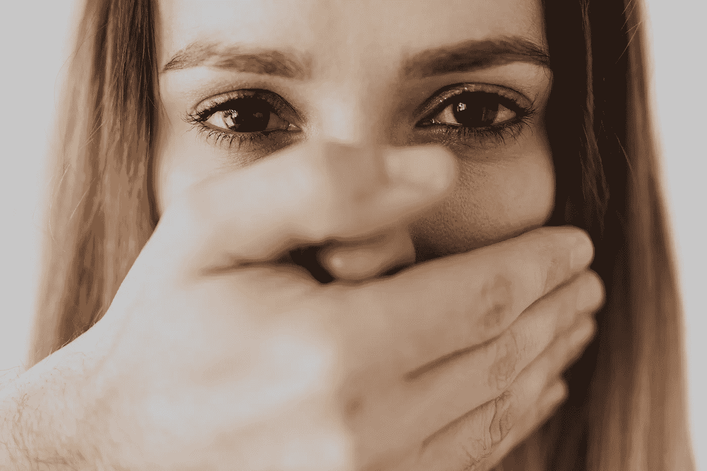
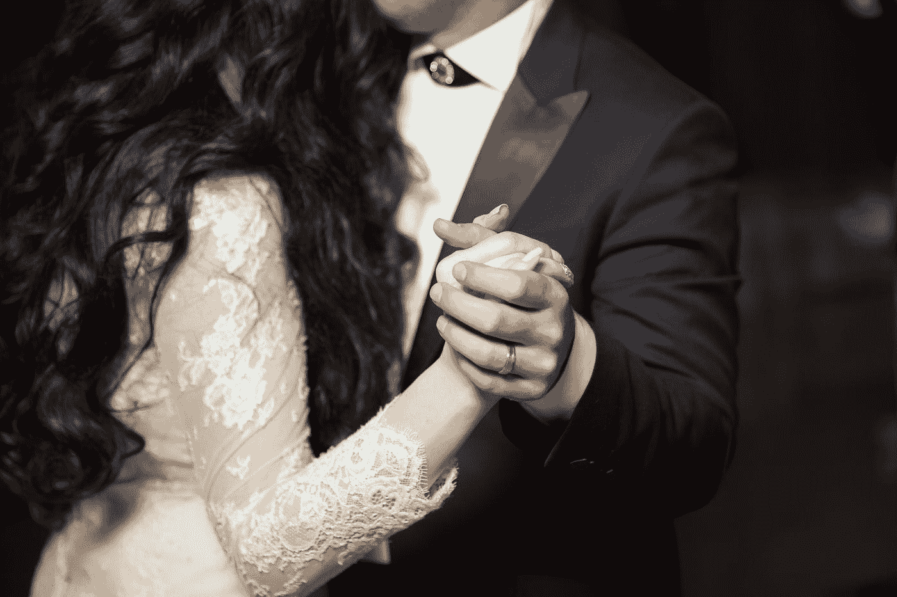
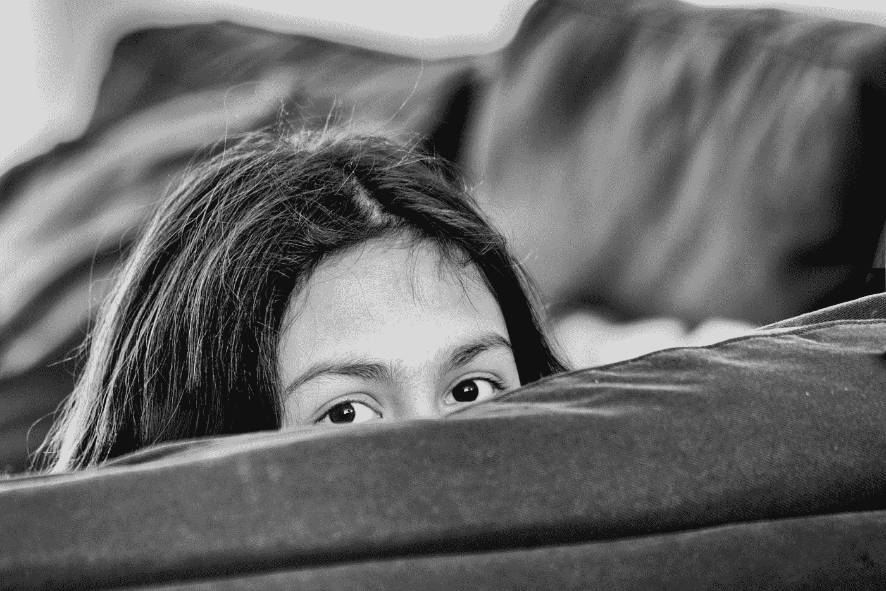

# 前爸爸的女儿

> 原文：<https://medium.datadriveninvestor.com/a-former-daddys-girl-cde86c48306c?source=collection_archive---------4----------------------->

# 为什么我三年没和我父亲说话了

Photo by [Karolina Grabowska](https://www.pexels.com/@karolina-grabowska?utm_content=attributionCopyText&utm_medium=referral&utm_source=pexels) from [Pexels](https://www.pexels.com/photo/woman-covering-her-face-with-her-hand-4379955/?utm_content=attributionCopyText&utm_medium=referral&utm_source=pexels)

我已经三年没和我父亲说过话了。他从未见过我两岁的儿子，也从未要求过。我们相距 20 分钟，但我们可能居住在不同的星球。事情并不总是这样。小时候，我父亲不会做错事。我爱他，他也爱我。很多。

当我六岁时，他给了我一只蠕动的、大腹便便的黑色实验室小狗，它成了我成年后最好的朋友。在我七岁生日那天，他带我去了俄勒冈海岸，那是一次最棒、最难忘的旅行。那是我第一次看到大海，我几乎记得那次旅行的每一个细节。他教我如何骑马，甚至还搭建了一个看台，这样我就可以看到他驯服新马的圆形围栏。我们在他的吉普车里找到了三明治和枫糖。在麦收期间，我和他一起在联合收割机上度过了无数个小时。我们关系很好，什么事都一起做。

Photo by [lauren lulu taylor](https://unsplash.com/@laurenlulutaylor?utm_source=medium&utm_medium=referral) on [Unsplash](https://unsplash.com?utm_source=medium&utm_medium=referral)

他在我 7 岁的时候开始和 Joelle 约会。她有两个孩子，他们最终搬来和我们一起住。这是一种改变，但我很快适应了，因为我真的很喜欢他们。孩子们很好，他女朋友做过的最糟糕的事情就是把我的马尾辫扎得太紧了。

我父亲和他的第二任妻子有过短暂的婚姻，她在我最早的记忆中，所以我大概在四岁左右。我记得她是一个邪恶的女巫，身上总是有浓重的烟味和香水味。与她相比，Joelle 是一个如此甜美的天使，我很感激她扮演了我继母的角色。

两年后，没有任何预兆，我和爸爸来到了 Joelle 的父母家。在那一点上，他们就像是我的祖父母，所以我想我们是去那里和他们一起吃午饭什么的。我们把车停在街对面，跳下卡车，朝他们的房子走去。乔埃尔站在门前的台阶上哭了。她的眼睛又红又肿，好像哭了很久。我不知道是怎么回事，就什么也没说。我爸爸也找不到合适的词。

> “那么，我想这是再见了。我能抱抱吗？”她哽咽了。

父亲不情愿地给了她一个快速的拥抱，告诉我该走了。她抓住我的手，泪眼汪汪地盯着我，嘴里说着“对不起”。我不知道发生了什么，但那是我很久以来最后一次见到她。当我现在见到她时，她仍然给我一个大大的拥抱，尽管我已经 30 出头了。这对我意义重大。

回想起来，我现在明白了和 Joelle 的突然分手是因为他和另一个女人 Cheryl*在一起。我正坐在爸爸的躺椅上和他一起看电视，他告诉了我关于她的事情。他说谢丽尔是一个很好的女士，我真的很喜欢她，因为她曾经是一个竞技皇后。

 [## 定义新冠肺炎时代的“生活”|数据驱动的投资者

### 我和妻子即将进行一个月的自我隔离，以避免感染冠状病毒。我们都 70 多了…

www.datadriveninvestor.com](https://www.datadriveninvestor.com/2020/04/23/defining-life-in-the-time-of-covid-19/) 

我在 1999 年 2 月遇见了谢丽尔。她第一次过来时，当我向她展示我收集的大量布雷耶马时，她发出了惊叹声。我想念 Joelle，但谢丽尔很好，喜欢马。她和我父亲 4 月订婚，同年 9 月结婚。我当时十岁。

Photo by [Alvin Mahmudov](https://unsplash.com/@alvinmahmudov?utm_source=medium&utm_medium=referral) on [Unsplash](https://unsplash.com?utm_source=medium&utm_medium=referral)

谢丽尔在婚礼前几个月搬进了我父亲的旧单间，我认为她从来没有真正觉得这个地方是她的。他们买了一个更大更好的新的双宽制造的，家庭中的权力转移了。谢丽尔变得非常控制欲强，开始对我和我爸进行微观管理。

当他们开始试图怀孕时，情况变得更糟了。她无法自己怀孕，不得不经历一个月又一个月的生育治疗。他们让她有强烈的情绪波动，我会整天呆在我的房间里，太害怕了，直到晚饭时间，当我爸爸在家缓冲我和她。尽管如此，在七年级中期，我还是决定全职和我爸爸以及谢丽尔住在一起。

Photo by [Lucas van Oort](https://unsplash.com/@switch_dtp_fotografie?utm_source=medium&utm_medium=referral) on [Unsplash](https://unsplash.com?utm_source=medium&utm_medium=referral)

在现代医学的帮助下，她两次怀孕，我现在有两个同父异母的妹妹。第一个是我 13 岁生的，第二个是我 16 岁生的。由于巨大的年龄差距，我没有嫉妒，我的姐妹们是我青少年时期真正积极的一部分。

我高三那年，我和我爸之间产生了巨大的裂痕。一天放学后，他坐在客厅里问我，如果他卖掉我们的房子和房产，我会不会不高兴。我们有 25 英亩的木材，有一条小溪穿过，我知道这个地方的每一平方英寸。这是一个成长的好地方。既然他问了，我就答应了。我总是那么顺从，接受一切，我的回答让他措手不及。他生我的气，我回到自己的房间大哭起来。我们再也没有讨论过这个问题，他几乎立刻就卖掉了房子。

他正在建造的新房子在出售时还没有完工，所以谢丽尔、我的两个姐姐和我爸爸去和我奶奶(也就是我爸爸的妈妈)住在一起。我被送去和我继母的妈妈住在一起。没有人问我，这真的伤害了我的感情。作为一个青少年，这没有意义，这让我觉得我被家庭抛弃了。谢丽尔继续她的情感虐待，尽管住在不同的房子里。她会打电话给我，说一些可怕的事情。她告诉我的妹妹们我讨厌她们，这就是为什么我不在那里。我越是试图为自己辩护，她就越是猛烈抨击我。当我们单独在一起的时候总是最糟糕的，因为发生的任何事情都是我对她的话。

那一年，我的内心发生了变化。我不再关心规则，因为无论我是否遵守规则，谢丽尔总是会惹上麻烦。这让我养成了一种“如果我要坐牢，也可以犯罪”的态度。这种刺激令人兴奋。

我通过兼职工作认识的一个朋友开始邀请我参加聚会，并介绍我吸食大麻。她把我带进一个人的卧室，我们坐在墙和床之间一条狭窄的深色地毯上。当她把我的手指移到正确的位置并解释如何使用碳水化合物时，烟斗在我手里感觉很别扭。我想到我爸爸会有多不高兴，就赶紧把它拿到我嘴边，打开打火机，吸了一口。

毕业两个月后，我搬到了离家乡 100 多英里的地方，开始了大学生活。我的生活压力小了很多，但我不知道如何处理我新获得的自由。我几乎每天晚上都去狂欢。我玩得很开心，我喜欢我所有的新朋友。离开并结识那些对我没有先入为主的评价或期望的人是我人生中的一个巨大转折点。我慢慢开始意识到，我可以成为我想成为的任何人，而不会受到任何人的指责。一种强大的平静开始在我内心扎根。

大学第一年，我尽可能多地回家做兼职服务员。每次拜访都变得越来越不舒服。他们变得越来越挑剔我的长相，并为我没有多去拜访而感到内疚。每当我想到回家旅行时，我就会充满焦虑。我开始偷偷来看我妈妈，避开我爸爸和他的家人。起初这很有效，但是在一个小镇里很难隐藏起来，有几次他们发现我已经回去了，没有见到他们。

作为一名家长，我知道我的行为是多么的伤人。我也意识到我选择了简单的方法，因为在他们眼里我无论如何都是“错误的”。我的奶奶，我父亲的母亲，通过短信联系我，我试着向她吐露我为什么一直不去看她。所有得到我的都被关闭了，后来，一封信告诉我我会多么后悔我的行为。我写了一封愤怒的、沾满泪水的回信，但最终没有寄出，而是扔进了柴火炉。

27 岁时，我嫁给了一个六个月前才开始约会的男人。我没有邀请任何人参加我的婚礼，因为这是我的选择。发誓要和一个人共度余生是我想要亲密和隐私的时刻。我一直是一个比较内向的人，我讨厌成为关注的焦点，尤其是在一大群人面前。这也让我爸和谢丽尔很不爽。再说一次，我理解这个决定对他们的伤害。

2017 年秋天去沃尔玛的一次快速旅行是我最后一次见到谢丽尔。我们碰巧在农产品区碰到了。她大张旗鼓地拥抱我，告诉我她是多么“爱我”。几个星期后，我发现我怀孕了，并在社交媒体上宣布任何事情之前伸出手告诉了她。她无话可说，这是我最后一次听到他们的消息。

也许这是我们都需要的借口？因为三年后的今天，我们在这里，我们都没有尝试去弥补。我自己成为了一名家长，伤透了我自己的心。我对孩子无条件的爱是无法形容的。随着我的成长，生活向我展示了我一直坚信的事情会发生多么剧烈的变化。我尽可能地控制我的自尊心。

话虽如此，我他妈的确信我将**永远**不会停止对那两个半个我的小人类的那种难以形容的爱，我将**永远不会**让他们离开三年而不知道这件事。我的孩子永远不会成为我心中的敌人来掩盖我有毒的缺陷。

我爱我的爸爸，但疼痛变得无法忍受。也许我们会在下辈子做对，但我甚至不打算在这辈子参加他的葬礼。多年来，对我的缓慢拒绝打击了我的灵魂。他对我儿子的拒绝让我心碎。

选择我意味着失去他。沉默已经说了很多。

## 访问专家视图— [订阅 DDI 英特尔](https://datadriveninvestor.com/ddi-intel)