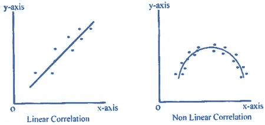
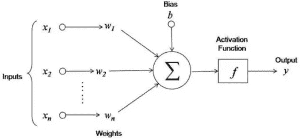
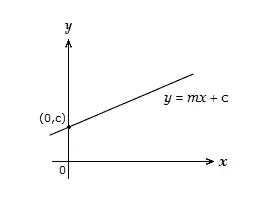
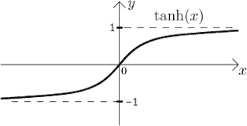
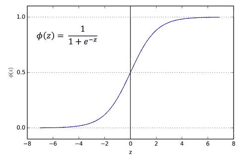
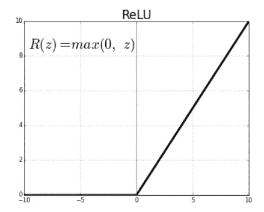
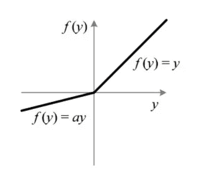
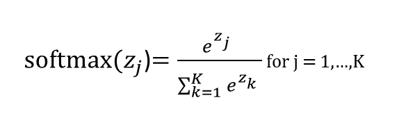

# 深度学习中激活函数的温和介绍

> 原文：<https://medium.datadriveninvestor.com/a-gentle-introduction-to-activation-functions-in-deep-learning-5d5402fcb033?source=collection_archive---------3----------------------->

## **简介**

当你开始深度学习时，你肯定会遇到术语 ***激活函数*** ，也称为神经传递函数。
在这篇博客中，我将解释什么是激活函数，以及为什么在深度学习模型中使用它们。

**注:** *我假设你对神经网络有基本的了解。*

机器学习/深度学习算法的目标是识别数据中的模式。从数学的角度来看，这种模式可以被认为是一种函数。机器学习算法在给定数据中逼近这一基础函数的能力使得这种算法非常强大。
对该函数或模式的识别使得模型预测新数据的输出成为可能。

作为数据基础的模式/功能可以是简单的，例如线性关系，有时也可以是复杂的，例如非线性关系。

## **一个简单的人工神经元**

深度学习模型通常由许多分层堆叠的神经元组成。为了简单起见，让我们考虑单个神经元。

神经元执行的操作基本上包括线性的乘法和加法操作，并产生输出。
在这之后，一个激活函数被应用来产生最终的出神经元。

如果不应用激活函数，上面的函数就像一个线性函数，将输入映射到输出。

这使得神经元只能近似线性函数。因此，模型无法识别数据中的复杂模式。

 [## 深度学习用 7 个步骤解释-更新|数据驱动的投资者

### 在深度学习的帮助下，自动驾驶汽车、Alexa、医学成像-小工具正在我们周围变得超级智能…

www.datadriveninvestor.com](https://www.datadriveninvestor.com/2019/01/23/deep-learning-explained-in-7-steps/) 

# 为什么需要激活功能？

为了使神经网络逼近非线性或复杂函数，必须有一种方法将非线性属性添加到结果的计算中。
使用激活函数的目的是将非线性引入模型。这使得深度学习模型可以在数据中找到复杂的模式。

## 任何非线性函数都可以用作激活函数吗？

不，在函数可以被认为是深度学习模型的良好候选之前，它应该具有以下属性:

1.  **非线性**
    这需要在模型中引入非线性。
2.  **单调** 要么完全不增，要么完全不减的函数。
3.  **可微分** 深度学习算法通过一种叫做[反向传播](https://en.wikipedia.org/wiki/Backpropagation)的算法来更新它们的权重。当使用的激活函数是可微的时，该算法可以工作。即它的导数可以计算。

# 激活功能的类型。

最有用的激活函数是非线性函数。下面列出了常见的激活功能。

## **1。Tahn 或双曲正切函数**

该函数的上限为 1，下限为-1，因此它将产生范围在 1 到-1 之间的输出。

## 2.乙状结肠或逻辑函数

该函数输出(0，1)之间的值，并且以 0 为中心。

## 3.Relu ( **整流线性单元)**

该函数产生 0 到无穷大之间的值。即它只输出正值。

## 4.泄漏 Relu

这是 ***Relu 的变种。*** 与 Relu 不同， ***漏 Relu*** 允许更多的输出值。
输出 0.01 到无穷大之间的值

## 5.Softmax

该函数主要用于多类预测问题，它输出给定输入的类概率。

# **我应该使用哪个激活功能？**

激活函数有优点也有缺点，这取决于它们允许模型学习用于泛化的特征的程度。

激活函数的选择也取决于你要解决的问题。

*   **Relu** 通常用于隐藏层，而 **sigmoid / softmax** 通常用于输出层。
    ***sigmoid*** 用于二分类问题 ***softmax*** 用于多类分类问题。
*   **由于**死神经元**问题，Tanh** 大部分时间被避免。
*   **Sigmoid** 和 **Tanh** 函数有时会由于消失梯度和死神经元问题而被避免。
*   如果我们在网络中遇到死亡神经元的**情况，那么 **leaky ReLU** 函数是最佳选择。**

**资源**

*   [https://www . analyticsvidhya . com/blog/2020/01/fundamentals-deep-learning-activation-functions-when-to-use-them/](https://www.analyticsvidhya.com/blog/2020/01/fundamentals-deep-learning-activation-functions-when-to-use-them/)
*   [http://www . data stuff . tech/machine-learning/why-do-neural-networks-neural-needle-an-activation-function/](http://www.datastuff.tech/machine-learning/why-do-neural-networks-need-an-activation-function/)
*   https://en.wikipedia.org/wiki/Activation_function
*   [https://medium . com/@ abhi Goku 10/activation-functions-and-its-types-in-artificial-neural-network-14511 f 3080 A8](https://medium.com/@abhigoku10/activation-functions-and-its-types-in-artifical-neural-network-14511f3080a8)

在本文中，您了解了什么是激活函数，以及为什么在深度学习模型中需要激活函数，并且还了解了常用的激活函数。我希望这篇文章达到了向您介绍激活函数的目的。