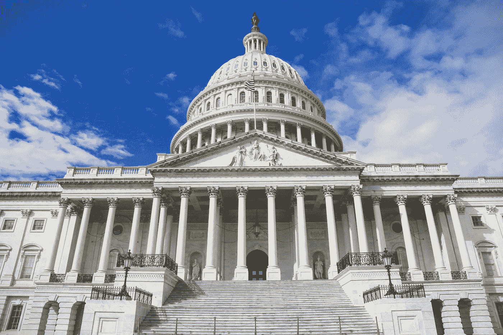

# 对民主党人来说，良好的第一步是:撤销特朗普所做的一切

> 原文：<https://medium.datadriveninvestor.com/a-good-first-step-for-democrats-undo-everything-trump-did-d8a2506af397?source=collection_archive---------5----------------------->

## 让我们花点时间幻想一下，如果民主党在 2020 年大获全胜，我们能做些什么

Photo by [Louis Velazquez](https://unsplash.com/@angelvela?utm_source=medium&utm_medium=referral) on [Unsplash](https://unsplash.com?utm_source=medium&utm_medium=referral)

鉴于目前发生的一切，让我们花点时间想想更好的时代即将到来:当民主党重新控制白宫和国会两院。

多亏了川普和他的亲信，再加上不可阻挡的人口趋势[早在 2004 年就在《T2:新兴民主党多数派一书中确定了](https://prospect.org/power/emerging-democratic-majority-finally-coming-pass/)，2020 年可能就是那一年。现在还早，但是考虑一下证据。

[根据](https://thecrosstab.substack.com/p/convince-me-im-wrongbiden-is-way)到 [G. Elliott Morris](https://medium.com/u/c9aa217be4fd?source=post_page-----d8a2506af397--------------------------------) ，经济学家*的数据分析师，乔·拜登基于他的各种模型目前“遥遥领先”。关于参议院，另一名数据记者 Harry Enten 计算出民主党现在略微有优势赢得参议院。预测趋于保守的政治认为民主党将会在众议院获得一个席位。除非出现一些不可预见的变化，否则现在还为时过早，2020 年对民主党来说将是一个好年景。*

* [## 如果资本主义失败了，那么还有什么选择呢？数据驱动的投资者

### 在当前政治领域的修辞之旅中，我们都可以面对面地接触到流行词汇，如…

www.datadriveninvestor.com](https://www.datadriveninvestor.com/2020/03/16/if-capitalism-is-a-failure-then-what-is-the-alternative/) 

鉴于上述情况，让我沉浸在我的希望中一分钟吧。然而，考虑到需要做多少事情来帮助我们的国家回到正确的轨道上，我们不能处于电影《候选人》中的罗伯特·雷德福角色[在赢得美国参议员竞选后问他的政治顾问](https://www.governing.com/topics/politics/Bill-Mckay-Effect.html)“我们现在该做什么？”不，民主党人必须在 2021 年 1 月 3 日之后的第一天就做好准备。

我以前写过一些新政府必须参与的政策举措，但它们至少包括选举改革、对富人增税、支持和扩大奥巴马医改、大幅提高最低工资，以及华盛顿特区和波多黎各可能成为一个州、普及儿童保健、减少碳排放、基础设施投资和学生贷款改革。事实上，这只是一个开始，表明新政府和国会将有多少工作要做。

那么他们从哪里开始呢？当然，南希·佩洛西领导下的美国众议院已经做了很多有益的工作，为已经通过的数百项法案指明了道路，而米奇·麦康奈尔领导下的参议院甚至还没有着手处理这些法案。这些法案包括解决[处方药价格](https://www.vox.com/policy-and-politics/2019/5/13/18618097/drug-prices-obamacare-congress-voxcare)、[投票权和竞选财务改革](https://www.vox.com/2019/3/8/18253609/hr-1-pelosi-house-democrats-anti-corruption-mcconnell)、[针对女性的暴力](https://www.vox.com/2019/4/4/18294057/violence-against-women-act-house-democrats-national-rifle-association)、[气候变化](https://www.vox.com/2019/3/27/18283831/pelosi-climate-change-green-new-deal)、[枪支管制](https://www.vox.com/policy-and-politics/2019/2/27/18224727/house-universal-background-checks-gun-violence-congress)等问题的立法。国会可以做得比一开会就通过这个一揽子法案更糟糕。

问题是通过立法很慢。比较一下我们看到的奥巴马医改和特朗普税收法案。

在 2009 年 6 月和 7 月，在民主党人的控制下，参议院健康委员会在 13 天内花了将近 60 个小时来审核这项成为患者保护与平价医疗法案法案的议案。那年 9 月和 10 月，参议院财政委员会花了 8 天时间研究该法案，这是 20 年来最长的一次提价。它审议了 130 多项修正案，并进行了 79 次唱名表决。

在 2009 年 12 月 24 日通过之前，参议院全体成员连续 25 天就医疗保健法案进行了辩论。这一历史并不包括为探索该法案的后果和可能的替代方案而举行的所有听证会。共和党指责民主党在国会“强行”通过该法案。

不幸的是，正如老话所说，有两样东西你永远不想看到被制造:香肠和立法。这是通过立法所需要的。不管你喜不喜欢奥巴马医改，你都必须承认两件事:它现在在[非常受欢迎](https://thehill.com/policy/healthcare/484010-obamacare-favorability-hits-highest-level-ever-in-new-poll)，尽管受到来自川普政府[的无情攻击](https://www.latimes.com/business/hiltzik/la-fi-hiltzik-trump-assault-obamacare-20190618-story.html)，它仍然存活了下来。

相比之下，特朗普的税收法案。抛开给富人大幅减税的明智之举不谈，在经济整体表现良好的时候，我们的预算赤字不断膨胀，不平等正在加剧，作为一项立法，该法案是一场灾难。这是非常不受欢迎的，也是前所未有的税收优惠，它大幅增加了我们的联邦债务，而承诺的好处却几乎没有兑现。

更重要的是，正如税务学者的一篇学术论文指出的那样，该法案充满了起草错误和意料之外的结果。作为回应，共和党人[随后提出了一份 297 页的法案来解决其中的一些问题。由于党派之争，该法案无疾而终，留给我们一个立法烂摊子。](https://publicintegrity.org/inequality-poverty-opportunity/taxes/trumps-tax-cuts/trump-tax-law-has-big-problems/)

如果参众两院就税收立法举行听证会，所有这些问题都可能被发现。但这不是共和党领导层想要的。他们想秘密起草这项法案，并在公众意识到他们在做什么之前尽快通过。结果，[没有举行听证会](https://publicintegrity.org/inequality-poverty-opportunity/taxes/trumps-tax-cuts/trump-tax-law-has-big-problems/)，没有修正案被允许，没有证人被传唤，众议院[在](https://publicintegrity.org/inequality-poverty-opportunity/taxes/trumps-tax-cuts/trump-tax-law-has-big-problems/)无党派的联合税收委员会完成对法案影响的经济分析之前通过了法案。

换句话说，没有人费心去讨论这项法案，结果是一项存在严重缺陷的立法。

此外，特朗普利用国会无法通过有意义的立法来填补空白，并在他认为合适的时候改变监管。以多德-弗兰克金融改革立法为例。这项在 2008 年金融崩溃后通过的庞大法案遭到了共和党人和银行业游说团体的强烈反对。由于这种激烈的反对，起草者们通过了一项立法，该立法可以被描述为一套广泛的指导方针，而不是一套具体的立法授权。

它是这样工作的。我们都知道那句老话，“细节决定成败。”每个人都支持人人享有医疗保健。当我们考虑到为所有人提供医疗保健会让一些人花钱，并减少其他人的覆盖面时，人们就会感到不安。这是不可避免的。天下没有免费的午餐。因此，国会在立法方面经常做的是通过一个广泛的框架，同时允许被称为“监管者”的联邦机构制定细节。

不幸的是，监管者不是由选举产生的，所以这种方式会让我们失去一定程度的透明度。此外，行业游说者已经变得善于引导这些政府机构的审议，这个问题被经济学家乔治·斯蒂格勒称为“监管俘获”因此，国会通过的立法最终可能会产生与法律起草者预期截然不同的结果。

特朗普政府创造了一种监管捕捉的艺术。通常[与行业利益](https://www.npr.org/2017/08/16/543876454/in-trumps-government-the-regulated-have-become-the-regulators)紧密合作，甚至[任命行业说客](https://www.propublica.org/article/we-found-a-staggering-281-lobbyists-whove-worked-in-the-trump-administration)担任领导职务，政府一直致力于将监管的立法授权转变为对不良行为的绿灯。这就是为什么本届政府尽管明显缺乏立法成就，却在废除环境保护、公民权利和消费者法规方面如此成功。

这些问题是有解决办法的。尽管奥巴马政府的情况并不完美——上帝知道，我对他的任期也有过批评——但我们在很多方面都取得了进展。例如，通过监管行动，我们[在减少碳排放方面取得了进展](https://www.nytimes.com/2019/06/19/climate/epa-coal-emissions.html)。在[减少不平等](https://www.washingtonpost.com/news/wonk/wp/2016/06/09/obama-really-did-sock-it-to-the-rich-bad/)方面取得进展。未投保的人数在下降。消费者正在享受新的保护措施。预算赤字甚至在下降。这些是一些积极的成就。所有这些成就都被现任政府抹杀了。

因此，与其表现得像共和党人一样，让顺从的国会强行通过有缺陷的立法，不如让我们慢慢来，把事情做好。正如我和南希·佩洛西领导下的众议院所阐述的那样，我们有一个雄心勃勃的立法议程。让我们把它做好。但鉴于特朗普对我们国家造成的损害，我们不能等待立法回应。

早在奥巴马任总统时，以及在此之前，立法和法规都经过了彻底的审查过程。因此，我们至少在一定程度上知道什么是有效的。如果我们只是在国会的第一天通过一个立法方案，准备好供拜登总统在 2021 年 1 月 20 日签署，这将使事情回到奥巴马总统任期结束时的样子，这将使我们有一个坚实的基础向前迈进。更重要的是，我们实际上应该通过立法来编纂法规本身。与其让监管者随意修改我们的意愿，不如通过具体的立法，详细说明我们期望的监管措施。采取这一步骤还有一个额外的好处，那就是缩短漫长的规章制定过程。

奥巴马的遗产当然不是完美的，因此还有很多事情要做。但我们民主党人不想简单地成为左翼共和党人。因此，我们需要把事情恢复到特朗普开始诋毁政府之前的状态，然后我们需要向前迈进，为所有人建立一个更强大、更公平的国家。*