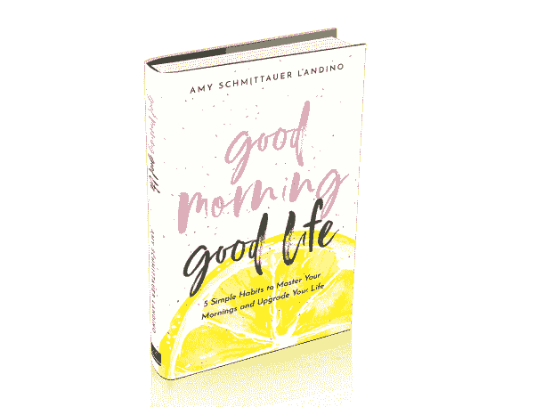
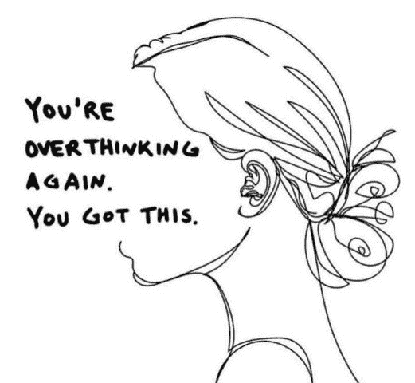

# 一些简单的习惯会给你的生活带来很大的不同

> 原文：<https://medium.datadriveninvestor.com/a-good-life-is-habit-forming-b9e5a8101cee?source=collection_archive---------17----------------------->

## 知道为什么有助于设定目标和前进

Photo by Pablo Heimplatz on Unsplash

过度思考过度了。仅仅几个简单的习惯就会在一天中产生巨大的影响。

这是[艾米·兰迪诺](https://twitter.com/Schmittastic/)、[T5 的书《早安，美好生活:掌控你的早晨并提升你生活的 5 个简单习惯》的前提](https://www.amazon.com/Good-Morning-Life-Mornings-Upgrade/dp/0578610000)

这位屡获殊荣的 YouTube 创作者、专业演讲者和畅销书作家共同创立了视频营销公司 [Aftermarq](https://twitter.com/aftermarq) 。她和千禧一代专家、顶级营销和品牌战略家切尔西·克罗斯特(Chelsea Krost)谈论了振兴职业和个人生活的切实可行的建议和做法。

 [## 目标设定听起来很简单

### 弄清楚你想要什么，并制定计划去实现它

medium.com](https://medium.com/datadriveninvestor/goal-setting-as-simple-as-it-sounds-d6d7ac7e4911) 

“我从我的为什么开始，”兰迪诺说。“目标和决心很棒，我有一大堆。但是如果我不知道我为什么要追求我想要的生活，这些都不重要。

“我也非常注重我在工作和个人方面养成的好习惯，”她说。“我日积月累打造的小东西会成就大事情。”

Krost 的首要目标是:

*   个人自我:健康，自爱，耐心，享受简单的事情，为家庭扩张做准备。
*   专业的自我:推出新的播客，创建下一个 LinkedIn 课程，通过指导客户和更多的合作创造伟大。

克罗斯特说:“人们不太关注目标和决心。”。"我希望更多地关注感恩、欣赏和当下."

过度担心准备工作将有助于改掉新习惯。现在是开始的时候了。边走边调整，但你必须首先开始。

“一步。走开。从。手机，”兰迪诺说。“我们需要与我们的想法保持一致，并从数字工具中解脱出来。然后我们才能思考我们想要的东西，以及为什么。在决定哪些习惯值得开始的背后会有更多的清晰。

“保持习惯就是要知道为什么它们对我们很重要，”她说。“从那里开始，当你采取合理的第一步——一次不要太多——并安排它们发生时，执行就会发生。和自己预约。”

用她的话说，那是“为胜利而阻挡日历”

兰迪诺说:“找到你的激情所在需要时间。当旅途变得艰难时，激情只能推动你前进。

# 网络流放

Krost 支持短期脐带切割。

“我时不时会进行一次科技排毒——尤其是在周末，”她说。“重启和充电非常重要。

克罗斯特说:“如果你要认真地致力于一些新的事情，就要认真地花时间去做一个智囊团，评估这个难题的每一部分。”“不要把过程推进到不知所措的地步，不要坚持到底。准备等于成功。”

 [## 重塑和变形成一个全新的你

### 记住那些让你走到今天的教训

jkatzaman.medium.com](https://jkatzaman.medium.com/reinvent-and-morph-into-a-whole-new-you-b6b62d5d5ed4) 

兰迪诺敦促人们重新调整自己，让自己掌握早晨，掌控一天。接受早晨，而不是与之抗争。以感叹号开始每一天，一路上添加重音符号。

“这不一定要重新布线，只是改变优先事项，”她说。“你不必非得是一个早起的人，按照自己的方式开始新的一天。当这对你很重要时，你将主宰你的早晨。

“我坚信的一个重要建议是不要抱着手机睡觉，”兰迪诺说。“把它放在另一个房间里。我有一张没有手机的床。说真的。这是最好的。晚安，电话。我需要入睡。”

这有助于理清她的思路。

“睡前 30 分钟不看手机，早上不看手机——除了关掉闹钟——让我在早上对自己的优先事项和心态有了更清晰的认识。起床让我兴奋多了。”

对于 Krost 的电池来说，这是生死攸关的交流。

“我从去年开始在周五晚上不给手机充电——只要我能做到，”她说。“这样，在某个时候，它会在周六消失，而我则完全消失了。这是叛逆的，自由的，它带给我完全的平静。”

为了帮助掌握早晨，睡觉前知道第二天需要做什么事情。那么当你睁开眼睛时，你会更容易接受它们，并准备好开始行动。在极少数情况下，你可能整夜都在做梦，寻找灵感。

# 习惯形成

当然，兰迪诺写了关于五个简单习惯的书。

“第一个习惯是由*决定*，”她说。“决策的力量会让你在生活中快速前进——尤其是如果你不花太多时间犹豫或来回奔波的话。

兰迪诺说:“对于你早上的例行公事，*决定*为什么这对你很重要，并对自己非常诚实。”。“有时候，我们的‘为什么’对其他人来说并不漂亮，但它足以让你在闹钟响起时起床。”

 [## 实现梦想比你想象的要容易

### 摆脱困境，掌控你的个人和商业品牌

medium.com](https://medium.com/datadriveninvestor/reaching-dreams-is-easier-than-you-think-94e2576812af) 

决定没有贪睡闹钟。

“有意识地快速做出决定是一种强大的习惯，”兰迪诺说。"你做得越好，你就会越清晰。"

第二个习惯是违抗。

“这是不可避免的，”兰迪诺说。“会有一些障碍打乱我们早上的日常工作。这些范围从内在的心态到外在的同居家庭成员。

“当你练习预测和准备将要到来的障碍时，你在早上和一整天都会变得更好，”她说。

决定和不服之后就来了。

兰迪诺说:“没有人需要被告知如何站起来离开他们的床。”“我们知道该怎么做。但是，当你采取必要的自我保健措施时，这个过程就容易多了。

“这里最重要的是获得你需要的睡眠——以及良好的睡眠,”她说。“考虑得到它所需要的时间，尊重它，并坚持到底。如果你没有得到健康的睡眠，早起也没关系。”

崛起自然引出第四个习惯:发光。

兰迪诺说:“无论你早上选择做什么，都要选择你最擅长的*。“你至少需要一样东西来做*动作*，一样东西来做*正念*，一样东西来做*精通*。那是一个美好的早晨。”*

# 社区建设

将所有这些放在一起，就形成了习惯 5:茁壮成长。

“这些是我们在一个美好的早晨后采取的步骤，帮助我们实现我们的优先事项和目标，”兰迪诺说。“创造一个像切尔西一样的社区。利用日历锁定。与新朋友联系。反思你的成就。

“如果你想让你的生活更上一层楼，那只能从早上开始，”她说。"你需要在这一天的剩余时间里保持好的心情。"

 [## 忠于你的团队

### 忠诚的社区成员是最好的学习对象

medium.com](https://medium.com/datadriveninvestor/be-true-to-your-group-f99f6aca6bca) 

克罗斯特早上很流畅。

“我养成的一个习惯是在户外大自然中开始新的一天，通常是以一杯咖啡开始，”她说。“早上，我穿着睡衣赤脚走在草地上。沉浸在大自然中是我快乐的地方。

“一个美好的早晨——不匆忙——让我变得伟大，”克罗斯特说。“一个糟糕的早晨——以匆忙开始——真的会让我一整天都昏昏欲睡。”

日常仪式有助于让启动的平凡部分自动运行。当你不假思索地进行仪式时，你可以把注意力放在即将到来的最重要的事情上。

“仪式很重要，所以很重要，”兰迪诺说。“别的不说，你表现出你能坚持到底。有时候，我们只需要向自己证明，我们可以跟上小事情，这样我们就可以走向大事情。

“这些仪式帮助你发现你最喜欢的东西，”她说。“如果你喜欢阅读，但又总是没有时间，那么进行这种仪式会让你感觉更合拍，知道自己在做自己喜欢的事情时会更有成就感。”

具体来说，兰迪诺有她最喜欢的仪式来帮助她在一天中茁壮成长:

*   护肤和拉伸。最好在凌晨 4:30 脸朝前。我认为这是运动。
*   晨间报纸，每日禁欲读物和柠檬水。
*   咖啡和目标回顾。
*   [吃青蛙](https://blog.noisli.com/what-it-means-to-eat-the-frog/)。我今天的第一个大任务是掌握。

# 晨练

克罗斯特掌握了自己的习惯:

*   咖啡、水和蛋白质。
*   用瑜伽、伸展、散步和和我的狗玩耍开始我的一天。
*   抽一张动物医学卡——今天是蝴蝶——或者查看我的星座运势，给我洞察力和洞察力。
*   制作每日清单。
*   播放心情音乐，感受并锁定。

克罗斯特说:“在 T4，前一天晚上做好准备是最好的时机。”。"你醒来时感觉压力减轻了很多，已经有能力掌控一天的生活了."

在更短的时间内完成更多工作的一个秘诀是设想你需要做什么以及你将如何去做。这就消除了最后一分钟准备的借口。直接跳进去，把大象从房间里搬出去。

“有明确的重点，”兰迪诺说。“如果你想完成某件事，就不要试图完成数百万件事。排除杂念。它们让你慢下来，而不是启发你。”

 [## 日程安排者让社交媒体保持正轨

### 利用生产力工具优化您的发布

medium.com](https://medium.com/datadriveninvestor/schedulers-keep-social-media-on-track-8f5813729d94) 

为了保持博客或视频博客的一致性，制定一个现实的时间表并坚持下去。

“逆向工程的目标，”兰迪诺说。“如果你想每周发布一次视频，先列出所有步骤，然后再安排时间。尽可能分批处理，这样你就可以摆脱仓鼠轮子，保持创造力。”

Krost 建议每月花一天时间来写 30 天的内容。这包括图形、引用、博客、视频、自拍、投票和#MondayMotivation 等主题。

她说:“当保持一致时，批量发布准备就是一切，更不用说它会让你在日常事务中节省很多时间。”。

# 生产力模块

人们花太多时间思考而不是做，这扼杀了生产力。他们让完美成为好的敌人，永远一事无成。

“外界的意见扼杀了一切，”兰迪诺说。“我们允许其他人决定我们的命运，因为避免对抗似乎更好。更容易，而不是更好。”

 [## 是时候组织起来了——恰到好处

### 保持约定有序有助于创作者保持生产力

medium.com](https://medium.com/datadriveninvestor/time-to-get-organized-just-right-2e036b011237) 

Krost 通过分析解决瘫痪的方法是研究、准备、执行、回顾、提炼和重复——知道“每个人都必须从某个地方开始”

“追求你想要的生活，”兰迪诺说。“不能停。不会停下来。如果你在你所关心的事情上有持久力，你会找到你渴望的成功。这对我来说一直都是真的，因为我拒绝放弃我热爱的东西。”

对此，克罗斯特加上了自己的口头禅:“你正在蓬勃发展。释放任何不为最好的自己服务的东西。前面的机会是无限的。*你是你唯一的限制*

**关于作者**

吉姆·卡扎曼是拉戈金融服务公司的经理，曾在空军和联邦政府的公共事务部门工作。你可以在[推特](https://twitter.com/JKatzaman)、[脸书](https://www.facebook.com/jim.katzaman)和 [LinkedIn](https://www.linkedin.com/in/jim-katzaman-33641b21/) 上和他联系。

*原载于 2020 年 1 月 17 日 https://www.datadriveninvestor.com***。**