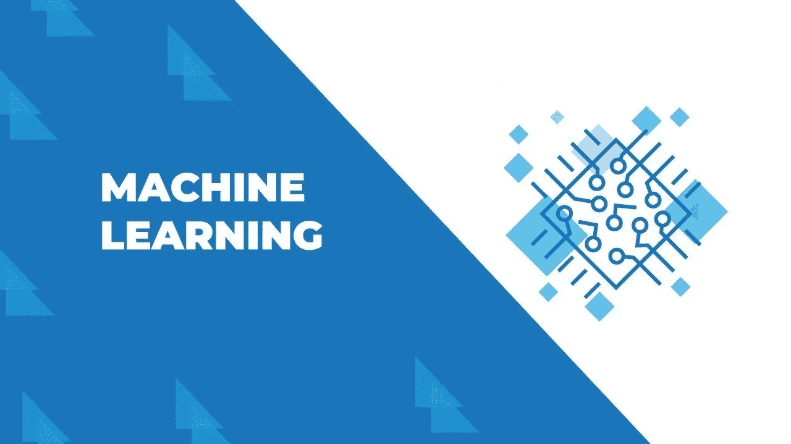
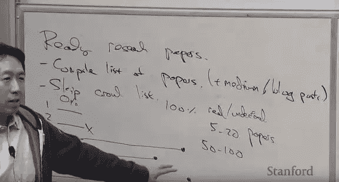
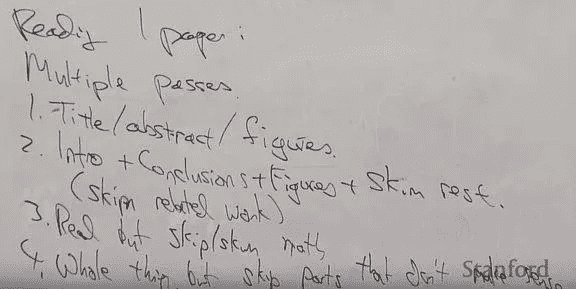
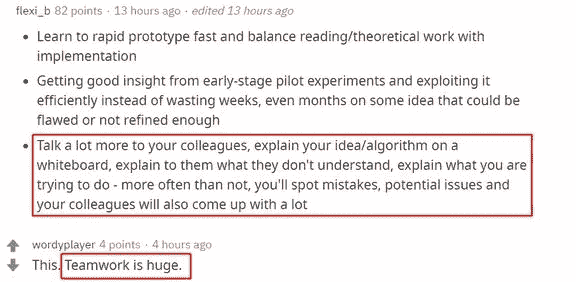
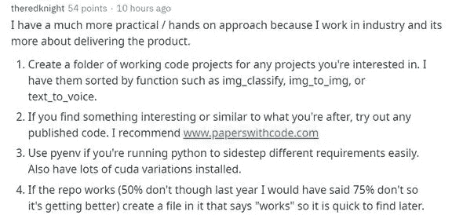
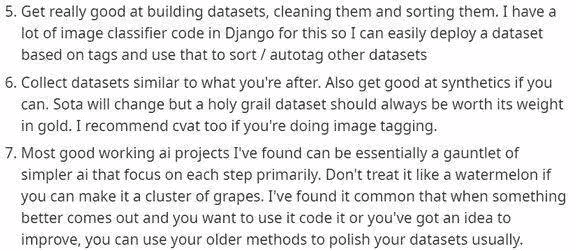

# 机器学习初学者指南 2021

> 原文：<https://medium.datadriveninvestor.com/a-guide-for-machine-learning-beginners-2020-7914dcaeac6b?source=collection_archive---------19----------------------->

A guide for machine learning Beginners 2020

> *如何成为一个有效的机器学习研究者，然后在这个领域有所建树？在那之前我们需要养成什么样的习惯？*

世界上不缺乏好的机器学习研究者，也不缺乏好的建议和指导方针。要成为一个有效的机器学习研究者，最重要的是要有彻底的自我管理能力和一点坚持到底的决心。

约翰·舒尔曼(John Schulman)是一名研究科学家，也是 Open AI 的创始成员之一，他撰写了一本“机器学习研究指南”，其中提供了许多关于选择问题和时间管理的建议。约翰·舒尔曼认为，成功的关键是解决正确的问题，并在这些问题上不断进步，以实现持续的个人成长。

 [## DDI 编辑推荐:5 本让你从新手变成专家的机器学习书籍|数据驱动…

### 机器学习行业的蓬勃发展重新引起了人们对人工智能的兴趣

www.datadriveninvestor.com](https://www.datadriveninvestor.com/2019/03/03/editors-pick-5-machine-learning-books/) 

此外，其他许多研究者也有自己独特的见解。吴恩达专门在斯坦福 CS230 课程上讲了一课，介绍如何看待论文，如何做研究。Reddit 社区的高级研究人员有独特的技巧来快速有效地做 ML 产品和做 ML 研究。

挑选研究问题

选研究题需要品味，选对题目的能力比技术技巧更重要。随着研究的深入，我们会慢慢发现研究问题的各种味道，哪些方法可以很快尝到，哪些方法根本不可行。

事实上，有几种方法可以改善研究问题的味道:

*   看了很多论文，认真复习讨论；
*   组建研究团队，吸收他人的研究经验；
*   请自己的研究员出谋划策，吸收别人的意见；
*   花时间想想什么研究能出成果；

对于最后一点，我们可以问自己“理论什么时候有用”、“实验结果具有普适性吗”、“为什么有些方法被广泛采用，而有些被遗忘？”前三点是其他研究者的信息，最后是你自己的思考。

想法和目标，研究的驱动力

一般来说，我们有两种方法来决定下一步的研究工作:

想法驱动:如果你阅读文献，发现一个关于如何处理 X 的想法，那么你可以开始一个项目来测试新的想法；

目标驱动:如果要实现某些 AI 功能，就要解决实现过程中的各种问题。

这两种方法并不相互排斥，任何领域的机器学习新思想都与某些目标有关。从某种意义上说，想法驱动的研究是目标驱动的一部分。在一篇博客文章中，约翰·舒尔曼用目标驱动作为例子，这意味着你的研究比整个子领域的目标更具体。约翰推荐这种研究模式，他也一直遵循这种目标导向的研究。

值得注意的是，想法驱动的研究有一个缺点:被窃取或窃取其他研究成果的风险。因为各地的研究人员都在阅读相同的文献，所以我们很可能会有类似的想法。如果我们想在想法驱动的研究中取得更多突破，那么首先需要对研究课题有深入的理解，并且观点与其他研究者有显著差异，这是很难实现的。

目标驱动的学习案例

在我的一个大学项目中，目标是让机器人能够操纵可变形的物体，例如试图打结的外科手术机器人和折叠衣服的家用机器人。实现目标的最初想法是基于从人类演示中学习，所以我计划从 RP2 打结的问题开始，然后出现了各种子问题，其中一个是轨迹优化，但我在这个子问题上的工作最终成为了这个项目最重要和最有影响力的产品。

在我大学的第五学期后，我对强化学习产生了兴趣，并决定专注于机器人运动。结果非常令人兴奋，因为目标非常具体。为了让 3D 机器人学会跑步，我将重点介绍策略梯度法，因为这种方法最适合理解和数学分析，并且可以利用之前优化的经验。在此期间，我开发了 TRPO 和 GAE，并成功实现了 3D 机器人运动的最初目标。

当我正在研究如何让机器人移动并使用策略梯度方法获得第一批反馈结果时，DeepMind 的团队使用雅达利上的 DQN 获得了结果。并且，得到结果后，很多人跟风，试图在此基础上开发更好的 Q-learning 版本，应用到雅达利领域。但是，在了解 Q-learning 之后，我判断这对于我的目标来说不是一个好方法，所以我继续使用策略梯度。这种坚持让我制作了 TRPO、GAE 以及后来的 ppo。

目标驱动的研究:在通用解决方案中定义你自己

目标导向研究有一个陷阱，就是把目标看得太彻底。比如当你有能力匹配的时候，你会用最直接甚至最无聊的方式来达到目的。无法推进自己在机器学习领域的发展。你应该把你的研究定义为一个可以被概括和推广，可以应用于其他问题的解决方案。

例如，在研究机器人运动时，我尽量避免将领域信息过度整合到解中，而专注于最本质的问题——目标是在仿真中实现运动。这种方法是通用的，以后可以在其他问题上实施。在做了一系列的特征工程和奖励形成之后，我小心翼翼地做了一些改动和优化，让这些改动不会在很大程度上影响到我正在开发的算法。现在我是以游戏为实验平台，同时确保算法的核心思想不是针对设定的，这样也可以应用到机器人上。

一步一步往上走

在机器学习领域，有时候聪明又勤奋的人并不能产生优秀的结果。主要是研究问题本身的潜力不大:任务能提高 10%还是 10 倍？经常有研究人员做着看似合理的事情，却只能稍微提高某个指标。

更大目标下的增量研究(10%的改进)是最有效的。例如，ImageNet 数据集上的开创性模型 AlexNet 在 2012 年提出时并不包含任何全新的组件。它只是积累了大量的小修正，却取得了前所未有的新成果。在日常的研究工作中，成绩会逐渐提高，但所有的步骤都要朝着更大的目标前进。

如果你想做增量研究，它们的有用性决定了它们的复杂性。比如你增加 10%的效果，最好只有两行代码。如果增加 50%，可以增加 10 行代码。增量研究的性能提升决定了它能增加的复杂度，否则没人会用你的新方法。

研究是一次旅程

研究是一条漫长的路，在这条路上可能会发现新的算法，可能会发表新的论文，也可能直到最后才知道一个结果。为了在这个旅程中开发新的算法和见解，你需要长时间专注于一个问题。

但是，我们不知道旅程的终点是什么，所以这个长期的解题过程需要培养有效的习惯，这样你才能不断走向更好的结果。

保持写笔记的习惯

养成记笔记的习惯很重要。比如你可以每天创建一个条目，然后写下当天你在做什么，有什么想法，有什么实验结果。

在日常总结的基础上，每一两周做一次回顾性总结，并进行点评:比如对实验结果的分析，一些有价值的见解(可以是自己的启发，也可以是来自同事朋友的金句)，代码进度，未来的工作规划。

这样做有什么价值？

一方面，笔记本是帮助你及时记下你的想法的工具，它会在复习过程中提醒你完成想法，督促你重新思考一些可能留在角落的问题。

另一方面，笔记本就像一个收纳盒，帮你把实验结果整理在一起。有些结论很容易忘记，比如哪些超参数是有价值的，那么可以参考笔记。

此外，笔记本可以帮助你解决时间使用问题。有时候你可能会想“上周我做了什么”，翻翻笔记就能找到答案。你可能意识到你需要提高你的时间管理技巧，或者你可能发现你在过去的几个月里改变主意太频繁了，很容易半途而废。

关于“换坑”

说到这里，我们继续分析“观念转换”的问题。一般来说，解决一个具有挑战性的问题需要花费大量的时间和精力。但有时很难说:我做得够不够？我应该走不同的路吗？

根据经验，过于频繁地转换思路比原地不动失败的概率更高。不排除有超级潜力的新点子，但更多时候是失望。如果你回顾笔记的内容，你会发现，在过去的项目中，有一半是你花了相当大的精力完成的。这样的项目不能说是完全失败，而是没有确定的结果。

所以你可以采取一种策略，设定一个固定的时间去尝试新的想法，比如每周花一天时间去探索与你目前从事的项目完全不同的想法。

人的能力发展

无论你如何分配你在研究生涯中的时间，你都必须学到很多东西。但从长远来看，如果你定期留出时间关注个人发展，你将有更好的机会做伟大的工作。具体来说，在从事现有项目的同时，你应该留出一些时间来继续丰富机器学习领域的一般知识。这样除了满足日常工作需求，你也不会停滞不前，不会陷入所谓的舒适区。

有很多方法可以丰富机器学习的知识，包括阅读教科书、学位论文和其他学位论文，以及从这些源材料中复制算法。在研究生涯之初，作者建议将时间重新分配给课本和学位论文，重点选择一部分进行消化和渗透，并根据感兴趣的学位论文复制模型和算法。

大多数学生在完成学业后不会花时间阅读课本，作者认为这是错误的。与学位论文相比，教科书通常以更集中的方式汲取知识。会议论文通常会包含一个主要的新观点和一个过于简洁的背景部分。此外，在阅读论文时，除了论文的观点，你还需要花更多的时间去理解复杂的符号和术语。与学位论文不同，好的教材融入了几十年的思考，以循序渐进的方式呈现复杂的符号。除了阅读入门的机器学习教材，还可以选择其他感兴趣领域的书籍。

除了课本，读一篇学位论文也必不可少。对于自己感兴趣的一些研究工作，可以看看这些研究者的博士论文。机器学习领域的博士论文一般包括导论和背景材料，过去在顶级会议上发表的一些论文，以及结论和展望。其中，学位论文的背景材料和结论总体上巩固了专家们对该领域过去和未来的一些统一看法，你可能会从中受益。

阅读课本和学位论文可以强化你的基础知识，但你也需要阅读大量的其他论文来扩展知识的前沿。在他研究生涯的早期，作者建议花大量时间重现论文中的想法，并将它们的实现结果与已发表的结果进行比较。这样不仅会对学位论文的题目有更深的理解，获得跑实验的经验，而且复活研究的做法会比原研究更快得到反馈。一旦你可以很容易地复制 SOTA 方法，就有可能超越它。

除了阅读和重新创作创造性的论文，你还应该关注你所在领域中不太突出的论文。对即将发表的论文进行批判性的审视将有助于你跟上你所在领域的发展趋势。此外，对于一些被广泛使用并为其他人打开大门的想法，观察它们之间的依赖图也可以帮助你培养阅读品味。

吴恩达的提议

在 CS230 中，吴恩达还对研究规划和如何阅读论文提出了一些建议。

为了有效地阅读论文，吴恩达说，我们想知道论文的来源，如 arXiv 或个人博客。下面，如果我们列出 5 篇要阅读的论文，吴恩达的习惯是将每篇文章排成一行，标明从 0 到 100 的阅读进度。开始时，我们只需要阅读每篇文章的 10%左右。如果发现论文 2 不是我们想要的，我们就结束它。如果第三篇论文很重要，那就仔细阅读以取得 100%的进步。

从论文 3 中，我们可以找到其他相关的研究，因此它也可以添加到论文列表中，如第 6 和第 7 条。看完论文 3，你可能会发现论文 4 也很有意思。然后用 4、6、7 继续阅读，记录阅读进度。

最后，如果我们阅读了 5-20 篇论文，我们几乎对这个领域有了一些了解。如果你高效地阅读了 50 到 100 篇论文，你对这个领域的理解就完整了。Ng 的背包里每天都带着一个文字文件夹，里面的纸质打印的论文就是他的论文清单。

那么具体怎么读一篇论文，吴恩达说从第一个字浏览到最后一个字是最糟糕的方式。一般来说，我们要多次浏览论文，每次的目的都不一样。

首先，第一遍只看标题、摘要、图表。摘要可以告诉我们论文说了什么，对于深度学习研究，很多可以总结成一两张图表。第二遍要继续看前言、后记和图表，其他内容我们暂时可以忽略。注意，看序言的时候，相关的研究部分可以忽略。虽然这部分对理解研究的脉络很有帮助，但是第二遍还是要抓住主要思想。

在第三次阅读时，我们会对论文的主体有一个大概的了解，但同时，那些费时的数学和演绎部分可以暂时跳过。我们只需要把握整体的脉络和框架。第四遍需要看完所有内容，但这时候肯定会有一些看不懂的部分，所以暂时跳过，再试一次。

阅读论文是做研究的基础，高效阅读高质量的论文是重中之重。在课程中，Ng 也分享了很多阅读论文和跟踪论文的小技巧。感兴趣的读者可以观看课程视频:

CS230 第八讲:职业建议/阅读论文:[https://www.youtube.com/watch?v=733m6qBH-jI](https://www.youtube.com/watch?v=733m6qBH-jI)

团队合作也很重要

除了上述开放 AI 研究科学家约翰·舒尔曼的一些建议，Reddit 网友也发表了他们对如何成为一名高效的 ML 研究员的看法。

也有网友认为团队合作也很重要，所以你要和同事沟通，向他们解释你不明白的想法或者算法，解释你在努力做什么。这样，你通常会更容易发现错误和潜在的问题，你的同事也能提出他们自己的一些想法。

除了学术领域，其他网友在行业内传递产品时也分享了一些实用的方法和建议:

*   为您感兴趣的任何项目创建一个工作代码项目文件夹；
*   如果你发现一些有趣的东西或者与你正在做的东西相似的东西，尝试任何已发布的代码；
*   在运行 Python 的同时，可以使用 pyenv 轻松规避不同需求；
*   如果回购成功，创建一个标有“工作”的文件菜单，方便下次查找；

*   让自己善于创建数据集并进行预处理和分类；
*   收集与自己研究相似的数据集；
*   等更好的代码出来了，再去尝试使用；当你意识到想法需要改进时，使用现有的方法来润色和优化你的数据集。

在机器学习领域，每个人都会有自己的一套研究方法，一些好的建议和做法不一定适用于所有人。所以，如果你想成为一个有效的机器学习者，认清自己，想出适合自己的路径很重要。