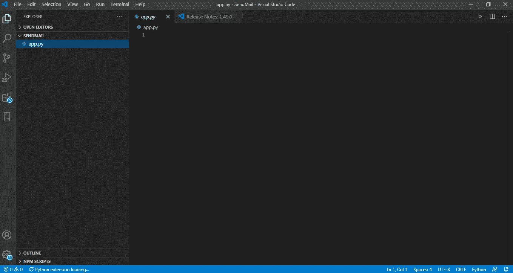
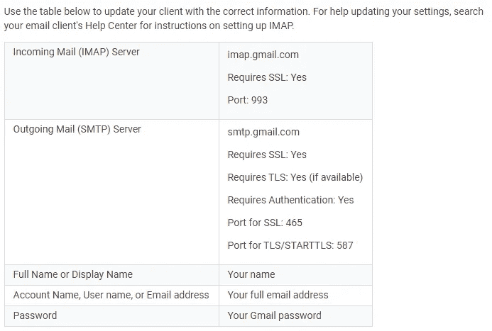
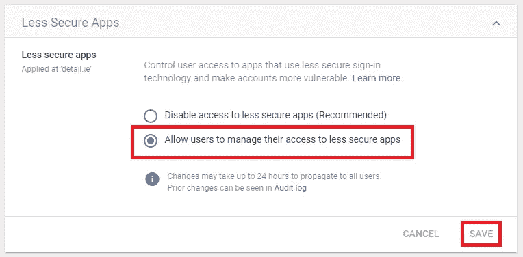
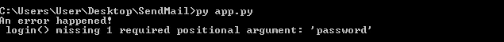

# 用 Python 创建自动邮件发送系统的指南

> 原文：<https://medium.datadriveninvestor.com/a-guide-to-creating-an-automatic-mail-sending-system-with-python-c39ffbc5f7f3?source=collection_archive---------5----------------------->

## 适用于每个人的实用指南


Photo by [Brett Jordan](https://unsplash.com/@brett_jordan?utm_source=medium&utm_medium=referral) on [Unsplash](https://unsplash.com?utm_source=medium&utm_medium=referral)

TPython 语言有许多优势，让日常生活变得更容易。它为我们的日常工作提供了巨大的好处，这可以通过自动化过程手动完成。在本文中，我们将通过 python 创建一个自动电子邮件发送系统，我们将分别讨论该系统的所有代码片段。为此，我们将遵循以下步骤。

*   **用‘cmd’创建文件**
*   **蟒蛇基本操作**
*   **连接电子邮件服务器**
*   **发邮件**
*   **针对错误发生采取的措施**

> **如果你准备好了，我们开始！**

# 1.步骤:**用“cmd”创建文件**

*   有了 cmd，我们将首先在桌面上创建一个文件。为此，我们用下面一行来访问文件。

```
C:Users\User\Desktop
```

*   我们通过键入**‘mkdirsendmail’**来创建第一个文件
*   通过**“CD SendMail”**我们可以进入这个文件夹。我们现在在我们刚刚创建的文件夹中，如下所示。

```
C:Users\User\Desktop\SendMail
```

*   然后我们编写**“拷贝 nul app . py”**,并将 python 文件写入一个空应用程序的文件夹中。

```
C:Users\User\Desktop\SendMail > copy nul app.py
                 1 file(s)copied
```

*   现在我们带着**“CD ..”回到桌面**命令。

```
C:Users\User\Desktop\SendMail> cd ..
```

*   现在我们正自动尝试在 VisualStudio 中打开代码就绪文件。

```
C:Users\User\Desktop\code SendMail
```



Our file is automatically opened to write our codes

# 2.步骤:Python 中的基本操作

*   **SMTP:** 我们使用**‘smtplib’**模块自动发送邮件。(不需要安装，因为它附带 Python。)我们从包含 **SMTP** 类开始。

```
**from smtplib import SMTP**
```

> SMTP:简单邮件传输协议—是一种用于邮件操作的 TCP IP 协议。

*   **为邮件信息创建一个变量:**我们为将要发送的邮件创建一个名为“subject”的主题标题。我们还用“消息”变量创建消息的内容。然后我们创建电子邮件，将显示“内容”和这两者结合在一起。为此，我们将进行合并。

```
#Information Mail Message**subject = "Test"
message = "This is a test message"
content = Subject = "{0}\n\n{1}".format(subject,message)**
```

在创建**【内容】**变量时，我们将主题和消息之间的空间确定为两行，我们用 **1** 发送消息，我们执行格式操作。第一个参数设置为**主题**，第二个参数设置为**消息**。

*   **创建邮件帐户信息:**我们创建了一个名为**‘我的邮件地址’**的变量来指定我们的邮件地址。然后我们创建**‘密码’**变量。

```
#Information Mail Account**myMailAddress = "email@gmail.com"
password = "password"**
```

*   **定义邮件要发送到的变量:**在邮件内容和账户信息之后，我们需要定义邮件要发送给谁。为此，我们设置了另一个名为“sendTo”的变量。

```
#Send to Message**sendTo = "sendto@gmail.com"**
```

# 步骤 3:连接到电子邮件服务器

*   **从 SMTP 类创建一个邮件对象:**我们创建一个名为**‘邮件’**的对象。我们在这里输入我们使用的电子邮件服务器的主机地址。由于我们使用的是**‘Gmail’**，我们需要将主机地址设置为**‘SMTP . Gmail . com’**。我们输入用作 587 的服务号码。

```
#Set Gmail Host Address**mail = SMTP("smtp.gmail.com", 587)**
```

> 如果你要用不同的邮件服务器发送邮件，你可以通过谷歌搜索“你使用 IMAP 的邮件服务器”来获得最新的官方信息。



Screenshot after search for gmail

*   **连接服务器:**我们将使用**‘ehlo’**函数来连接服务器。

```
**mail.ehlo()**
```

*   **发送加密数据:**我们将使用**‘starttls’**函数将我们的数据以加密形式发送到服务器。

```
**mail.starttls()**
```

*   **登录:**我们将使用**‘登录’**功能登录邮件服务器。这里我们需要输入我们的密码信息。我们之前已经指定了我们的**‘my mail address’**和**‘password’**变量。

```
**mail.login("myMailAddress, password")**
```

# 步骤 4:发送电子邮件

现在我们已经登录到邮件服务器，我们可以发送我们的邮件。为此:

*   我们将使用**‘sendmail’**功能。

```
**mail.sendmail()**
```

*   我们的第一个参数将显示是谁发送了邮件，即 **myMailAddress** ，我们的第二个参数将显示邮件将发送给谁，为此创建了' **sendTo'** 变量，我们的第三个参数是邮件本身，因此我们之前设置了' **content** '变量。

```
**mail.sendmail("myMailAddress, sendTo, content")** 
```

> 为了避免因语言选项不同而导致邮件内容不符合您的要求，您可以使用**‘编码’**功能根据您需要的字符执行转换过程。

*   **输出给用户:**我们希望在最后阶段得到邮件已经发出的通知。**那样的话:**

```
**print("Your mail has been sent successfully")**
```

# 步骤 5:针对错误发生采取的措施

*   此外，让我们确定在出现错误的情况下如何继续。为此，我们将使用' **try-except'** ,我们将让所有代码行对错误做出反应。我们将把这个表示为**【e】**。

```
**try****except Exception as e:
** 
```

*   然后，我们会将错误显示为打印输出。下面一行我们要显示错误。我们将通过格式化来发送 e 参数。**那样的话:**

```
**print("An error happened!\n{0}.format(e)"**
```

这样，整个代码阶段就完成了。你可以看到他们都在一起，如下。

# 要点

*   对于 Gmail 用户，需要自动邮件发送流程确认。为此，您需要启用该选项以允许不太可靠的应用程序。否则，将会出现错误。



*   你可以使用 **cmd** *('py app.py)* 来运行你的 **SendMail** 项目。如果出现错误，您的屏幕将如下所示:

