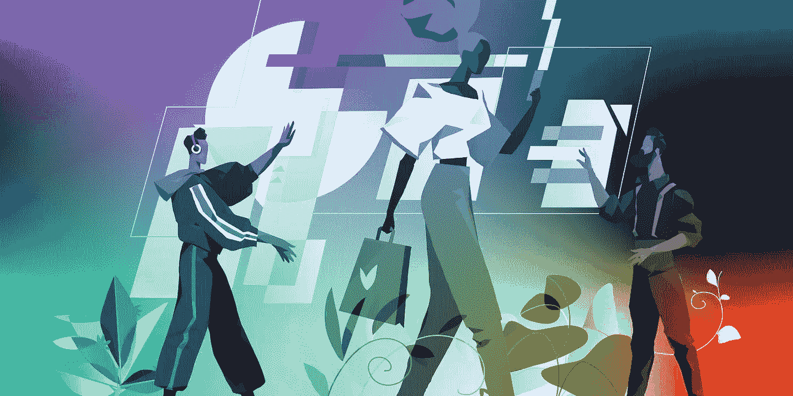
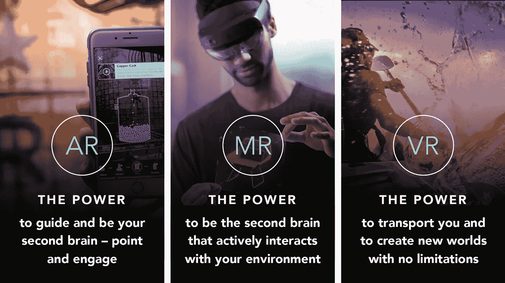
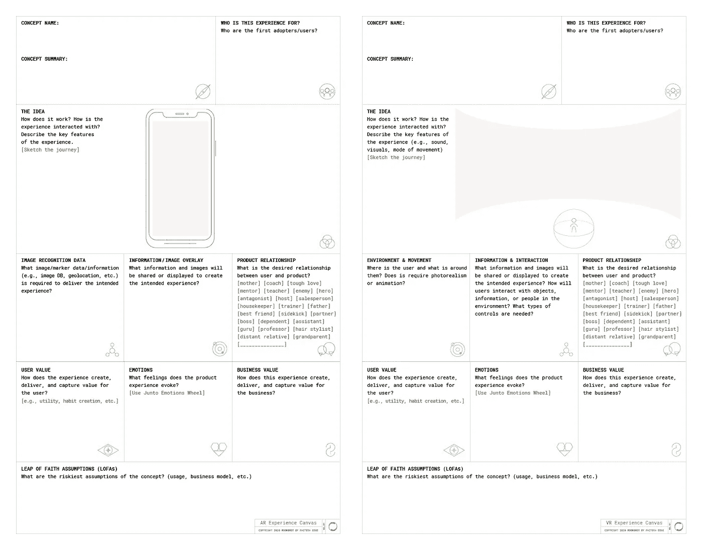

# 沉浸式现实创新的价值指南

> 原文：<https://medium.datadriveninvestor.com/a-guide-to-the-value-of-immersive-reality-innovation-80ad0faae152?source=collection_archive---------14----------------------->

我们正在经历一种思维方式的转变，我们发现的想法可以为沉浸式现实带来投资回报。创新并不像一些组织年复一年提倡的那样从商业案例开始。询问“业务案例是什么？”吸走了房间里的能量和创造力，毫无疑问，也打击了你的员工分享想法的积极性。它没有注入创新和变革的气息。它让我们沿着市场人口统计和总可寻址市场的道路前进——所有这些都是估计和猜测，尽管是有根据的猜测。它并不涉及如何、什么、何时或为什么有人应该为一个引人注目的体验或我们品牌的产品付费或仅仅看重它。在这篇文章中，我提倡创建一个体验案例。出于讨论和说明的目的，这篇文章关注的是企业如何用身临其境的现实来检验可爱产品的创造。

当我们研究公司如何弄清楚如何用身临其境的现实来制造可爱的产品时，商业案例的局限性和失败变得尤为明显。关于沉浸式现实，我们已经清楚明白了一件事:除非你创造一种以人为中心的体验，否则所有形式的沉浸式现实——增强现实、混合现实和虚拟现实——都可能失败。商业案例并没有真正解决你创造的体验或者他们希望与之互动的人。这并不是说商业案例没有价值——作为一个创造了许多商业案例并为许多企业提供各种程度的数字化、产品创新、商业模式颠覆或投资初创企业咨询的人——当商业案例做得正确时，会有巨大的价值。但这不是你开始创新对话的地方，那么你应该从哪里开始呢？

# **1 知道在哪里以及如何看、听和感受**

许多人说，寻找问题，这样你就能找到机会——他们没有错。但是，这不是唯一的地方，或寻找的方式。创新可以仅仅是增强当前良好的体验。创新可以涵盖从扩大你的产品到简化供应链的方方面面，甚至更多。创新的概念在被称为[第四次工业革命](https://www.weforum.org/agenda/2016/01/the-fourth-industrial-revolution-what-it-means-and-how-to-respond/)中被许多人吹捧。但是许多企业说他们创新，即使他们不知道如何创新。更糟糕的是，许多企业阻止自己的员工创新。

 [## 作为可访问存储器的虚拟现实架构|数据驱动的投资者

### 一个好的建筑 app 是由什么构成的？一个详细的模拟，一方面是信息丰富的，但也是视觉和…

www.datadriveninvestor.com](https://www.datadriveninvestor.com/2020/02/15/vr-architecture-as-an-accessible-memory/) 

创建一个分享想法的论坛，在那里你可以提出想法——非常类似于日本的制造业创新，生产线上的人被激励去分享和建立流程改进。没有人比你自己的员工更了解你的业务。所以给他们分享的空间绝对应该是一个起点。不幸的是，许多组织延续了令人沮丧的工作方式，如“创新只发生在这个团队中”或“你只是不明白”或某种变体:“[你需要跳过这 7 个圈，与这 3 个人(他们很难抽出时间来)交谈，然后我们会看到]”以我的拙见，这些不是建设性的也不是有益的工作环境——我只是写了这些陈述就感到沮丧。希望你开始感觉到创新是如何系统化的，或者缺乏创新是一个组织系统的问题——但是是一个可以解决的问题！

倾听和观察是很好的开始方式:对你的人，团队，以及你的产品或服务的用户。我从旅程和生态系统开始，这需要我倾听用户。通过观察整个旅程或生态系统，你可以确定一个人整体体验的顶峰(最有利的部分)和低谷(最不利的部分)，然后在这些机会中构思——这是通过打开思想的闸门进行发散思维的一个例子。如果你在总体上难以理解这个概念或构思，设计冲刺或概念研讨会可以帮助你真正挖掘旅程和构思——在这种情况下，是沉浸式现实。像 [design sprints](http://www.moonshotio.com/design-sprint/) 这样的工具可以让公司专注于提供价值，特别是对最终用户。这一点很重要，因为高层领导经常会对最新的发光物体着迷，而没有注意应用所述发光物体。正如你将在这篇文章中看到的，经验案例也有助于防止企业失去重心。

# **2 评估用户的生态系统**

了解你的用户生态系统将有助于你了解如何调整你自己的业务生态系统。一个生态系统不同于一次旅行。旅程通常专注于用户购买行为，许多企业希望了解与购买其产品相关的旅程。另一方面，一个生态系统由一个人可能与技术和接触点以及你的产品交互的所有方式组成，或者在一天、一周或一个月中与你的产品相关的交互。例如，如果你是一家服装零售商，考虑你的生态系统可能如何与你的客户互动:在他们的家里，他们的衣柜里，甚至他们的意识形态上，为什么这符合他们的个人审美和衣柜，他们的社交空间(物理和数字)，等等。你的创新如何与他们的相互影响？我把你的品牌生态系统与顾客生态系统的这种一致称为互动对等。

# **3 写出或画出它是如何工作的——中等水平**

以中等保真度将您的想法可视化，以便与您自己和/或您的团队一起快速对想法进行压力测试。

我说的“中等水平”是这样的:

-这种沉浸式现实体验的输入是什么:图像、关键标记、位置等。

-这种沉浸式现实体验的输出是什么:信息、覆盖图等。

-用户附加的简单交互元素:用户做什么。

请记住，当您通过体验的输入和输出进行思考时，虚拟现实体验的考虑因素将不同于增强或混合现实的考虑因素。当你通过你的经验思考时，这里有几个额外的问题可能会引起你的兴趣:应该使用 2D 还是 3D 资产？环境怎么样？我周围 360 度发生了什么？这种体验是为你的用户模拟运动还是他们能控制运动？

这些问题仅仅触及了体验设计的表面。但是它帮助你开始思考这个想法，并把它变成一种体验。

# **4 概述用户价值**

了解你的受众，以及你的体验*如何为他们带来价值*。你需要超越人物角色和主要受众，不幸的是，组织已经滥用了他们——请注意，这是无意的——所以识别我们的用户需要我们作为创新、产品和体验战略家来重新思考这个问题及其意义。相反，回答这个问题:谁是你的第一批采纳者？(略有不同的说法:你希望你的第一批领养者是谁)。还要注意的是，像沉浸式现实这样的技术也可能创造识别新观众的机会。

这也是思考你想要唤起的情感的时候。情绪与经历密切相关。我们都知道看《玩具总动员》时的感受，我们会回想起我们拥有的玩具以及你与心爱的泰迪熊或动作玩偶的关系。你想激发灵感吗？创造快乐？像 [Junto 情感轮](https://www.thejuntoinstitute.com/blog/the-junto-emotion-wheel-why-and-how-we-use-it)这样的工具可以帮助你发现观众表面之外的情感需求。

这是产品创新的一部分，创造体验的人很容易迷失，但它对用户和企业都有深远的影响，并将让你走上成功创新的道路。这些也将帮助你对你的想法进行压力测试——如果我们不能理解或真正指出这种产品体验提供的价值，那么也许是时候改变或放弃这个想法了。

# **5 了解产品关系**

你希望你的顾客和你的产品之间有什么样的关系？思考:我们的用户想要或重视与我们产品的关系。你想要师徒关系吗？蔻驰？一个搭档？通过关系建立联系将获得同理心和忠诚度——这很可能比你正在创造的产品版本更长久。当我们回忆生活中的产品或经历时，我们会记得那些让我们有所感触的东西，那些我们有着特殊关系的东西。我们确实会对实物和数字产品产生感情——你成长过程中拥有的泰迪熊，你保存的冠军赛篮球，你选择作为“玛丽·近藤”手机保留的应用程序。这样做将有助于你变得更加以用户为中心，并实现你想要传递的用户价值。

# **6 欢迎来到创造体验案例！**

这种经验案例可能对你来说是新的，但我保证许多人已经这样做了一段时间，而不知道它。体验案例是前面提到的那些(有点简单)主题:产品体验(它是如何工作的)、用户价值和产品关系。体验案例使你的产品概念和它所推动的价值具体化。我决定与你和创新社区分享这个工具(我和客户一直在使用它)。我在这里分享两个经验案例:一个是虚拟现实，一个是增强现实。

画布有两个部分前面没有讨论，但是很重要:

*   信念的飞跃假设:这些本质上是你的用户行为或市场未知，需要进行评估。对于 Airbnb 这样的企业来说，LOFA 应该是:人们真的会住在别人家里吗？还是说人们真的会愿意让陌生人待在自己家里？
*   商业价值:请注意，我特意将它留在画布底部，因为我仍然认为从高层次思考它是有价值的。但在评估沉浸式现实想法时，商业价值不一定是你首先考虑的事情。

# **了解、理解和评估**

正如我在开始提到的，商业案例仍然是有价值的和必要的。但是在你真正为产品写商业案例之前，你需要知道、理解和评估这些概念。

当我们的思维转变为接受体验案例时，我们还需要考虑价值。体验的价值，它的投资回报率，在为用户实现价值的过程中得到最好的理解。顾客终身价值(CLV)、积极关联和忠诚度是实现价值的例子。根据我的经验，这些可以带来收入，但这一切都始于体验和用户价值。您通过产品体验投资于与客户的关系，我们做得越好，收益越大。

最重要的是，作为创新者、思想家、创造者、设计师和领导者的全球集体，我们有能力创造能够改变生活的产品和体验。我们可以帮助重新想象并实际创造新常态，一种更好的常态(持续地，而不仅仅是在全球流行病和民权运动中)——一种植根于同情、爱、灵感、独创性和乐趣的常态。因此，让我们继续努力，在我们所做的和创造的一切中，实现那种有意识的、有目的的创新。我希望这个经验案例能帮助你达到目的！

**访问专家视图—** [**订阅 DDI 英特尔**](https://datadriveninvestor.com/ddi-intel)