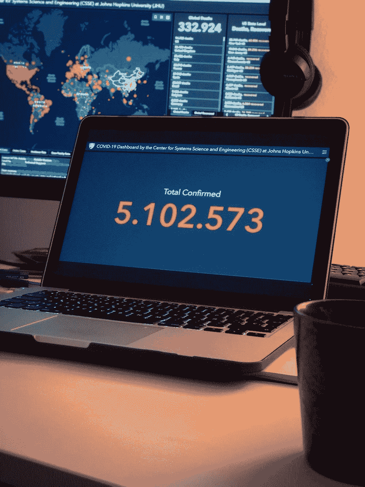

# 一个自我复制的黑客，不用 CPU/GPU 就能挖掘密码

> 原文：<https://medium.datadriveninvestor.com/a-hack-that-replicates-self-mines-crypto-without-cpu-gpu-ab5df0143303?source=collection_archive---------6----------------------->

Source: Unsplash

现在，继续我的概念验证。请注意，我没有创建(大部分)这个，也没有将它传播给任何不同意的机器。假设并不违法，对吧？

注意:我确实创建了大部分 powershell 中的挖掘脚本，并在不久前执行了它。这个概念验证的其他方面是全新的。

看那个，我甚至找到了一点罪证代码:)

好吧，那么，用一些逻辑将它分解成小的可实现的步骤，想法是选择一个密码来窃取人们的计算机，而不使用他们的 CPU/GPU(大多数人，无论多么愚蠢，都会注意到并诊断)。大多数僵尸网络友好的 crypto 将使用目标机器的 CPU 的%或(有时)GPU 来挖掘 crypt。

 [## 为什么参与正确的加密交换至关重要|数据驱动型投资者

### 到目前为止，与黄金和美元相比，加密货币，尤其是比特币，已经显示出巨大的增长

www.datadriveninvestor.com](https://www.datadriveninvestor.com/2020/07/16/why-engaging-with-right-crypto-exchange-matters/) 

我选择了“爆裂”——但从那以后,“爆裂币”改变了它的名字，变成了“BHD”和一大堆其他相关的硬币。您可以使用相同的脚本来挖掘它们——只需要在这里更改(一些)执行。

上面的 Windows 批处理文件会将一些命令保存到不同的 Powershell 脚本中，然后运行。

简而言之，它计算出 C:上有多少硬盘空间，然后取其中的%并在后台运行“engraver ”,这是一个 FOSS Burst 命令行绘图仪。假设计算机运行足够长的时间来完成这个过程，它会在启动时启动“清道夫”来挖掘这个突发事件。

这里有比这更复杂的东西——例如，运行一个“不可见”的 Windows 命令提示符，使用我在 netherwebs 上找到的脚本，或者从我的集中式服务器加载 JSON 响应(如果这个阴谋在…上执行，这将是有罪的)以评估下一个目标的起始随机数。

现在，为了在互联网上传播这一点(没有任何预算可言),我们将从 piratebay 或类似网站下载热门(较小的 MB 大小)软件种子。自然，有些人会下载我们新播种的种子，执行。在这里，我们的批处理文件干净地(并且完全不可察觉地)与它结合在一起。exe，他们会得到他们破解的软件，而我们会在他们的系统上运行我们的批处理。

其中一些人会重新播种——我们会强迫他们重新下载种子和数据，并使用系统进程和命令行 windows 种子软件(我不确定是否存在)播种。

这就是了——非侵入性繁殖。人们想要自由软件，消费自由软件，并获得各种各样的肮脏东西——降低他们的 UAC 盾牌默认这样做。

请注意，这些指示的一部分被混淆为不太有效(无私)或不太有罪(自私)，在可能否认的意义上。

订阅获取您的每日顶级科技报道综述！

看啊！一个插头！

！！点击此处订阅:[http://bit.ly/JarettMail](http://bit.ly/JarettMail)

收到关于新文章的通知？技术？比特币/加密/区块链(不一样的东西？)?心理健康漫谈？欢迎来到 Jarett Dunn 电子邮件订户名单！

记得点击，订阅:【http://bit.ly/JarettMail[！！](http://bit.ly/JarettMail)

想要平装本还是电子书漫谈和废话？查 Kindle:【https://amzn.to/2FycOfp】T4

**访问专家视图—** [**订阅 DDI 英特尔**](https://datadriveninvestor.com/ddi-intel)