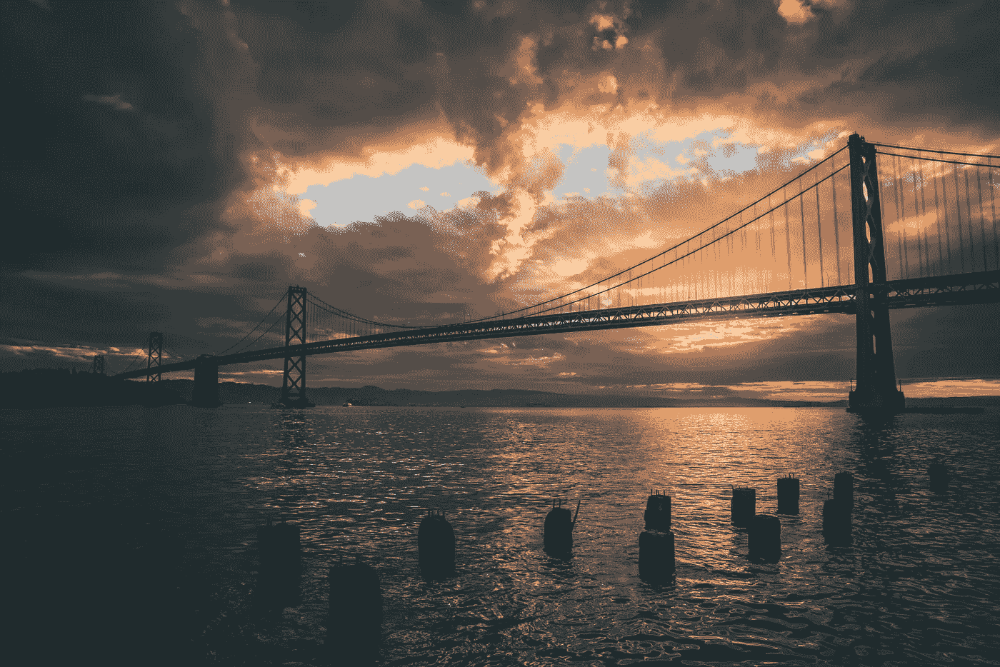

# 从更高的地方坠落。

> 原文：<https://medium.datadriveninvestor.com/a-higher-place-to-fall-from-67bad2077e77?source=collection_archive---------13----------------------->

The sun may have never set on the British Empire but it most certainly sets here now.

# 宁静的山谷。

> “早在 70 年代，诺贝尔经济学奖得主希尔伯特·西蒙就接受了这些不成熟的观点，并对它们进行了严谨的解释:‘信息消耗什么是相当明显的。它消耗了接收者的注意力。因此，丰富的信息造成了注意力的匮乏。”—富兰克林·福尔，《没有头脑的世界:大型科技的生存威胁》。

如果这个词存在于硅谷的日常用语中——也许是在湾区外的斜坡上喃喃低语，或者是从满怀希望的准企业家们谈论如何*打败“正常”*——那么它现在肯定已经退休了。随着冠状病毒疫情在世界各地肆虐，并向各种形状和规模的行业发出一连串的鱼雷，有一个行业似乎准备安然度过这场攻击:[尽管经济衰退的威胁日益逼近](http://forbes.com/advisor/investing/covid-19-coronavirus-recession-shape/)、大规模失业、[在硅谷称之为家园的国家死亡人数超过 10 万](https://www.cdc.gov/coronavirus/2019-ncov/cases-updates/cases-in-us.html)、街头骚乱以及不得不重新调整公司的运营方式， 如果一群赌徒将世界视为一个赌场，他们可能会将强大的大型科技行业视为等同于在房子上下注，而不仅仅是因为他们在回馈。

 [## 以最好的面貌面对未来|数据驱动型投资者

### 社交媒体营销从客户开始。广告、反馈和管理投诉交织在一起…

www.datadriveninvestor.com](https://www.datadriveninvestor.com/2020/03/01/take-charge-with-your-best-face-forward/) 

不管这些理论上的赌徒或旁观者是否意识到，一个已经强大的行业已经准备好成为 21 世纪资本的顶级掠夺者。如果华尔街统治了金钱世界，那么大型科技可能很快就会统治思想世界。甚至不用深究一个令人信服的虚拟现实模拟可能带来的难题，我们就能亲眼目睹事态的升级；一个已经被批评为太不稳定的行业——甚至是无忧无虑的——在它的方法中，商业意识和私人消费者信息可能会占据更多的哲学和政治权力。

这完全取决于谁在主持大局……

更确切地说，是电动游乐场。

# **脸书和“政治目标”**

> “我认为我们是一家技术公司，而不是媒体公司。”——马克·扎克伯格，脸书首席执行官。

在永无止境的公众批评中，脸书仍然被卷入马克·扎克伯格在参议院前为剑桥分析公司丑闻作证的麻烦中。不仅满足于出于政治广告的目的而泄露数百万用户的私人数据，社交媒体如何影响未来选举的其他问题仍然笼罩着硅谷走廊。尽管扎克伯格坚称，他认为剑桥分析公司在决定不使用用户信息后删除了这些信息，但用金钱交换来武器化社交媒体平台的想法对于希望造成伤害的第三方来说只是合乎逻辑的解决方案。

I’m still waiting for a computer that talks to me when I enter the room.

硬币的另一面是，我们已经知道在 2018 年之前没有什么是私有的。 软件公司、数据公司和[社交媒体多年来一直在扫描和收集我们的信息](https://www.forbes.com/sites/kalevleetaru/2018/10/25/social-media-companies-collect-so-much-data-even-they-cant-remember-all-the-ways-they-surveil-us/#6fb098e17d0b)——更不用说智能设备甚至在[我们没有直接与他们交谈的时候也在监听我们说的话](https://www.washingtonpost.com/technology/2019/05/06/alexa-has-been-eavesdropping-you-this-whole-time/)。不知何故——带有政治意味——这感觉更加邪恶。亚马逊使用你以前的购买历史来推荐新东西是一种情况——让一家公司通过用户信息来影响政治活动是另一种完全不同的情况。

归结起来就是:如果人们在 2018 年之前没有注意到大型科技在用户隐私和选举安全方面的作用，那么创可贴最终会被撕掉，让所有人都看到。

# **YouTube 和“审查”**

> “我们希望支持那些使用 YouTube 与世界分享知识的人，以及数百万来到我们平台学习的用户。”YouTube 首席执行官苏珊·沃西基。

虽然有些人——可以理解——担心 YouTube 的去货币化运动，原因似乎是[随意定义的或不可能理解的](https://www.forbes.com/sites/erikkain/2017/09/18/adpocalypse-2017-heres-what-you-need-to-know-about-youtubes-demonetization-troubles/#750dc6666c26),但当我们不能清楚地定义 YouTube 在何处划定构成这些东西的界限时，希望消除宣扬仇恨言论的视频的方法就变得不那么明确了。

早在 2019 年，当 YouTube 开始发布关于打击宣扬仇恨言论、白人至上主义、新纳粹主义或其他保守主义甚至极右翼理想的视频的大型新闻稿时，它因似乎在一些频道上执行禁令而受到批评。如果无名创作者的频道被删除了，那么为什么一个广受欢迎的保守派评论员史蒂芬·克劳德因一名记者的古巴裔美国人血统和同性恋身份而对其进行诽谤的视频却被允许自由赚钱？

Tech companies should call bad PR-moves ‘playing with coffee.’

尽管 YouTube 收回了最初拒绝将 Crowder 去货币化的态度，但古老的格言 ***【金钱万能】和*** 甚至在互联网领域也被证明是正确的；克劳德的数百万用户通过他们的谷歌广告计划帮助 YouTube 赚了很多钱。虽然他的频道在 YouTube 的土豆赚钱农场的大计划中仍然是微不足道的，但比起大创作者，更容易忽视来自小创作者的微薄收入。

但是职业喜剧演员呢？他们可能通过观察——或体验——少数种族或少数性别的生活来制作喜剧。如果他们在政治正确的标靶上以不被认为是靶心的方式讲述他们的故事呢？

这仅仅是个人看法的问题吗？

谁能区分“伤害的意图”和“大笑的意图”？

# **Twitter 和“提供背景”。**

> “每条推文中都有一个完整的宇宙，至于它将如何传播，这真的完全取决于内容。”——推特首席执行官杰克·多西。

Big Tech 寻求呈现“背景、整个背景，除了背景别无其他”的最新传奇，以 Twitter 在“事实核查”方面的新冒险的形式出现。尽管 Twitter 表示，它实施这一政策是为了帮助打击在该平台上流传的“错误信息”浪潮，但一个合理的问题是“谁将背景联系起来？”或者甚至是“谁对事实核查者进行事实核查？”[尽管首席执行官杰克·多西声称这些旗帜的目的是为了反对虚假信息或煽动性语言](https://www.cnn.com/2020/06/03/tech/twitter-enforcement-policy/index.html)，但我们在决定什么是“美化暴力”和什么不是时，该如何划分界限呢？

因此，即使美国总统在乔治·弗洛伊德(George Floyd)抗议高潮期间威胁恢复法律和秩序的频繁推特演说中获得了一面旗帜，我们又怎么能指望一个人或一台机器根据上下文本身来区分呢？发微博说你要杀一群人是一回事…威胁说如果你的烤面包机不烤你的面包就杀了它，然后收到通知，这太荒谬了。它不仅荒谬，任何看到它的人都会拒绝认真对待它——甚至是这个平台。

公平地说，这种框架在僵尸农场或成群结队的网络流氓抓住平台大规模传播煽动性词汇、文章或短语的能力的情况下是有用的。不太有用的是可能会突然出现明显不需要它的情况。

# **两步解决方案:**

那么我们的底线在哪里，我们如何实施呢？[正如我之前在其他文章中提到的，我不是软件工程师。](https://medium.com/datadriveninvestor/why-i-wish-id-chosen-a-career-in-software-engineering-8cd5e2243e96)然而，我确实有一些建议，可以帮助我们的行业巨头变得更加负责，如果他们觉得有必要通过标记露骨内容、禁止或保护数据来保护用户的福祉。等式的另一面——就像这篇介绍中提到的——是科技公司对于他们的…硬盘来说变得太大了……可以这么说。

毕竟，我们知道人类和机器都不可能监控通过这些平台进入的所有东西。一些文章、广告或词语会在不知不觉中渗透进来。

*这就是游戏的本质。*

这就是互联网的本质。

## **1。** **定义你的参数。**

如果你的内容包含你不希望被货币化或传播的特定信息或词语，确保你跟进所有使用该平台的账户——即使是那些为你赚钱的账户。即使这在短期内会损害你的钱包，但当你的用户看到你跟进备受关注的案件时，这有助于建立信任。

如果平台觉得他们需要开始打击允许的言论水平，那么他们至少应该尝试开发一个系统，能够将黑色喜剧与邪恶的仇恨分开。这可能很难，甚至不可能，但它有助于在用户和平台之间建立更好的关系。

## **2。** **创建问责。**

现代互联网已经发展了三十年，普通消费者明白，尽管隐私政策已经到位，但几乎没有什么是隐私了。 话虽如此，但与组织共享用户信息以用于政治目的可能并不是最好的主意。如果冠状病毒的衰退在未来十年继续下去，大型科技由于 ***的本质而继续繁荣，每个人都需要使用互联网，不管你是就业还是失业*** ，那么这些公司应该建立更多的问责制。

无论国会最终通过了提供更严格监管的法律，还是科技巨头变得太大而难以掌控，最终陷入一系列丑闻，他们自己机构的问责制都会为用户创造一种特殊的信任。

*如果他们最终成为谁有权说什么和如何说的看门人…*

*…那他们最好准备好，当作证的时间到来，信任被侵蚀的时候，给出一个明确的答案。*

—

即