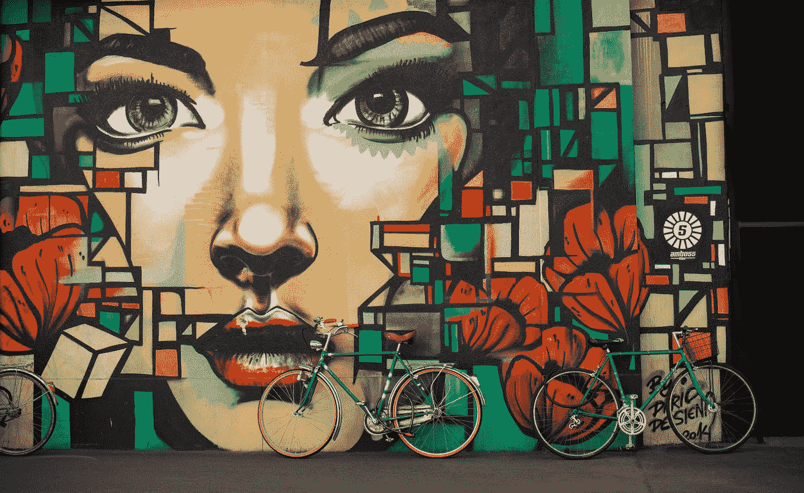

# 人工智能将手伸向艺术

> 原文：<https://medium.datadriveninvestor.com/a-i-turns-its-hand-to-the-arts-98933f0021e6?source=collection_archive---------22----------------------->

Photo by [Timon Klauser](https://unsplash.com/@timon_k?utm_source=medium&utm_medium=referral) on [Unsplash](https://unsplash.com?utm_source=medium&utm_medium=referral)

一位艺术家使用机器学习创建了卡利古拉、尼禄和哈德良等古罗马皇帝的面部写实肖像。

为了发现这些角色在现实生活中的样子，加拿大电影摄影师兼虚拟现实设计师丹尼尔·沃斯哈特使用一个名为 Artbreeder 的神经网络来运行大约 800 个半身像。

沃斯哈特随后使用 Photoshop 对艺术育种模型进行了微调，添加了从硬币、艺术品和历史文本中对皇帝的书面描述中收集的细节，以使肖像真正变得栩栩如生。

 [## 一名大学生使用语言生成人工智能工具创建了一个病毒式博客帖子|数据驱动…

### 作为作家，我们喜欢告诉自己，我们处在一个无法自动化的职业中，至少短期内不会。但是…

www.datadriveninvestor.com](https://www.datadriveninvestor.com/2020/09/15/a-college-student-used-a-language-generating-ai-tool-to-create-a-viral-blog-post/) 

“计算机编程中有一条经验法则叫做垃圾进垃圾出，它也适用于 Artbreeder，”沃斯哈特在一封电子邮件中告诉《生活科学》。

这意味着，一个损坏小、特征清晰、雕刻精美的半身像会得到很好的效果，而损坏的雕塑或糟糕的拍摄图像会产生很差的效果。

他在博客文章中说[,沃斯哈特更喜欢用作他的主要来源的半身像是在他们的皇帝主题还活着的时候雕刻的，或者是制作得最巧妙的。](https://medium.com/@voshart/photoreal-roman-emperor-project-236be7f06c8f)

对于肤色，Voshart 要么为 Artbreeder 提供彩色参考图像，要么让它“猜测”如何分配色调，以便模型的表面类似于真实的人类皮肤。

“我可以通过手动控制来改变肤色和种族，”他说。

沃斯哈特告诉《生活科学》,寻找皇帝的艺术和参考文献大约需要两个月，组装每幅肖像平均需要 15 到 16 个小时。

对于卡利古拉皇帝，沃斯哈特调整了艺术育种者的模型，使用了包括“头部畸形，眼睛和太阳穴凹陷”和“眼睛瞪着，目光野蛮到足以折磨人”的描述

以上细节摘自 1928 年发表在《语言学研究》杂志上的一篇题为《罗马皇帝传记中的个人形象》的论文。

相比之下，根据 1928 年的论文，尼禄的下巴更圆，皮肤长有雀斑，他的脸更讨人喜欢，而不是更迷人。

沃斯哈特在新冠肺炎隔离期间开始了他的罗马皇帝计划

在最初分散注意力的过程中，他收集了足够的知识和兴趣，将 54 位皇帝纳入了他的作品。

你可以在沃斯哈特的网站上看到更多他的重建作品，在他的 [Etsy 商店可以买到罗马皇帝项目中 54 张脸的海报。](https://go.redirectingat.com/?id=92X1590019&xcust=livescience_za_6479734419036977000&xs=1&url=https%3A%2F%2Fwww.etsy.com%2Fshop%2FVoshart%3Fpid%3D259915&sref=https%3A%2F%2Fwww.livescience.com%2Fai-roman-emperor-portraits.html%3Ffbclid%3DIwAR13-azLoz7-k0yp-QHJKmK6Ky-B4ENxr5Cs32w39Iotj3K60eUdxCCFG4g)

## 获得专家观点— [订阅 DDI 英特尔](https://datadriveninvestor.com/ddi-intel)