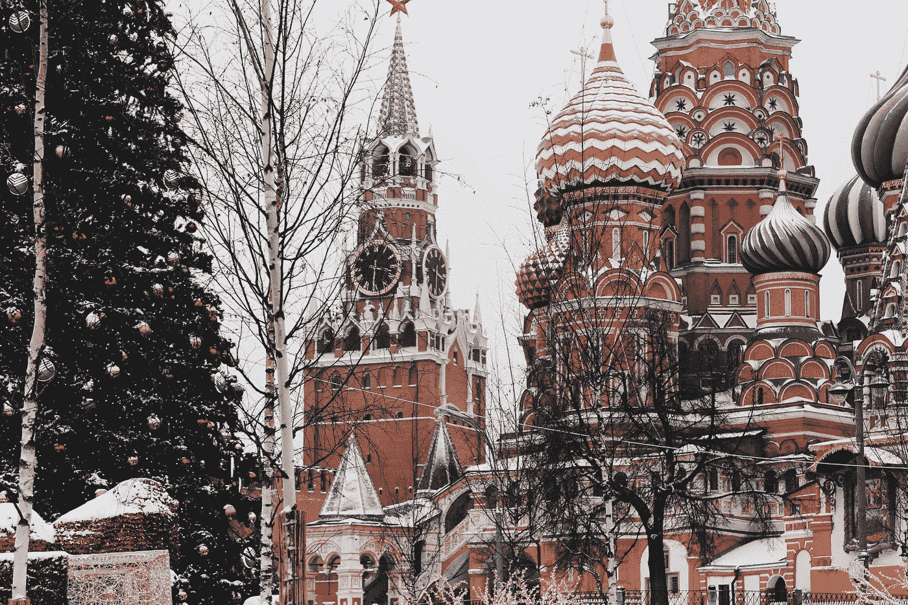

# 弗拉基米尔·普京给共和党上了一堂领导力课

> 原文：<https://medium.datadriveninvestor.com/a-lesson-in-leadership-for-the-gop-from-vladimir-putin-5fed18bece55?source=collection_archive---------29----------------------->

## 共和党的内爆给美国政治留下了真空，并摧毁了这个国家

Photo by [Michael Parulava](https://unsplash.com/@parulava?utm_source=unsplash&utm_medium=referral&utm_content=creditCopyText) on [Unsplash](https://unsplash.com/s/photos/kremlin?utm_source=unsplash&utm_medium=referral&utm_content=creditCopyText)

1999 年 12 月 31 日，弗拉基米尔·普京成为俄国总统。这是 2000 年恐慌意识到的。出人意料的是，俄罗斯第一任总统鲍里斯·埃尔津(Boris Eltsin)选择了这一颇具戏剧性的场景，即传统的新年前夕总统问候，让他年轻、鲜为人知的继任者震惊世界。

不管是好是坏，普京已经被证明是俄罗斯需要的领导人。他不是一个自由民主模式的领导人，而是一个独裁主义者。从教科书的角度来看，他一直是个好领导。唐纳德·特朗普和大多数当选的共和党人可以从他身上学到很多东西。

鉴于我自 1994 年以来一直在俄罗斯生活和工作，我了解俄罗斯，俄罗斯也了解我。理解俄罗斯人对我来说并不容易，但在经历了几次婚姻和 20 多年的职业成功和失败后，我可以说我接受普京的角色是俄罗斯不可或缺的。

然而，普京冒犯了我，我对俄罗斯秘密和网络活动的容忍已经结束。我很生气。这些反美活动实际上使弗拉基米尔·普京成为俄国的好领袖。虽然他并不总是把小人物伊万的利益放在自己的利益之前，放在那些舒适地飞向太阳的特权小圈子之前，但他已经建立了一个或多或少平静的国家——我想说，甚至温顺。

俄罗斯人被数百年的专制统治击得屈服，这一历史事实正中普京下怀。俄罗斯的政治文化从来不允许公民社会的繁荣，这一事实今天依然如此。虽然他们抱怨一切，就像这是一个国家过去的时间，他们这样做是因为他们也明白，很少可以改变。事情就是这样。俄罗斯永远不会成为一个更开放、更民主的社会。永远都是俄罗斯。

不过，没关系。我在这里生活的头十年才完全理解这个现实；然后，又过了五年才接受。一旦缺乏民主保护被接受；一旦系统的不公平性被接受——俄罗斯人永远不会仅仅基于功绩而成功；一旦人们接受了国际姿态，像公鸡一样昂首挺胸，比实际改善普通俄罗斯公民的生活更重要，那么就有可能毫不犹豫地说，弗拉基米尔·普京是俄罗斯的好领导人。

还记得去年春天俄罗斯向美国提供医疗设备以帮助抗击 Covid 疫情吗？与此同时，俄罗斯医生被剥夺了口罩，病人被剥夺了呼吸机。然而，对这个国家来说，俄罗斯善意的形象比通风机爆炸活活烧死病人的恐怖更重要。

## 新年前夜的演讲

从电视成为横跨苏联 11 个时区的公寓和集体农场中无处不在的电器后的某个时候开始，直到 1991 年它痛苦的结束，一个仍然团结整个国家的现代俄罗斯传统是新年前夕演讲。在克里姆林宫大钟楼的指针敲响午夜前的五到三分钟，在任的总书记或总统会结束过去的一年，迎来新的一年。

在过去的 21 年中，有 17 年这一责任落在了弗拉基米尔·普京身上。作为一个在军队服役了六年，并在职业生涯中成功领导了 20 多个团队的人，如果要我用一个词来总结领导力的精髓，我会回答:**连续性。从一个位置跳到另一个位置，在酝酿另一个计划之前没有执行一个计划，并且从来没有让日子轻松过下去，从而允许某种政策结果的缝合导致混乱。混乱是领导的对立面。**

弗拉基米尔·普京掌握了连续性的艺术。他是可预测的。他的可预测性总是给俄罗斯或她的对手带来积极的结果吗？不。但这不是这里的重点。作为一个受益于这种可预测性的人，我可以说，20 世纪 90 年代的混乱真的很有压力——你永远不知道什么会在何时何地降临到你头上。被黑手党虐待的可能性很高，就像被警察、官僚或邻居虐待一样。从 2000 年开始，增速放缓，到 2010 年，增速停止。生活变得可以预测，虽然我不同意俄罗斯的选择或方向，但这些选择为普通公民提供的稳定性让在疫情这样的地方生存变得容易得多。

## 唐纳德·特朗普和共和党

特朗普治下的美国现在一片混乱，关于共和党真的没什么可说的了。我曾经试图通过把他们称为“现代共和党”或“MOGOP”来区分当前共和党疯狂的迭代但这已经没有必要了。共和党是唐纳德·特朗普的政党。

这是一种个人崇拜，主要是为了应对巫师的反复无常。因为特朗普对他的狐假虎威的基础如此掌控，以前理智的爱国者现在对美国毫无忠诚可言。如果他们不与特朗普合作，他将无情地攻击和攻击，直到反叛的共和党人被制服、瓦解或摧毁。

美国的任务已经变成安抚唐纳德·特朗普(Donald Trump)，摧毁任何阻止他成为唐纳德·特朗普的人(或事)。这场混乱的结果是，共和党已经脱离了自己在国家治理中的角色。从来没有一个现代的自由民主国家，更不用说那个所谓阵营的领导人，如此肆意地无视其大多数公民的福祉。美国是混乱的本质。

从他就职的那一天开始，人群的规模引起了轩然大波，谎言和骇人听闻的仇恨源源不断。他在 Covid 管理上的过失导致了数十万人死亡。由于他在竞选连任中被彻底击败，他公开煽动叛乱，声称没有证据证明他被欺骗了。在最近与佐治亚州国务卿的电话中，他公开威胁该男子要么拿出他获胜所需的选票，要么承担“法律”后果。总统犯了叛国罪。

加入他疯狂行列的是 11 名共和党参议员和 140 名众议院代表。他们将投票反对确认来自各州的选举人名单，不是因为他们认为存在选民欺诈，而是因为他们害怕激怒特朗普-这可能导致他们失去权力。这些民选官员不是在执政，他们不是在试图缓解疫情的经济困境；他们没有想方设法让受苦受难的选民呆在家里；让他们戴上面具并接种疫苗。他们试图帮助总统窃取他输掉的选举。

他们中的许多人都公开嘲笑在疫情期间保持安全和健康的预防措施，原因只有一个——不要惹恼特朗普。常识被抛到了九霄云外，脆弱的美国人的生命被忽视，只为了让唐尼开心。就特朗普而言，自 11 月 3 日以来，他已经打了 22 次高尔夫。在这 22 天的联系中，41800 名美国人丧生——他还攻击自己政党的成员维护美国宪法。

弗拉基米尔·普京虽然在疫情行动开始后几乎失踪了——据报道，他住在莫斯科郊外某处的一个净化过的掩体里——但他仍敦促他的政府至少承认形势危险。俄罗斯人戴着面具，从来没有人抱怨我们的预防措施。当然，许多人忽视它们，但没有一个政府官员说过采取预防措施违背了俄罗斯宪法中承诺的自由。由于缺乏嘲讽的专业流行病学家，大多数俄罗斯人认为他们应该戴口罩，保持社交距离，洗手。

众所周知，俄罗斯在淡化由 Covid 引起的死亡率方面也很有效，但无法掩盖显而易见的事实，即许多人死于某种疾病，他们只是报告一些事情，如*一个人从 Covid 中康复，但随后死于肺炎、中风、心力衰竭甚至普通流感。俄罗斯淡化死亡的原因是苏联时期遗留下来的。共产主义和前共产主义国家的公民需要相信“国家”在保护他们，而其他国家却没有这样做。永远不要承认失败或错误，只责怪别人是腐败的威权主义的默认模式——也是特朗普和共和党今天的默认模式。*

特朗普治下的美国，在共和党的支持下，在福克斯新闻频道的鼓动下，已经变成了海上一艘无舵之船，在飓风间穿梭。偶尔，理智指引着国家的航船驶向风暴的中心，阳光确实会照耀一点，就像 11 月 5 日，当乔·拜登赢得大选变得显而易见时那样；然而，唐纳德飓风再次袭击了我们，今天我们在这里。

## 普京 12 月 31 日晚 11 点 56 分的讲话

当我看着普京总统在 2020 年的最后几分钟发表演讲时，我被他的雄辩打动了。我不喜欢普京，但当他提醒这个国家我们刚刚度过的艰难的一年时，我很高兴他对我们说话，对我说话。他向逝去的灵魂致敬。当我听的时候，我能感觉到一滴眼泪在我的眼睛里涌出。

弗拉基米尔·普京是一个领导者。

正是这种情绪，在过去的一年里，我们的生活中已经消失了，更不用说四年了。特朗普从来没有说过超出自我范围的话。一个真正的、无私的领袖的安慰的话是如此的需要，就像在发烧的头上湿一块毛巾，我只是想在这里有人说:

*我们熬过来了，人们，虽然前方会有更多的痛苦、损失和牺牲，但我们会一起挺过来，欢笑、哭泣、舞蹈和爱的时光会回到我们身边。上帝保佑你们。*

但是，作为一个美国人，我可以转向我们的领导人，听到这些话。我转向弗拉基米尔·普京。

**访问专家视图—** [**订阅 DDI 英特尔**](https://datadriveninvestor.com/ddi-intel)