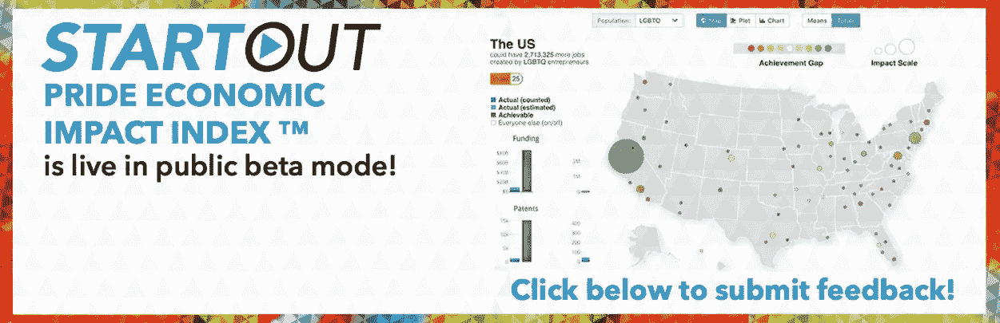
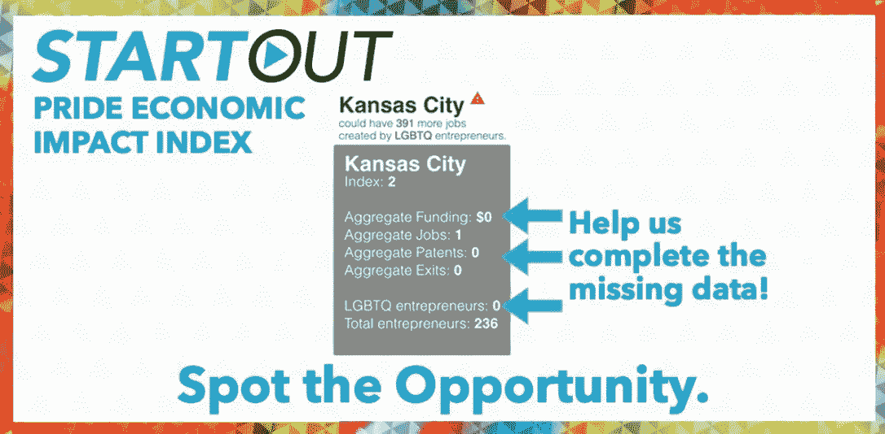

# 公平竞争机会

> 原文：<https://medium.datadriveninvestor.com/a-level-playing-field-321edd8a9543?source=collection_archive---------7----------------------->

*照亮 LGBTQ+数据间隙*

任何有价值的社会或经济政策都必须首先在公平的竞争环境中找到立足点，并以基本的公平感为基础。然而，如果没有正确的数据，实现真正水平的音高几乎是不可能的。最近 [StartOut](https://startout.org/) ，其使命是增加 LGBTQ+创业者的数量、多样性和影响力，并放大他们的故事，以推动社区的经济赋权，并且，我是其中的主席，宣布了 [StartOut Pride 经济影响指数](https://lnkd.in/dKaX7-H) (SPEII)。这种公平感和公平的竞争环境是该倡议的基础，也是我们希望通过#SPEII 实现的核心目标。

该指数得到了摩根大通的大力支持，已经开发了一年多，现在首次面向 StartOut 社区成员公开测试。SPEII 是一个开创性的应用程序，它分析了数百万个数据点，以确定 LGBTQ+企业家对更大经济的贡献和经济影响，以及其中未实现的潜力。它通过测量 LGBTQ+创业社区对各个城市和地区的经济影响，以及量化 LGBTQ+创始人无法平等获得资本时就业和创新损失的影响等方式来实现这一目标。

SPEII 背后的想法是解决在更大的经济中 LGBTQ+代表性的根本缺乏可见性。预计在未来十年，中小型企业(主要由企业家驱动)将推动该国超过一半的就业增长。对 LGBTQ+作为创业社区的一个子集的影响有一个清晰的认识，这不仅对于理解什么样的工作岗位被创造出来，而且对于理解什么样的工作岗位被留在桌面上是至关重要的。

 [## 经济就是包容人|数据驱动的投资者

### 建模，数据，最重要的是，人 Tayo Oyedeji 博士在他的食谱中混合了所有这些成分，为一个…

www.datadriveninvestor.com](https://www.datadriveninvestor.com/2019/03/06/economy-is-all-about-including-people/) 

随着指数的成熟，我们将能够看到 LGBTQ+社区在哪些地方找到了公平的竞争环境，并与他们没有找到的地方进行对比。这将是一个强有力的工具，有助于衡量不平等对更大经济的影响，为地区、城市和服务不足的社区之间的相对表现设定基准。我们将深入了解这些影响背后的促成因素，揭示迁移模式，并开始理解潜在的动机。所有这些将使我们能够根据实时数据为更加公平的经济竞争奠定基础，并帮助制定新的经济和社会政策。

在接下来的几周和几个月里，随着我们开始达到数据收集的临界点，LGBTQ+社区的经济影响开始显现，我将回到这个领域，揭示我们正在学习的一些关键见解。然而，要到达那里，我们需要一只手。在这一阶段收集数据至关重要，你可以通过识别全国范围内的“出柜”公司和企业家来帮助缩小 LGBTQ+公司在代表性不足的城市中的数据差距。而且，你可以在:[https://lnkd.in/djqcHVQ](https://lnkd.in/djqcHVQ)秘密地这样做。与此同时，请继续关注更多更新，并尽你所能参与进来！