# 一点点想象力引发巨大的回报

> 原文：<https://medium.datadriveninvestor.com/a-little-imagination-triggers-big-rewards-3019d188f526?source=collection_archive---------11----------------------->

## 企业主应该知道数字营销的关键步骤

Photo by Ambreen Hasan on Unsplash

企业主不需要知道数字营销，但至少他们应该知道该向谁咨询，与谁合作才能成功。

在企业家的指导下，营销专家可以通过匹配内容、受众和社交媒体平台来跟进。企业的产品和服务将抓住想象力，创造巨大的投资回报。

这就是我们的想法，也是[梅勒妮·纳木尔万·哈皮苏](https://twitter.com/Namulwany/)利用的地方。除了是一名数字营销人员，她还是一名广告人、战略家和培训师。她在[非洲推特聊天](https://twitter.com/AfricaTweetChat)中挖掘了所有这些，并透露了企业发展的秘密。

 [## 修复你的社交媒体营销

### Twitter 快速而广泛地传播你的信息

blog.markgrowth.com](https://blog.markgrowth.com/fix-up-your-social-media-marketing-26cbfa3a5d45) 

概括地说，Namulwany Hapisu 概述了企业主要在数字营销中取得成功必须了解的基本概念:

*   永远要有一个目标。不要不知道要去哪里就开车。
*   没有品牌目标*每个人*。缩小你的受众范围。
*   这是关于你的内容的质量，而不是数量。
*   *测量。测量。测量*。

有策略:

*   知道你的目标。
*   制定关键结果来衡量你的目标是否实现。
*   充分了解你的目标受众。

关于你的听众:

*   他们是谁？
*   他们什么时候上线？
*   他们在哪里上网？
*   什么类型的内容吸引他们？
*   他们为什么要关注你？

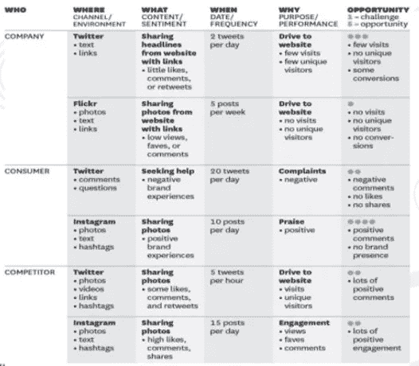

“衡量你得到的结果，”Namulwany Hapisu 说。"这是基于衡量每个目标是否实现的标准."

# **来自分析的洞察力**

分析可以帮助品牌在网上发展。他们应该给出一个关于内容如何表现和吸引用户的好主意。只是一定不要把所有的数字都当成真理，因为可能会有无法解释的打嗝。

Namulwany Hapisu 认为分析可以帮助企业主:

*   设定现实的目标。
*   细分你的目标受众。
*   从平台角度来看，了解你的大部分在线流量来自哪里。
*   确定人们从哪个位置开始访问。
*   了解哪些页面被访问得最多。

“简而言之，分析帮助一个品牌知道什么是有效的，什么是无效的，”Namulwany Hapisu 说。“他们帮助制定与营销相关的关键商业决策。通过了解谁是他们沟通的目标，品牌可以在网上更好地重新定位 T21。

“例如，通过脸书上可用的简单分析，你可以知道谁是你的目标受众，以及他们何时在线浏览现有页面。”

同样，企业家可以根据他们发布的各种类型的内容来判断哪种内容适合他们。

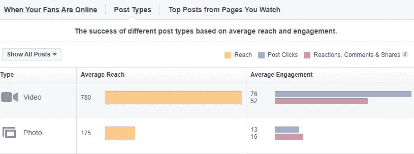

Namulwany Hapisu 说:“你还可以判断出你的目标年龄组何时上网。”

此示例显示了一个针对社交媒体平台的报告。

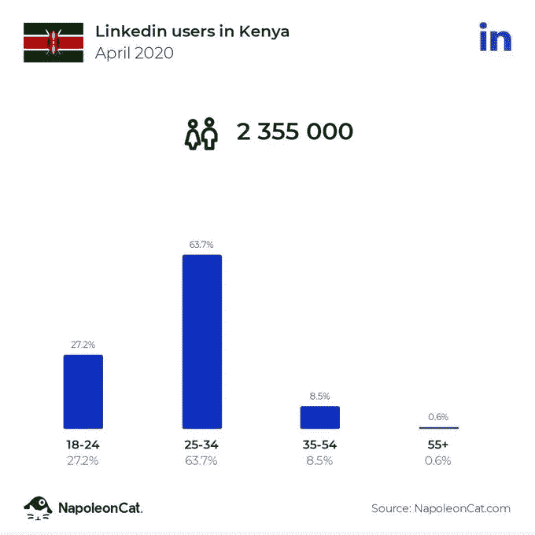

“许多人忘记了消费者行为，然而它是如此，如此重要，”Namulwany Hapisu 说。“我真的很喜欢通过分析，你可以知道消费者什么时候离开了你的网站。”

她从她的博客分析中给出了这个例子。

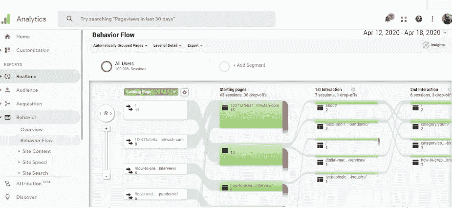

分析有助于品牌了解什么可行，什么不可行。

Namulwany Hapisu 说:“他们基本上给你一些数字，你用这些数字来衡量你在网上的成功。”“没有那些数字，你还能衡量什么？”

选择标签时，确保它适合你的品牌。不要去追一个听起来不错的，强行去装。以下是一些建议。

# **更简单的搜索**

Namulwany Hapisu 有标签提示:

*   在特定平台上做一个标签搜索，看看有多少人使用过这个标签。
*   分析流行标签。
*   寻找与特定帖子的讨论主题相关的标签。

“如果我在谈论数字营销时试图增加我的影响力，我可以进行标签搜索，看看有多少帖子使用了这个特定的标签，”Namulwany Hapisu 说，并举例说明:

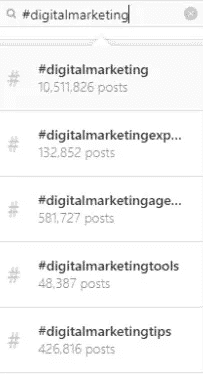

“分析流行标签很重要，因为你*不需要*跳到所有标签上，”Namulwany Hapisu 说。“只跳转到与你的品牌相关的页面。

她说:“如果你试图接触到大量的人，使用一个已经使用过几次的标签是有意义的。”"然而，这也取决于你的目标位置."

 [## 如果你做得对，有一个标签

### 了解标签的基本知识来推销你的业务

medium.com](https://medium.com/datadriveninvestor/theres-a-hashtag-for-that-if-you-do-it-right-79b9d167c86a) 

一些 hashtag 分析信息只能选择性地获得。

Namulwany Hapisu 说:“目前，Instagram 是我所知道的唯一一个可以提供以前使用过这个标签的人数的平台。”

她警告说，像#DigitalMarketing 这样的标签已经被过度使用，导致人们在搜索内容时跳过这些名称，而倾向于热门推文。

“你创造的标签需要一点时间才能流行起来，”Namulwany Hapisu 说。“然而，对于那些会看到你的推文的人来说，这是一个起点。这是最好的选择。”

她更喜欢这些标签追踪工具:

*   [推特活页夹](https://www.tweetbinder.com/)
*   [Hashtagify](https://twitter.com/hashtagify)
*   [品牌 24](https://twitter.com/brand24)
*   [哈希追踪](https://www.hashtracking.com/)

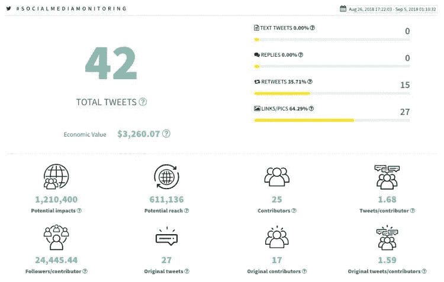

# **关注 SEO**

营销策略的一个关键方面是整合搜索引擎优化。

看待 SEO 的一个方法就是抓住主题。自然地把你要讨论的关键词和短语放入你的介绍中。然后真正地讨论它们。还有更多，但这是一个好的开始。

 [## 对于 SEO 来说，文字是关键

### 以下是搜索引擎优化的基础

medium.com](https://medium.com/datadriveninvestor/for-seo-the-words-are-key-691ed1fb8d1e) 

Namulwany Hapisu 说:“确保所有在线交流的内容都包含关键词和搜索术语”，并给出了以下考虑因素:

*   SEO 博客
*   搜索引擎优化的社交媒体
*   为搜索引擎优化更新网站内容

“像你的消费者一样思考，”Namulwany Hapisu 说。“他们最理想的搜索引擎是什么？人们在灾难中会寻找什么？”

作为例子，她展示了一篇排名很高的文章。

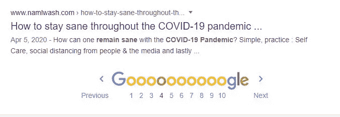

"说到 SEO，你上次谷歌自己是什么时候？"Namulwany Hapisu 说。“你喜欢你所看到的吗？

“当有人用谷歌搜索我时，我努力确保我的 LinkedIn 个人资料排在第一位，”她说。“你猜怎么着？我设法做到了。也要挑战自己。”

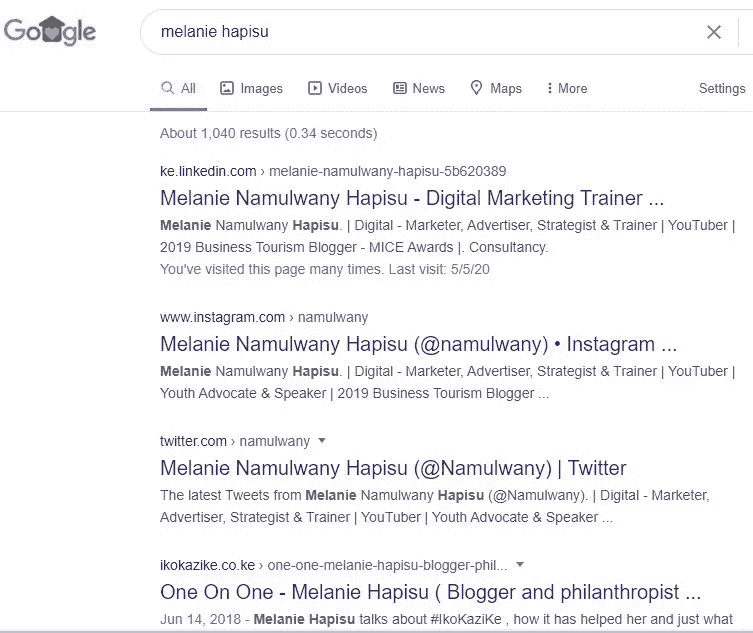

消费者评论是在线发展品牌的一个经常未被开发的内容来源。这些是用户生成内容的一种形式，带有主动推荐的力量。这是免费的，热情的营销，这是最好的价格。

Namulwany Hapisu 说这些是评论的最佳用途:

*   营销，因为消费者在购买之前会看评论。
*   带出他们的客户在说什么。
*   调整一个人应该购买或注册产品或服务的原因，并重新调整它的用途。

 [## 谷歌给了企业家生意

### 一个方便的助手帮助公司在网上获得牵引力

medium.com](https://medium.com/datadriveninvestor/google-gives-entrepreneurs-the-business-c8f17b87aa7d) 

“你有没有在网上买过*的东西？”Namulwany Hapisu 说。“如果是，顾客评论是说服您购买的原因之一吗？*

"说到顾客评论，你的顾客在哪里留下他们的评论？"她说。“我强烈推荐使用谷歌我的业务。”

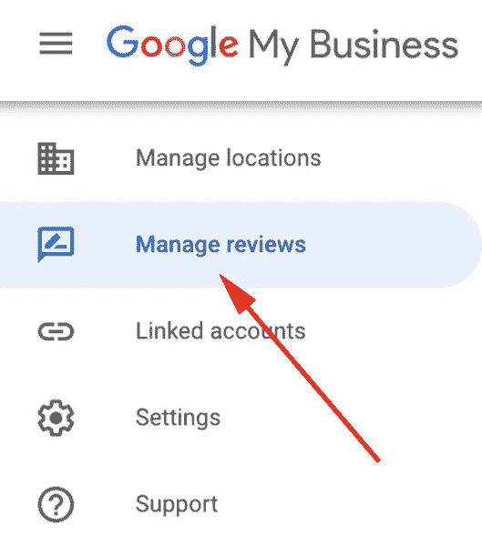

# **大创意，大品味**

当创建一个数字营销活动来帮助公司在网上发展他们的品牌时，Namulwany Hapisu 敦促那些负责人总是从一个大的想法或主题开始工作。

“想出不同的方法来将想法或主题带入生活，”她说。“确保这个想法与你的目标受众和你的品牌相联系。

Namulwany Hapisu 说:“这是一个伟大想法的例子:品尝这种感觉。”“想到什么了？我想到的是解渴、快乐和良好的心情。”

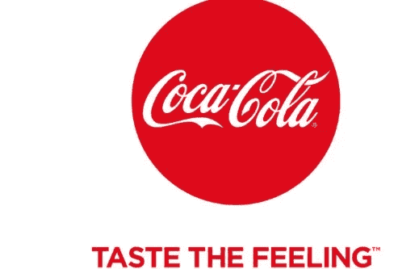

她注意到可口可乐将这个主题带入生活的创造性方式，发挥了她提到的想法。

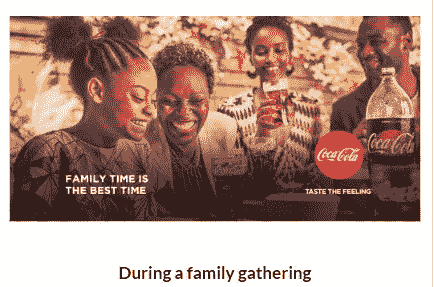

Namulwany Hapisu 增加了品牌在线发展的更多方式:

*   加入在线社区
*   [讲述你的品牌故事](https://www.datadriveninvestor.com/2019/11/18/consistent-branding/)
*   [与有影响力的人合作](https://www.datadriveninvestor.com/2020/01/15/influencers-perform-in-the-spotlight/)
*   [经营数字广告](https://www.datadriveninvestor.com/2019/06/05/targeted-ads-dominate-the-competition/)
*   跳到大喜的日子

**关于作者**

吉姆·卡扎曼是拉戈金融服务公司的经理，曾在空军和联邦政府的公共事务部门工作。你可以在[推特](https://twitter.com/JKatzaman)、[脸书](https://www.facebook.com/jim.katzaman)和 [LinkedIn](https://www.linkedin.com/in/jim-katzaman-33641b21/) 上和他联系。