# “另一种经济”还有很长的路要走

> 原文：<https://medium.datadriveninvestor.com/a-long-slog-ahead-for-the-other-economy-aba14eb588c?source=collection_archive---------10----------------------->

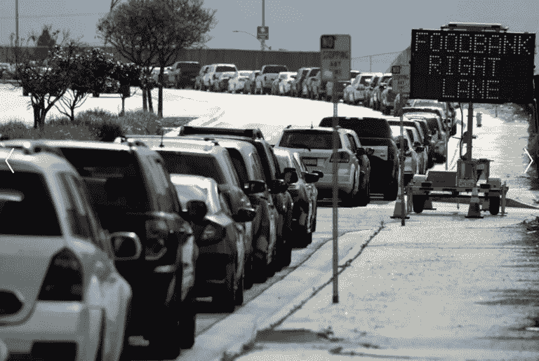

Carson, California Food Line — Reuters.com April 18, 2020

总体经济数据并没有反映出经济中的扭曲和痛苦程度。

**企业和消费者不均衡的复苏**

过去一周发布的一系列新的整体经济数据显示，大部分数据都在改善，但更深入的研究提醒我们，在评估业绩指标时，为什么“平均值”会产生误导。我们在公开市场上看到的不均衡复苏和扭曲，是由意识形态而非解决问题的实用主义所形成的刺激方案所驱动的。向整个疫情经济注入的大规模财政和货币刺激在为能够进入公开市场的大公司加油方面取得了惊人的成功(以至于几家公司在申请破产后股价飙升)。与此同时，成千上万的小企业倒闭，因为公私伙伴关系被证明对许多独立企业主来说难以获得、限制太多或太复杂。刺激支票刺激了零售支出，但这些支出的大部分直接流向了在线零售商和科技公司，它们已经从向在线购物的转变中受益。这些公司被推到了新的高度，并能够巩固其竞争地位，而实体企业，尤其是小型独立企业，则萎靡不振，许多都失败了。在疫情之前，许多线下零售商已经受到在线竞争对手的威胁，而疫情只是加速了这一不可避免的局面。然而，在疫情之前蓬勃发展的体验型行业，如餐饮业，在此次危机中尤其受到重创。他们似乎也不太受政府刺激的影响，部分原因是行业分散，还因为 PPP 未能理解这些小企业的性质，这些小企业已经在薄利经营，使得最需要的企业没有资格获得 PPP 援助。

**深入了解经济数据**

尽管失业率下降到 6.3%看起来像是回到了正常范围，但去年春天疫情罢工时出现的劳动力大规模外流对标题失业数字的有用性产生了扭曲效应。更深入地研究其他劳动力指标，如就业人口比率，可以为真实的就业状况提供更多的视角。在大多数经济危机期间，工人在求职受挫后会逐渐离开劳动力市场，但这场危机的性质导致人们立即退出劳动力市场。这是由整个经济领域引起的，尤其是实体零售商、餐馆和酒店企业关闭或限制服务。尽管就业人口比已经从 51%的低点(历史低点)有所改善。2 月 21 日的第一次读数仅为 57.4%，为 1983 年以来的最高水平。

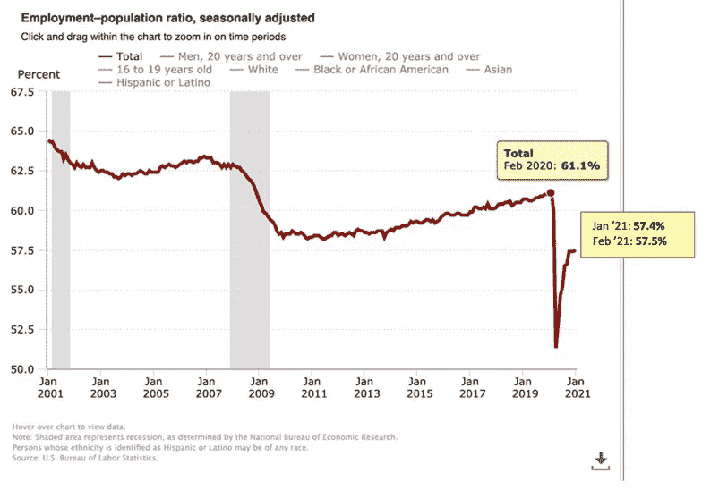

Bureau of Labor Statistics

就业人口比率反映了人口结构随时间的变化，因此长期趋势主要是由于美国人口老龄化，但这并不能解释 2020 年 2 月的 61.1%和 2021 年 2 月的 57.5%之间的巨大差距。对当前失业状况的更好描述应该是将另外近 700 万据报道想要工作但不被认为是劳动力的人加回来。

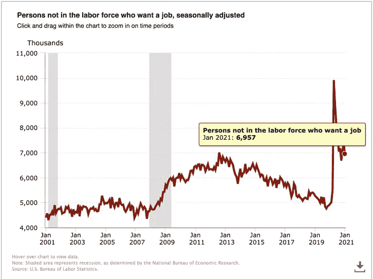

U.S Bureau of Labor Statistics

1 月份就业状况的改善与疫情期间的趋势一致，即在零售和酒店等行业工作的员工比那些容易转移到在家工作的员工失业情况严重得多，如专业和商业服务，这些行业在 1 月份的就业增长最快。

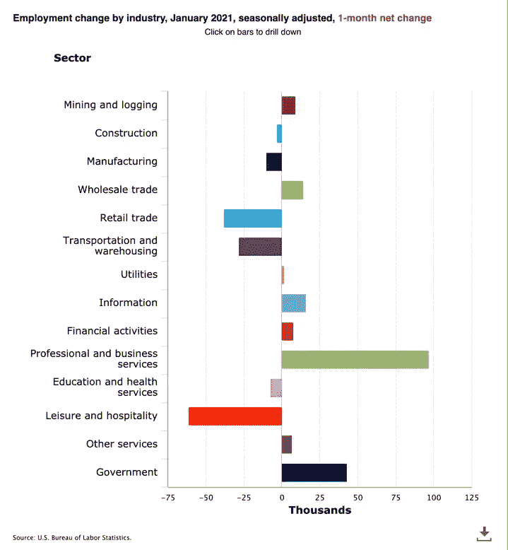

U.S Bureau of Labor Statistics

1 月份出现的另一个模式是更广泛的疫情趋势的延续，即净损失最大的工作也是薪酬最低的工作。在下面的图表中，左下象限显示了显示一月份最大损失和最低周工资的工作，而右上象限显示了就业净增长和最高周工资的工作。

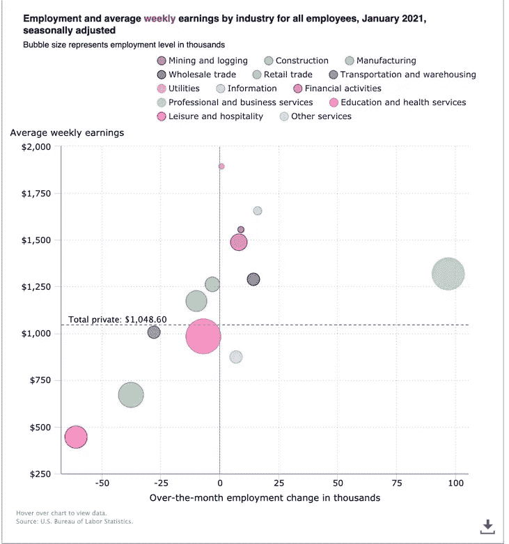

U.S. Bureau of Labor Statistics

来自 www.tracktherecovery.org 的类似观点显示了不同收入群体的失业率，显示了经济现实中最高和最低工资群体之间的鲜明对比。经过一年创纪录的财政和货币刺激后，这种差距应该是令人不安的，特别是与最高收入阶层的就业增长相比，最低收入阶层下降了 21%。

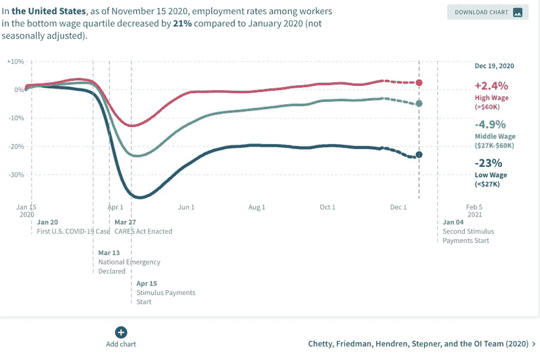

[www.tracktherecovery.org](http://www.tracktherecovery.org)

2020 年的通胀率为 1.4%(不包括食品和能源)，能源价格的大幅下降为消费者提供了一些缓解，但食品通胀率上升了 3.9%，是十多年来的最大增幅。

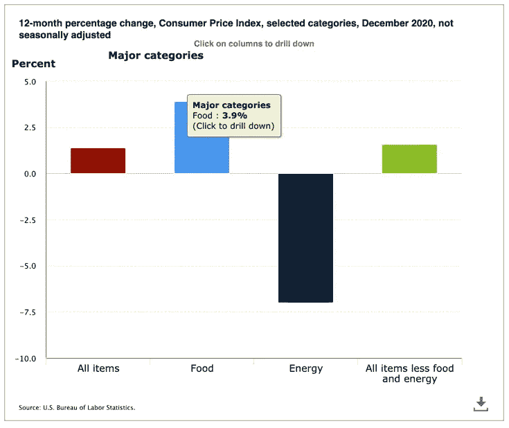

U.S. Bureau of Labor Statistics

在家(食品杂货店)和外出(餐馆/便利设施)的食品价格以同样的速度增长，尽管从餐馆场合到食品杂货店的大规模转移可能已经推动了家中食品价格的不成比例的增长。

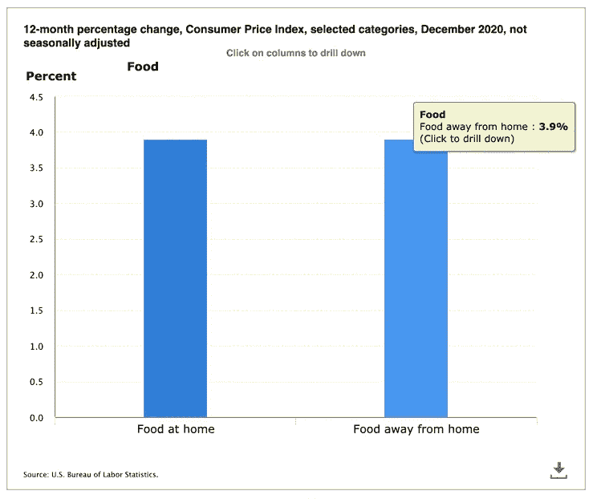

U.S. Bureau of Labor Statistics

有趣的是，在远离家庭的食物组中，价格上涨存在显著差异，其中有限服务(快餐/便利)价格上涨了 6%，是全服务膳食价格上涨的两倍。随着价值 6590 亿美元的餐饮业(疫情之前为 854 亿美元，下降了 23.8% —全国餐馆协会)的经济状况被疫情改变，我们可以预计远离家庭的食品通胀将继续超过其他地区的经济。推动 2021 年餐厅价格的因素包括:

*答:大量餐馆倒闭降低了许多贸易领域的竞争饱和度，这为幸存下来的公司创造了定价权。*

*B .第三方渠道合作伙伴为该行业的大部分地区提供交付和路边订购服务，已经在该行业取得了巨大的渗透，但是如果没有两位数的价格增长，这种经济状况是不可能持续的。*

*C .餐馆雇员的工资将会增加。即使联邦最低工资倡议没有通过，地方市政当局和劳动力市场的压力也会对劳动力成本造成压力。*

*d . 2020 年，所需的最低技术投资有了显著的飞跃，更高的价格是餐馆支持这些投资的一种方式。*

尽管总体经济形势表明，我们预计 2021 年餐厅食品价格的涨幅将高于平均水平，但由于当地的经济状况将影响当地的商业定价策略，因此这一涨幅将会不均衡。

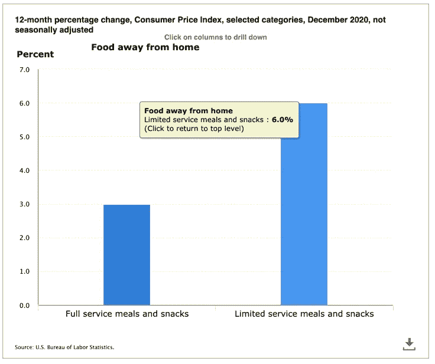

U.S. Bureau of Labor Statistics

经济困境集中在底层三分之一的家庭，这是由上述低收入职业的失业造成的，表现为食品和住房无保障。粮食不安全在 12 月达到顶峰，超过 13%的美国家庭报告在过去一周挨饿，路易斯安那州的不安全率最高，为 18.2%。12 月份，被取消抵押品赎回权的家庭被驱逐的可能性也高达 35.5%，但这也是人口和地理分布的。

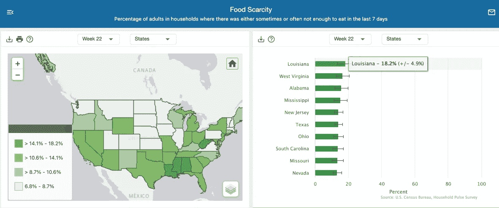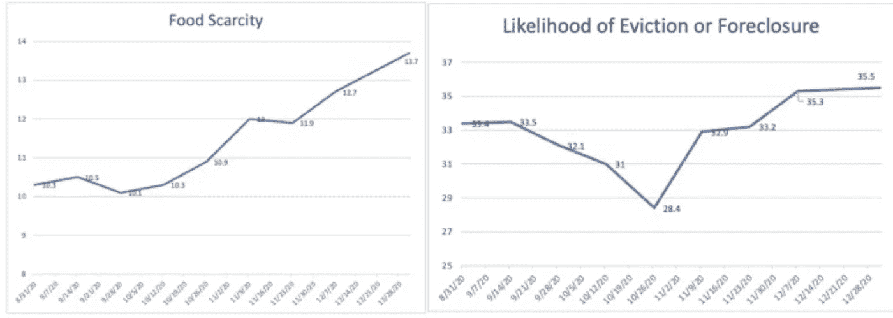

U.S Census Bureau Pulse Survey

**振兴社区企业家精神**

来自疫情的经济痛苦打击了地理上分散的个人和企业，这一事实增加了复苏的复杂性，并限制了标准政府刺激工具的有效性，因为这些工具在很大程度上是围绕帮助从公共市场中受益最多的大型行业而设计的。联邦政府很难给独立企业拨款。像小企业管理局和银行这样的组织和商业网络通常会提供很大的帮助，但它们无法完全理解如何向没有抵押、负债累累、利润微薄、没有明确商业计划的企业提供贷款和赠款——即使在经济景气时期，这也是大多数小企业面临的现实。这场疫情不是一场普通的经济危机，而是一场公共健康和经济危机，这场危机对人们、社区、工业和商业造成了不平等的破坏。随着我们走出危机，我们正从一个地方开始，在这个地方，财力最雄厚的企业对独立企业拥有几乎不可逾越的优势——这一优势比以前大得多，这是美国纳税人和美联储的称赞。如果我们想振兴小企业，促进当地社区的创业精神，我们需要有针对性地提供帮助，其力度可以与危机期间大规模竞争所带来的流动性洪流相媲美。