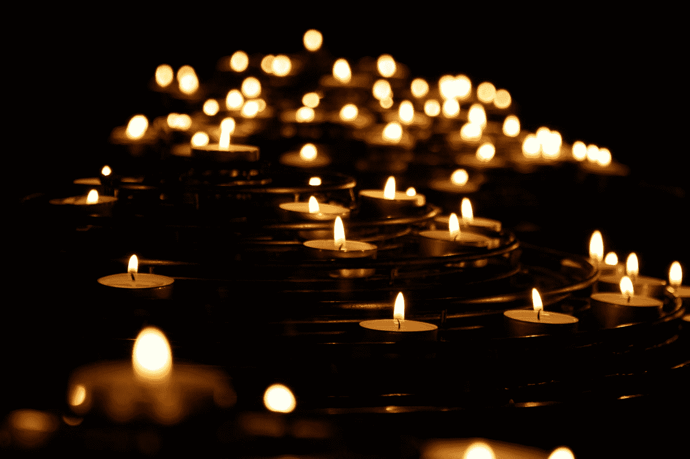

# 给我已故哥哥的情书

> 原文：<https://medium.datadriveninvestor.com/a-love-letter-to-my-late-brother-3d3b88ddbfad?source=collection_archive---------6----------------------->

## 关于悲伤和损失

## 意外损失的痛苦、遗憾和无法了结

Photo by [Alex Dukhanov](https://unsplash.com/@argtone?utm_source=medium&utm_medium=referral) on [Unsplash](https://unsplash.com?utm_source=medium&utm_medium=referral)

我已经说了你三年半了。但老实说，我已经有将近五年没和你说过话了。

我谈论你是因为我害怕和你谈论 T2。我害怕面对你所带来的情绪。

但是通过今天给你写这封信，我承诺要面对你，重新建立一种敞开的关系；一段由于你的死亡而处于非终结状态的关系。

我不记得上次我们谈话是什么时候了，这让我很伤心。我知道你对我有期望，但我没有达到。我知道在你最需要我的时候我不在你身边。我知道你经常感到失落，你犯的一些错误是对帮助的呼喊。

我知道在那迷人的微笑下隐藏着巨大的恐惧、痛苦和心痛，而这些你常常试图独自面对。

**在你的一生中，我没有优先考虑你的痛苦。**

我担心和担心你的一些选择，但我咽下去了。我想打电话给你很多次，恳求你做一些不同的事情，但我却避免了对抗。我优先考虑我自己的东西。我把自己埋在自己每天挣扎的借口里。我自私地疏远了你。

Photo by [Sam Burriss](https://unsplash.com/@samburriss?utm_source=medium&utm_medium=referral) on [Unsplash](https://unsplash.com?utm_source=medium&utm_medium=referral)

我准备用我的借口来掩饰自己。但我不准备埋葬你。

在我被告知之前我就知道你已经走了。这是一个我永远不会忘记的早晨。妈妈在房间里，在打电话，反复低声说着你的名字，用一种我从未听过的方式说着。

 [## 良好的生活是习惯的形成|数据驱动的投资者

### 过度思考是过度紧张。仅仅几个简单的习惯就会在一天中产生巨大的影响。那是…

www.datadriveninvestor.com](https://www.datadriveninvestor.com/2020/01/17/a-good-life-is-habit-forming/) 

我知道你走了。有些话永远不必说出口。有时候心灵和灵魂知道那些嘴巴无法表达的东西。妈妈没必要说这些话。我破碎的心知道我再也看不到或听不到你的声音了。

Photo by [Jakayla Toney](https://unsplash.com/@jakaylatoney?utm_source=medium&utm_medium=referral) on [Unsplash](https://unsplash.com?utm_source=medium&utm_medium=referral)

失去你的痛苦仍然存在。我心中谈论你的那部分通过它呼吸。然后还有一部分保持关闭。这是令人惊奇的部分；藏着后悔种子的部分。在你死后三年半的时间里，我才鼓起勇气和你说话，今天我终于可以这么做了。

我知道我一直把你放在心里。我不知道你是怎么抓住我的。

> 你被谋杀的那晚还在生我的气吗？父亲节那天我向你伸出援手，你为什么不回应我？还是在你生日的时候？

我本可以做得更多。我应该做得更多。你不在的时候，我应该给你写信的。我应该努力去看你的。我应该更好地照顾你。我应该更努力去了解你。不是公众的你，而是你觉得你必须独自承担负担的那一部分。

Photo by [Mike Labrum](https://unsplash.com/@labrum777?utm_source=medium&utm_medium=referral) on [Unsplash](https://unsplash.com?utm_source=medium&utm_medium=referral)

这就是我现在的全部。我应该做什么，我可以做什么，以及我没有做的遗憾。

我想念你的微笑。我想念你的精神。我怀念你未言明的慷慨。我想念你出现的所有例子，在我身边，用不需要言语的善意行为。

**爱情中没有完美。慷慨是没有边界的，你的微笑提醒我从痛苦中找到力量，从绝望中找到乐观。**

Photo by [Brigitte Tohm](https://unsplash.com/@brigittetohm?utm_source=medium&utm_medium=referral) on [Unsplash](https://unsplash.com?utm_source=medium&utm_medium=referral)

你已经不在这里了。我不知道你是否能听到，感觉到，或者感受到我的道歉，或者将我的遗憾内化。

我再也回不去做我没有为你做的事，或者做我不能为你做的事。我没有机会纠正错误。我在地球上再也看不到你的笑容，或者嘲笑你总是说的可笑的不恰当却又好笑的事情。

**但我总能找到时间和你谈谈；带着对你的回忆坐下来，与你分享我心中的想法。**

我爱你。我想你。很抱歉我没能陪在你身边。当我泪流满面时，当我听到我的儿子——你的侄子(你从未见过，也永远不会有机会见到)说你在这里时，我百分之百地确定。我 100%确定，虽然你的身体不在这里，但你的灵魂今天就在这个房间里和我在一起。

当我试图重新打开那片自从你离开我们后就被关闭的心时，我只能希望你的心会欢迎我回来，如果在某个时候它对我关闭了。

放心吧，我的兄弟。我的心仍然很沉重，但要知道我爱你，我会很快再和你说话。

## 访问专家视图— [订阅 DDI 英特尔](https://datadriveninvestor.com/ddi-intel)