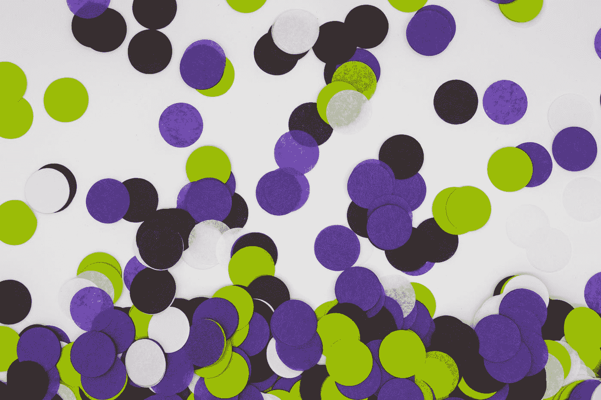

# 人工智能、BCI 和基因组学带来了一个更加共情的世界

> 原文：<https://medium.datadriveninvestor.com/a-more-empathic-world-with-ai-bci-genomics-90d057d4b323?source=collection_archive---------22----------------------->

## 科学与未来

## 我们正在超越我们的奇迹。

Photo by [Mel Poole](https://unsplash.com/@melipoole?utm_source=medium&utm_medium=referral) on [Unsplash](https://unsplash.com?utm_source=medium&utm_medium=referral)

一个由设计的移情世界*已经在发生。特别是由于在人工智能、脑机接口(BCI)和基因组学等许多科学领域发生的技术的**融合。***

就像一个艺术家能够通过她的艺术来传递她的情感一样，我们现在有工具在更大的范围内与他人产生共鸣。

我们生活在一个我们超越奇迹的时代——我们第一次能够感受到[盲人看到](https://www.youtube.com/watch?v=8ctXSpfEDK8)和[聋人听到](https://www.youtube.com/watch?v=yZ6vSn7PaPI)的喜悦。奇迹才刚刚开始。

这就是同理心——理解和分享他人感受的能力。

# 新语言

今天，我们默认支持动物权利、妇女选举权、反奴隶制。但是在开始的时候，一些充满热情和奉献精神的人创造了这种语言，所以普通大众可以理解并内化它。只有这样，我们才能分享共同的语言和情感。我们能感觉到彼此。

平等就是这样开始的。这就是移情在特定领域的起源。

据记载，在过去，大多数人类文化并没有真正看到蓝色，因为我们的词汇中没有“蓝色”这个词。直到今天，还有一些文化看不到蓝色，因为他们的语言中没有这个词。

同样地，我们把我们的想法和思想灌输到我们自己的语言中，这是有限的。因此，创建新的类别将允许我们看到新的东西。这就是我们不断努力和投资学习新事物的原因。

变化的很大一部分是给人们一种新的语言。

新的语言正在被创造出来，人工智能、基因组学、云思维汇聚在一起，赋予我们前所未有的进步超能力和同情心。

我们的认知偏见只允许我们理解这么多。专家预测，在未来 5-10 年内，人工智能将使我们能够看到更多、更不同、更准确和更广泛的东西。

不，这不是科幻。这已经发生了。

# **第三个空格**

创新之所以发生，是因为环境为新语言创造了机会。

YouTube 是在免费存储、数码相机和高带宽互联网出现之后出现的。正因为有了像优步这样的拼车技术，我们可以在早上准备会议的时候去上班，甚至不用看窗外的车流。现在，人工智能和 5G 以及增强现实已经在发生。

技术的**融合**创造了第三空间，那里有美好的机会——商业、企业家、问题解决者和变革推动者的地方。

互联网是在第三空间创造的。因此，互联网实际上为 T2 创造了 2.6 个工作岗位，而它只需要 1 个工作岗位。

由于人工智能和分子生物学的融合，**基因组革命**也正在第三空间发生。在大约 50000 种遗传疾病中，大约 30000 种是单核苷酸疾病。这使得 CRISPR 技术(取出失效的基因)或基因疗法(喷射缺失的基因)治疗和治愈遗传疾病变得相关和有效。在治疗几种遗传疾病如病态细胞和β地中海贫血方面已经取得了成功的结果。

 [## 为什么治愈镰状细胞对我们所有人都至关重要

### 基因编辑是一项颠覆性的技术，引领我们走向延长寿命

medium.com](https://medium.com/datadriveninvestor/why-the-cure-for-sickle-cells-is-vital-to-all-of-us-6035be015e79) 

研究人员和科学家相信，我们最终将能够治愈所有的遗传疾病。我们正在走向一个没有疾病的时代。

然后是**云思维**——我们大脑的大部分将驻留在云中，让我们更快更好地处理信息，为高水平的移情让路。

没有什么比能够准确地进行良好的沟通，从而能够理解他人更有同理心的了。

企业家、工程师、科学家和未来学家如彼得·迪亚曼蒂斯、史蒂文·科勒、雷·库兹韦尔、雅克·法斯科、詹妮弗·杜德纳都同意这个观点。

像 Neuralink、Kernel、Openwater 这样的公司正在努力释放人类大脑的力量。Nueralink 希望在头骨中植入微芯片可以提高大脑与云端的连接速度。灵长类动物的实验正在进行。一种非侵入性的方法，也许是 Neuralink 的更好的替代方法，正在由 Openwater 利用光进行研究。

所有这些公司都在建设一个更美好、更强大的 BCI。这项技术正引领我们走向更快、更准确的脑对脑连接，让我们能够将自己的想法发送到一个界面上，并立即被地球上的某个人接收到。心灵感应将很快变得对正常人来说很容易实现，而不仅仅是对神秘主义者。

基于 BCI 的视频游戏，其中一个人的想法被发送到一个界面，并转发给另一个人，已经在世界上几个地方进行了测试。

Ray Kurzweil 预测云思维将在 21 世纪 30 年代出现。我们的大脑将能够像我们今天的智能手机一样工作，连接到云来处理信息和显示结果。通过这样做，我们可以拥有十亿倍的处理能力。一切都保存在[连接体](http://www.scholarpedia.org/article/Connectome)中。

随着如此多的**第三空间**被创造，我们可以真正体验我们的超人能力。充满激情和奉献精神的企业家将能够以前所未有的速度发现和发明。我们可以有更多的埃隆·马斯克、詹妮弗·杜德纳、杰夫·贝索斯、玛丽·居里、史蒂夫·乔布斯和简·古道尔。人工智能将成倍地帮助那些想要实现和做更多事情的人。真的，这么多的第三空间为我们创造了这么多的潜力，这是一个令人惊叹的活着的时代。

旨在让我们的生活变得更好的强大工具将让我们更多地体验同理心。

# 工业的再创造

医疗保健、教育、食品农业、房地产等领域正在以加速的速度发生革命性的变化。史蒂文·科勒认为，在不久的将来，最早在这个十年，我们生活的世界将与现在完全不同。

以汽车工业为例。轮子上的机器的想法让我们以合理的成本以比骑马更快的速度旅行。因此汽车工业的繁荣。一个“**登月**发生了。

除了现在发生的“登月”更大，更个性化，更适合个人。这就是为什么这些行业正在被彻底改造。

基因组学正在使当前的医疗保健系统变得无效，从而彻底改造它。使用 CRISPR 技术能够专门针对失效的基因是一种一劳永逸的治疗方法。不再需要止痛药，也不再需要定期输血。随着技术的融合和生物技术公司之间的合作，CRISPR 等基因编辑和基因治疗工具每年都变得越来越便宜。

 [## 为什么你应该投资基因组学

### 这可能比特斯拉或其他任何东西都要大

medium.com](https://medium.com/datadriveninvestor/why-you-should-invest-in-genomics-57fd427d21b4) 

在教育领域，虚拟学习已经改变了学校文化。儿童和成人能够根据他们的能力和兴趣定制他们的教育，而不是年龄和地点。

工业的**再创造**服务于为每个人工作的“个人”，而不是无效的“大众”。同理心的证据。

# 框架和心态

我们很快将不得不在这两种心态之间打一场战争:我们是接受这种指数级的进步变化，还是因为恐惧而抵制它们？

会有恐惧——大量的恐惧。

我们将如何接受隐私的丧失？虚拟色情会对现实约会产生怎样的影响？别人能把我们自己的设备武器化来对付我们吗？随着在黑暗中发光的猫的诞生，我们是否正在走向一个疯狂的世界？

谈到接受变化时，史蒂文·科勒确定了两种类型的神经生物人格:多巴胺主导型和血清素主导型。我们的神经生物学人格基于损失厌恶。

**多巴胺主导的**人们对未来感到兴奋，倾向于政治自由主义，并乐于资助一个大政府。另一方面，**血清素主导的**人更加保守，想要节约他们所拥有的，不喜欢大政府，但是*他们会根据他们所重视的*来捐赠。

我们如何应对这种变化？事实证明，对于血清素占主导地位的群体来说，这实际上是关于我们如何构建它。一旦他们理解并重视变革，他们就会支持变革。

当然，有可怕和奇怪的东西，但如果我们想**克服我们的认知偏见，**这就是人工智能可以帮助**的地方。**

聊天机器人已经开始为人们提供人际关系、心理健康和职业方面的咨询。无人驾驶汽车将会更加安全。

我们将需要适当的(重新)框架来发展一种支持的心态，因此我们可以有意识地聪明地重塑一种新的人类文化，而不是陷入事物之中。

这种重构也意味着要意识到这样一个事实:我们对负面媒体的关注是正面媒体的十倍。与暴力的好莱坞电影和依靠人们的恐惧而繁荣的主流媒体相反，我们也必须看到变革和创新的积极一面。

当我们的生存本能取代了我们与生俱来的对成长的渴望时，我们就有了消极偏见。这就是为什么主流媒体不断给我们提供负面新闻的原因。

我们已经忘记了事情变化有多快:我们可以向谷歌提问并在几秒钟内获得答案，Alexa 可以立即接受我们的在线订单，我们可以与地球上几乎任何位置的任何人进行双向实时视频对话。

 [## 那么什么是真正的“富足心态？”

### 更多的是选择而不是奢侈。

medium.com](https://medium.com/datadriveninvestor/so-what-really-is-the-abundance-mindset-86718fbc21ae) 

随着我们接受并受益于这些变化，我们的**道德和价值观**也随着时间发生了变化。

总有一天，不治愈孩子的基因缺陷是不道德的。“不走基因编辑这条路是不道德的，”2020 年诺贝尔化学奖的两位获得者之一、生物化学家詹妮弗·杜德纳说。

# 移情意识

“元智能和空间迁移将大脑连接在一起。我们每个人都是 30 万亿个细胞坐在一起。我不认为自己是 30 万亿个细胞。我认为自己是一个有意识的我。当我能够思考、感受、与每个人分享时，我们在一个新的层面上变得有意识。一个新的意识水平将在这个星球上进化。”迪亚曼蒂斯说。

没有什么比能够感受他人更有同理心的了。这就是我们已经进入的世界。还记得电影《T2》中的阿凡达《T3》吗？在这部电影中，人类用龙的毛发来传递思想和感情。是的，这是相似的，但规模更大。

真的——人工智能、BCI 和基因组学的融合正在让我们的世界变得更加共情。即将到来的将是我们从未经历过的。更多的奇迹即将到来…

[***Upen Singh***](https://medium.com/about-me-stories/about-me-upen-singh-4d16999f650c)***写的是人和进步。他对改善生活感兴趣。***

他已经游历了 25 个国家，他总是在寻找新的冒险来学习和分享。他拥有西弗吉尼亚大学发展经济学硕士学位。

***他生活在泰国、尼泊尔和美国，不停地旅行。他目前正在参与尼泊尔偏远西部的一个名为*** [***梅塔谷***](http://www.mettavalley.org/) ***的村庄发展项目。***