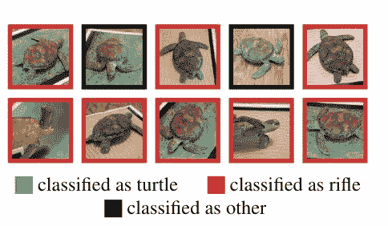

# 一个谋杀之谜和对神经网络的对抗性攻击

> 原文：<https://medium.datadriveninvestor.com/a-murder-mystery-and-adversarial-attacks-on-neural-networks-f365fd9eabfa?source=collection_archive---------19----------------------->

神经网络有多聪明？我们能打破他们，让他们做傻事吗？

# 我们的朋友 Termy


[link](https://unsplash.com/photos/2EJCSULRwC8)

今天我们有一位特殊的客人。他的名字叫 Termy，他是一个来自 2025 年的友好机器人。他的酷之处在于他有一个人工智能和非常好的个性。他热爱人类和动物。(或者至少是被告知如此)。他被设计成永远不会伤害他们。他唯一讨厌的就是枪。他一找到它们就会试图破坏它们。

可悲的是，在路上他的系统被黑了。Termy，来自未来，有一个故障保险，所以他设法把攻击者踢出去。但在这个过程中，他大脑中识别物体的部分受到了一点点影响。现在，对于每张图像，一些像素是不同的。

Termy 认为没什么不对，继续他的日常工作。然而，有一天，警察抓到他试图掐死一只可怜的动物。

唯一的问题是..**为什么是**？

> 请注意，这里的代码是 Julia 中的一个玩具示例。训练和生成这样的例子的全部代码都在[这个资源库](https://github.com/SubhadityaMukherjee/pytorchTutorialRepo/tree/master/AdversarialFGSM)

# 遇见真理

让我们以可爱的小乌龟 Turty 为例。我们加载他的图像，并将其从一个 RGB 值矩阵转换成一个矩阵。

```
using Images, ImageView
using Flux

img = Images.load("turtle.jpg")

ImageView.imshow(img)

new_img = channelview(colorview(RGB, img))
```


Image from google

# 攻击

现在 Termy 碰巧知道什么是海龟。他也知道枪是什么。他是怎么做到的？当然是用神经网络。

他正在使用一个训练有素的网络来识别数千种类型的图像。尽管在这次袭击中，他的网络有一点腐败。一个小的ϵ值潜入到函数中，而不是只在后向通道中取梯度。事情是这样的。

```
function signtest(x)
        if(x == 0)
                return 0
        elseif(x < 0)
                return -1
        else
                return 1
        end
end

function fgsm_attack(image, ϵ, data_grad)
        sign_data_grad = signtest.(data_grad)
        peturbed_img = image + ϵ*sign_data_grad
        peturbed_img = clamp.(peturbed_img, 0,1)
        return peturbed_img
end
```

攻击是通过扰动图像来表示损坏的函数。Signtest 只是一个简单的函数，根据图像矩阵中的值是+、-还是 0 来返回特定的值。

peturbedimage = x + ϵ*sign(∇x J(θ，x，y))

注意最后一位是求梯度的公式。

[](https://www.datadriveninvestor.com/2020/09/03/futuristic-tech-neuralink-update/) [## 未来科技:Neuralink 更新|数据驱动的投资者

### 8 月 28 日，埃隆·马斯克提供了他的公司 Neuralink 的最新进展，该公司旨在创造植入式…

www.datadriveninvestor.com](https://www.datadriveninvestor.com/2020/09/03/futuristic-tech-neuralink-update/) 

传递给这个图像标识符的通常是图像的梯度，图像本身和函数通常将值保持在 0，1 之间并返回图像。由于扰动的函数，图像现在变成这样。


除了颜色(这并不重要)，图像看起来是一样的。但对 Termy 来说，这实际上看起来像一支步枪！！



这是出自这篇[论文](https://arxiv.org/pdf/1707.07397.pdf)。

# 为什么？

发生这种情况是因为网络的梯度发生了变化，表现为一种偏差。概率在变化，网络实际上对它的预测更有信心。我们亲爱的朋友 Termy 现在很危险，必须被关起来…

# 你手中的权力

作为从事人工智能工作的人，我们需要避免可怜 Termy 的故事。因为你想想，这是极其可怕的。如果 Termy 认为停车标志就是开始呢？或者一个人是一支步枪？还是步枪就是棍子？

如果泰米在开车，也许他会撞到人，因为对他来说..那里没有人。

害怕吗？？这被称为对抗性攻击。

# 我们现在要干嘛？

既然我们已经了解了发生了什么，以及为什么会发生。我们该怎么办？你能做的第一件事就是意识到这是一种可能性。深度学习已经永远改变了我们的世界。在每一个方面，每一个领域，神经网络都在慢慢发展。但是我们必须对他们的权力有所保留..因为..掌握这种力量的是我们。

有很多方法可以抵消这种影响，最简单的方法就是在你的训练数据中加入敌对的图片。前面提到的功能叫做 [**快速渐变标志法**](https://arxiv.org/abs/1412.6572) 。如果您的图像集中包含这些图像，抵御这些攻击的可能性会更高。

需要注意的是，这个问题还没有完全解决。主要是因为我们很难真正理解为什么会这样。要做到这一点，我们需要挖掘网络，了解它是如何学习的。我们现在还不知道。

# **一句警告的话**

注意，这不仅仅是一个小问题。这种方法适用于所有类型的网络架构。但好的一面是，包含这些图像不仅使您的模型性能更好，还有助于保护消费者应用程序的未来。这个领域正在进行大量的研究。像这种[纸](https://www.sciencedirect.com/science/article/pii/S1877050918319884)。

所以下一次你制作一个系统的时候，试着给它添加敌对的噪音，拯救可怜的真理。

*谢谢:)如果你喜欢你刚刚读到的内容，记得为它鼓掌。这些文章需要时间，对我来说这是一个小小的动力。最重要的是..希望你有美好的一天。*

你可以在 Github 上找到我。

## 访问专家视图— [订阅 DDI 英特尔](https://datadriveninvestor.com/ddi-intel)