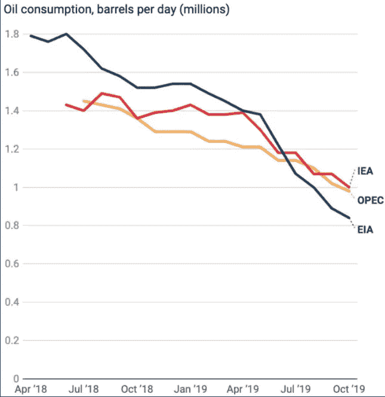

# 油价自然会产生风险溢价

> 原文：<https://medium.datadriveninvestor.com/a-natural-risk-premium-has-accrued-to-oil-prices-3930983ecc17?source=collection_archive---------6----------------------->

摘要:本文认为，当前的油价缺乏基本面驱动因素，如贸易紧张局势和保护主义风险上升、原油消费下降以及全球经济同步周期性放缓。相反，以前不存在的风险溢价已经在更持续的基础上支撑了全球石油市场。无论其结构性驱动因素如何不同，本文不试图概述反映风险和宏观经济驱动的石油价格的基本原理，而是使用生产数据、地缘政治不确定性的定性评估和贸易政策不确定性产生的经济政策不确定性的负面影响的组合来概述所感知的差异。因此，从中期来看，大宗商品出口国的财政平衡可能会有所改善，而这一趋势可能会因遵守石油输出国组织削减计划而得到加强。尽管与不确定的全球背景相关的石油消费下降表明油价逆风，但石油输出国组织减产的反应以及海湾地区不确定性带来的自然风险溢价将继续在中期内支撑油价。

在特朗普总统决定在 2018 年单方面退出伊朗核协议后，油价出现了自然的风险溢价，一系列溢价事件从伊朗和英国之间的海湾扣押油轮到 9 月 14 日据称对阿布卡奇和胡莱斯的沙特石油加工设施的袭击。与此同时，全球经济放缓，国际货币基金组织三次下调增长前景和贸易不确定性，打击了全球原油消费，同时商业投资减少。即便如此，油价已经开始以地缘政治风险为特征，自然风险溢价现在已经在不那么短暂的基础上累积；石油基本面现在出现了持续的分歧，如沙特阿拉伯、俄罗斯和美国的创纪录产量，以及较低的盈亏平衡和较低的生产成本。尽管利率创下历史新低，产量也有所增加，但美国页岩生产商负债累累，因此一些人可能会认为，鉴于全球增长放缓和消费下降，石油市场应该陷入衰退(见图表)。尽管考虑到结构性动态，这些观点似乎是合理的，但我认为，在短期内没有重大供应冲击的情况下，自然风险溢价不太可能出现 2014 年的低点。在海湾紧张局势加剧的情况下，这一点在石油输出国组织减产推动的油价上越来越明显。最近几个月，油价在每桶 63-65 美元之间波动。鉴于同步出现的周期性放缓和市场供应过剩，油价本应大幅走低，但事实并非如此，因为目前油价已经累积了一种天然的地缘政治风险溢价。

 [## 为什么包容性财富指数比 GDP 更能衡量社会进步？|数据驱动…

### 你不需要成为一个经济奇才或金融大师就能知道 GDP 的定义。即使你从未拿过 ECON 奖…

www.datadriveninvestor.com](https://www.datadriveninvestor.com/2019/03/08/why-inclusive-wealth-index-is-a-better-measure-of-societal-progress-than-gdp/) 

# 危机后油价的演变

2008 年金融危机导致全球增长放缓，全球经济收缩 1.6%，2009 年回升至 4.3%。随着 GDP 增速回落至 2.5%至 3.5%的区间，拐点远未开始持续的复苏趋势。刺激推动的全球经济复苏并没有带来石油价格的同步和持续复苏；这反映在 2014 年油价暴跌中，油价从危机后每桶 100 美元的高点跌至每桶 40 美元以下。尽管如此，这标志着全球原油价格的新曙光，因为技术进步促进了更长的分支井、水平钻井和水力压裂。随后的废物最小化技术和工艺创新降低了美国石油生产商的盈亏平衡，吸引了大量资本。后者也是由油价下跌促成的，因为平均信贷质量较低的能源生产商可以利用债务市场为当地项目融资。

# 较低的盈亏平衡价格导致全球原油供应过剩

美国页岩革命降低了美国能源公司的盈亏平衡成本，即每桶 45 美元，引发了新一轮供应浪潮，沙特阿拉伯和俄罗斯的技术进步使供需平衡向供过于求倾斜。除了周期性以及产量和原油库存增加之外，石油输出国组织还实施了产出限制，以减轻油价下行的风险。尽管沙特阿拉伯、卡塔尔、委内瑞拉和俄罗斯的盈亏平衡价格分别为 88 美元/桶、27 美元/桶、216 美元/桶和 53 美元/桶。即便如此，即使油价跌至 20 美元/桶，石油输出国组织成员国也能获利。在供应再度过剩、地缘政治风险定价不稳定和生产成本降低的这段时期，全球经济仍在增长，尽管比前几年有所放缓。人们可以说，全球增长放缓、盈亏平衡成本降低和地缘政治紧张加剧之间的相互作用，引发了石油基本面和油价之间的背离。此外，美国页岩革命使美国原油库存和石油钻机数据重新变得重要，因为其在全球轻质原油产量中的份额大幅上升。与此同时，沙特和俄罗斯的份额下降，这可能会使石油输出国组织实现稳定但略高的价格的目标变得复杂，因为随着需求压力的变化，俄罗斯将更喜欢获得市场份额。

原油价格受美元推动的说法有些言过其实。

美国原油产量数据重要性的增加似乎更多地反映了美国金融市场在全球贸易中的突出地位，而不是其在全球原油产量和全球分销中所占份额的上升。这符合贸易趋势，50%的全球贸易以美元结算，尽管这是其出口规模的三倍，经济规模的五倍。美元推动的油价走势的重要性，并不是全球大宗商品市场结构动态变化的征兆，而是已成为全球大宗商品市场特征的内在定价。

虽然美国能源情报署预测美国的平均产量为每天 1300 万桶，但沙特和俄罗斯的产量在 2018 年平均为 1030 万桶和 1160 万桶，这引发了人们对供应过剩的担忧，当时国际货币基金组织在其前两次展望中将全球增长预测下调至 3.2%(前值:3%)和 3.4%(前值:3.6%)。尽管贸易导致制造业下滑，石油消费下降，但油价仍保持在每桶 55.17 美元，布伦特原油为 63.35 美元。

# 全球贸易的复苏不太可能导致油价持续上涨

弗莱尔(2009)的一项研究表明，从长期来看，20%的贸易流量往往会拖累 5.0%的产出。由于关税和非关税壁垒的实施，贸易紧张局势持续降级导致的全球增长复苏可能不会在短期内给油价带来足够的上行压力，因为轻微脱钩的影响可能会在短期内产生挥之不去的影响。然而，我认为去全球化的说法被夸大了，美国和中国经济将在一些领域脱钩，如国防敏感技术和投资，中国经济仍将是美国农产品的主要进口国，贸易战只会加速中国经济的结构调整。

鉴于消费下降和货币政策推动的增长，全球原油价格高于合理水平。宽松的货币政策并没有导致消费的显著增长，而是起到了减少全球贸易紧张的负面影响的作用。因此，劳动力市场的紧张是过去投资的结果，而美国、欧洲央行和新兴市场最近的政策利率下调只是确保了股市的持续反弹。虽然我们看到了最近的一些波动，但全球许多风险资产市场在 2019 年表现出色。美国股市指数上涨超过 30%，欧洲和中国接近 25%，新兴市场和日本超过 15%。新兴市场主权债务、美国高收益债券和新兴市场公司债券的回报率都超过了 12%。值得注意的是，2019 年第四季度中国和新兴市场表现尤为强劲。这证实了一种观点，即金融市场和实体经济之间的结构性差异以及持续的风险溢价，已开始支撑全球原油价格。这解释了为什么不温不火的增长和石油消费的下降导致油价持续走高。后者在很大程度上可以解释为，在美国决定单方面退出伊朗核协议后，海湾地缘政治的不确定性日益加剧，通过在西岸和加沙建立定居点以及承认耶路撒冷为以色列首都，增加了以色列和哈马斯之间直接冲突的风险。

Source: IMF

**贸易战将导致东南亚进一步一体化，而油价的短暂波动并非不可能**

后者是全球最大的半导体进口国，占 55%，并将进一步整合东南亚国家，如韩国、日本、印度、马来西亚、新加坡和 BRI 国家，使其进一步融入其供应链。例如，中国从其他亚洲国家进口的集成电路目前占 39%，而韩国、新加坡、越南、马来西亚、日本和菲律宾分别占 22.0%、7.7%、2.9%、7.9%、4.7%和 3.5%。因此，轻微的脱钩并非不可能，这取决于贸易争端的影响持续多久，但即使美国试图向中国公司关闭敏感行业和技术，防止金融危机的需要也将激励合作。贸易战的影响，而不是世界的巴尔干化，表明价格信号不太乐观，尽管升级消息的短暂下跌可能促使石油输出国组织和国际能源机构进一步下调增长需求前景。2020 年的平均价格可能为 65 美元，但根据海湾地区的风险平衡以及贸易战的影响，可能会暂时升至 70 美元/桶。如上图所示，全球原油消费一直在下降，这应为油价提供看跌信号，但事实并非如此，因为自然风险溢价已经抵消了对油价的通缩影响。

# 美国在石油市场的全球主导地位一直受到制裁和以美元定价的大宗商品的推动

重要的是要理解美国作为全球主导者的演变，通过其制裁外交以及国际能源署和国际能源署的设置来抗衡石油输出国组织的定价能力，他们认为这是以重新平衡全球金融市场为目的的主要机构。此外，全球大宗商品价格以美元计价，这加剧了其定价能力，尤其是受到制裁的石油输出国组织成员国——叙利亚和委内瑞拉——进一步削弱了其定价能力。沙特阿拉伯和伊朗没有找到妥协，而是卷入了地区冲突，因为它们试图保持地区主导地位。这对石油输出国组织来说是适得其反的，因为气候变化和消费者偏好的改变以及汽车行业的结构性变化将加速能源转型，它应该寻求从油价中获益。这种缺乏远见的做法扩大了美国制裁的影响，降低了石油输出国组织的定价能力。

制裁、美国外交和 E&P 利益。

第二次世界大战结束后，出现了布雷顿森林机构，如国际货币基金组织、联合国和世界银行，其任务是设计一个以规则为基础的全球自由秩序，基本上由美国推动。这个新时代的特点是创建了 Swift 支付系统，该系统使全球经济受制于美国霸权，并促进了对经济愿景和经济主权与美国愿景相背离的国家实施域外制裁。

美国的新殖民主义采取了定向制裁的形式，在美国因据称未能在 1998 年打击该地区的恐怖主义而对其经济实施制裁后，委内瑞拉开始了人道主义虐待和经济恐怖主义的趋势。美国政府的这一理由是毫无根据的，旨在惩罚委内瑞拉拒绝采用资本主义模式，美国认为这是不可或缺的，因为它寻求加强对其势力范围的控制。

在此之前，委内瑞拉在页岩革命前继续向美国供应石油，美国只是在实现进口多元化并成为净能源出口国后才寻求实施制裁。

# 违反联合国安理会决议的行为导致油价悄然上涨

在美国入侵之后，美国又入侵了伊拉克、利比亚和叙利亚，以求获得油田，强行实现经济自由化，并维持其在中东和北非的霸权。正如我在早些时候的一篇文章中所述，美国违反了几项联合国安理会决议，并威胁说，如果各国不签署第 98 条，美国将取消援助。第 98 条禁止任何美国总统在国际刑事法院受到起诉并被追究责任。所有这些都导致油价上涨，随着制裁在大宗商品定价中根深蒂固，这一点变得越来越明显。

# 制裁将激励创造一种替代以美元为中心的 Swift 支付系统

与此同时，所有推翻叙利亚阿萨德的努力都失败了，美国对俄罗斯、伊朗和叙利亚的制裁只是起到了加强国家间协同作用的作用。虽然易货贸易和 Swift 的替代方案可能会促进替代方案的出现，但中国的参与和持续贸易将与其对特朗普贸易战的结构调整密切相关。中国重新调整其亚洲技术供应链的决定不仅将刺激经济增长，并将越南、韩国、马来西亚、新加坡和印度纳入中国供应链，还将支持 SWIFT 清算系统的替代方案，这将提高中国在联合国安理会的合法性，并确保俄罗斯和中国不会在任何有关中东重建的讨论中被边缘化。这对于中国来说尤其突出，因为中国的经济利益横跨伊朗、从俄国和一带一路进口的能源，如果这有助于建立一个以美元为中心的 SWIFT 系统的替代系统，伊朗和的经济红利将更快地扩散。

全球金融周期正从美元周期转变为人民币周期。对于新兴市场来说尤其如此，这些市场的供应链、经济和货币越来越多地与人民币挂钩。在亚洲，马来西亚林吉特、印度卢比、新西兰元、澳大利亚元、泰国铢、韩圆正越来越多地与中国经济和货币挂钩。

对伊朗的制裁和美国退出伊朗核协议给中东带来了前所未有的不确定性

对伊朗的一系列制裁仍在继续。其理由是伊朗决定拒绝从美国购买核裂变材料。通过选择从巴西购买核材料，伊朗被发现违反了现行法律，其石油出口受到了制裁。尽管美国违反了国际法，但伊朗同意了联合全面行动计划，该计划恢复了与全球经济的经济联系，以换取遏制其核计划并将其核相关活动仅限于民用。尽管改变了其福尔道和重水阿尔卡克设施，允许国际原子能机构进行侵入性的特别核查，该机构曾 14 次认证伊朗的合规性，但特朗普总统选择在 2015 年单方面退出伊朗核协议。这导致了中东事件的意外转折。

# 联合国安理会成员违反了国际法，规避制裁的企图已被证明是徒劳的

他的决定迫使联合国安理会的现任成员(英国、法国、德国、俄罗斯和中国)违反国际法(即联合国安理会第 2231 号决议)，因为以美国为中心的支付系统(SWIFT)阻止他们履行协议下的承诺，并提供伊朗核协议下承诺的经济利益。欧洲的特殊目的工具 INSTEX 未能产生任何重大结果，这应该被用来确保没有美国风险敞口的公司与伊朗进行贸易，而不会有被美国贸易体系排斥在外的风险。

伊朗的军事能力应该会让油价观察人士更加担忧，因为 170 亿美元的信贷安排只能安抚它更长时间。

与此同时，来自法国的 170 亿美元信贷安排不仅无法补偿伊朗在欧洲无力实施国际协议方面的损失，还让欧洲和世界需要一个以美元为中心的 SWIFT 银行系统的替代方案。由于没有其他选择，一艘伊朗油轮 Grace one 被扣押，伊朗人因此扣押了一艘英国油轮 Sterna Impero。此外，对石油管道和沙特石油设施的袭击不仅表明了国际协议的无效，还表明了美国导弹防御系统无力保护沙特阿拉伯的安全。对沙特国防支出的影响不在本文的讨论范围内，但也门或伊朗真主党如此精确地瞄准沙特油田的能力，对美国国防和军事装备保护沙特利益的能力具有重大影响。更令人担忧的是这对美国外交政策的影响。伊朗不仅像大多数人所说的那样瞄准了石油设施，还击落了一架来自美国的无人驾驶飞机，这是同类技术中最先进的。对于像伊朗这样资源紧张的国家来说，要想展示类似于美国的军事能力，很难看到不包括伊朗在内的降级。

中东几十年的动荡和军事冲突，以及最近制裁和定点袭击的升级，导致全球大宗商品价格自然出现风险溢价。然而，可以说，由于制裁、出口管制和地缘政治不确定性等外部因素造成的不确定性，无风险利率明显更高。就全球原油价格而言，短期波动仅仅是现有价格趋势的放大因素，但潜在价格本身远远高于海湾地区的紧张局势、伊朗石油出口制裁的恢复、中央银行以及最近对沙特阿拉伯 Albaqaiq 生产设施的袭击。

# 美国的制裁往往是毫无根据的，只会巩固美国的霸权，Swift 的替代品似乎是可能的

正如奇尔科特报告所概述的那样，有关伊拉克大规模毁灭性武器的说法毫无根据，证据不足。所有这些都证明了一种说法，即美国在其他国家寻求一种无价值的外交政策，以通过基于规则的秩序和国际贸易体系巩固其非法获得的合法性。这解释了为什么中国和俄罗斯越来越多地考虑以美元为中心的 SWIFT 支付系统的可靠替代方案。俄罗斯主要石油生产商 Rosneft 现在只接受欧元支付，以减少对美元的依赖，而印度、俄罗斯和中国越来越多地接受本币支付。

一场全面冲突将席卷中东，这将刺激对话，但油价的不确定性仍将持续。

美国自愿投票反对联合国安理会促进以色列和巴勒斯坦两国解决方案的决议，而奥巴马总统威胁说，如果巴勒斯坦人质疑其阻止两国解决方案的决定，美国将撤回援助。与此同时，特朗普总统决定承认耶路撒冷为以色列首都，允许在西岸和加沙地带建造定居点，以及最近关于上述行动的声明不违反国际法，这些都增加了冲突的风险。更令人担忧的是，尽管受到美国最严厉的制裁，但伊朗的军事能力表明，一场全面的冲突可能会波及中东，包括美国。全球经济比第三次世界大战更需要担心——气候变化、不平等和全球增长放缓。

他们并非不倾向于在全面冲突的情况下以美国为目标，这预示着全球稳定的不祥之兆，并增加了该地区的风险。伊朗外交部长穆罕默德·贾瓦德·扎里夫主张通过对话实现该地区的稳定，而埃尔多安则问全球领导人，为什么全球南部不断陷入战争和冲突的泥潭。这表明未来的冲突可能会横跨中东，随着金正恩测试和越来越相信他的洲际弹道导弹的能力，直接冲突的风险不能低估。随着心怀不满的国家越来越能够接触到美国，直接冲突的风险似乎很遥远，但不确定性仍然存在。

# 石油输出国组织削减支出以支撑油价

石油输出国组织同意将石油日产量再削减 16.7 万桶，另外非自愿削减 40 万桶。与此同时，阿联酋、科威特、伊拉克和俄罗斯将分别减产 60，000 桶/日、55，000 桶/日、50，000 桶/日和 70，000 桶/日。其决定是在 Saudi Aramco 上市后做出的，该公司最近在 Tadawul 交易所上市。创纪录的超额认购上市将筹集 17 亿英镑，其中 25%将来自外国投资者，而沙特公共养老基金机构获得了价值 11.5%的股份。减产可能会提振上市需求，但油价不会反映全球贸易紧张(这往往会抑制需求)，而是会反映沙特限制产量的能力，这与不断变化的供应动态一致。

进一步的产量限制将支撑油价，但赤字国家可能会减少遵守以支撑公共财政

与此同时，石油输出国组织成员准备同意进一步降息，这取决于贸易战的结果。在美国的页岩革命中，沙特和石油输出国组织失去了全球石油市场份额，而美国、沙特和俄国现在分别拥有 18%、12%和 11%的份额。因此，进一步减产将把市场份额让给美国，尤其是作为石油输出国组织成员的委内瑞拉和伊朗目前正受到美国的域外制裁。这不仅对沙特、俄国和石油输出国组织的市场份额来说是个不祥之兆，也削弱了它们减产和支撑价格的能力。一些石油输出国组织成员，如沙特阿拉伯，目前持有财政赤字，因为这种短期的经济分歧不是不可能的，因为预算需求可能会减少遵守的激励。阿联酋和尼日利亚的情况更是如此，这两个国家目前的赤字分别占 GDP 的 4.5%和 1.5%。尽管如此，这些国家可能会受益，但也有可能将更多的市场份额让给非石油输出国组织生产商。有人可能会说，削减石油产量是不明智的，因为这可能会加剧周期性放缓，而贸易紧张局势会加剧这种放缓。此外，支撑油价的自然风险溢价应该会抵消美中贸易争端的负面影响，但随着两个最大的经济体完成贸易和赤字国家寻求在平衡国内优先事项的同时减少财政赤字的第一阶段，最近削减的额外收益可能会受到越来越多的考验。尽管由于美国的制裁外交，油价出现了自然溢价，但随着商业信心和投资减弱，持续的消费者需求也支撑了油价。因此，消费者乐观情绪、美元走强和货币刺激措施限制了贸易战的影响。即便如此，海湾地区的紧张局势和不断上升的冲突风险已经给油价带来了新的持续风险溢价，如果没有重大的供应冲击或进一步下调石油需求预测，这种风险溢价不太可能消失。面对贸易和经济政策的不确定性，油价不仅背离了基本面，而且在最近一段时间里，油价也开始更密切地反映地缘政治的不确定性。

# 油价下一步走向何方？

随着抗议活动震撼全球经济，从灭绝叛乱到世界各地的学生抗议，气候变化已成为全球议程的首要问题。随着各国政府努力减少碳排放，它们必须倡导降低从运输到加热的所有等级原油的含硫量。石油市场可能正在经历最后一轮牛市，其持久性将取决于净零排放目标的采用。与此同时，自然风险溢价有冲突风险上升的不幸迹象，这可能会以前所未有的规模加剧气候驱动的移民。政府必须对石油生产商施加更严格的限制，在 2020 年底前取消补贴。来自之前发放的补贴、税收优惠和股权注入的资金必须放入一个基金，以实现经济去碳化、创造高质量的绿色就业机会并向最容易发生经济转型的个人进行财政转移。

*N.B I 将风险溢价定义为石油等商品的额外价格，其驱动因素是供应约束和/或其他瓶颈的不确定性，这些因素会扰乱供应并加剧需求压力。*