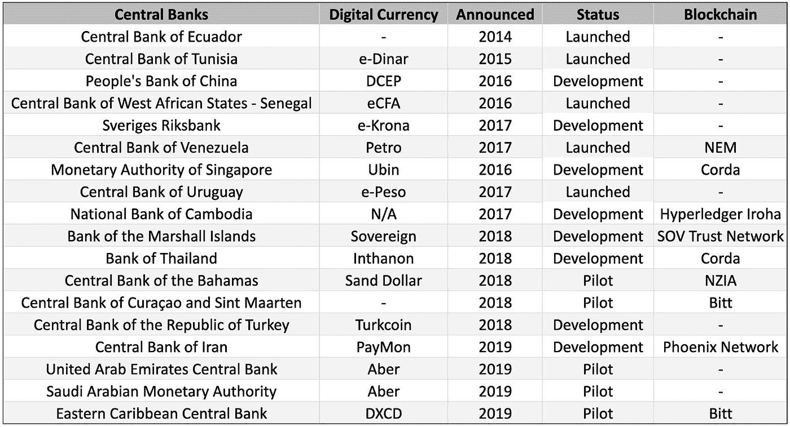

# 新兴市场的新故事&区块链金融

> 原文：<https://medium.datadriveninvestor.com/a-new-narrative-for-emerging-markets-blockchain-enabled-finance-e4e553da0499?source=collection_archive---------5----------------------->

加密货币和区块链领域对新兴市场的看法发生了明显的转变。直到最近，新兴市场一直被归入外部技术受益者的类别，并被视为潜在的用户群，在这个过程中，新兴市场被用来证明投机是合理的，或者在某些情况下，被用来争取监管机构的批准。

现实是，新兴市场不仅仅是外部技术的伪慈善受益者。新兴市场代表着世界上一些最令人兴奋的金融机会，由于令牌化，这些机会比以往任何时候都更容易获得。

此外，新兴市场参与者并非铁板一块。他们中的许多人同样在寻找世界上最好的金融机会，而他们以前在很大程度上由于金融世界的陈旧结构而无法获得这些机会。

 [## 投资算法快速指南|数据驱动投资者

### 让我们想象一下 30 年前的股票市场:让我们想象一下现在:像现在的许多其他领域一样，投资市场已经…

www.datadriveninvestor.com](https://www.datadriveninvestor.com/2019/01/31/a-quick-guide-to-investment-algorithms/) 

简而言之，叙事正发生转变，承认这一群体是新的全球投资者阶层的一部分，而不仅仅是汇款的受益者或等待银行存款的无银行账户者。

Photo by [Matthew Henry](https://unsplash.com/@matthewhenry?utm_source=medium&utm_medium=referral) on [Unsplash](https://unsplash.com?utm_source=medium&utm_medium=referral)

# **之前对新兴市场和区块链的叙述**

在过去几年中，新兴市场的概念，因为它们与加密货币和区块链相关，已经陷入了几个叙事比喻。

第一个比喻是“区块链，而不是加密货币”的观点从这个角度来看，让这场运动有趣的不是加密货币本身，而是支撑加密货币的分布式账本技术的应用世界。

这一观点已被国际货币基金组织和世界银行等经济发展机构普遍接受。“区块链不加密”的观点也是 IBM 等企业工作小组的标准说法，他们乐于成立新的部门来探索区块链的商机——无论是在新兴市场还是更远的地方。

尽管比特币或加密货币领域的人士可能经常对“区块链不加密”的说法持怀疑态度，但对 DLT 在新兴市场的潜在应用的兴趣是有道理的。

发展中国家的经济常常受到物流流程、不发达的法律和经济基础设施以及完全由中央集权的行政官员控制的不透明流程的束缚。

区块链承诺了一些完全相反的东西，描绘了一幅新经济基础设施的愿景，用去中心化的点对点模式取代集中控制，用结构透明取代不透明。

更重要的是，有一个简单的叙事类比，说明建立完全超越旧金融机构的东西的潜力。如果世界各地的电信基础设施可以跨越固定电话时代，为什么新的银行基础设施不能做到这一点？事实上，鉴于许多地方现有的移动支付和移动货币基础设施如此强大，这些用户难道不会比一些已经接入发达国家信用卡和借记卡基础设施的人更快地采用新技术吗？

然而，如果有越级类推的话，这些机构研究的许多申请不是以金钱为重点，而是社会的其他方面。其中一些侧重于民间社会的简单核心基础设施，如降低政府官僚机构的成本。

在 2017 年为《哈佛商业评论》撰写的一篇题为[“区块链如何帮助新兴市场实现飞跃”](https://hbr.org/2017/05/how-blockchain-could-help-emerging-markets-leap-ahead)的文章中，Vinay Gupta 和 Rob Knight 写道，迪拜计划每年将超过 1 亿份文件转移到区块链，以刺激创新并节省大量成本。

其他举措集中于打击历史上存在重大问题的领域的腐败，如产权和土地登记。Knowledge@Wharton 的一篇文章[介绍了](https://knowledge.wharton.upenn.edu/article/blockchain-brings-social-benefits-emerging-economies/)一个印度国家智库项目，该项目旨在实施区块链项目，包括安得拉邦的土地所有权、供应链记录和医疗保健，同时还讲述了一个管理昌迪加尔市土地权利信息的 ConsenSys 试点项目。

然而，区块链以金钱为中心的应用从未真正离开新兴市场的话题。在令牌化世界的令人兴奋的 ICO 时代，围绕新兴市场和加密的另一种叙事出现了，它与汇款等跨境交易有关。

一个人不需要成为区块链的拥护者就能得出结论，当前的汇款系统急需彻底改革。[根据世界银行的数据](https://www.worldbank.org/en/news/press-release/2019/04/08/record-high-remittances-sent-globally-in-2018)，2018 年向低收入和中等收入国家的汇款达到 5290 亿美元，同比增长近 10%。

这种经济转移的费用通常会很高，并打击世界上最脆弱的群体。当局用 200 美元的费用作为基准。平均费用组合吃掉 14 美元——或其中的 7%。

这就是为什么许多加密项目开始改变这种情况，使用令牌化的方法，承诺大幅降低跨境转移资金的费用。

这些类型的令牌化方法的挑战是，它们需要足够大的网络效应，以便令牌具有这种用例所需的流动性。更重要的是，即使人们使用具有显著流动性的代币，加密市场的内在波动性也为价值转移和接收之间的滑动和价值损失创造了很大的机会。也许这就说得通了，这将是一个特殊的稳定币，把这个故事带到了下一个层次。

今年 6 月，当大卫·马库斯(David Marcus)坐下来就他为脸书领导的新全球数字货币项目 Libra 在国会作证时，很明显他有一个主要的故事要推动:让未被银行贷款和贷款不足的银行贷款。

马库斯[一遍又一遍地重复着](https://www.wsj.com/articles/facebooks-libra-bets-it-can-bank-the-unbanked-11566471601)世界金融体系，根本无法为世界上的大部分人服务。这一群体要么根本无法获得关键的金融服务，要么即使获得了，报酬也高得惊人。像 Libra 这样的数字货币可以带来根本性的变化。

与小型加密项目不同，Libra——拥有其成员联盟和数十亿户外潜在用户——将拥有使网络运转的流动性。与比特币等不稳定的加密货币不同，Libra 将与一篮子加密货币挂钩并保持稳定，使其成为汇款等用例的更好工具。

Libra 的出现为区块链和加密背景下的新兴市场叙事做了一些事情。

首先，为无银行账户者提供银行服务的故事强化了这样一种观点，即新兴市场主要是其他地方正在建设的区块链技术的一个使用案例和受益者，而不是另一个金融利益相关者。特别是在脸书的手中，这种叙述与你从全球经济发展组织或慈善机构听到的事情没有什么不同。

其次，Libra 的功能有点像发令枪，让全球发达市场和新兴市场的政府考虑建立自己的数字货币。

中国的反应尤其积极，围绕即将推出的数字人民币，中国加快了 R&D 和公关工作。其他国家也做出了回应。在欧洲，法国和欧洲等国家已经开始探索自己的数字货币。环顾世界，在过去的几年里已经看到了一个巨大的发展阵列，甚至更多，现在预计在天秤座和中国的数字元之后。

在某些方面，这验证了加密货币在新兴市场(以及总体上对国民经济)的潜在影响的概念。

与此同时，我们认为新兴市场的真正潜力尚未释放，事实上它可能不是汇款等问题的显而易见(如果重要的话)的解决方案，而是令牌化所带来的新兴市场的全新概念。

# **标记化在新兴市场真正能做什么**

如上所述，迄今为止，大多数区块链和加密货币领域都着眼于该技术对解决经济和社会发展问题的影响。我们认为，这种叙事现在正以两种方式发生转变，即将新兴市场视为完全的市场参与者，而不是全球行善主义的受益者——既包括现有全球投资者如何参与新兴市场机遇，也包括一类新的全球投资者如何受邀参与全球最佳金融产品。

*更明智地把握新兴市场机遇*

今天的发达市场投资者面临着一系列挑战。自 2008 年危机以来，利率一直处于人为低位，其中一个影响是无法获得储蓄或债券市场的收益率。其结果是，资本从收益率有限的公开市场涌入私人市场，寻找更奇特的收益率机会。顾名思义，私人市场的准入门槛更高，操作起来也更复杂。要阅读更多关于这一动态的内容，请参阅我们最近的文章《金融的民主化》。所有这些的最终结果是，许多投资者开始寻找替代空间，包括新兴市场。

老练的投资者认为新兴市场太小而没有吸引力的日子已经一去不复返了。事实上，随着全球经济继续相互联系，世界上许多最有趣的金融机会都可以在发展中经济体找到，这些经济体有潜力跨越整个基础设施和技术范式。

以太阳能为例。太阳能是增长最快的能源部门之一，预计到 2040 年将超过除天然气以外的所有其他形式。预计到 2035 年，新兴市场将占所有能源需求增长的 90%，重要的是，新兴市场已经占风能和太阳能新投资的 63%(比如，比美国还多)。

为了让国际投资者接触到这个市场，Invictus 最近推出了新兴市场太阳能(EMS)基金。该基金建立在 Sun Exchange 提供的基础设施上，这是一个 P2P 市场，允许个人购买和租赁太阳能电池板给非洲的学校和小企业，使用比特币区块链作为支付分配基础设施。新兴市场基金打算在利用规模投资激励的同时，通过增加额外一层审查来优化回报。

我们提到这只基金不是为了给自己打气，而是因为我们相信它反映了一些变化，我们相信这些变化不仅会让今天的投资者更适应太阳能等新类别的替代投资，还会让投资者在他们使用的投资产品中有所期待。

简而言之，投资者希望更加灵活，能够在没有相同限制性最低限额的情况下投资于新的类别；具有持续的流动性，而不是繁重的锁定期；基金持有的透明度；容易登机。这正是总部位于区块链的基金管理公司所能做到的。

*新型全球投资者的新机遇*

发达市场投资者并不是唯一一类在寻找新机会时面临挑战的投资者。新兴市场的许多人代表了一类新的全球投资者。然而，从历史上看，这一群体也面临着一些最终归结为地理意外的情况。

这些问题中的第一个与通货膨胀有关。在世界许多地方，通货膨胀是一种决定性的力量，它以在发达国家几乎不可想象的方式掠夺人们的财富。

通货膨胀本身并不是唯一的问题，因为政府应对通货膨胀的措施常常会给那些希望分散投资、将财富转移到国外的投资者带来更多挑战。今年，阿根廷一直在加强[资本管制](https://www.washingtonpost.com/politics/2019/09/06/argentina-just-reinstated-foreign-currency-restrictions-heres-what-you-need-know/)，例如，拼命试图保持持有比索，而阿根廷人只是为了更好的生活而试图多元化。

即便是那些在通胀后拥有足够财富、并拥有规避资本管制机制的人，也不一定有好的投资场所。只要看看主要新兴市场中持有密码的人的比例，就能明白全球投资机会的需求。

根据 2019 年 Statista 全球消费者调查，加密货币比例最高的 5 个国家是土耳其、巴西、哥伦比亚、阿根廷和南非。在 2018 年的 Globalwebindex 调查中，加密货币用户超过全球平均水平的 16 个国家中，有 13 个来自新兴市场。

对我们来说，这些数字不仅反映了对加密货币的兴趣，也反映了对获得超越物理邻近范围的投资机会的兴趣。

与令牌化基金简化现有全球投资者进入新兴市场的方式一样，我们相信，令牌化的区块链基金管理的好处——包括取消投资最低限额和 24/7 流动性——可以让这类投资者获得世界上最好的金融产品，而以前他们根本无法获得这些产品。

这方面的一个例子是 Invictus 的保证金贷款基金或 IML。IML 基金是一种基于美元的基金，它 1)保护财富(因为它是基于美元的), 2)通过向投资者提供 8%以上的可预测回报来鼓励储蓄。该产品面向全球投资者，帮助投资者以稳定、公认的全球货币获得丰厚回报。

我们才刚刚开始看到区块链的金融技术能为新兴市场做些什么。我们认为，虽然加密货币作为解决政府和民间社会汇款和区块链应用等问题的方法的想法可能仍然有效，但随着我们开始理解新兴市场固有的金融机会以及这些市场投资者的尊严和主权，故事发生了转变。