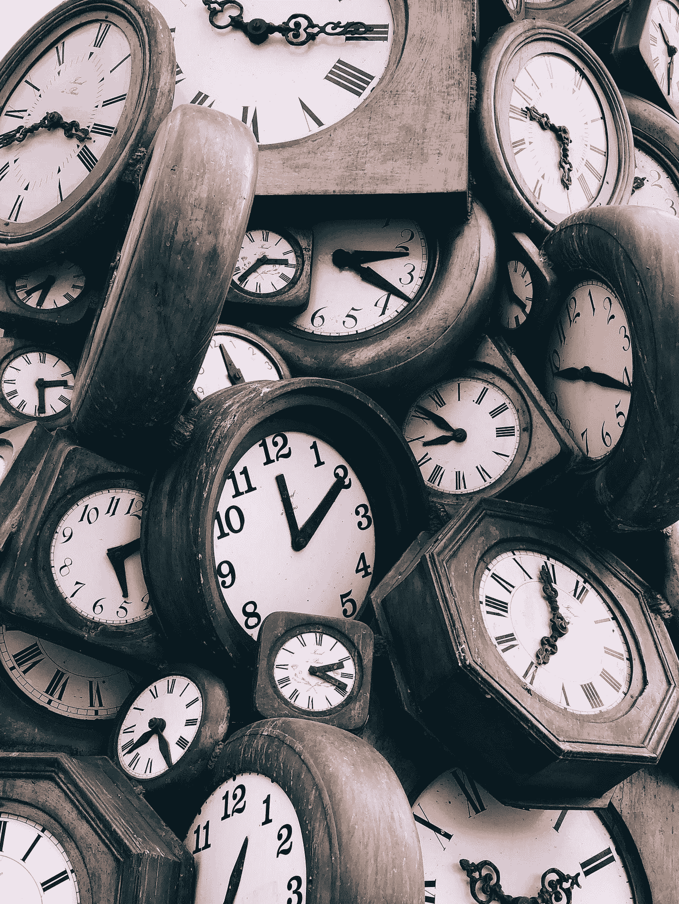
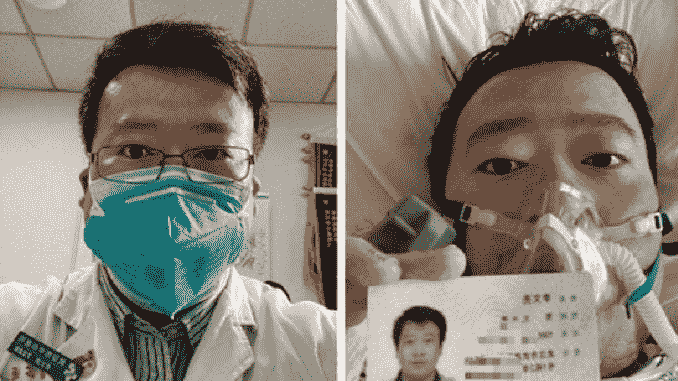

# 新世界来了(新冠肺炎冠状病毒疫情的故事):新冠肺炎危机的长期影响可能是什么？数据驱动的投资者

> 原文：<https://medium.datadriveninvestor.com/a-new-world-comes-a-covid-19-coronavirus-pandemic-story-what-might-be-the-longer-term-effects-fbf373defeec?source=collection_archive---------6----------------------->

## 我们面临着一个真实但可控的危机——一种传染性非常高但死亡率中低的疾病(只要医院和呼吸机供应能够维持)。

## 我们将很快走出我们的避难所。我们使用物质世界的方式将会改变。我一直在寻找预言，以下是我的发现。

Photo by [zaya odeesho](https://unsplash.com/@the_zaya?utm_source=medium&utm_medium=referral) on [Unsplash](https://unsplash.com/?utm_source=medium&utm_medium=referral)

我们面临着一个真实但可控的危机——一种传染性非常高但死亡率中低的疾病(只要医院和呼吸机供应能够维持)。

在新冠肺炎危机[时移](https://medium.com/age-of-awareness/time-shift-a-covid-19-pandemic-story-9f35e1f22e2e)之际，许多人猜测:新冠肺炎危机的 [*长期影响*](https://davidbrin.blogspot.com/) 可能是什么？

 [## EndCoronavirus.org

### 我们的团队由 4000 多名志愿者组成，包括科学家、工程师、医生和无数积极的…

www.endcoronavirus.org](https://www.endcoronavirus.org/home) 

## 我们将很快走出我们的避难所。我们使用物质世界的方式将会改变。我一直在寻找预言，以下是我的发现。

就像望远镜聚焦遥远的恒星一样，[大数据](https://www.datadriveninvestor.com/glossary/big-data/)模型告诉我们，新冠肺炎是一个疫情，很可能在未来几年感染大多数人类。许多人不希望相信这一点，或者误解了时间范围(2019 年 12 月的中国相当于 2020 年 2 月的韩国，美国相当于 2020 年 3 月)。

We are in the midst of a [Time-shift](https://medium.com/age-of-awareness/time-shift-a-covid-19-pandemic-story-9f35e1f22e2e) Photo by [Jon Tyson](https://unsplash.com/@jontyson?utm_source=medium&utm_medium=referral) on [Unsplash](https://unsplash.com?utm_source=medium&utm_medium=referral)

对于你(专注于数字和数学模型)或任何学过代数的人来说，我们必须替换其中一个变量来“解决”问题(做出预测)。剑桥大学温顿中心的 David Spiegelhalter 通过将风险转化为时间变量已经做到了这一点。

 [## 如果资本主义失败了，那么还有什么选择呢？数据驱动的投资者

### 在当前政治领域的修辞之旅中，我们都可以面对面地接触到流行词汇，如…

www.datadriveninvestor.com](https://www.datadriveninvestor.com/2020/03/16/if-capitalism-is-a-failure-then-what-is-the-alternative/) 

> *…新冠肺炎非常粗略地贡献了* ***一年的风险*** *。在这个数字上有一个简单的现实核查。在英国，每年大约有 60 万人死亡。帝国理工学院的团队估计，如果病毒完全不受挑战，大约 80%的人会被感染，将有大约 510，000 人死亡。*[**covid 代表多少正常“风险”**](https://medium.com/wintoncentre/how-much-normal-risk-does-covid-represent-4539118e1196)

At the same time, this data seen through the microscope of personal stories can indeed be shockingly frightening. The world knows the story of Li Wenliang (Chinese: 李文亮; 12 October 1986–7 February 2020) who was a whistleblower that returned to work, later contracted the virus and died from the disease on 7 February 2020, aged 33\. [Wikipedia](https://en.wikipedia.org/wiki/Li_Wenliang)

智能手机带来的对生活在这个新“显微镜”中的东西的恐惧让我们感到害怕。如果我们能够在这场情感共鸣驱动的风暴中幸存下来，并重新发现我们冷静的理性，那么这个世界将会变得更加美好。

> *“当人们害怕时，没有人能让他们相信他们是安全的……许多人在害怕时根本听不到事实。”* [*道格·利维*](https://medium.com/@sfdoug) *在* [沟通关于冠状病毒:伊波拉和其他突发事件的教训](https://medium.com/@sfdoug/communicating-about-coronavirus-lessons-from-ebola-and-other-emergencies-f2a2c50c834)

我们的数字文化“已经将我们的中枢神经系统本身扩展到一个全球性的怀抱[并且]情感共鸣*已经取代了认知共鸣*，我们把全人类当作我们的皮肤 T30。[【安全港(新冠肺炎·疫情战胜恐惧的故事)】我们可以通过从被动型社会转变为主动型社会来战胜这种恐惧。](https://medium.com/datadriveninvestor/safe-haven-a-covid-19-pandemic-story-to-combat-fear-d8e18fcb784d)**

****

**Photo by [zaya odeesho](https://unsplash.com/@the_zaya?utm_source=medium&utm_medium=referral) on [Unsplash](https://unsplash.com/?utm_source=medium&utm_medium=referral)**

# **全系统的变化**

**我们将很快走出我们的避难所。虽然物理世界可能看起来和新冠肺炎冠状病毒疫情之前差不多，但我们使用物理世界的方式将会改变。我一直在寻找预言，以下是我的发现。**

# **CONVID-19 前的恐惧被重新考虑，我们现在采取的削减[过度]监管的紧急措施被永久化**

**两位杰出的科学家最近在《纽约时报》*中推荐了他们认为在冠状病毒应对期间应该暂停/调整的五项法规。他们认为，这样做会让我们更有能力对抗病毒。 [***抗击冠状病毒，削减繁文缛节***](https://www.nytimes.com/2020/03/24/business/coronavirus-medical-supplies-regulations.html) [*《纽约时报》*](https://www.nytimes.com/)***

1.  **像对待驾照一样对待行医执照；也就是说，允许他们跨越州界。**
2.  **暂时禁止任何冠状病毒相关的医疗事故诉讼。**
3.  **暂停专利:“对于任何被认为是对抗这种病毒所必需的产品的生产，专利应该被短暂地暂停。”**
4.  **暂停隐私:例如，使用智能手机数据来跟踪用户，以确定生病的人的“可能接触者”。**
5.  **听着:“开放网站，不要征求对新法规的意见，而是对限制我们抗击病毒能力的现有法规的意见。让第一线的人们报告阻碍他们的法规。”**

**在新冠肺炎危机结束后，这些建议中的许多仍然是合理的。想想这张由《理性》杂志[撰写的由新冠肺炎启发的十大搁置规则](https://www.datadriveninvestor.com/2020/03/23/coronavirus-a-to-panic-z-between-the-lines/)[。](https://youtu.be/cMvSCJzAmw8)**

# **社交距离可能会变得永久——我们可能不得不将我们的社交互动和服务行业分成积极/消极和数字/物理两类**

> **一旦美国有了快速、有效和充足的新冠肺炎测试(就像两个月前我们应该和能够做的那样),那么为什么不让公司重新开放一些工厂等等。，让已经经历了病毒暴露和随后的潜伏期(无论是否有症状)的员工重返工作岗位？ [**大卫·布瑞恩**](https://davidbrin.blogspot.com/)**

**最终，一些餐厅甚至可能会让 COVID 阳性的员工为只有 COVID 阳性的客户服务——所有这些都通过智能手机的个人资料得到确认。**

> **因此，最终会有这种数字免疫证明，这将有助于促进全球重新开放。**

*** *比尔盖茨在[非监护人](https://off-guardian.org/2020/04/04/did-bill-gates-just-reveal-the-reason-behind-the-lock-downs/)中引用了 3 月 24 日[TED 采访](https://www.ted.com/talks/bill_gates_how_we_must_respond_to_the_coronavirus_pandemic)中的话。**

> ***公司可能会有成对的办公室或孪生工厂友好竞争，就像广告中那样，生产 Twix 巧克力棒的左半部分和右半部分。还是权衡取舍，选边站？想象迪斯尼乐园对积极的人开放，而环球对消极的人开放？* [*展望未来*](https://davidbrin.blogspot.com/2020/03/the-pothole-solution-to-work-and-money.html) *由* [**大卫·布瑞恩**](https://davidbrin.blogspot.com/)**

**随着新冠肺炎病毒在全球的传播，各种组织正在实施前所未有的工作方式转变。面对不确定性，适应性强、有韧性并相互支持的公司和员工将会胜出。我们都将了解远程工作或与分散的同事和客户一起工作的好处。[远程工作从](https://humu.com/remote-nudges/)[胡姆](https://humu.com/)轻推**

**商业会议软件和在家工作软件已经被预测了几十年，但由于管理层的不情愿而受到冷落。这些将随着小规模卫星办公室中的房地产繁荣而迅速发展，在这些办公室中，员工每天至少有一部分时间受到个人监督，因此他们在家工作的时间可以保持有效。 [***这一切会走向何方？意想不到的选择和结果…和一些安慰***](https://davidbrin.blogspot.com/2020/03/where-might-this-all-lead-unexpected.html) 作者[大卫·布瑞恩](https://en.wikipedia.org/wiki/David_Brin)**

# **行为科学将占据中心舞台**

**在智能手机带来的行为科学的推动下，我们将从被动型社会转变为主动型社会。**

**在 [PsyArXiv](http://blog.psyarxiv.com/about-psyarxiv/) (由[心理科学进步协会](https://improvingpsych.org/)维护的
心理科学免费预印本服务)中，考虑这位相对较新的弟子对新冠肺炎疫情的潜在反应。**

> ****新冠肺炎疫情代表了一场巨大的全球健康危机。由于这场危机需要大规模的行为改变，并给个人带来巨大的心理负担，社会和行为科学的见解可以用来帮助人类行为与流行病学家和公共卫生专家的建议保持一致。……我们确定了有效应对新冠肺炎疫情的几个见解，还强调了研究人员在未来几周和几个月应该迅速填补的重要空白。****
> 
> **[**运用社会和行为科学来支持新冠肺炎·疫情的回应**](https://psyarxiv.com/y38m9/) **中的****
> 
> ***我们的数字文化“已经将我们的中枢神经系统本身扩展到一个全球性的怀抱中【并且】* [情感共鸣](https://lesley.edu/article/the-psychology-of-emotional-and-cognitive-empathy) *已经取代了* [认知共鸣](https://www.goodreads.com/book/show/29100194-against-empathy) *我们把全人类都当成了自己的皮肤*。*[*避风港(一个新冠肺炎·疫情对抗恐惧的故事)*](https://medium.com/datadriveninvestor/safe-haven-a-covid-19-pandemic-story-to-combat-fear-d8e18fcb784d)***

***新冠肺炎冠状病毒疫情需要一个专注于我们行为的反应——包括我们的洗手习惯、恐慌性购买和社交距离的能力。此外，禁止旅行、关闭学校/餐馆、在家工作(如果这是一种选择)以及随之而来的死亡也会带来社会和经济影响。***

***这些工具将在疫情结束后找到新的用途。我建议你仔细阅读即将发生的事情。***

***[行为科学家](https://behavioralscientist.org/selected-links-the-behavioral-science-of-the-coronavirus-covid-19/)整理文章，帮助揭示冠状病毒疫情的行为特征。***

******

***Wayne Boatwright 是一名商业和法律专业人士，他最近在圣昆廷监狱服刑 7 年。Wayne 在通过更智能地管理复杂的流程、信息和关系来帮助组织取得成功方面拥有 20 多年的经验。他的“超能力”是发现和理解组织需要什么来成长和繁荣，然后开发系统、通信和流程来帮助他们为其成员向前推进。Wayne 的著作侧重于将数字领域构建为一个统一的领域，并打破线性顺序推理在我们的数字时代不再足够的束缚。*不，你不会在维基百科搜索中找到这个。我们正在穿越新的领域。***

***如果你喜欢这篇文章，并想不受任何限制地阅读更多这样的文章，为什么不考虑通过使用下面我的推荐链接成为一个中等会员(如果你还不是一个)？***

*** [## 通过我的推荐链接加入 Medium-Wayne boat Wright

### 作为一个媒体会员，你的会员费的一部分会给你阅读的作家，你可以完全接触到每一个故事…

wayneboatwright.medium.com](https://wayneboatwright.medium.com/membership) 

我从你的月费中得到一部分，不需要额外的费用，这将对我作为一个作家起到很大的支持作用。*** 

****原载于 2020 年 4 月 6 日*[*【https://www.datadriveninvestor.com】*](https://www.datadriveninvestor.com/2020/04/06/a-new-world-comes-a-covid-19-coronavirus-pandemic-story-what-might-be-the-longer-term-effects-of-the-covid-19-crisis/)*。****