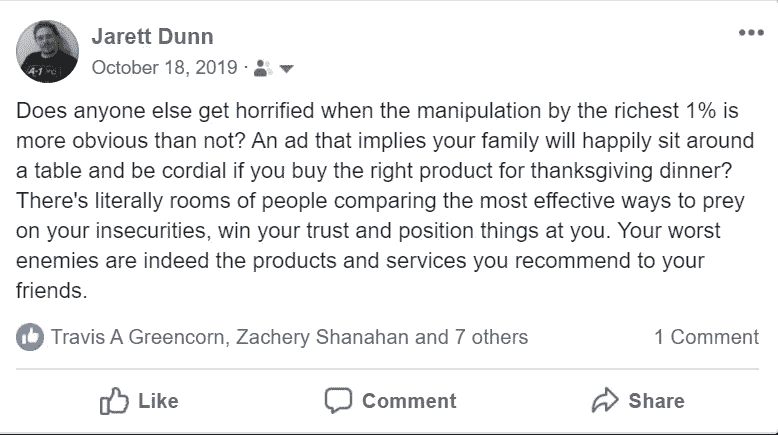
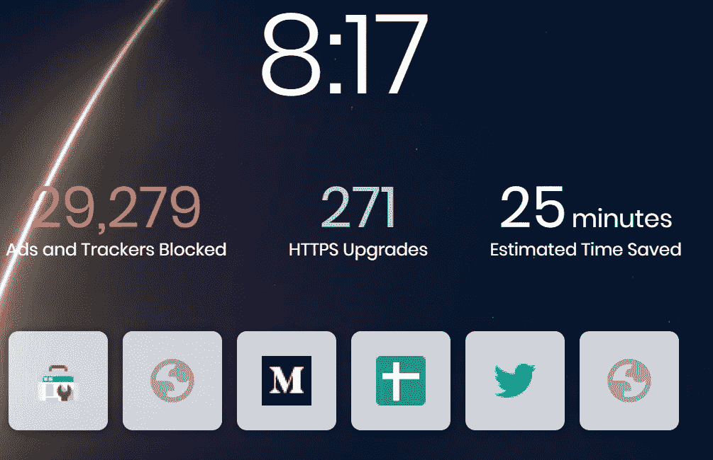
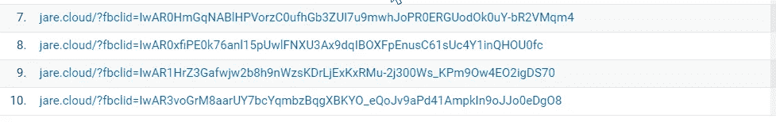

# 一个非技术性的介绍如何勇敢的浏览器保护你，你的数据和你的隐私！

> 原文：<https://medium.datadriveninvestor.com/a-non-technical-intro-to-how-brave-browser-protects-you-your-data-and-your-privacy-25ed17498b18?source=collection_archive---------15----------------------->

[在 jare.cloud](https://jare.cloud/2020/01/23/a-non-technical-intro-to-how-brave-browser-protects-you-your-data-and-your-privacy/) 上查看本帖原文！

准备好做出改变，成为一个更加隐私和安全的人在互联网的纠缠角落？[现在下载勇者浏览器](https://brave.com/jar444)！

当最富有的 1%的人的操纵比不操纵更明显时，其他人会感到震惊吗？一则广告暗示，如果你为感恩节晚餐购买了合适的产品，你的家人会愉快地围坐在餐桌旁，并感到亲切？实际上，有很多人在比较最有效的方法来利用你的不安全感，赢得你的信任，并把事情摆在你面前。你最大的敌人确实是你推荐给朋友的产品和服务。

你是勇敢者和蝙蝠生态系统的新手吗？你知道吗？用 Brave 浏览器代替其他浏览器，你可以每月赚 100 美元。[通过浏览不滥用你的隐私或个人身份信息的广告，了解勇敢能为你带来多少收益](https://jare.cloud/2020/01/21/the-insane-earning-potential-of-the-brave-browser-in-bat-and-how-to-turn-it-into-a-business/)！

除了明显的影响和操纵方法，重要的是要考虑互联网营销公司(如 GOOGL、FB)跟踪你、消费并可能出售你的数据的不太引人注目的方式。不仅要担心巨头，还要担心无数更小更专业的机构或政府实体，它们的目标各不相同——无论是目的还是手段。

 [## 艾预测:“颠覆，然后是生产力”|数据驱动的投资者

### 人们越来越担心，随着机器学习和互联网的普及，所有白领工作都将消失

www.datadriveninvestor.com](https://www.datadriveninvestor.com/2018/08/06/ai-forecast-disruption-then-productivity/) 

当你访问一个网站或移动应用程序时，他们通常会使用某种形式的 cookie 或其他互联网欺骗手段来跟踪你，直到你离开该网站。这些互联网追踪器将跟踪你的浏览历史和你的习惯，以评估针对你的新的和更好的广告方式——当有人试图向你出售某些东西时，增加他们的有效性，增加他们对广告商的整体投资回报。如果一些公司看到你浏览某些内容，他们会采用一种被称为“消费者再定位”的策略，在其他地方更频繁地向你展示他们的广告，比如在你的脸书新闻订阅上。他们发现你以前在某种程度上(可测量的…)是感兴趣的，现在获得或保持你的客户比一般互联网用户要便宜得多。

勇敢的浏览器自动阻止互联网上所有这些追踪器。现在，当你在桌面或手机上浏览时，大型营销和小型营销公司再也不能利用你的个人数据和习惯。更重要的是，这些行为者中更邪恶的人会积极地向最高出价者(以及所有其他出价者)出售或赠送你的信息，这意味着你会收到我们习惯于收到的垃圾邮件和其他营销电子邮件，这些邮件来自我们在向网站、平台或应用程序提供信息时从未订阅的人——例如，即使我们试图为世界做点好事或捐赠慈善事业。

更重要的是，默认情况下，勇敢的浏览器会屏蔽互联网上的所有第三方广告。我们都目睹过这种情况——当一个网站或平台向你展示一个来自网络营销策略的广告，而这个广告不是来自同一个原创方，当你点击这个广告时，它会将你重定向到网站之外。这里的“坏”不一定是广告本身——毕竟，金钱让世界运转——而是广告和点击追踪你的数据和个人身份信息的方式。例如，当你点击脸书(或推特，等等)的一个广告时，他们会对你的请求产生一个变量。这个变量将你标识为互联网上的个人点击者，这些社交巨头将进一步使用和滥用你和你的数据——更好、更有效地向你销售，胜率更高。

[阅读 Brave browser](https://jare.cloud/2020/01/15/better-web-brave-rewards-your-content-make-money-monetizing-twitter/) 的详细信息，以及他们如何将互联网的奖励生态系统重组为一个更好的网络——这是我的第一手体验！

总而言之，当营销技巧显而易见时，它们更容易被忽视或合理地接近。当这些策略处于潜意识和幕后时，它们更容易影响你和你身边的人。答案是提升你的浏览体验..现在！

想了解 tech 和《当疯子》的新文章？在这里订阅我的邮件列表:【http://eepurl.com/gIykNL 

*原载于 2020 年 1 月 24 日*[*https://jare . cloud*](https://jare.cloud/2020/01/23/a-non-technical-intro-to-how-brave-browser-protects-you-your-data-and-your-privacy/)*。*