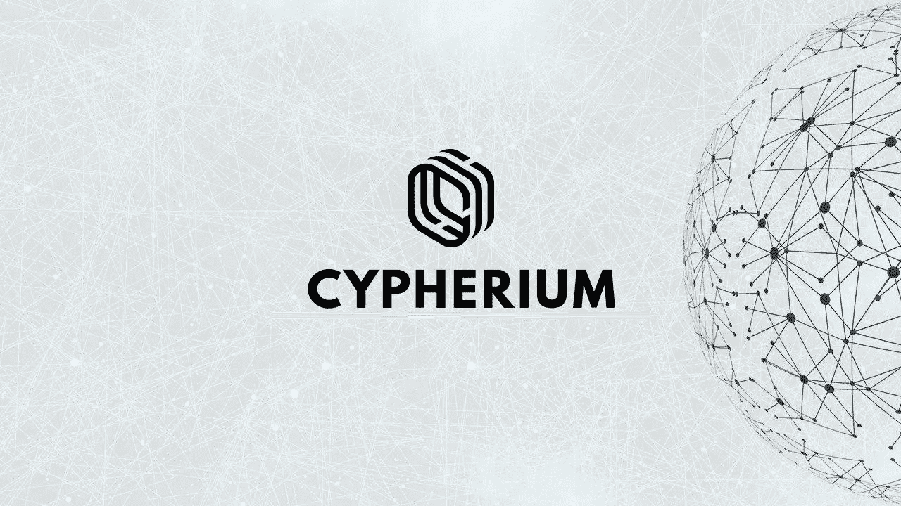
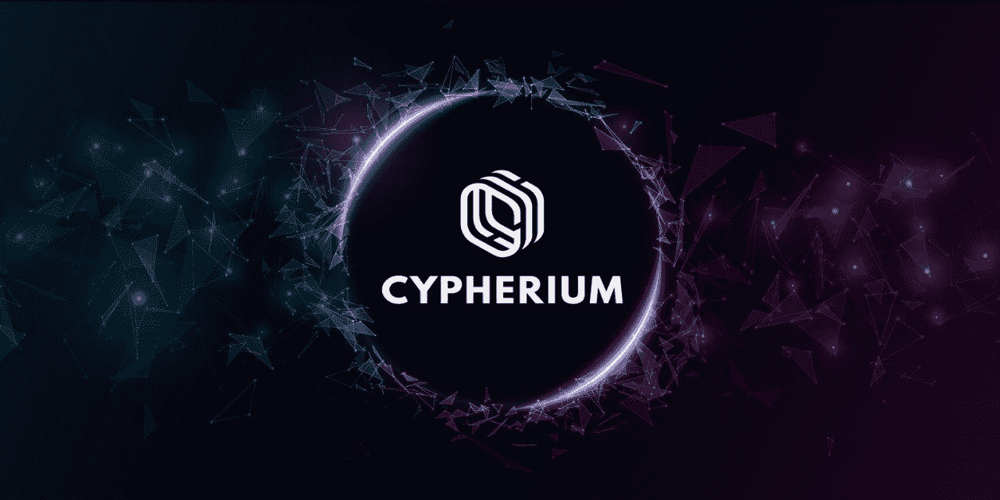
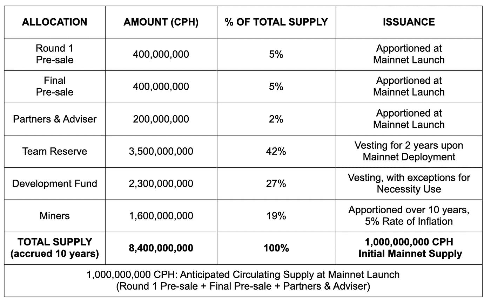
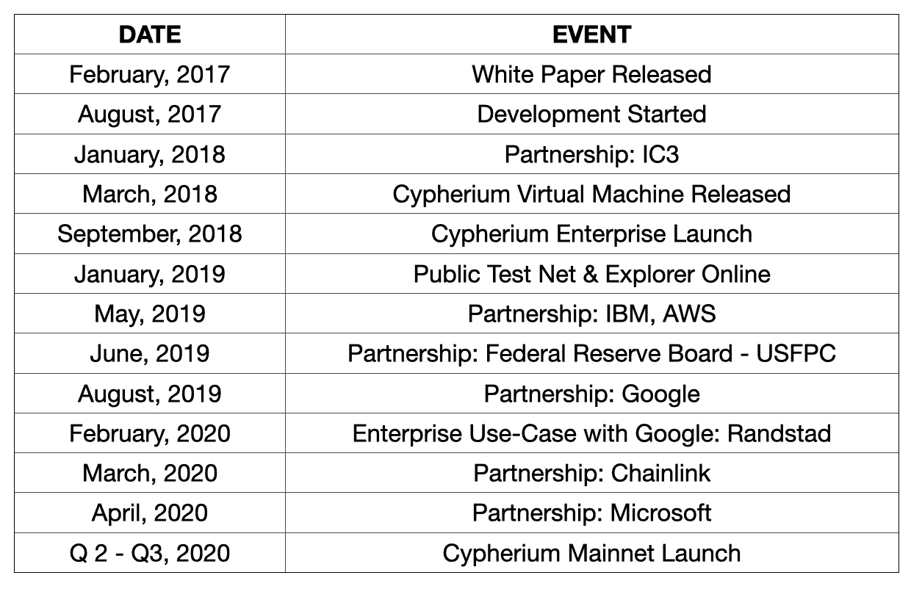

# Noobs 接管 cypherium . io——评论

> 原文：<https://medium.datadriveninvestor.com/a-noobs-take-on-cypherium-io-review-5040737ad75f?source=collection_archive---------3----------------------->

Cypherium 致力于解决区块链的可扩展性问题，他们确实有解决方案

尽管我们在过去几年中看到了区块链发展的良好进展，但企业采用是区块链目前缺乏的最重要的领域之一。在理解为什么企业采用还没有发生之前，让我们回顾一下过去几年中区块链的发展

首先出现的是老爷爷**比特币，**基于 PoW，被称为“**区块链 1.0** ”。接下来是以太网，它带来了革命性的**智能合约**(以透明、无冲突的方式交换任何有价值的东西)和 **dApps** ，设定了进化的下一个阶段**区块链 2.0，**开启了一系列新的市场并显著改变了格局。

**区块链 3.0** 有望消除之前区块链平台的所有缺点，即:

*   可扩展性问题
*   互用性
*   可持续性
*   管理
*   成本因素。

对于区块链来说，要实现企业范围的采用，第一步将是解决所有上述瓶颈，尤其是可伸缩性和成本因素

让我们首先了解真实世界的数字。在目前的情况下，比特币和以太坊无法与 Visa 和 PayPal 等竞争。PayPal 每秒处理约 200 笔交易，Visa 每秒处理 1667 笔交易，Etherium 每秒可以处理约 20 笔交易，而比特币每秒只能处理 7 笔交易。这只是表明我们与真实世界的数字相比有多慢。

**区块链 3.0** 预计将提供更好的功能，并为下一代项目开辟大量新机会。

这是预计 **Cypherium** 会产生影响的领域

# 柏树属

## 介绍

Cypherium 是一个企业级的区块链项目，其设计具有高度的可伸缩性和健壮性，利用了一种混合设计，该设计具有联合工作证明(PoW)和 HotStuff(也被脸书的 [Libra](https://www.forbes.com/sites/francescoppola/2019/06/30/the-real-threat-from-facebooks-libra-coin/) 采用)共识机制，据称可以在不牺牲去中心化的情况下实现每秒数千个事务。Cypherium 旨在实现可伸缩性、分散化和商业化。

关于 Cypherium 以及它在技术上有多先进，周围的其他项目已经写得够多了。与其继续进行更多的技术分析，我将先睹为快，看看这个项目以及它为企业市场提供的解决方案，这些解决方案帮助他们在短时间内建立了一些令人惊叹的合作关系。

Cypherium 在 2016 年开始了该项目的开发，为他们的项目设定了五个目标:

1.  为数十亿用户处理实时交易的即时分类账。
2.  智能合同平台，支持所有行业的企业用例。
3.  连接世界各地孤立数据岛的可信数据库。
4.  一个开放的网络，给予任何参与者或贡献者选举权。
5.  抵御日益增长的数据隐私威胁的安全保险库

好家伙，他们想出了解决上述所有目标的方法

为了解决可扩展性问题，Cypherium 采用了混合设计，该设计采用了联合工作验证(PoW)和 HotStuff(也被脸书的 Libra 采用)共识机制，帮助 Cypherium 在不牺牲分散性的情况下实现了每秒数千个事务。

使用混合共识的优点是它将共识与交易验证过程分开。这有助于减少交易验证的等待时间。从而减少网络请求的开销，加快事务处理速度。

为了运行智能合同，Cypherium 设计了 Cypherium 虚拟机(CVM)，这是一个隔离的安全环境，可以在其中执行写入 Cypherium 区块链的智能合同。

CVM 是使用基于注册的 *Dalvik VM 架构(*谷歌 android 操作系统采用的基于 Java 的虚拟机)设计的，未来将帮助 Cypherium 在基于 Android 的移动设备上执行智能合同。Cypherium 虚拟机也完全兼容以太坊虚拟机(EVM)，这意味着用 Solidity 编写的 DAPPs 也可以在 CVM 中执行。

# Cypherium 企业

Cypherium Enterprise 是由谷歌、亚马逊、微软和腾讯的前软件开发人员开发的高度可扩展和健壮的智能合同平台。

根据 Cypherium 团队的说法，Cypherium Enterprise 旨在提供比 Hyperledger 更快的交易速度。虽然 Hyperledger 每秒可以在 10 个节点上执行 100-200 次交易，但另一方面，Cypherium 在相同的设置下可以提供 2，000 TPS，这使得该产品最适合企业范围的适应。

Cypherium 已经通过[谷歌](https://cloud.google.com/)、[亚马逊](https://aws.amazon.com/)、[微软](https://azure.microsoft.com/en-us/)、 [IBM](https://www.ibm.com/cloud) 的栈平台，将 Cypherium Enterprise 作为区块链即服务提供给企业客户。

# Cypherium Token (CPH)和估价

CPH 是 Cypherium 区块链的原生公用令牌，在平台中发挥着不可或缺的作用(支付会员费、投票等)，并将被用作 Cypherium 生态系统内的交换媒介。

最初，CPH 被设计为与 BTC、瑞士联邦理工学院等类似的减半模型，然后被重新设计为基于通货膨胀的模型，最大发行量为 10 亿枚代币。

预计当代币在交易所上市时，其价值将在 1.5 亿至 2 亿美元之间。还需要注意的是，Cypherium 已经是 IC3 联盟的一部分，Chainlink 也是该联盟的一部分。从使用案例和合作关系来看，有很大的发展空间。

# 产品路线图和进展

该项目即将推出 Cypherium Mainnet。预计在接下来的几个月内。回顾 Cypherium [Github](https://github.com/cypherium/CypherTestBin) ，很高兴看到团队在 Github 中非常活跃，这对项目来说是一个非常积极的信号。

# 组

Cypherium 团队的一个显著特点是他们大多数来自顶级机构。所有团队成员都有丰富的区块链开发和设计经验。

## 尾注

毫无疑问，Cypherium 的设计考虑到了企业业务的复杂需求。已经有项目在研究类似的概念，如 EOS，Aelf，ONT，波尔卡等。他们中的一些已经处于路线图的更高级阶段，如推出 mainnet (EOS，ONT)和 Test Net(Aelf)，而 Cypherium 则姗姗来迟。但是 Cypherium 有一个优势，那就是 Cypherium 企业

虽然 Cypherium Enterprise 相当新，但它通过[谷歌](https://cloud.google.com/)、[亚马逊](https://aws.amazon.com/)、[微软](https://azure.microsoft.com/en-us/)和 [IBM](https://www.ibm.com/cloud) 的堆栈平台为企业客户提供区块链即服务，这使 Cypherium 比其他区块链企业拥有巨大优势。

除此之外，Cypherium 还与世界级的区块链技术研究和学术联盟 IC3(加密货币和合同倡议)密切合作，以推进区块链技术即服务的集成。

如果你想了解更多关于这个项目的信息，请访问

主页:[https://cypherium.io/](https://cypherium.io/)

中等:[https://medium.com/@cypherium/](https://medium.com/@cypherium/)

卡卡奥:[https://open.kakao.com/o/ghgVo4Ob](https://open.kakao.com/o/ghgVo4Ob)

电报:[https://t.me/cypherium_supergroup](https://t.me/cypherium_supergroup)

亚洲电讯:[https://t.me/cypherium_asia](https://t.me/cypherium_asia)

推特:https://twitter.com/CypheriumChain

Reddit:https://www.reddit.com/r/Cypherium/

Github:[https://github.com/cypherium/CypherTestBin](https://github.com/cypherium/CypherTestBin)