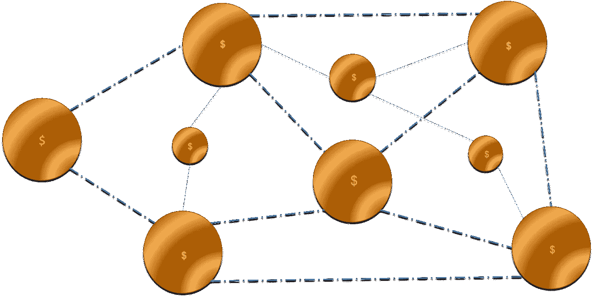

# 应对新型冠状病毒的新型经济体系？数据驱动的投资者

> 原文：<https://medium.datadriveninvestor.com/a-novel-economic-system-to-respond-to-the-novel-coronavirus-data-driven-investor-597d55174dae?source=collection_archive---------20----------------------->

Smart Money

经济学不受自然法则或物质世界的支配，而是受人类为组织生活而创造的规则支配。它是一个不受基础现实直接约束的涌现系统。因此，虽然农民的生产力受到自然的限制，也受到他按照自己的意愿驯服自然世界的能力的限制，但我们社会中的当代经济体系在很大程度上是由人类的情感和激励以及我们将它们与某种商定的社会目标相结合的能力所驱动的。

# 经济学——一个涌现的系统

致力于开发 Covid19 疫苗的科学家正在修补自然强加的限制，并试图弯曲它以满足人类的需求。那些科学家在基础现实的水平上工作。经济学家不是。经济系统与基础物理约束相差几度，因此可以相对容易地受到人类的显著影响和操纵，这与自然界的物理规律不同。因此，我们可以通过拓展思维，创造性地设计形势所需的经济体系，而不是将旧模式视为不言自明的真理，来释放巨大的价值。

 [## 如果资本主义失败了，那么还有什么选择呢？数据驱动的投资者

### 在当前政治领域的修辞之旅中，我们都可以面对面地接触到流行词汇，如…

www.datadriveninvestor.com](https://www.datadriveninvestor.com/2020/03/16/if-capitalism-is-a-failure-then-what-is-the-alternative/) 

通过假设与过去相似的路径和轨迹来为这次疫情的结果做准备，未必是最佳策略。疫情传播模型是非常有用的，直到我们开始约束自己，接受它们为预言的真理。对于我们的经济来说更是如此，因为情绪在塑造它们的过程中扮演着如此不相称的角色。在考虑当前问题时，我们不需要像过去那样假设类似的必要条件和结果。我们今天有几个新的手段可以用来影响当今的疫情。例如，到目前为止，互联网已经成为一个重要的工具，它可以共享信息，保持工作岗位，允许人际互动，并在适当的地方收集和传播关于传染病的数据。当前的封锁为重新设计系统和创造一种新的经济组织形式提供了重大机遇。无论是为资产定价以匹配它们对人类的真正价值，还是重组我们的城市空间，或者反思我们的金融体系，我们都有机会进行真正有意义的变革。

现有的市场定价模型可以解决这些问题。例如，我们远距离工作的能力会如何影响商业房地产的估价和我们城市空间的设计？然而，在经济方面还有更深层次的问题，比如货币本身的性质，这可能会受益于利用迄今尚不可用的技术进行的积极干预。我们可以利用新技术产生有意义的影响，其中一个例子就是基于[分类账](https://www.datadriveninvestor.com/glossary/ledger/)的货币创新，这种货币可以以电的速度流动，并被赋予比价值储存和[交易单位](https://www.datadriveninvestor.com/glossary/exchange/)更多的维度。在这种情况下，人类对应用于[密码术的数学法则的成功修补已经产生了一种创新的记账和转移价值的新系统，这种系统是可追踪的、透明的和](https://www.datadriveninvestor.com/glossary/cryptography/)[不可改变的](https://www.datadriveninvestor.com/glossary/immutable/)。在探索如何部署这样一个系统以实现更好的资金流动和更有针对性地有效利用其价值方面，投入更多的精力可能是有益的。

# 在疫情时期，基于账本的数字货币会是一个有用的工具吗？

在英国和其他地方，凯恩斯主义者在当前的疫情危机期间支持经济的措施已经开始实施。在英国，财政大臣创建了休假计划，从国库中支付每月高达 2500 英镑的工资(高达工资的 80%)。保持就业率并确保人们有钱消费是这些措施背后的动机。如此大规模的资金外流可能会导致印更多的钱，导致通货膨胀，或者导致更高的税收，或者两者兼而有之。如果没有适当的控制，这种行动可能会给人口的不同部分带来不对称的负担或货币措施的意外后果。除了追踪病毒的传播，还需要追踪资金在经济中的流动。

一种基于分类账的货币可以分批发行，并通过分类账上的交易地址序列进行追踪，这有助于提高问责性和透明度。此外，将[智能合约](https://www.datadriveninvestor.com/glossary/smart-contracts/)附加到货币部分的能力可以帮助定义最终用途或创建特定用途的货币令牌。将智能合约附加到货币上所创造的可能性可能是有意义的，因为它们为货币增加了更多维度。这种结构几乎直接反对最初的[区块链](https://www.datadriveninvestor.com/glossary/blockchain/)架构的假设用例，即[比特币](https://www.datadriveninvestor.com/glossary/bitcoin/)，它是根据自由主义原则设计的(去中心化，不受政府控制的交易媒介)。区块链或基于账本的数字合同架构也可能是政府财政部本身的有用工具。这可能有助于在封闭经济中开辟一条道路。基于[令牌](https://www.datadriveninvestor.com/glossary/token/)的货币为数字交易增加了一个不同的方面，因为您可以对通过智能合约发行的特定货币份额应用进一步的功能和约束。例如，食物代币就是一个特定用途驱动的数字代币的例子。

# 智能货币？

这种政府发行的基于分类账的货币仍然是集中的货币，而不是像比特币那样的分布式分类账货币。当这些戏剧性的措施可以开始放松时，纳税人可以将他们的税款或英镑用于特定的最终目的和项目，以实现经济的再平衡。表面上看起来是把控制权交给了政府，但实际上它也把控制权交还给了纳税人，以确保他们缴纳的税款用在了承诺的地方。考虑到这种架构为经济系统提供的灵活性和透明度，向数字货币和令牌化的智能经济的转变可能有助于提高政府的效率。

受区块链启发的数字账本只是政策制定者和经济学家可以用来帮助我们摆脱杂草的众多发明之一。与科学家面临的通过在实验室中对抗自然来寻找治疗方法和疫苗的更艰巨挑战相比，以开放和创造性的方式加速增长和重新确定社会价值是一个容易解决的问题。

然而，很能说明问题的是，到目前为止，我们似乎更有希望成功地驾驭自然，而不是更好地组织自己。

*原载于 2020 年 5 月 27 日***。**