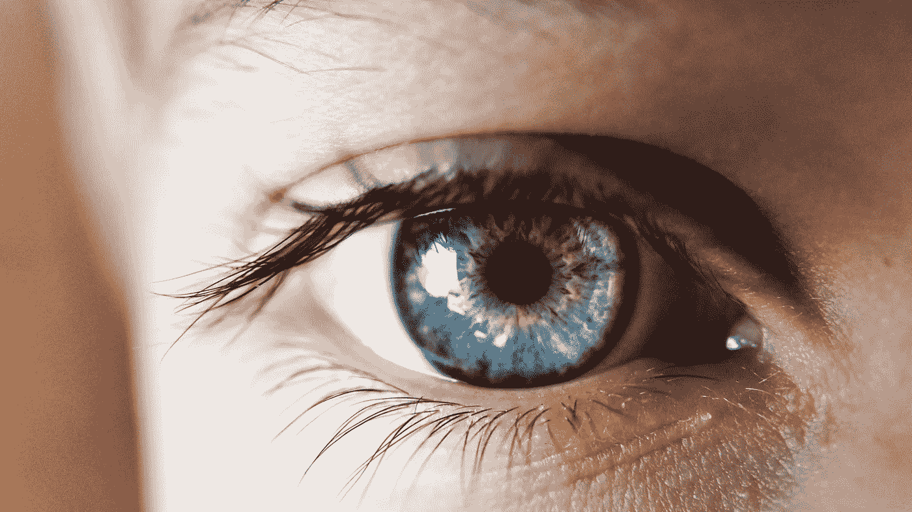

# 疫情风格的生活方式:病毒和梅先生如何改变我们的生活

> 原文：<https://medium.datadriveninvestor.com/a-pandemic-inspired-lifestyle-how-a-virus-and-mr-may-change-our-lives-4c86e4b0d4e4?source=collection_archive---------24----------------------->

Photo by [Lucrezia Carnelos](https://unsplash.com/@ciabattespugnose?utm_source=unsplash&utm_medium=referral&utm_content=creditCopyText) on [Unsplash](https://unsplash.com/s/photos/augmented-reality?utm_source=unsplash&utm_medium=referral&utm_content=creditCopyText)

文学和电影不是娱乐；它们是对我们未来未知生活经历的预测。无论是计算机智能、假死还是自动驾驶汽车，作家们都利用研究来推进他们的媒介。

今天，这种变化很大程度上是由一种致命病毒 COVID19 的力量推动的，就像之前的瘟疫一样，它改变了我们所知道的生活。我们已经看到了“未来”的某些方面，但没有人对此有深入的了解。

想想 1990 年的电影《[全面回忆》](https://en.wikipedia.org/wiki/Total_Recall_(1990_film))，真实的东西在一个人的头脑中被创造成“真实的”精神操控至关重要。在这样一个世界里，度假的概念是一个人的愿望和经济的虚构。想体验和你现在不一样的生活？

提供你的指纹，你手上的植入芯片，或者你的视网膜扫描，它就是你的了。没有必要离开你现在的位置。不用打包，不用匆忙赶交通工具，也不用担心你的行程。这都是由人工智能程序或植入物或药物完美规划的。你会坐下来，随时享受它。

他们可以为你的午餐时间安排假期，把它们压缩到那个时间段，而不损失娱乐。你永远不会错过你想去的某个地方或某个地方，或是一生中的某项活动。

一个重新想象的世界

主要城市的物质世界必须改变。毫无疑问，这是因为技术为远距离协作提供了大量新的机会。

[Zoom](https://www.lifewire.com/what-is-zoom-and-how-does-it-work-4800476) 打开了一扇可能性之窗。现在，该平台提供了更少的旅行，更少的租赁或购买任何业务空间的需求，甚至是医疗保健业务，而且成本更低。

竞争已经在紧咬 Zoom 的脖子，并打造替代方式来改变企业的商业模式。在计算机平台领域表现不俗的谷歌已经升级了它的 [Google Meet](https://www.theverge.com/2020/4/16/21223778/google-meet-gallery-view-calls-gmail-javier-soltero) 程序，该程序位于其邮件程序中。当人们可以在自己的家庭办公室、后院或厨房处理大部分业务时，为什么会有人想要离开自己的家或家人呢？

Copyright: [Andriy Popov](https://www.123rf.com/profile_andreypopov)

甚至连时尚产业也看到了这将如何影响他们。在旅行限制期间，媒体利用它和其他形式的“ [Facetime](https://www.lifewire.com/what-is-facetime-2000237) ”视频连接。穿夹克打领带的记者可以泰然自若地穿牛仔裤或短裤。

另外，不需要电脑。视频会议只需要手机连接。如果说[索尼 Handycam](https://en.wikipedia.org/wiki/Handycam) 改变了战时的新闻业，那么手机同样提升了日常生活的整个领域。

脸书起步较晚，但他们现在通过 Facebook Messenger 提供多达 50 人的视频会议。威瑞森收购了蓝战士，用于商业“聊天”思科强调会议的安全性，推出了 Webex。

Zoom 不怕捶胸顿足，展示了他们现在拥有多达 3 亿的每日参与者。因为其他非商业团体也将利用这项技术，所以我们可能认为它并不都是商业。

房地产市场

随着电话会议成为全球商业的重要组成部分，房地产市场是创新的最佳时机。疫情强调了限制病毒传播的新的特殊要求，Zoom 及其竞争对手已经突破了商业地产的原有计划。

建筑师、社会心理学家和城市规划委员会重新设计的拥挤不堪的办公大楼似乎过时了。现在，绿色空间不必局限于办公室顶层公寓或屋顶。在没有柏油路的城市街道上，可以再次看到树和草。虚拟景观也可以根据一个人的突发奇想来创造。

交通枢纽也是如此，市中心的公共汽车和公交系统再也不能像往日一样拥挤不堪。装有小配件的自行车会成为城市生活的交通工具吗？

忘了摩天大楼，娱乐场所呢？社交距离现在要求世界各地的[迪斯尼公园](https://www.orlandosentinel.com/coronavirus/os-ne-coronavirus-tourism-whats-next-20200426-evv6ahxxwjgyvnof6zyxhu2lfe-story.html)有新的设计理念，就像餐馆和剧院一样。

带有新技术设备的[免下车电影](https://en.wikipedia.org/wiki/Drive-in_theater)会回来对抗落后的电影票房吗？像[商场](https://www.theatlantic.com/video/index/602371/dead-malls/)这样的零售空间在疫情之前的 2017 年就已经消亡了。他们将如何被重新想象？

Photo by [Kalea Jerielle](https://unsplash.com/@kaleajerielle?utm_source=unsplash&utm_medium=referral&utm_content=creditCopyText) on [Unsplash](https://unsplash.com/s/photos/mixed-reality-contact-lenses?utm_source=unsplash&utm_medium=referral&utm_content=creditCopyText)

走进先生的世界

在我们面对的这个无法想象的未知世界中，人工智能可能会成为一种救赎。然而，新发现的自由感也可能被证明是一个无形的锚。

著名的社会心理学家埃里希·弗洛姆(Erich Fromm)在 20 世纪 40 年代写了《逃离自由》(Escape From Freedom)弗洛姆认为，当我们试图做出决定时，选择会带来压力。较少的选择比无数的选择更容易处理吗？有可能。

正如弗洛姆在他的经典著作中所写的，“我们的目的……(是)表明现代社会的结构同时以两种方式影响着人:他变得更加独立、自立和挑剔，他变得更加孤立、孤独和恐惧”

为了这种新的自由，我们放弃了什么？我们的心理健康能处理这种孤立吗，或者我们需要他人的身体存在吗？对学校儿童的研究表明，身体对于学习和个性发展至关重要。

有趣的是，从某种前瞻性的角度来看，弗洛姆认为“*大多数精神病学家把他们自己社会的结构看得如此理所当然，以至于对他们来说，不太适应的人承担了不太有价值的耻辱*。

他指的是哪个“社会”，在我们的新常态下，谁来决定这个“不值钱”？这些“不太有价值”的人会得到和更有价值的人一样的自由吗？这是否意味着他们在就业、医疗和人权方面将受到限制？AI 和 MR 会起到作用吗？

自由似乎是一个流动的概念，并建立在创造规范的基础上。新规则可能不那么灵活，而且在寻求稳定的过程中，可能会变得前所未有的僵硬和分层。先生可能被用在邪恶的方式来平息不太有价值的人的不满。在这里，它会是一种精神监狱吗？

我们可以用算法重新设计我们的内心世界。一种新颖的隐形眼镜概念已经开始筹划，在这种隐形眼镜中，你的或者其他人的节目都可以随意播放。

我们离行为的控制还有多远，如果不是身体上的，而是精神上的，就像“[拆迁人](https://www.youtube.com/watch?time_continue=2&v=0B5v6QZ5R3g&feature=emb_logo)”中所示在描述先进技术如何“监禁”违法者方面，这些节目非常极端，也可以用来提高人们对生活的看法。没有人的允许，算法就变成了生命。我几乎可以看到与“[斯戴福的妻子们](https://en.wikipedia.org/wiki/The_Stepford_Wives_(1975_film))”的关系，但没有“女性机器人”

毕业演讲总是强调离校将如何决定未来，但我们不得不怀疑在这个新的池塘里，他们将如何沉浮。