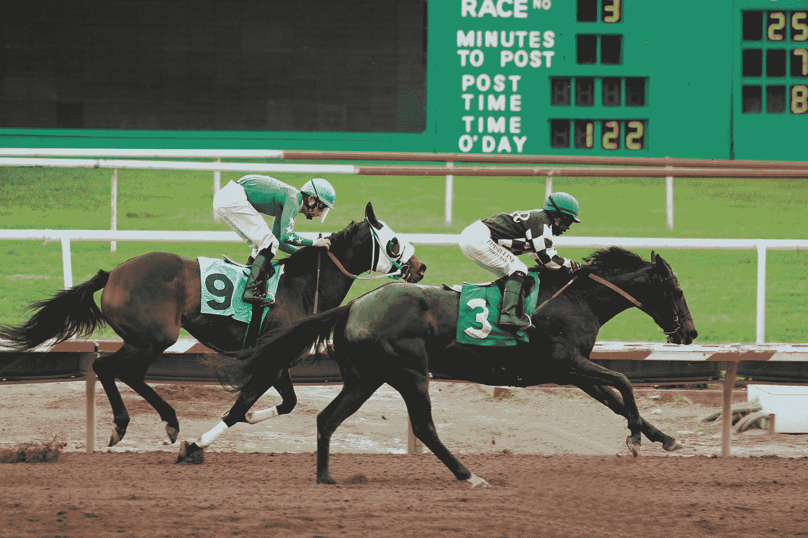
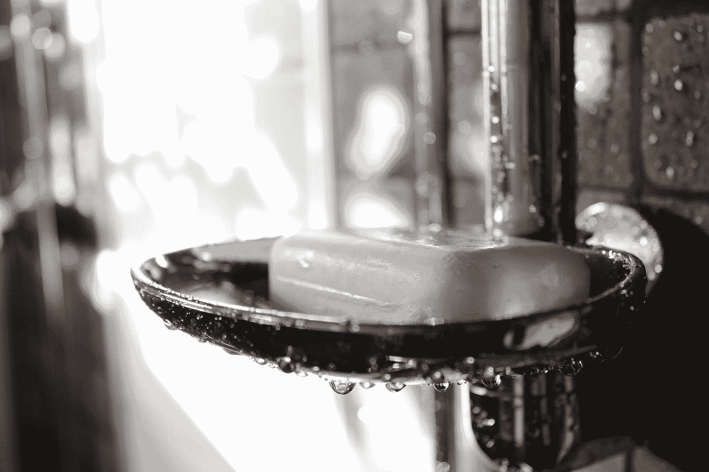
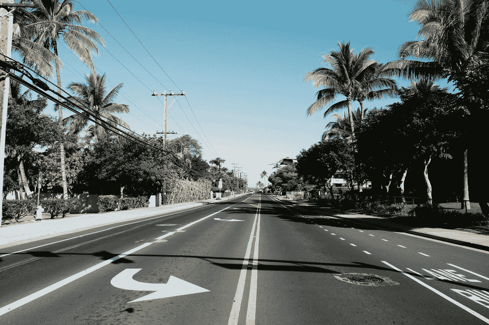
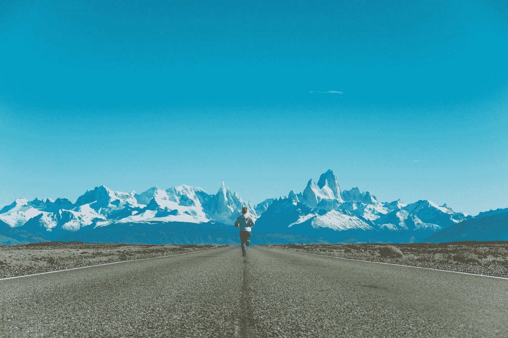

# 疫情期间的生产率

> 原文：<https://medium.datadriveninvestor.com/a-pandemic-proof-productivity-guide-75c16ed594f9?source=collection_archive---------14----------------------->

## 生产力 101

## +8 提高生产力的策略

Photo by [krisna iv](https://unsplash.com/@finesite?utm_source=medium&utm_medium=referral) on [Unsplash](https://unsplash.com?utm_source=medium&utm_medium=referral)

在 2021 年，这个世界似乎不仅属于那些最有创造力的人，也属于那些最有*生产力的人。*

众所周知，在疫情之前，能够最大限度地提高家庭和工作效率是检查日历上所有事情的唯一方法，这反过来又有助于睡个好觉。

日复一日，高效就是方法。

[Courtesy: Disney+](https://www.disneyplus.com/en-ca/welcome/sign-up?cid=DSS-Search-Google-71700000059780232-&s_kwcid=AL!8468!3!395918840793!e!!g!!disney%2B&gclid=CjwKCAjwv4_1BRAhEiwAtMDLsp0qA5Q53Zg1XJBZH4G2At-62qAhUXMVLB22Lg8DE92G1sN3JCzjXBoClkQQAvD_BwE&gclsrc=aw.ds)

现在插入一个全局疫情。

插入孩子们整天在房子里跑来跑去，希望在缩放会议举行时引起注意。

插入完全关闭公共课外活动，定期睡眠模式和上传混乱，凌乱，频繁中断的工作时间。

插入市场的损失，创造了自 2008 年以来从未有过的“睁一只眼睡觉”的恐惧水平。

*生产力列车现在看起来怎么样？*

像所有人一样，适应疫情的生活和工作并不容易。怎么可能，我们从来没有经历过这样的事情。

 [## 释放结果的简单哲学|数据驱动的投资者

### 这是我们播客中帕迪·布鲁斯南的一段话。帕迪是一个正念和冥想老师，一个…

www.datadriveninvestor.com](https://www.datadriveninvestor.com/2020/03/16/a-simple-philosophy-to-unlock-results/) 

为了打开在可预见的未来生产力会是什么样子的窗口，这里有 8 个在疫情期间提高生产力水平的策略。

# 创造新的规范

Photo by [Jesse Sewell](https://unsplash.com/@jessesewell?utm_source=medium&utm_medium=referral) on [Unsplash](https://unsplash.com?utm_source=medium&utm_medium=referral)

由于疫情停止了大部分常规工作，现在是重新思考新标准和新生产力水平的好时机。

在远程环境中，新的工作流程正在形成。

新政策正在制定中。

PJ 的会议一直很热闹。

随着这些不断变化的条件而来的是新的机遇。

在努力提高这些新规范的生产力水平的过程中，我们需要更有创造性地思考，跳出框框。可以建立哪些新的套路？有哪些老套路需要去除？在孩子们醒来之前能做些什么？睡觉前？我的团队什么时候最需要我？对我的家庭和工作来说，什么时候我处于最佳状态？

为了在疫情期间提高生产力水平，这些都是值得深思的大问题。

找出差距。

弥补差距。

创造新的标准。

# 生活在攻势中

Photo by [Sheri Hooley](https://unsplash.com/@sherihoo?utm_source=medium&utm_medium=referral) on [Unsplash](https://unsplash.com?utm_source=medium&utm_medium=referral)

疫情遭遇熊市的那天，你在哪里？

政府宣布救助小企业的那天，你在做什么？

*按下贪睡按钮的频率有多高？*

每天，尤其是在不确定性和波动性增加的时期，保持攻势比以往任何时候都更重要。

每天早起不仅要研究 ***正在发生的事情*** ，还要研究***事情是如何发生的*** 是保持敏捷和适应性的关键。在动物王国，大多数鲸鱼很少睡超过 10 分钟，否则它们很容易淹死。是的，淹死。对他们来说，他们休息。长时间的睡眠是不可能的，因为这会让他们完全脱离生活的游戏。

做一条鲸鱼——休息以保持敏锐，同时保持警惕以避免溺水。

# 午睡吧

Photo by [Kalegin Michail](https://unsplash.com/@kalegin?utm_source=medium&utm_medium=referral) on [Unsplash](https://unsplash.com?utm_source=medium&utm_medium=referral)

没有什么比午后小睡更好的了。午睡能让你精力充沛。

根据我们的精力工作，而不一定是传统的朝九晚五，这在心理需求和宏观关注水平空前高涨的时候至关重要。

重要的是要记住，从 ***时间管理转移到*** 精力管理可以充分提高生产力水平。

午睡可以让事情变得更清晰、更专注、更有效率，尤其是在家里长时间工作的时候。与其在下午喝第三杯咖啡或吃含糖的零食，不如给你的身体它真正想要的东西——精神上的休息。

# 设定清晰的 WFH 边界

Photo by [Mimi Thian](https://unsplash.com/@mimithian?utm_source=medium&utm_medium=referral) on [Unsplash](https://unsplash.com?utm_source=medium&utm_medium=referral)

100 美元创业作者克里斯·吉列博(Chris Guillebeau)在苹果播客中有一个关于这个的精彩片段。

 [## Side Hustle 学校:#1196 -问答:在家工作的技巧？？在苹果播客上

### 当我们都在适应一种新的生活方式时，我一直在思考一个问题:有什么工作的小窍门……

podcasts.apple.com](https://podcasts.apple.com/ca/podcast/side-hustle-school/id1188487073?i=1000471063328) 

创建一个 ***生产力计划表*** 结合远程工作新规范中的所有需求是关键。进入一个有清晰界限的节奏需要一些实验和测试。

把它当成一个科学项目。

只有我们知道自己的想法、感受和焦虑，也只有我们知道什么时候工作状态最好。一旦科学实验有了可靠的结果，每天重复这些条件。

要获得更多提高工作效率的远程工作技巧，请查阅这本由 Jason Fried 所著的难以置信的书:

 [## 远程:不需要办公室

### 在 Amazon.com 的三个商业领域中排名第一。作为雇主，把你的招聘限制在一个小的地理区域…

basecamp.com](https://basecamp.com/books/remote) 

# 洗更长时间的澡

Photo by [Anne Nygård](https://unsplash.com/@polarmermaid?utm_source=medium&utm_medium=referral) on [Unsplash](https://unsplash.com?utm_source=medium&utm_medium=referral)

一些最好的想法可能发生在淋浴的时候。这就是为什么在毛巾伸手可及的地方放一本日记或记事本是很重要的。

 [## 为什么我们在淋浴时有最好的想法:创造力的科学

### “我不是一个真正有创造力的人”，这句话总是让我觉得很奇怪。难道真的是我们中的一些人生来就…

open.buffer.com](https://open.buffer.com/shower-thoughts-science-of-creativity/) 

花时间与虚拟的一切断开连接，让自己置身于一个唯一重要的事情是热水打在脸上的空间，这可能是疫情之前最被忽视的奢侈品之一。

当这一切都说了，做了，也许一个积极的行为变化是社会渴望洗更长时间的澡。

生命太短暂了，不能匆忙去洗澡。

# 少开车

Photo by [Marifer](https://unsplash.com/@ferlop101?utm_source=medium&utm_medium=referral) on [Unsplash](https://unsplash.com?utm_source=medium&utm_medium=referral)

有人怀念疫情之前的交通吗？交通可能是现代最大的生产力吸。

在疫情之前，一周花 8 小时*坐在车流中是很正常的。对许多人来说，我确信这是相似的。*

*对我来说，将这些坐在车流中的时间转换成在[媒介](https://medium.com/u/504c7870fdb6?source=post_page-----75c16ed594f9--------------------------------)上写作的时间是一种纯粹的快乐。*

*这让我很好奇，我们还能利用一周中额外的非交通时段做些什么来提高工作效率呢？*

# *移动更多*

**

*Photo by [Andrea Leopardi](https://unsplash.com/@whatyouhide?utm_source=medium&utm_medium=referral) on [Unsplash](https://unsplash.com?utm_source=medium&utm_medium=referral)*

*运动可以成为生产力的最大源泉 ***。****

*就像淋浴一样，每天适度到剧烈的体育活动可以提高工作效率。安排时间不仅有助于时间/精力管理，还能激发更高层次的思考，促进更多的集中注意力。*

*如果你是一个早起的人，这里有一篇文章是关于如何建立一个以运动为焦点的日常生活，以提高你一天的工作效率。*

* [## 为什么你应该制定一个日常计划(PDR)

### 改变你的早晨方法——改变你的结果

medium.co](https://medium.com/swlh/why-you-should-develop-a-pre-day-routine-pdr-517a5db49a6) 

# 带它出去(如果可能的话)

Photo by [Nitin Mathew](https://unsplash.com/@nitin_mathew?utm_source=medium&utm_medium=referral) on [Unsplash](https://unsplash.com?utm_source=medium&utm_medium=referral)

这可能不是每个人都能做到的，但是如果可以做到的话，每天都去做。在大自然中散步(*尤其是现在独自一人*)可以 ***清理头脑，打开心灵，给感恩流动的空间。一些最好的商业策略和创业想法来自于在大自然中行走。***

在前疫情世界的混乱中，人类和自然之间有某种联系开始消失。

现在比以往任何时候都更重要的是重新点燃与户外的自然联系。离开电脑走到户外会提高工作效率，让思维更加清晰，注意力更加集中。

不要只相信我的话，看看作者格雷琴·鲁宾的这篇令人深思的文章。→

 [## 新冠肺炎危机期间大自然不可思议的美丽

### 这些天，我发现自己很惊讶，大自然并没有反映我的情绪状态。一方面，世界处于…

gretchenrubin.com](https://gretchenrubin.com/2020/04/uncanny-beauty-nature-covid-19/?utm_content=buffer71dab&utm_medium=social&utm_source=twitter.com&utm_campaign=buffer)  [## 如何在远程工作环境中茁壮成长

### 如何在远程工作环境中茁壮成长电子书:法赫、瑞安、费思、乔伊:亚马逊

www .亚马逊. ca](https://www.amazon.ca/dp/B091MSMR2D/ref=sr_1_1?dchild=1&keywords=how+to+thrive+in+remote+working+environment&qid=1617484066&sr=8-1)*