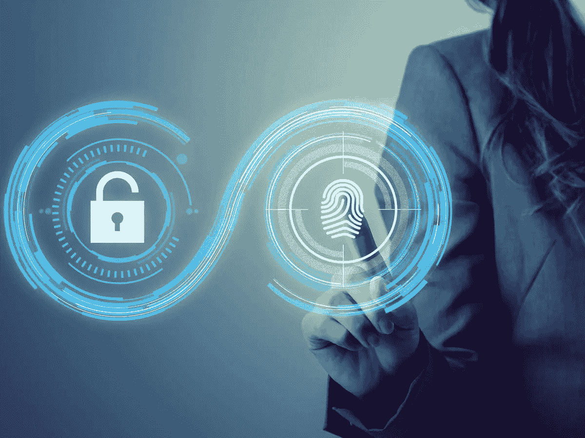
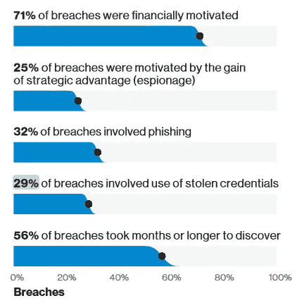
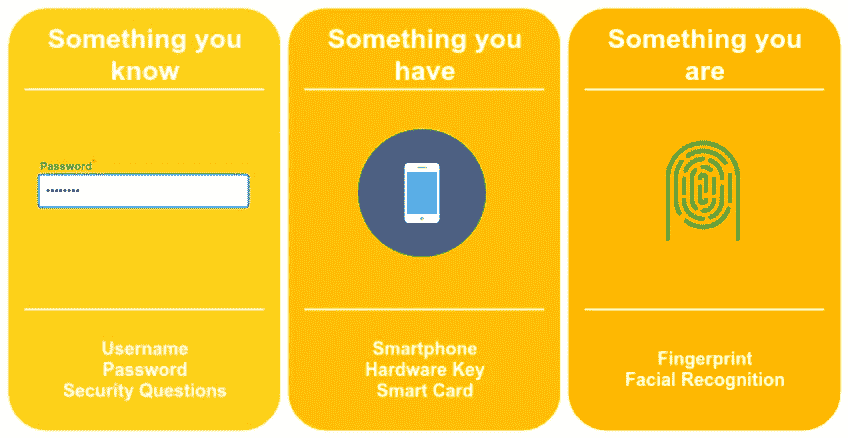
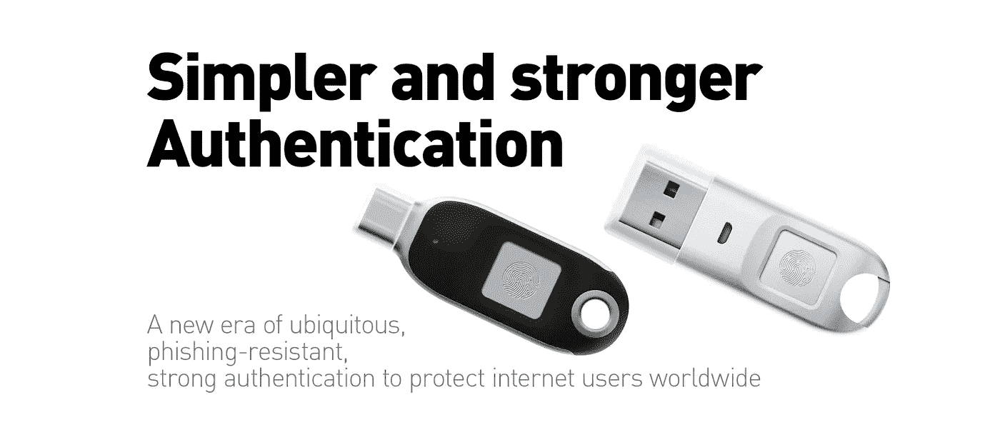
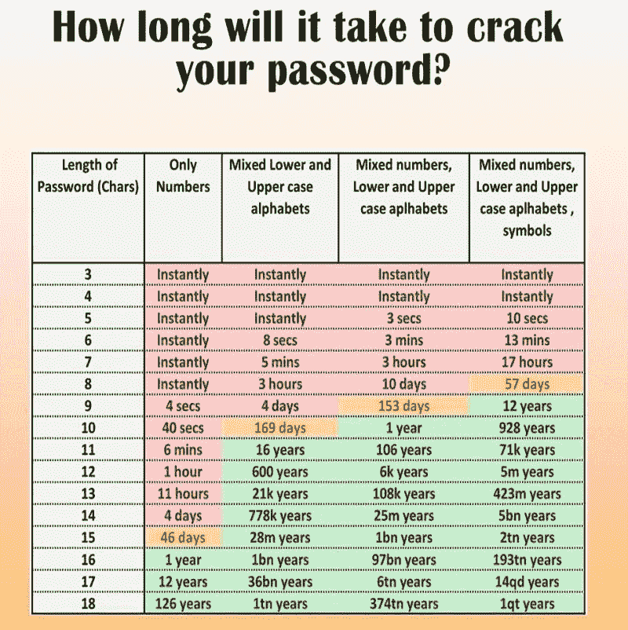

# 无密码的未来

> 原文：<https://medium.datadriveninvestor.com/a-password-less-future-c185f886af04?source=collection_archive---------6----------------------->

联盟和技术的简明报道使我们更接近一个没有密码的世界。

## 主题

*   密码问题
*   公司成本
*   认证的类型
*   多步认证
*   多因素认证
*   生物计量学进展
*   FIDO 联盟
*   WebAthn 协议

# 密码问题

尽管它们保护我们的资产免受恶意用户的侵害，但密码系统几乎没有根本问题。

## 太多要记住的了

实际上，我们访问的每个设备或网络帐户都需要我们借助密码来验证自己。在一天结束的时候，我们留下了太多要记住的东西。

> 最近的一项研究表明，一个普通的 IT 人员在任何给定的时间点都必须记住 20 到 40 个密码。

## 危险人物

为了避免记住这么多密码，许多用户开始在多个地方反复使用相同的密码。一次密码泄露就会暴露他们所有的数字资产。

 [## 人们对隐私的不理解是什么？数据驱动的投资者

### 你知道那种感觉。无论是访问应用程序、订阅还是你最喜欢的运动鞋。你按下…

www.datadriveninvestor.com](https://www.datadriveninvestor.com/2019/04/11/privacy-and-convenience/) 

或者，他们把自己的密码写在手机、电脑或笔记本的某个地方，很可能是在一个地方。如果有人得到了一张纸或一个数字文件，用户的资产就又公开了。

## 黑客的天堂

所有互联网账户密码都存储在中央服务器上。这吸引了所有知名黑客试图破解它。

可悲的是，其中一些人确实成功了，当这种情况发生时，你的密码会被卖给像 [dehashed](http://www.dehashed.com) 这样的网站，在那里有人可以以低至 5 到 10 美元的价格购买。

> 是的，你被黑的密码在网上以几乎一分钱的价格出售。

## 短密码不安全

听听爱德华·斯诺登对约翰·奥利弗密码的看法。

# 公司成本

出于几个原因，密码对公司来说是一个巨大的负担。

## 数据泄露的主要来源

绝大多数公司的数据泄露都是由密码引起的。*事实证明，密码被盗是数据泄露最简单也是最常见的原因之一*。

据[报道](https://www.cs.columbia.edu/~smb/classes/f19/Files/(3)_2019_Verizon_DBIR.pdf)，高达 **29%** 的数据泄露是由密码被盗引起的。一项独立的研究显示，在美国，每个被盗密码给公司带来的平均成本高达 800 万美元。

## 处理与密码相关的问题

与密码相关的问题确实需要关注、时间和人力。在大型组织中，成本会大幅增加。IT 管理团队被迫花费一定比例的工时来解决与忘记密码和其他登录问题相关的查询。

# 认证的类型

有三种主要的认证类型。

1.  **您知道的一些东西:**如密码、pin 或安全问题等
2.  **你拥有的东西**:手机、借记卡、u 盘等
3.  **你是什么**:指纹、人脸识别、视网膜等

# 多步认证

在多步身份验证中，涉及多个(两个或更多)步骤。然而，这些步骤使用了与**相同类型的认证**。

例如，使用两个步骤，其中您提供两个不同的密码来获得对设备的身份验证，或者使用两种生物特征形式的身份验证，例如视网膜扫描和指纹来获得对系统的身份验证。

# 多因素认证

多因素身份认证(MFA)是指使用多种形式的身份认证，如密码和视网膜扫描。

有 ***两个不同的因素*** 用于认证。如果黑客窃取了您的密码，仍然需要完全不同形式的身份验证(视网膜扫描)来获得访问权限。

***双因素*** 认证是世界范围内最广泛采用的认证方式。

我们一直都在这么做，就像从 ATM 机取钱一样，我们输入我们的卡(我们拥有的东西)，然后输入我们的 pin 码(我们知道的东西)。类似地，*在网上支付*时，我们输入我们的 pin(我们知道的东西)，然后输入我们在手机上收到的 OTP(我们拥有的东西)。

# 生物计量学进展

生物计量学在过去几年里突飞猛进。这项技术已经被证明是非常可靠的，因此它现在正在强势进入消费者市场。

它带来了巨大的优势，因为你的指纹、视网膜、面部等将会一直伴随着你。不像密码，你不需要记住任何东西。除非你有一个双胞胎兄弟姐妹，否则被人欺骗的风险很小

我们已经开始在许多地方使用生物计量，比如使用指纹登录我们的智能手机和办公室。

“ [**Windows Hello**](https://www.microsoft.com/en-us/windows/windows-hello) ”是微软的一个雄心勃勃的项目，致力于使用生物特征进行身份验证，并提出“你就是密码”。

在这场名为“释放未来”的活动中，塞特亚·纳德拉大力宣传了这一功能。观看该视频中的一小段剪辑(从 13:50 到 14:25 ),其中他提到了 Windows hello。

像“Alexa”、“谷歌助理”这样的数字助理正在掌握 ***语音生物计量*** 来识别他们的用户，最近已经开始在[银行业务](https://www.biometricupdate.com/201811/biometrics-secured-voice-banking-with-amazon-alexa-now-available-from-two-canadian-credit-unions)中帮助他们。

# FIDO 联盟

已经有许多促进双因素认证的运动。一个突出的运动是 FIDO 联盟，因为它得到了世界所有主要技术公司的支持。

FIDO 代表**快速在线认证**，它是由 250 多家大型科技公司组成的联盟，致力于一个目的(无密码认证)。就在今年 2 月[苹果加入了这个群体](https://www.biometricupdate.com/201811/biometrics-secured-voice-banking-with-amazon-alexa-now-available-from-two-canadian-credit-unions)。

## 主螺距

其主要宣传是推广不使用密码的 2 因素认证。想一想，到目前为止，我们使用的所有双因素身份认证都有“**我们知道的**”组件，如 pin 或密码。

该组织正在推广其他两种类型(我们拥有的和我们拥有的)作为执行双因素身份认证的首选方式。

## 原型

这是支持 FIDO 的设备的外观，

FIDO 称它们为“**安全密钥**”。这个小小的硬件就是你在你的设备上进行身份验证所需要的一切。你得把这个设备插入你的电脑或任何电子配件，并在上面按上你的指纹，这样你就能进去了。

使用**设备**(你拥有的)和**指纹**(你是谁)实现双因素认证，避免了对密码的需求。

## 没有中央服务器

如果您的密码被黑客攻击或泄露，您可以随时重置它。但是如果你的生物计量被黑了，好吧， ***你改不了*** ，除非你打算做*整形:* P。

为了消除这种风险，FIDO 建议将认证数据 ***存储在设备*** 上，而不是存储在中央服务器上。因此，认证用户所需的生物计量信息将存储在本地的某个地方。

没有中央服务器意味着黑客没有一个“天堂”来攻击整个组织。它将提高安全性多倍，保护您的隐私。

# WebAuthn 协议

到目前为止，我们已经讨论了登录到您的物理设备(计算机和智能手机)，使用 FIDO 指南使它们无密码。

> 但是我们访问的数百个网站呢？几乎我们所有的网络账户都需要密码来认证。我们如何摆脱他们？

[WebAthn 协议](https://en.wikipedia.org/wiki/WebAuthn)旨在让您使用 FIDO 推荐的双因素网络认证方法。这意味着访问一个网站，你需要做的就是把你的“安全密钥硬件”插入你的电脑，并在它的上表面提供指纹。

所有主流的网络浏览器都已经支持这个协议。事实上，如果你已经有了一个安全密钥硬件，你可以在这个[网站](https://webauthn.org/)上现场演示。

# 脚注

1.  第一台使用密码的计算机是在 20 世纪 60 年代的麻省理工学院。讽刺的是，它也是第一台被黑的电脑。
2.  国家标准与技术研究所(NIST)定义了密码标准。在 2004 年发布的一份文件中，它建议密码至少有 8 个字符，其中至少有一个大写字母、一个小写字母、一个数字和一个特殊字符，并应定期更换。
3.  2017 年，NIST 重写了密码规则。它现在说使用长的，容易记住的短语而不是疯狂的字符，并且它建议只有在被黑客攻击的情况下才改变密码。
4.  一张估计破解密码需要多长时间的图片最近流传开来。看看这个。

## 有任何疑问吗？把它们放在这里

[LinkedIn，](https://www.linkedin.com/in/mehul-gala-5790a237/) [Twitter，](https://twitter.com/mehulgala77) [Medium](https://medium.com/@mehulgala77)