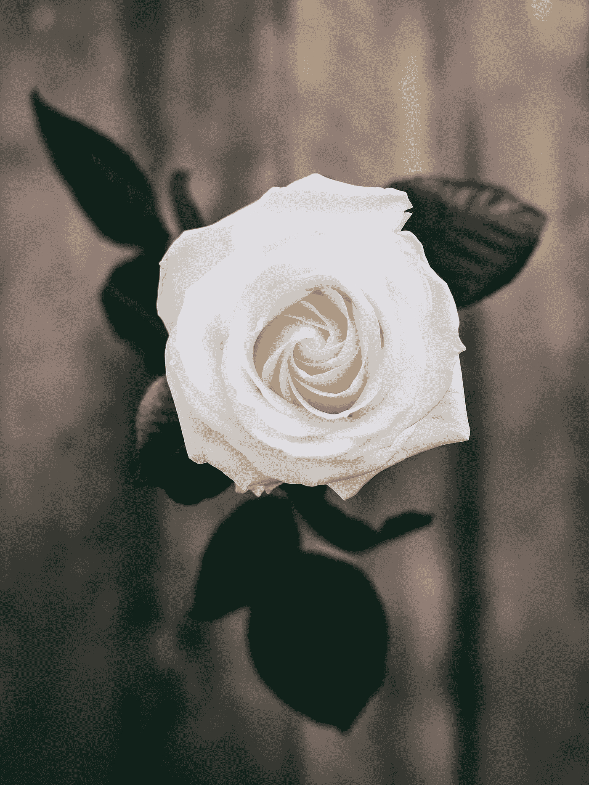

# 我心周围的荆棘

> 原文：<https://medium.datadriveninvestor.com/a-pennystock-poem-a7e42dd3004a?source=collection_archive---------36----------------------->

## 流血的关系

Photo by [Annie Spratt](https://unsplash.com/@anniespratt?utm_source=medium&utm_medium=referral) on [Unsplash](https://unsplash.com?utm_source=medium&utm_medium=referral)

哦，细价股，
你是如此与众不同，
你像玫瑰一样吸引着我，
你用你的刺，让我流血。

有时你像银河系中最亮的星星一样闪耀，
有时你像一个等着吃我的怪物。
每当我说再见的时候，
我立刻开始想念你，
虽然我知道我不是唯一的一个。

总有一天，
你会让我成为世上最幸福的人，
然后把我的心掏出来，就像下一秒什么都不是一样。我一直希望有一天，我们能平静地生活，但我知道这一天不会很快到来。

你用你的容貌诱惑我，每次我都忍不住要屈服。你的离去让我嫉妒，没有什么能和你相比。

哦，小股票，你还想从我这里得到多少？我快要失血过多了。有人会来救我吗？

你能不能不要这么忽冷忽热？告诉我你到底想要什么。你能不能别跟我玩游戏了？所以我们可以更进一步。我们以前来过这里，这次会有所不同吗？

你就是这样对待永远爱你的人的吗？你还没准备好接受更多吗？这是我们旅程的终点吗？我只是希望我们有更多的时间。

也许有一天你会意识到，我的爱是真实的。也许我们可以从此幸福地生活在一起，就像电影里一样。

但是你认为我是理所当然的，而我所想的就是离开你。
一劳永逸。

*嘿，既然你在这里，为什么不加入我的* [***邮件列表***](https://marcuschan.ck.page/76504d9d12)**来看看你收件箱里偶尔出现的酷故事，或者考虑一下* [***成为会员***](http://xn--74h/) *来阅读我所有的故事！☺**