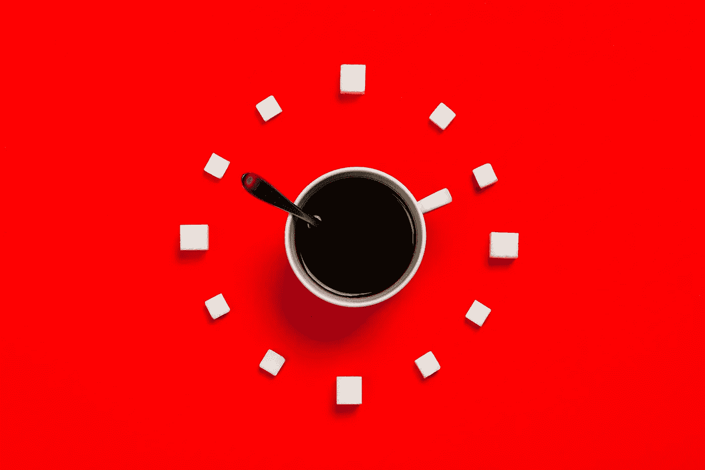
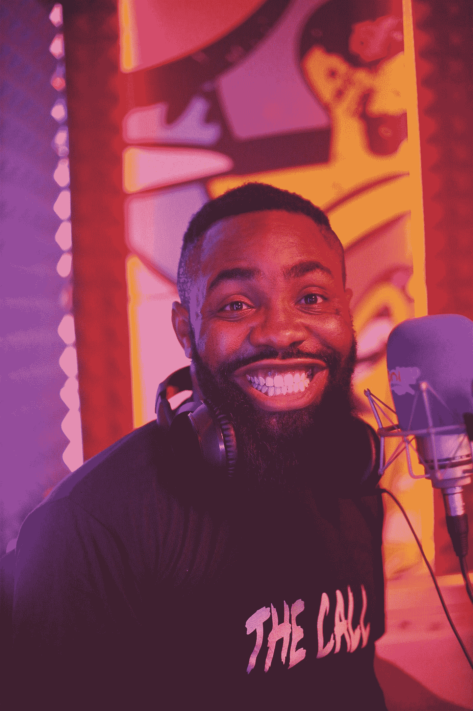
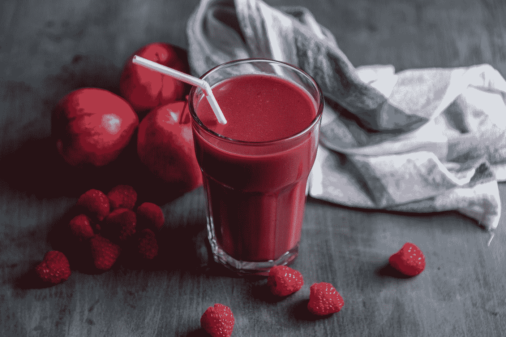
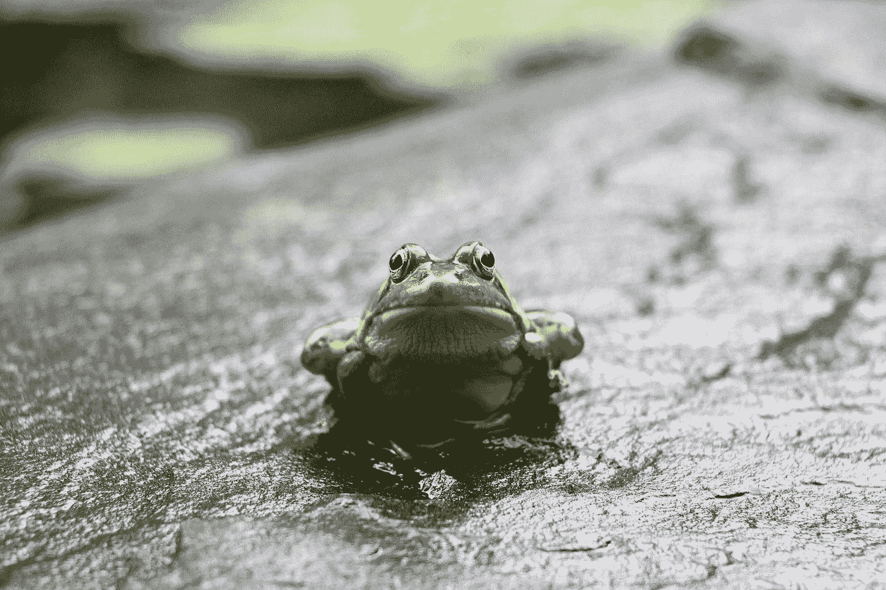

# 一个完美的早晨惯例需要这四样东西

> 原文：<https://medium.datadriveninvestor.com/a-perfect-morning-routine-needs-these-4-things-522c4fe06383?source=collection_archive---------16----------------------->

Photo by [Stas Knop](https://www.pexels.com/@stasknop?utm_content=attributionCopyText&utm_medium=referral&utm_source=pexels) from [Pexels](https://www.pexels.com/photo/white-mug-on-red-background-2916450/?utm_content=attributionCopyText&utm_medium=referral&utm_source=pexels)

## 保证你自己有一个平衡的、富有成效的、愉快的一天

我不同意这种磨人的心态。

**有可能**成功，而**不可能**早上 5 点起床，写 1000 个单词，做力量瑜伽，喝一杯瘦绿冰沙，所有这些都在醒着的 60 分钟内完成。

> 一个好的早晨惯例不是你能塞进去多少。它是关于让支柱就位来支撑你将要建造的东西。

你需要记住四个字:**心、身、魂** …和**蛙**。

上一次我逮到你了。对吗？

# 头脑

以清醒的头脑开始新的一天，很少会出错。

当我做广播节目制作人时，我知道我的工作是为成功创造条件。我没有展示这个节目，但是我需要确保所有的东西都准备好了，这样展示者才能脱颖而出。

Photo by [Cool FM 96.9](https://unsplash.com/@coolfm969?utm_source=medium&utm_medium=referral) on [Unsplash](https://unsplash.com?utm_source=medium&utm_medium=referral)

你的大脑也是如此。你需要为你的大脑创造什么条件，让它每天都有一个完美的开始？

*对我来说，是安静的独处。*

对于一个年轻的家庭来说，这很难实现，但我换了很多我能做的工作(但我妻子讨厌)，这样我就可以先起床，下楼，在家里其他人起床之前有 15 分钟的时间独处。

我打开收音机，喂了猫，给自己泡了杯咖啡，给妻子泡了杯茶，然后收拾屋子准备行动。一直以来，我都在有效地告诉我的大脑:

> “别老担心，一切都在控制之中，今天会是个好日子。”

这意味着当孩子们饥肠辘辘地跑下楼梯吃早餐时，我已经准备好，面带微笑地等着他们的食物。

Photo by [Providence Doucet](https://unsplash.com/@providence?utm_source=medium&utm_medium=referral) on [Unsplash](https://unsplash.com?utm_source=medium&utm_medium=referral)

在一天的前 15 分钟里，你需要什么来为一天的成功创造条件？

直接锻炼？
日志？
冥想？
音乐？

好好思考一下——静静地坐着，向你的大脑挑战答案——然后实施一个对你有效的计划。

 [## 失落的思考艺术——利用你被遗忘的超能力

### 动动脑子。求你了。

medium.com](https://medium.com/illumination/the-lost-art-of-thinking-harness-your-forgotten-superpower-1bf583f08f57) 

# 身体

现在的疫情改变了我对健康和健身的态度。在 COVID 之前，这是一个不错的选择。现在，它已经在我的优先列表中上升到了必不可少。

所以，我早上的作息已经改变了，包括我如何补充燃料和我如何锻炼。它揭示了适应性在建立完美的早晨日常生活中的重要性。

你目前健康和健身的总体目标是什么？

Photo by [Francesca Hotchin](https://unsplash.com/@franhotchin?utm_source=medium&utm_medium=referral) on [Unsplash](https://unsplash.com?utm_source=medium&utm_medium=referral)

让早晨成为你一天中的一部分，当你确切地知道你在做什么的时候，你就不必去想它了。

计划每天早上吃什么和喝什么——把这个决定作为一周更大计划的一部分。

尽可能早地进行锻炼。

早晨是一天中受外界因素影响改变计划的可能性最小的时候。如果你锻炼得早，就不太可能错过。

但是记住适应性这个概念。如果你的优先事项改变了——调整你的早晨日程，但是要确保仍然有一个计划。

# 灵魂

太多的晨间例行公事没有给灵魂营养留有余地。

生活中你最看重什么？把它作为你每天做的第一件事。

在生活中，我最重视家庭关系。

所以在我开始我的 15 分钟独处来为美好的一天做准备之前，我去看我的孩子和妻子。我问候他们，检查他们怎么样，并通过在他们身边向他们表示我爱他们。

如果信仰对你来说是最重要的，那就先祈祷吧。如果你的心理健康对你来说是最重要的事情(我们都需要先戴上氧气罩)，冥想，写日记，去户外，做对你有用的事情。

无论你做什么，都不需要花很长时间。确保你每天做的第一件事反映出你生活中的头等大事是有力量的

Photo by [Jenn Simpson](https://unsplash.com/@sassygreenboots?utm_source=medium&utm_medium=referral) on [Unsplash](https://unsplash.com?utm_source=medium&utm_medium=referral)

# 青蛙

啊哈，包里的小丑。青蛙。为美好的一天奠定完美基础的最后一根支柱。

它是生产力的追逐者，通过首先处理头脑、身体和灵魂，你已经创造了平衡。

一天中最艰巨的任务。你一直担心的那个。你一直在拖延的那个。**做吧**。尽可能快地(同时仍然正确地做)。

你盘子里的青蛙。塞进嘴里，嚼碎，咽下去。

Photo by [Austin Santaniello Bucholtz](https://unsplash.com/@abuchotlz?utm_source=medium&utm_medium=referral) on [Unsplash](https://unsplash.com?utm_source=medium&utm_medium=referral)

吃青蛙是生产力的首要原则。这是一个基于马克·吐温名言的概念，由作家布莱恩·特雷西推广开来。

> “如果吃青蛙是你的工作，最好在早上第一件事就做。如果你的工作是吃两只青蛙，最好先吃最大的那只。”——马克·吐温

通过把吃青蛙作为你工作日的第一项任务，你会感觉到成就感，你会产生动力。太大了。

接下来的每一项任务都会变得更容易。你增加了自信，理清了思路。

# 关键要点

每天早上好的惯例包括以下四个方面的深思熟虑的行动:

**头脑**——利用你的前 15 分钟，为你的大脑创造必要的条件，以便在一天的剩余时间里积极地为你服务。

**身体**——从更大的角度规划你的饮食和锻炼。早点锻炼，提前知道自己在消耗什么。

灵魂——找出对你来说最重要的东西，并采取行动，把它作为你要做的第一件事。

**青蛙**——当你准备好变得富有成效时，首先面对你最困难的任务——创造信心和动力。

在你的早晨例行公事中创造这四个支柱，你将会有一个平衡的、富有成效的和愉快的一天。