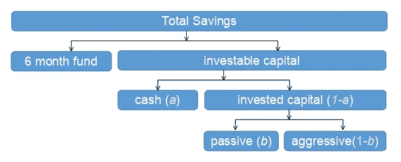
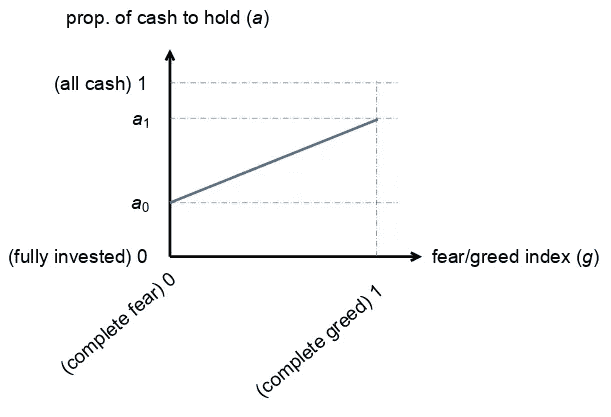
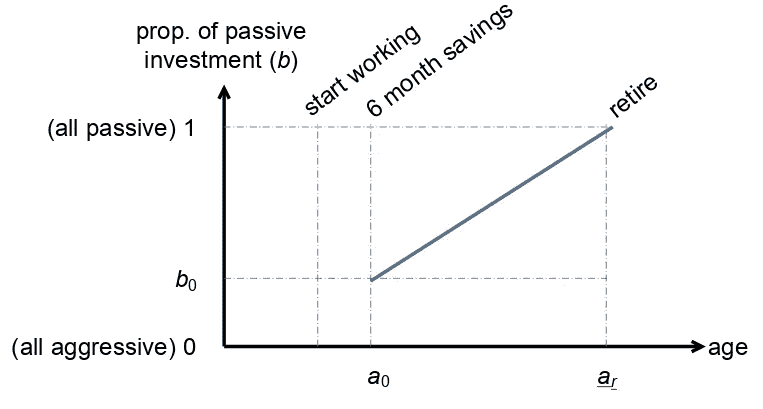

# STEM 领域的博士学位让我在财务上准备不足——以及我是如何克服的

> 原文：<https://medium.datadriveninvestor.com/a-phd-in-a-stem-file-left-me-financially-underprepared-84b9589a765e?source=collection_archive---------1----------------------->

我在天真的想法中长大，认为努力工作就是舒适退休的代名词。你低着头，喝你正在喝的东西，你的财务前景会神奇地变得明朗起来。有一个虚无缥缈的实体会照顾你的退休。称之为我们所生活的文明的魔手，或者神的干预，或者任何你希望的东西。

虽然我在 STEM 领域完成了我的博士学位和随后的博士后学位，但在结束时，我一直担心退休。这并不是因为缺乏努力。在我做博士后的日子里，我几乎每天都从上午 10 点工作到午夜，然而，我的财务状况并不好。有些不对劲...

我要做的第一件事是找一份真正的工作。这让我有时间在正常的 8-5 工作时间后学习金融。

# 1.获取金融知识

鉴于互联网上无处不在的信息，学习金融并不难。有太多的知识可供任何人吸收。其中一些是免费的，而其他的可以通过付费程序获得。你不再需要去耶鲁大学向诺贝尔金融学奖得主罗伯特·希勒学习，或者在一家领先的金融机构工作，从这些金融机构中设计最新算法的人那里了解人工智能技术分析的最新发展。

我学习并从中受益的一些东西是:

*   **YouTube** : [麻省理工学院开放式课程中的数学主题及其在金融中的应用](https://www.youtube.com/watch?v=wvXDB9dMdEo&list=PLUl4u3cNGP63ctJIEC1UnZ0btsphnnoHR)，
*   [**Coursera**](https://www.coursera.org/) : [金融市场](https://www.coursera.org/learn/financial-markets-global/home/welcome)作者 Robert Shiller，[新兴市场专业的交易策略](https://www.coursera.org/specializations/trading-strategy)来自印度商学院
*   [**uda city**](https://www.udacity.com/):[人工智能进行交易，纳米学位项目](https://www.udacity.com/course/ai-for-trading--nd880)来自技术分析方面的领导

我确信还有许多同样令人印象深刻的资料可供你研究。

然而，尽管有这么多关于金融理论方面的信息，但总是会有迈出第一步的焦虑。这些课程没有教会我投资的实际过程——开立交易账户、国家间税收和法律、进行第一笔交易等等。要做到这一点，你需要一个团队的积极支持，这个团队的成员愿意和你一起走过这个过程。我在第六学院和他们的 T2 价值投资课程中发现了这样一个群体。这个项目的基地在新加坡。我相信所有国家都有这样的项目。

如果你在开始投资之旅时也有同样的不安全感，我强烈建议你去找最近的知名投资课程，并尽快报名。

# 2.早早地踮起脚尖

尽管学习金融很好，但你必须在某个时候尝试一下。越早越好。在你职业生涯的早期，有可能会犯错误，从中吸取教训，然后恢复。随着你越来越接近退休，你会积极地开始失去这种奢侈。

我想重申支持小组的重要性，尤其是在你刚开始的时候。投资包括对冲对你有利的赌注。这只能通过尽可能多的搜索和消化信息来实现。你对一家公司和经济的了解越多，你就能更好地确定一个特定的赌注是好是坏。一个支持小组，比如由 Vi 学院(和其他类似的学院)提供的小组，将帮助你获得更多关于公司、关于总体经济的信息，以及了解各种有前途的公司的案例研究。你也能从其他人那里获得想法，理解其他人对不同主题的观点。

在这篇文章中，我将探讨你在投资之旅中应该采取的第一步。接下来是一套**可操作项目**，让你在投资之旅中建立一套稳定的方法。这种方法是为了让你在退休时经济独立。投资是一个过程，需要学习。

# 3.收入、费用和储蓄

为了保证退休生活，你必须有一两个稳定的收入来源。这些收入将成为你投资的基础。你的收入越多，你就能为你的投资存更多的钱。投资的第一部分包括估计你每个月能为你的投资留出多少。还是那句话，这是一个过程。你练习得越多，你就会做得越好。

考虑将你的收入分成三大类:

1.  每月开支，
2.  保险，以及
3.  储蓄

通常保险(尤其是健康保险)放在“每月费用”标签下。然而，在这里我想特别强调保险的重要性。*这是必须的*。不要吝啬这个。

在估算了你每月的开销和保险支付后，你会估算出你一个月能省多少钱。然而，还有另一种思考储蓄的方式:

> “首先支付自己”——j·兰普顿

在这种情况下，你在每月支出前留出一笔固定的金额*。*

不管你是先存后花，还是先花后存，都要养成向投资账户源源不断投资的习惯。这可以是一个你不接触的独立账户，或者是一些你可以用来把你的储蓄和你的花费分开的会计格式。请记住，这是一个过程。每个月都这样练习，让它成为第二天性。

# 4.投资计划

一旦你有了一些存款，你应该开始考虑如何投资这些存款。你需要计划好你的投资之旅。因为，你的余生都将在这个旅程中度过，所以你想要制定一个可持续且易于遵循的计划。这个计划应该包括三个因素:

*   生活中不可预见的财务意外
*   市场条件，以及
*   年龄

下面是您投资概况的基本计划的示意图。可能还不清楚上述三个因素是如何在计划中编码的。这就是本文其余部分的目的。

考虑按以下方式分配您的总储蓄:

1.  保留 6 个月的花销以备不时之需。别碰这个。这是为了应对上面提到的第一个因素——生活中不可预见的财务意外。如果你已经检查了你的月支出，如第 3 节所述，你应该能够相当容易地估算出这个数字。剩下的(我们称之为 ***可投资资本*** )才是你应该用来投资的。
2.  现在你需要谨慎对待你想要积极投资的资金数量(我们称之为 ***投入资本*** )。这取决于上面提到的第二个因素——市场条件。一些市场条件本来就比其他市场条件风险更大。当这种情况发生时，你应该考虑减少可投资资本的投资。如何计算待投资的可投资资本比例详见第 4.1 节。
3.  最后，你要考虑将投入的资金一部分投入 ***进取型*** 投资，另一部分投入 ***被动型*** 投资。这个比例其实是由你的年龄决定的，这是你在投资时要考虑的第三个因素。为什么会出现这种情况，以及如何计算这一比例将在第 4.2 节中介绍。

## 4.1.计算你的投资资本

千万不要把所有可投资的资本都投进去。投资本来就有风险。然而，能够以有意义的方式降低风险是很重要的。你要问自己的第一件事是，“*我应该投入多少资金*？”

在这里，我们从一句最常被引用的投资箴言中吸取教训:

> 当别人贪婪时要恐惧，当别人恐惧时要贪婪——w·巴菲特

现在，让我们把这句话变成可以付诸行动的东西。让我们假设你知道其他人的恐惧-贪婪等级，从[0，1]开始。也就是说，你有某种方法来确定，在给定的时间点 *t* ，一个介于 0 和 1 之间的数字 *g* ( *t* )，它告诉你当前总体的乐观程度。然后，你可以计算出在时间 *t* 你希望持有的现金比例 *a* ( *t* )如下:

*a*(*t*)=*a*₀*+*(*a*₁—*a*₀)×*g*(*t*)

这里， *a* ₀和 *a* ₁是你想作为现金持有的储蓄的最小和最大比例。*你决定多少钱。记住这个公式是一个指南。它会给你一个粗略的估计，在任何时候你的可投资资本应该是多少。*

下图对此进行了示意性解释:

我们如何知道市场当前的恐惧/贪婪状态？这有许多代理。举个例子，

*   你可以使用主要指数的市盈率(如标准普尔 500 指数、道琼斯指数或罗素 2000 指数)，并在此基础上创建一个标度。市盈率越高，市场越贪婪，你可能希望持有的现金就越多。每个索引的伸缩性不同，因此您需要创建从这些索引到上述伸缩性的适当的线性映射。
*   你也可以考虑使用 CNN 商业频道的简单易用的[恐惧&贪婪](https://money.cnn.com/data/fear-and-greed/)指数。请注意，该指数从 0 到 100，因此您将其缩放 0.01，以将其直接带入上图所示的公式中。

## 4.2.积极投资和消极投资的分离

投资是一段旅程，最终会让你过上舒适的退休生活。记住这是目标。这个想法是建立一个系统，让你在生命的早期承担更大的风险，并随着时间的推移将其转化为低风险资产，供你在余生中使用。从根本上说，在你生命的尽头，你想要什么？

*   住的地方:如果你在没有稳定收入来源的时候租房子住，这肯定对你不利。你想在前线保护自己。
*   足够的资金来支付你的日常开支:这可以是你从蓝筹股、房地产投资信托基金、交易所交易基金中获得的股息，或者是你从债券中获得的溢价，以及你可能以自由职业者的形式获得的任何其他被动收入来源。
*   足够的资金来支付你的健康保险(当你老的时候，这将是很重要的)。为此，你可以考虑建立一个在未来 10-20 年内到期的定期存款计划，用于你的健康保险。

在你目前的年龄，你应该投入多少积极的投资，多少应该存放在更消极的投资中？为此，人们可能会考虑我们试图实现的是什么。当你年轻的时候，你想把大部分的投资投入到积极的投资中，少部分投入到消极的投资中。随着年龄的增长，你应该慢慢地将你的积极投资转为消极投资。考虑一下你生活中的以下进展:

1.  当你开始赚钱时，你需要建立 6 个月的应急基金(不投资)
2.  当你处于职业生涯的早期，你有足够的时间。你有尝试新事物和失败几次的奢侈。你也应该能够承受市场的涨跌(考虑到你 6 个月的应急基金)。你可以“了解内情”。
3.  随着年龄的增长，你逐渐接近退休，你应该有一个越来越稳定的收入来源——你可能无法从风险投资中恢复。
4.  退休时，你应该没有风险投资。你应该主要投资蓝筹股、REITS 和其他更稳定的收入来源。

那么，这对于积极与消极的分裂意味着什么呢？主要是这个因素取决于你的年龄。这示意性地表示在下面。

在你职业生涯的早期，你想以更高的风险投资( *b* ₀)开始，当你退休时，这种投资应该会减少到零。

*b*(t)=*b*₀+(1-*b*₀)×(年龄(*t*)-*a*₀)/(*a*ᵣ*-a*₀)

这里

1.  ₜ =你现在的年龄
2.  ₀ =你开始投资的年龄
3.  ᵣ =退休年龄
4.  ₀ =安全投资的初始比例

你的风险偏好决定了₀.*可以是 0* 。你决定吧。重要的是，当你接近退休时，你应该确保你不再投资于风险资产。还有，这是一个建议。如果你愿意，你可以创建一条抛物线。

# 5.结论

所以总的来说，如果你想创建一个能让你舒适退休的系统，下面的想法可以帮助你

1.  *找一份收入最大化的工作*。这是显而易见的。你挣得越多，就越有可能过上舒适的退休生活。此外，你能存起来用于投资的钱越多。
2.  找一份能给你一些私人时间的工作。这段时间可以用来不断提升你的技能(这对保持竞争力至关重要)，也可以让你监控市场(至少在周末)并贯彻你的投资计划。
3.  *获得金融素养*。我怎么强调这一点都不为过。你对财务知识了解得越多，你就能更好地准备在人生的每一步做出正确的财务决策。
4.  *加入已经投资的团体*。这将减少风险对冲，通常提供更好的全面的想法
5.  *尽可能的节省*。
6.  *制定适合自己的投资计划*。一个你可以在私人时间内处理的事情。开始时，你会对整个过程非常兴奋，可能会花大量的时间研究和学习金融。然而，重要的是要记住，一天只有这么多小时，你不想被所有与投资相关的工作淹没。

# 6.未来阅读

希望现在，你知道如何把钱存起来，并开始投资。这只是开始。接下来，你需要开始了解这些公司及其估值、经济学、情绪分析、技术分析以及未来结果预测。如果你精通技术，你可能也想了解机器学习，以及如何利用它。

> 长寿和繁荣——史波克先生