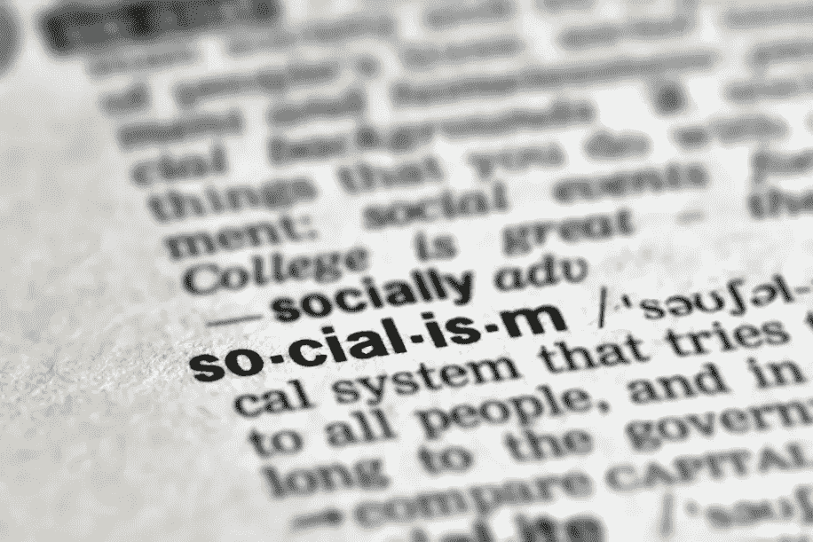
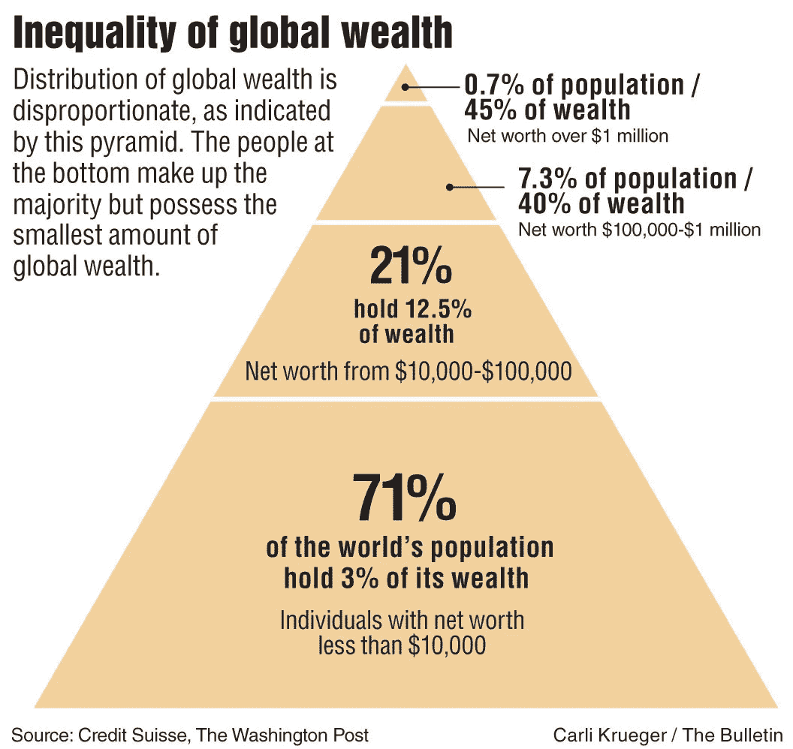
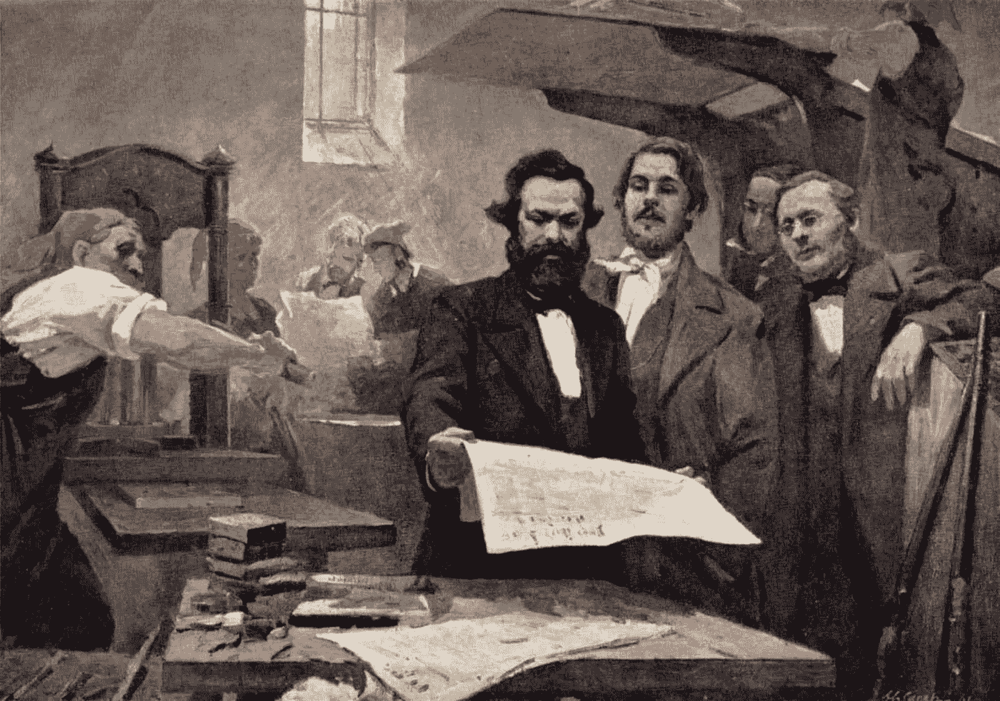
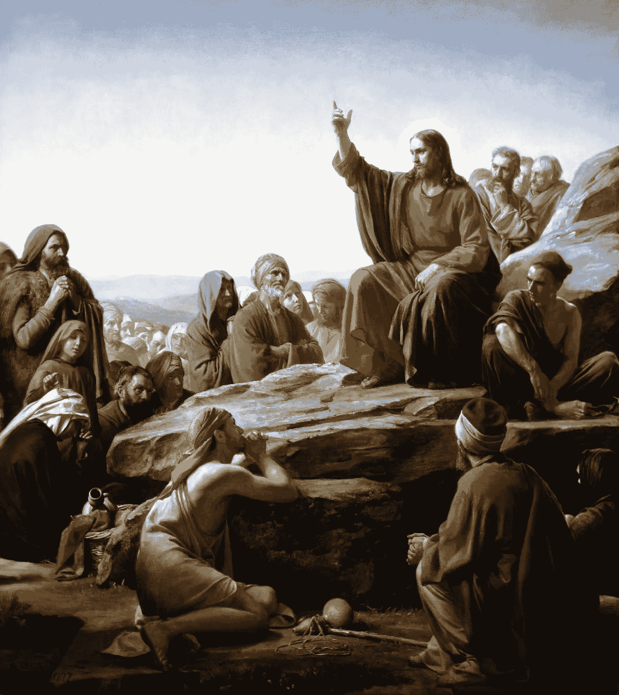
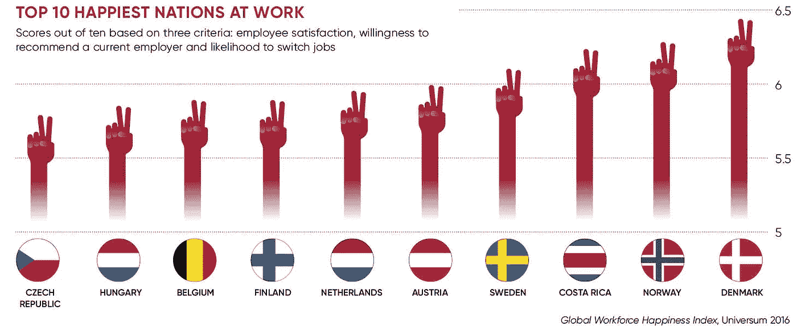
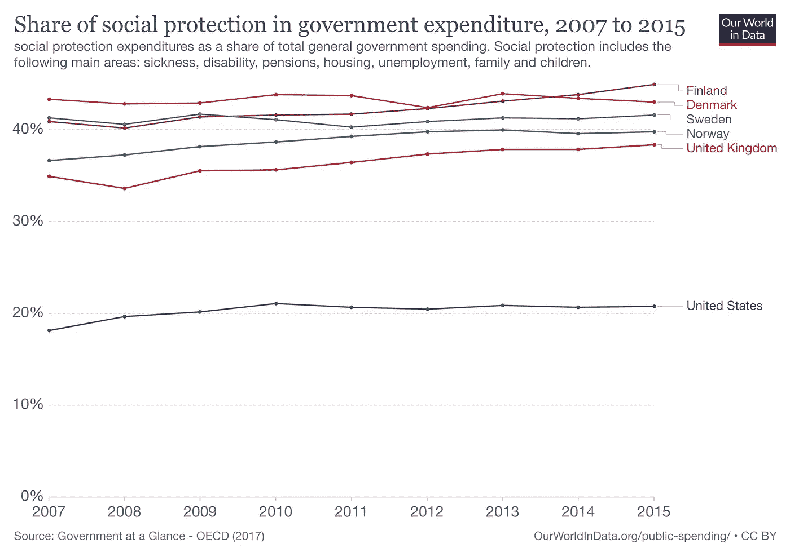
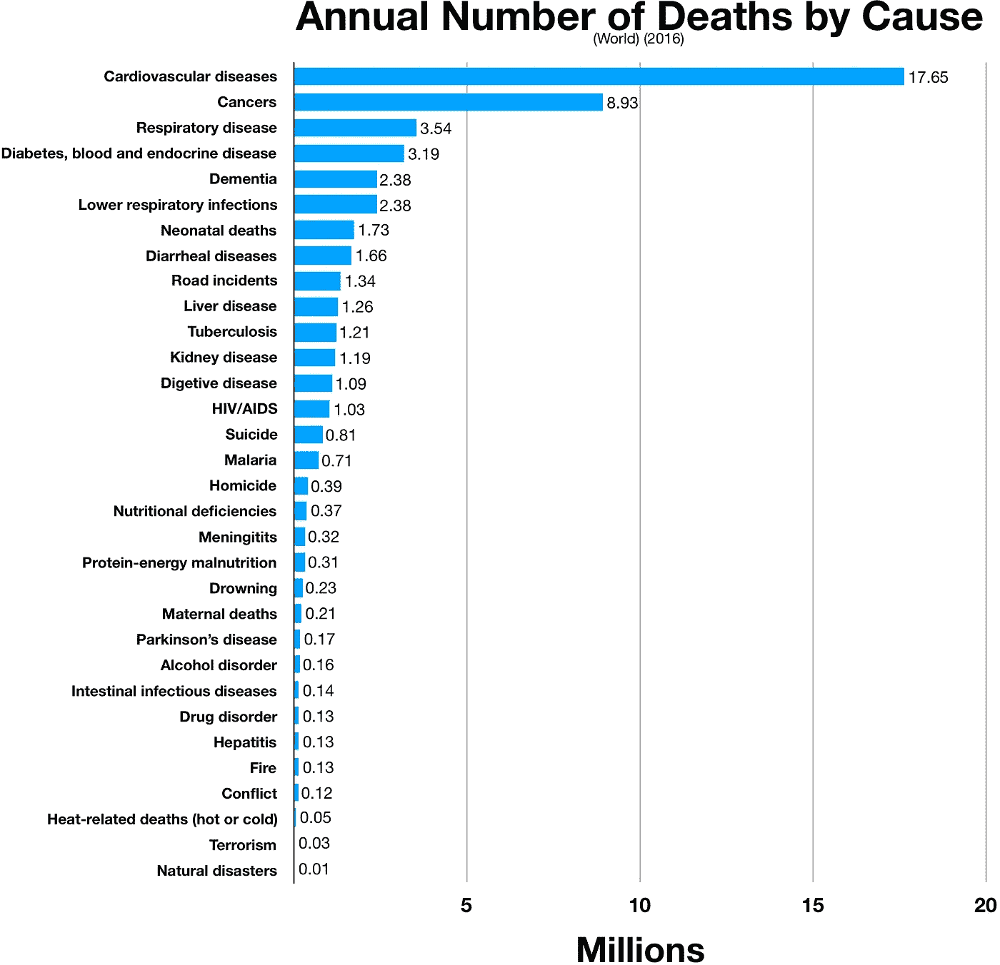
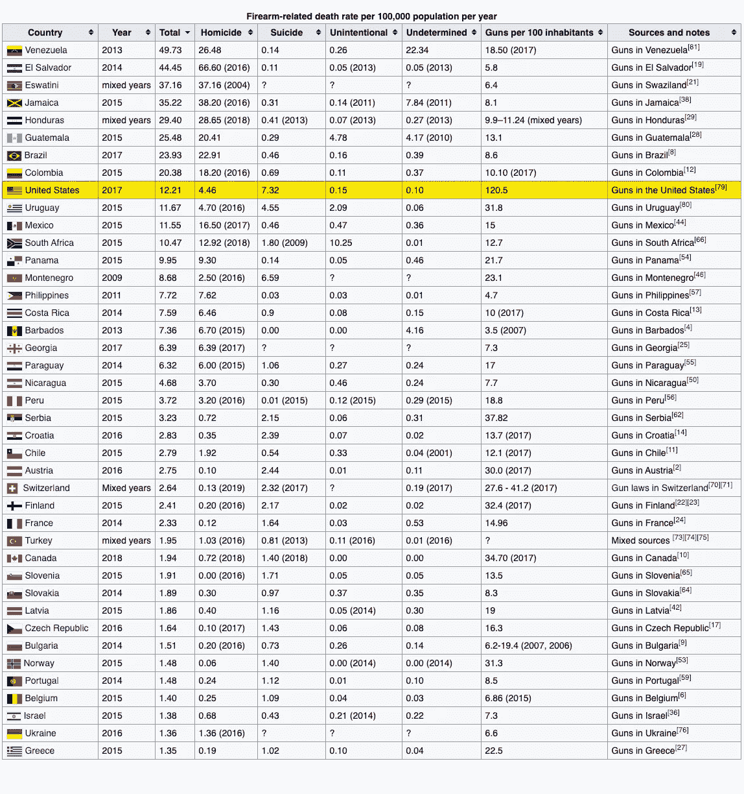

# 后资本主义时代的情书

> 原文：<https://medium.datadriveninvestor.com/a-post-capitalist-love-letter-3614c64f6692?source=collection_archive---------7----------------------->

## “我”的时代必须让位于“我们”的时代，才能达到它的逻辑终结状态:环境和人际的人造结构的内爆。历史掌握着我们需要的所有钥匙。我们只需要重新学习它。

Ideology 101\. Image: CFI

每个社会和时代似乎都有他们钦点的妖怪。你知道，共同的敌人和恐惧的对象，当权者可以围绕它们建立令人不寒而栗的故事，以集中和激励人们实现自我放大的议程。

来操纵它们。

事实上，没有哪个被诽谤的人、团体或意识形态真的像我们的叙事作者想让我们相信的那样*糟糕。这是因为宽容和冷静超然的理性主义不是好战、兜售政策或巩固投票集团的重要导火索。相比之下，恐惧的煽动和由此产生的愤怒的武器化是操纵的高超工具，旨在达到自我保护的目的。*

*昨天对国会大厦的突袭只是这种情况的一种表现，而且在我们自己的历史背景下，这种表现相当不温不火。*

# ***我们往南去了哪里***

*亚当·斯密写完《国富论》后不久，资本主义应运而生，催生了一个新兴的实业家“大师阶层”，随之而来的是两件重要的事情。首先，在人类历史上第一次，一个新的贵族阶层——工业商人——通过财富的积累获得了与那些通过严格的血统渠道获得统治权的人一样大的影响力。令人震惊的是，这意味着任何人都可以变得强大，只要他们掌握足够的资本和影响力。其次，正因为如此，工作和协作的性质发生了巨大的变化。新的商业大亨统治秩序开始巩固他们的权力并增加他们的财富，他们使用*和*来消灭他们认为的竞争对手。旧的君主政体至少知道他们对自己的指控负有最终责任——无论是贵族还是农民；他们中的大多数都照着做了。在商业中并非如此，在商业中，唯一重要的事情是增加财富，通过任何必要的手段。*

*正如俄罗斯虚无主义者谢尔盖·涅恰耶夫的格言所说:*

> *"为达目的不择手段。"*

*(不，不是马基雅维利。)*

*史密斯的资本主义是达尔文式的“适者生存”,赢家通吃，输家越惨，对赢家的战利品越有利。很快，行为的**透明****——及其使者*信任**诚信*——消失了。这是因为混乱和秘密是一个人如何保持自己的优势，或霸权，对潜在的篡位者。游说消除最大限度开采的障碍，或任何削减顶峰利润的东西，成了工作的首要任务。总的来说，今天依然如此。***

*因此，第一次，产品的质量不仅不再是商品和服务生产背后的驱动力，小企业主也因此建立并维持了他们的声誉，从而维持了他们的生意。相反，在资本主义制度下，质量成了分散注意力的东西，而不是 T21 真正关心的东西:市场渗透。*

*质量和营销这两件事是截然不同的。质量源于工艺和做工，这是很难伪造的。另一方面，营销只需要好的故事，不管它是否与经验真理有任何相似之处。*

*因此，随着资本主义的兴起，手艺在很大程度上被扫地出门，而固有的过时、作秀和口是心非全都开花了。值得注意的是，随着技术的进步，产品变得越来越不可靠，寿命越来越短，因为资本主义的运作方式是获取尽可能多的利润，这导致了故意制造不合标准的产品，这些产品不得不被回购，并以削减生产成本的名义偷工减料，从而实现利润最大化。*

*质量，粗鲁地，变成了“糟糕的生意”——除非有资本的精英们在这些事情上“浪费”。*

*这种思维模式的顶点是一个我一直觉得既令人厌恶又令人轻视的绰号，因为它贬低了我们的存在。*

*人类现在被贴上了“**消费者**”的标签。*

*也就是说，我们在地球上的主要角色是消费，以此来喂养资本主义所要求的对生命至关重要的“增长野兽”。对资本主义的忠实信徒来说，我们只不过是嘴巴和钱包。我们能*塞进*人类嘴里的东西越多，能*从*人类钱包里提取的东西越多，世界就会变得越好。*

*啊？*

# *肥胖和债务:资本主义猫薄荷*

*肥胖和债务只是这种意识形态范式的几个*逻辑结果中的两个。**

*根据几乎每个健康专家的说法，普通成年人只需要 1600-2000 卡路里就能茁壮成长，而美国人现在平均消耗 3600 卡路里，是 T2 的两倍，这导致了世界上最肥胖的慢性病患者。*

*说到食物，我们是真正的*消费者:世界冠军。**

*肥胖对经济有很大的好处。健康专家、医院和诊所、制药公司、饮食小贩、保险公司、健身专家、农业企业、食品商、作家、服装零售商和政府都将从我们不健康的身体中获利。*

*根据 Investopedia 的数据，肥胖症是全球 2 万亿美元的经济来源，其中美国人贡献了 1900 亿美元。奇怪的是，它认为这是经济的“成本”。一点也不！当金钱由于肥胖而易手时，这正是每个资本家都知道的经济车轮的润滑剂:金融工具的交换。*

*Investopedia 写道:*

> *“体重和肥胖相关问题的增加不仅损害了数十亿人的健康，也给经济带来了巨大的损失。据估计，肥胖、吸烟和武装暴力是人类产生的三大社会负担之一。肥胖的经济影响大约相当于吸烟和武装战争，每年高达 2 万亿美元，约占全球 GDP 的 2.8%。按照目前的速度，预计到 2030 年，肥胖将影响全球近一半的成年人口。*

*战争、吸烟和肥胖是资本主义最赚钱的三项事业。*

**

*A growing market*

*出于同样的原因，债务对经济也很重要。房地产公司、物业管理公司、银行和其他承销商、保险机构、投资者以及政府都需要你的债务来增加季度回报。*

*美国国债是其国内生产总值的 106%。这意味着它欠 T1 的比 T2 赚的多。消费者跟随政府的领导，就像任何一个好的消费者会:*贪婪地*。就在去年，美国消费者债务达到了 14.3 万亿美元的新高。住房债务占了其中的大部分(稍后会有更多)，而学生债务排在第二位(稍后也会有更多)。事实上，仅在上个世纪下半叶，美国家庭债务就从 1952 年“仅”占 GDP 的 20%飙升至 2016 年的 76.2%。*

*正如我之前所说，资本主义是一门好生意。*

*毫无疑问*不是*的事情，对我们的公共福祉有益。*

*自斯密的资本主义诞生以来的 200 年间，富人和穷人之间的巨大鸿沟超出了所有人的预期。众所周知，商业巨头现在控制着比以往更多的财富。*

*几个[统计](https://en.wikipedia.org/wiki/Distribution_of_wealth):*

*截至 2017 年，仅 8 位超级富豪的财富就相当于地球上一半人口的财富。*

*最富有的 1%的人现在和其他 99%的人拥有同样多的财富。*

*前 10%的人享有全球 85%的财富；最底层的 90%只分享了其中的 15%。*

*而前 30%的人拥有 T21 全部财富的 97%。最底层的 70%人口仅占 3%。*

*它。是。令人震惊。*

**

# ***亵渎神圣***

*但是，告诉某人资本主义是邪恶的，或者说它的缺点大于优点，是被诽谤和边缘化的；怀疑某人的爱国主义或理智；在过去一个世纪的某些时候，被怀疑颠覆或叛国。*

*一样多(大多数？)资本家会热情地告诉你，引用米尔顿·弗里德曼(Milton Friedman)或戈登·盖柯(Gordon Gekko)的话，如果他们没有博览群书的话:*

> ***贪婪是好的**。*

*忘记弗里德曼的*希望*是股东利润，当足够产生时，可以用于社会目标，“如果他们希望这样做的话。”当他写下他的开创性学说时，这就是他的意思，企业的社会责任是增加利润。更多信息请见下文。*

# *异端意识形态*

*在 20 世纪上半叶，共产主义这个词不仅是一种深深的侮辱，而且值得被列入监视名单或关进监狱。“共党左派”受到宗教迫害，尤其是在麦卡锡[时代。两次“红色恐慌”——紧随两次世界大战之后——谴责俄罗斯母亲的“奉承”意识形态是对美国生存的威胁。为什么？因为，从根本上说，它把*群体*置于*个人*之上。在马克思恩格斯的*共产主义*](https://en.wikipedia.org/wiki/McCarthyism) [*宣言*](https://en.wikipedia.org/wiki/Communism#Marxist_communism) 中，阶级斗争*是*问题。被压迫和被剥削的无产阶级——工人阶级——掌握在从他们的劳动中获利的统治阶级——手中——是阶级冲突的*原因*,从而威胁到一大群人的福祉，并在这个过程中质疑我们自己的人性。*

**

*Marx and Engels at the Rheinische Zeitung. E. Capiro, Public domain, via Wikimedia Commons*

*我想我们知道政治上的共产主义已经变成了什么样。*

*如今，无政府主义是一个更加肮脏的词。如果无政府主义——对中央集权和等级制度的拒绝——盛行，实业家将失去他们主导商业的主要手段——政治游说和幕后交易。[无政府主义者](https://en.wikipedia.org/wiki/Anarchism)，可以追溯到古希腊和中国，我们生活的这个世界的大部分都是建立在他们的哲学基础之上，“根据*维基百科的说法，**寻求一种基于废除所有不合理的、强制的等级制度，并创建直接民主和工人合作社的制度**。**

*我可以理解为什么资本家认为这听起来很可怕。*

*最后，今天的共产主义和无政府主义的味道以社会主义的名字出现。也许在今天的美国政治话语中，没有比给某人贴上社会主义者的标签更大的侮辱了。像无政府主义者和共产主义者一样，社会主义者寻求赋予普通人权力。*

*在社会主义中，社会所有权——即生产力和交换的战利品——以某种形式的共同信托持有，所有人都从中受益。这是一个松散意识形态的事实上的组织基础，从一开始就以许多方式为目标。*

*给我们带来哲学、陪审团审判和民主的古希腊人！)，以及数学、医学和科学等“副产品”，都是社会主义者。对他们来说，民主*是社会主义的一种形式。**

*拿撒勒的**耶稣**——上帝之子——对 24 亿*基督教信徒(世界人口的三分之一)的教导*——被完全* [视为](https://en.wikipedia.org/wiki/Christian_socialism#:~:text=New%20Testament,-Jesus%20Expels%20the&text=The%20teachings%20of%20Jesus%20are,socialist%2C%20especially%20by%20Christian%20socialists.)社会主义。**

**

*Sermon on the Mount, by Carl Bloch, 1877\. By Carl Bloch, via Wikipedia Commons*

*根据许多列表，如“世界幸福报告”，当今社会主义程度最高的国家——丹麦、瑞典、挪威、冰岛和芬兰的斯堪的纳维亚五国——被集体认为是最适合人类生活和发展的地方，因为——请击鼓！—在这些地方，政府的主要活动是确保其公民的福祉——所有公民的福祉。这需要在公共福利项目上进行世界领先的资本支出，如基础设施、卫生、教育、权利、经济安全网、养老金、父母支持、集体谈判……*

**

*平均而言，这些国家的社会保障支出是美国的两倍。*

**

*Scandinavia vs. the US (with the UK thrown in for good measure). Attribution above.*

*斯堪的纳维亚是由民主国家组成的。有些也是君主国。但是毫不掩饰地说，它的公民都被认为是社会主义者。*

*这种现象甚至有一个专门的术语:[北欧模式](https://en.wikipedia.org/wiki/Nordic_model)。*

*北欧模式的结果是世界上最幸福的人。*

*不出所料，他们也是世界上 10 个最不腐败的国家之一——在清廉指数评估的 179 个国家中。*

*资本主义更好吗？*

*嗯，根据国际货币基金组织的统计，这五个国家的人均国内生产总值排在前 14 位。一个是挪威，甚至超过了美国，总体排名第四。*

*因此，没有资本主义就无法进步的观点完全是胡说八道。*

*在我看来，挪威或其他倾向于社会主义的国家没有发生的事情是美国享受了太多的令人厌恶的不平等。*

# ***集体主义***

*所有这些“主义”都可以归结为一个简洁的词:集体主义。出生于德国的 19 世纪社会学家费迪南德·托尼斯提出了“T4”的概念，他观察了小乡村社区的人们如何优先考虑整体的力量和健康作为幸福的主要衡量标准。*

*你知道，在城市化之前，我们历史上 99%的时间里，每个人类社区都是如此。*

*集体主义是一个价值体系。它描述了个人的凝聚力，以及团体本身相对于个人的优先性。*

*在集体主义中，没有失败者；只有赢家。*

*我今天在一篇名为《关系经济》的文章中写了这个问题。我不想重复，但是一家名为 *Mondragón 的西班牙企业集团，从佛朗哥时代就开始运营，在过去的 75 年里已经发展成为巴斯克地区的一个超过 80，000 人的社区，有学校、医院、银行，当然还有商业，这些共同组成了*在所有资本主义的西班牙最赚钱的企业*。此外，在初创企业中，它们的失败率几乎为零，因为一旦做出承诺，银行就会成为创业伙伴，提供创业成功所需的任何形式的经济、商业或教育合作及支持。**

*蒙德拉贡是一个集体主义企业。所有成员也是业主。通过这种方式，他们集体劳动的成果被公之于众，并被再投资于社区的更大利益。对于 Mondragón 的创始人，一位在第二次世界大战中名叫唐·何塞·马里亚·阿里兹门迪亚里耶塔的年轻牧师来说，“人先于事物出现”。对他来说，认为*需要*在任何交易中成为输家的想法是“想象力的一个缺点”*

**

*Mondragón, Spain, from the air*

*随着越来越多的人受到有毒政治、大型企业和失控经济的负面影响，博弈 B 社会(即所谓的“无限”社会，没有赢家和输家)的想法今天越来越流行。*

# ***美国:海报中的孩子该做*不该做*的事***

*每年在西方——在美国比其他任何国家都多——获得医疗保健、高质量教育和拥有住房都变得越来越难以负担。*

*正因为如此，那里的平均教育水平直线下降。2013 年,《大西洋》*发表的一篇名为 ***美国学校与世界:昂贵、不平等、数学不好*** 的文章说明了一切。我们的全球排名很可怜:整体排名第 27 位，落后于包括斯堪的纳维亚五重奏在内的“领先”国家。**

**令人尴尬的视频不久前在互联网上流传，是由德克萨斯理工大学的学生创作的。一个人认为这些是讽刺性的，但结果却是悲剧性的真实。他们展示了美国大学生不能说出他们自己的总统的名字，甚至不能在照片中认出他。);但他们很快会告诉你金·卡戴珊结过几次婚，以及她在奥斯卡上穿什么，这只是美国教育状况的一个例子。**

**美国人变得沉默了；但这不是他们的错。是资本主义的。**

**并不是每个人都能进入——更不用说支付——哈佛，但是 1971 年的学费比今天的 T22 少 17 倍*。私立高等教育机构都遵循了这一总体轨迹。***

***而且不仅仅是教育。人们变得越来越虚弱，比其他国家的公民死于几乎所有的疾病。一篇[文章](https://www.commonwealthfund.org/publications/issue-briefs/2020/jan/us-health-care-global-perspective-2019)去年发表在*英联邦基金*上，题为 ***美国医疗保健从全球角度看，2019:更高的支出，更差的结果？*** 认为，美国在**医疗保健**上的支出占经济的比重更高——是其他经合组织国家的两倍——但美国的预期寿命最低*自杀率最高，慢性病负担最重，肥胖率是其他经合组织国家的两倍*。*****

******

***The global disease burden. Obesity is THE leading cause of death worldwide.***

***肥胖——以及由肥胖引起的心血管疾病、癌症(1/3)、糖尿病、血液和内分泌疾病*(见上表)*——*是资本主义的*产物*。把美国人吃的东西称为“食物”是对食物的一种伤害。我已经写了[关于这个的](http://www.foodfitforliving.com/)好几年了。太骇人听闻了。人们正在用他们的健康和生命付出代价。****

**PS:必须说，与医疗保健相关的资本成本的冲击落在了个体纳税人身上，而不是政府本身，也不是从疾病和死亡中获利的公司。政府所做的是鼓励增加支撑 GDP 的农作物和食品的消费。**

**我就此打住。**

**正如我前面提到的，根据国会预算办公室的数据，美国国债是 GDP 的 102%。美国人比任何人都更擅长“负债”。他们将矛头直接指向了房地产，自 1940 年以来，房地产价格一直以两倍于通胀的速度上涨。因此，根据美国消费者新闻与商业频道的说法，“年轻的新买家几乎不可能进入这个市场。”如今，买家的平均年龄是 44 岁，而就在 40 年前，他们的平均年龄是 25-34 岁。**

**教育费用上涨，买房也是如此。1940 年，根据 2000 年的通货膨胀调整后，房屋价值的中位数是 30600 美元。1980 年是 93400 美元。到 2000 年，它已经涨到了 119，600 美元——增长了四倍。**

**你明白了。**

# ****最后的想法****

**这一切的结论是什么？让资本主义在足够长的时间内成熟并达到其逻辑终点，会导致实践它的人的毁灭。嗯，不全是；像我在本文开头提到的那些超级富豪，一个正在崛起的、越来越排外的超级富豪阶层，将会赢得一切；而 99%的“下层阶级”(或者至少是 70%的那部分)越来越努力地维持现状:获得**教育**，保持**健康**，获得**良好的生活**，以及能够**退休**而不去吃狗粮(我见过老年人这么做，*亲身经历*)。总的来说，那些可以说他们在这四个目标中处于胜利一方的人，更不用说他们在养家方面得到支持，或拥有工作基础设施，或在法庭上受到公平对待，或可以信任他们的政府，或他们的社区是安全的(你好，世界上“最武装的国家”！)，每日递减。**

**那么，我们剩下的人会遇到什么呢？**

**是时候考虑替代系统了吗？**

**仅挑出一颗冉冉升起的新星，中国版的共产主义/社会主义/专制制度比美国资本主义更糟糕吗？他们在所有方面都超过了美国。虽然他们的人权侵犯是非常真实的，但在美国也有严重的人权侵犯，不仅仅是非裔美国人、犹太人和穆斯林；但是日常虐待。猖獗的肥胖*是*一种侵犯人权的行为——这种行为*是由私营企业*造成的，但*是由政府本身支撑和国有化的*,导致疾病失控和死亡。伴随着一个更关心个人主义而不是集体安全的国家而来的枪支暴力是对人权的侵犯。尽管美国人口仅占全球人口的 4%，但却拥有全球 46%的枪支。他们与枪支相关的死亡率在世界上排名第九，仅次于委内瑞拉、萨尔瓦多、埃斯瓦蒂尼(南非)、牙买加、洪都拉斯、危地马拉、巴西和哥伦比亚——其中没有一个是发达的民主国家。**

****

**Bad company… Source: Wikipedia**

**我就此打住。又来了。**

**虽然很少有美国人想听到资本主义的替代方案，但事实是，这是一个有毒的破碎系统，虽然英国可能发明了它，但他们已经开始接受一种伪资本主义形式，其中包括强大的社会主义元素，如下图所示。**

****

**Rule, Brittania.**

**英国是彻头彻尾的斯堪的纳维亚。**

**在我看来，一种新的集体主义经济(或关系经济)是实现美国《独立宣言》中概述的某些理想的途径:即“人人生而平等”；“他们被赋予不可剥夺的权利，如生命权、自由权和追求幸福的权利”；“对这些目标具有破坏性”的政府应该被废除，以便“将它们的基础建立在最有可能影响人民安全和幸福的原则之上。”**

**嗯。**

****获取专家观点—** [**订阅 DDI 英特尔**](https://datadriveninvestor.com/ddi-intel)**