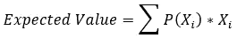
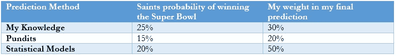

# 一个强大的框架来进行有利可图的赌注

> 原文：<https://medium.datadriveninvestor.com/a-powerful-framework-to-make-profitable-bets-e20fbeb8548?source=collection_archive---------2----------------------->

## 我的血型是 EV+

Photo by [Malcolm Lightbody](https://unsplash.com/@mlightbody?utm_source=unsplash&utm_medium=referral&utm_content=creditCopyText) on [Unsplash](https://unsplash.com/s/photos/chance?utm_source=unsplash&utm_medium=referral&utm_content=creditCopyText)

我喜欢打赌。但是真的，我喜欢量化我的决定。每个决定都有三个组成部分:

## 1.赌注的数量

## 2.风险

## 3.报酬

生活中的决定有不确定的结果。以下是一些例子:

1.  我应该去上学吗？
2.  该不该买房？
3.  值得约她出去吗？
4.  我应该买亚马逊股票吗？
5.  我应该赌新奥尔良圣徒队赢超级碗吗？是的，他们会的。

只有数字 5 是典型的赌注，然而所有的决定都是赌注。当你决定去上学时，你就拿你的时间和学费做赌注。然后是**奖励**:更高的收入潜力或知识来实现你的目标，比如建造下一颗卫星或治愈癌症。然而，你无法确定地预测 5-10 年后的结果，所以你要管理**风险**，因为每个决定都有可能产生不确定的结果。

我们的目标是从我们的决策中“获利”，但不一定是金钱上的收益。我们可以为我们的灵魂谋利；例如，孩子的喜悦或生活伴侣的安慰。决定仍然需要牺牲，所以我会教你一个框架，你可以应用到你的生活选择中。

# 像赌场一样思考——做长线游戏

在赌场赌博是一个失败的赌注，因为他们使每场比赛都无利可图。平均而言，尽管有一些“幸运”的顾客，赌场还是想赢。他们用 [**期望值**](https://en.wikipedia.org/wiki/Expected_value) **(EV)** 来衡量这个。

你将一个事件的概率与奖励或赌注相乘，并求和来计算期望值。

赌场只为客户提供负 EV 投注，所以如果一个客户多次进行相同的投注，他们就会输钱。**期望值衡量无限或多次做出决策时所有情景的平均支出**。让我们看一个概率不精确的例子。

# 几率意味着什么？

我是 NFL 的球迷，我支持新奥尔良圣徒队。我相信他们能赢得 2020 年超级碗，所以一个朋友来找我说:

> “我敢打赌，圣徒队今年赢不了超级碗，我给你 7:1 的赔率。我赌 70 美元，你赌 10 美元。”

我应该打赌吗？

我觉得圣徒队可以赢得一切，但我必须计算圣徒队赢得超级碗的概率。我可以根据我对足球、专家和各种来源的统计模型的了解来得出这个概率。谨慎的做法是结合各种方法来产生稳健的预测。

我将执行加权平均以找到最终概率。

**圣徒获胜概率=(0.25)(0.3)+(0.15)(0.2)+(0.2)(0.5)= 0.205**

圣徒有 20.5%的夺冠几率，所以他们有 79.5%的输球几率。

**EV =(0.205)($ 70)+(0.795)(-10)= $ 6.4**

这是一个正的 EV 赌注，所以我要赌一把，因为平均来说，我将获利 6.4 美元。如果你想更保守一点，你可以声称圣徒队只有 15%的胜算，所以自己计算 EV 吧。相反，通过查看 7:1 的赔率，有一个更快的方法。

## 隐含概率

赔率代表进行盈亏平衡下注的隐含概率— EV = $0。

1.  ***决定你是被看好还是被看好*** *。* 我赌 10 美元赢 70 美元，所以我是失败者。
2.  ***如果你是失败者，就取较小的数作为你的分子，如果你是被看好的，就取较小的数作为你的分子。*** 1 为失败者，7 为被看好者
3.  ***将两个数相加算出你的分母*** *。对于我们的例子来说，7 +1 = 8。*
4.  ***计算隐含概率的分数*** *。1/8 = 0.125 或 12.5%*

> 赔率意味着圣徒队有 12.5%的机会赢得超级碗。问题就变成了:圣徒赢得超级碗的概率比隐含赔率高吗？如果他们这样做了，你就下了一个积极赌注。如果低于 12.5%，你就是在赌输。

为了向自己证明这一点，使用 7:1 的赔率(70 美元对 10 美元)，计算圣徒获胜的 EV 为 12.5%，圣徒失败的 EV 为 87.5%。EV 将为零。

为了练习，让我们掷一枚公平硬币。如果是反面，我给你 5 美元，如果是正面，你给我 3 美元。计算隐含概率。你能明白为什么对我来说这是一个消极赌注吗？

## 警告:

1.  ***电动汽车的关键假设是多次试验*** 。你可能会输掉一场赌局，但如果你下同样的赌注，从长远来看你会赢还是会输？这种方法不能保证短期的成功。
2.  ***保证你可以进行多次试验*** 。你将在很长一段时间内获得收益，所以确保你不要把所有的现金都押在几个赌注上，因为你可能会输掉所有的赌注，并且不能再做任何未来的赌注。
3.  ***EV 依赖于你的准确预测*** 。在预测未来事件时，保持谦逊、诚实和客观。

# 生活中的应用

如果你不喜欢做金钱上的赌注，你可以把这个应用到任何决定上。我将提供一个简单的例子。

> 想象一下我在工作中喜欢的女孩。我应该约她出去吗？可能的结果:
> 
> 1.她拒绝了我，并向人力资源部举报了我。
> 
> 2.她礼貌地拒绝了，我们专业地处理。
> 
> 3.她接受了，我们开始了一次愉快的约会。

让我们用一个介于-5 和 5 之间的假设幸福量表来代替金钱，5 是最幸福的。让我们做些假设:

我已经和我的同事谈过了，我们关系很好，所以我怀疑她会向人力资源部举报我。让我们把情景 1 和 10%的可能性联系起来，在我的幸福量表上打 5 分。情景 2 有 50%的可能性在幸福度上是-1，情景 3 有 40%的可能性在幸福度上是 3。

**EV =(0.1)(-5)+(0.5)(-1)+(0.4)(3)=****0.2**

邀请她出去是积极举动！**

EV 是通用的。职业扑克玩家使用隐含的概率来下注。你可以将 EV 应用于投资——比较买房和投资亚马逊股票的 EV。

这是关于在生活中做出**简单**和**合理**的决定。你会有赢有输，但如果你尽职尽责，无论结果如何，你都不会后悔自己的决定。去长，冲洗，重复。