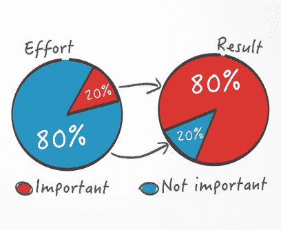
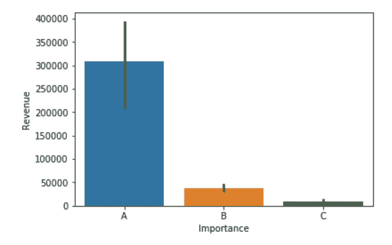
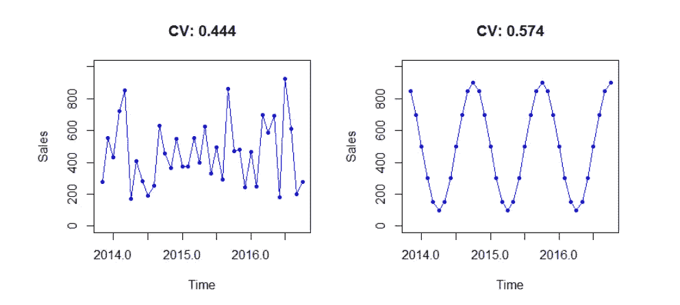
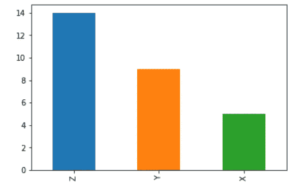

# 需求计划细分的强大工具

> 原文：<https://medium.datadriveninvestor.com/a-powerful-tool-for-demand-planning-segmentation-a66bfa729360?source=collection_archive---------2----------------------->

在需求计划和供应链管理过程中，选择性细分是一个强大而简单的工具，对于制定稳健的需求计划策略至关重要。[选择性细分](https://aditya-bhattacharya.net/2020/07/20/sales-and-demand-forecast-analysis/2/)在前所未有的时期更加重要，比如当前的 Covid19 场景。由于每个部门的资源和机会都是有限的，因此需求规划和供应链管理战略必须确保最大的收入和可用资源的最大利用率，以及将大机会转化为更大机会的集中能力，这一点非常重要！

ABC-XYZ Analysis for business strategy

在需求规划、供应链管理甚至销售预测过程中，在非常精细的级别上实施选择性细分的一个伟大技术是 [**ABC-XYZ 分析**](https://aditya-bhattacharya.net/2020/07/20/sales-and-demand-forecast-analysis/2/) **。** [ABC-XYZ 分析](https://aditya-bhattacharya.net/2020/07/20/sales-and-demand-forecast-analysis/2/)基于基本的帕累托法则或 80/20 法则，该法则解释了 80%的影响是由 20%的可用人口造成的。或者换句话说，据信全球 80%以上的财富仅由全球 20%的人口分享，如果我们更深入地研究这项研究，就会发现在大多数行业，超过 50%的财富仅由 1%的人口拥有，这令人惊讶，但也相当重要。 [***要获得 Python 中关于如何用自己的 set 实现 ABC-XYZ 分析的完整代码示例，请点击链接***](https://aditya-bhattacharya.net/2020/07/20/sales-and-demand-forecast-analysis/2/) ***。***

80/2o Pareto Rule

Pareto principle on Effort-Result Anology

那么，这个 ABC-XYZ 分析到底是什么呢？ABC-XYZ 分析由两部分组成:ABC 分析和 XYZ 分析。听起来很荒谬？实际上不是。抛开更多的细节，ABC 分析决定了所有项目的重要性。因此，这基本上是一种分组方法，您可以根据项目的重要性对其进行排序。现在，我们如何根据重要性对所有项目进行分组？我们如何计算重要性？正确答案显然是，看情况！这取决于不同的细分市场、不同的行业和不同的使用案例。让我们以需求计划为例，其中最重要的决定因素是每个项目或每个客户或项目和客户的组合所产生的收入。但有些人可能会认为，最重要的决定因素是订单的数量，而不是收入，因为数量在很大程度上取决于产品的价值。比方说，高价值产品可能订购数量较少，而低价值产品可能大量订购，但收入份额可能较少。因此，在这种情况下，我们将把产生的收入作为决定因素。因此，简而言之，为了计算重要性，或需求预测中的 ABC 分析，所有项目都按其收入份额进行排名，并分为 A、B、C 三个时段，其中前 20%的项目属于 A 类，接下来的 30%属于 B 类，其余 50%属于 C 类。听起来很简单？嗯，实际上是！ [**代码示例**](https://aditya-bhattacharya.net/2020/07/20/sales-and-demand-forecast-analysis/2/) **。**

Example of ABC matrix distribution

唯一的问题是，一些组织，根据产品的类型，或他们的市场，可能会考虑利润率，平均年销售额，营业收入等。而不是总收入来计算重要性。即使决定因素发生了变化，方法和原则仍然不变。因此，在进行 XYZ 分析之前，有几件事需要考虑，即 ABC 分析对所选的重要性指标、分割比例(10–30–60 分割，而不是 20–30–50 分割)和类别数量(有些人可能更喜欢使用 ABCD 类别，而不是 ABC)很敏感，但这都取决于实际使用案例。

现在，来看 XYZ 分析。现在，重要性本身不足以制定商业战略，因为有时重要的客户可能没有固定的购买或订单模式。简而言之，它们是不可预测的。因此，XYZ 分析是关于确定客户或商品的可预测性或可预测性。在进行粒度级预测或分析时，这是一个需要考虑的极其重要的因素，这也凸显了预测某些客户或项目的难度。XYZ 分析也是关于将整个组分成 3 类，X、Y 和 Z，其中 X 代表最可预测的组，Y 代表中等可预测的组，Z 代表最不可预测的组。

 [## 物联网解决方案如何改变供应链中的机遇|数据驱动型投资者

### 物联网(IoT)可能开始时规模很小，但它正在成为世界经济中的一个重要因素。事实上…

www.datadriveninvestor.com](https://www.datadriveninvestor.com/2018/11/14/how-iot-solutions-are-shifting-opportunities-in-the-supply-chain/) 

现在，又出现了一个与 ABC 分析类似的问题，是关于衡量可预测性时要考虑的指标。在需求计划的上下文中，基于数量的需求或客户订单可能是确定可预测性要考虑的最重要的因素，但它同样取决于上下文和用例。下一个问题是，我们如何计算可预测性并根据可预测性对项目进行排序？最受欢迎的方法是计算变异系数(CoV ),它实际上是计算标准偏差除以平均值的值(换算标准偏差)。但是从实践经验来看，我们经常看到这种方法的许多缺陷。这种方法只考虑历史变化，不考虑季节性，容易受到异常值的影响。根据经验，更好的方法是考虑预测的准确性，主要是通过使用实际值和预测值之间的平均绝对百分比误差(MAPE)。因此，我们的想法是考虑约 80%的历史时间序列数据来预测剩余的 20%时间序列数据，并将预测值与实际值进行比较，以计算 MAPE，然后通过预测模型 MAPE 值对所有项目进行排序，并使用类似的拆分比率，即 X 类的前 20%，Y 类的后 30%，Z 类的后 50%。同样，ABC 分析中的问题也见于 XYZ 分析中。另一个问题是选择预测建模算法。对于大多数具有季节性的时间序列数据，季节性 ARIMA 或萨里玛模型对于进行 XYZ 分析来说是足够好的。 [**代码示例**](https://aditya-bhattacharya.net/2020/07/20/sales-and-demand-forecast-analysis/2/) **。**

CoV is not a good metric for forecastability as it does not consider seasonality or any other typical predictable patterns within the data.

Example of XYZ Matrix distribution

现在，一旦对所有项目分别完成了 ABC 和 XYZ 分析，下一步就是合并这两个单独的分析，以得到一个完整的 ABC XYZ 分析，该分析将所有可用的预测或分析项目分成 9 个独特的组，即 AX、AY、AZ、BX、BY、BZ、CX、CY、CZ，并给出最终的 ABC-XYZ 矩阵，AX 是最重要和最可预测的组，CZ 是最不重要和最不可预测的组。虽然通常业务利益相关者对 BX、AY 和 BY 项目更感兴趣，因为他们可能会看到向 AX 推广这些细分市场的潜在机会！但是，我们将把这一范围留给业务利益相关方，让他们自己来制定这 9 个集群的战略。作为数据科学家，我们的范围将受到限制，直到这一分析和一些见解和建议！

总之，像 ABC-XYZ 分析这样一个简单而强大的工具实际上帮助我们根据项目的重要性和可预测性对项目进行分组，以便企业可以采取必要的行动和计划不同的战略来增加机会，并确保在资源有限的情况下取得最大的成果。此外，对于销售预测，进行粒度级预测通常很困难，因为预测准确性可能会受到粒度数据的偏斜度的严重影响(在大多数情况下，这种偏斜度非常大)。因此，ABC-XYZ 分析还有助于我们从所有全球项目中筛选出最重要和最可预测的项目，以便我们能够更加专注地提高最重要项目的预测准确性。 [**代码示例**](https://aditya-bhattacharya.net/2020/07/20/sales-and-demand-forecast-analysis/2/) **。**

> ABC-XYZ 分析有用的其他热门领域:
> 
> 1.市场分析
> 
> 2.电子商务洞察
> 
> 3.确定动态定价或订阅价值策略。

*要获得 Python 中关于如何用自己的 set 实现* [*ABC-XYZ 分析*](https://aditya-bhattacharya.net/2020/07/20/sales-and-demand-forecast-analysis/2/) *的完整代码示例，请遵循* [*链接*](https://aditya-bhattacharya.net/2020/07/20/sales-and-demand-forecast-analysis/2/) *。保持* [*关注*](https://aditya-bhattacharya.net/) [*我的文章*](https://aditya-bhattacharya.net/blogs) *详细了解这些概念，并随时向我发布关于您的* [*反馈*](https://www.linkedin.com/in/aditya-bhattacharya-b59155b6/) *的内容，以便我相应地做得更好！* [*请鼓掌让我知道我能帮助你找到！*](https://aditya-bhattacharya.net/2020/07/20/sales-and-demand-forecast-analysis/2/)