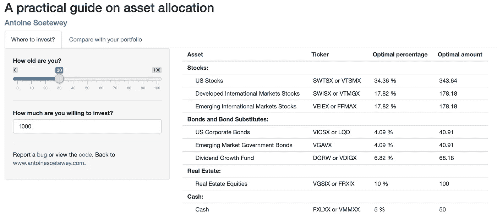

# 最佳资产配置实用指南

> 原文：<https://medium.datadriveninvestor.com/a-practical-guide-on-optimal-asset-allocation-fec7b210ff7b?source=collection_archive---------1----------------------->

## 根据本书改编 [*漫步华尔街*](https://www.amazon.com/gp/product/0393352242/ref=as_li_tl?ie=UTF8&camp=1789&creative=9325&creativeASIN=0393352242&linkCode=as2&tag=antoinesoetew-20&linkId=55f4165ca6155fa54d7cbde4fcf6ac23) ，伯顿·g·马尔基尔

A Shiny app with an example of optimal asset allocation

在他的书[*一次在华尔街的随机漫步*](https://www.amazon.com/gp/product/0393352242/ref=as_li_tl?ie=UTF8&camp=1789&creative=9325&creativeASIN=0393352242&linkCode=as2&tag=antoinesoetew-20&linkId=55f4165ca6155fa54d7cbde4fcf6ac23) 中，伯顿·g·马尔基尔建议读者根据年龄选择最佳的资产配置。作为一名业余投资者，我认为开发一个闪亮的应用程序来描述他对其他感兴趣的投资者的建议会很有用。这是该应用程序的链接:

*   [最优资产配置](https://antoinesoetewey.shinyapps.io/optimal-asset-allocation/)

以下是完整的代码，如果你想加强它(见一个例子，如何使用这个应用程序后，嵌入式代码):

*请注意，如果应用程序达到每月使用限额，链接可能会失效。如果是这种情况，请稍后再试。*

# 这个 app 怎么用？

1.  通过此[链接](https://antoinesoetewey.shinyapps.io/optimal-asset-allocation/)打开应用
2.  把你的年龄设在**以下你多大了？**
3.  表明你愿意投资多少

在右侧面板(或下方，取决于屏幕的大小)上，您会看到一个表格和一个条形图。该表包括:

*   代表不同分配的不同类型的资产
*   每种资产最常见的代号
*   每项资产的最佳百分比
*   每项资产的最佳金额

在表中，最佳百分比取决于你的年龄(年龄越大，投资组合越保守)，而最佳金额取决于你的年龄和你愿意投资的金额。

柱状图展示了每种资产的最优权重(也就是你投资组合的最优比例):股票、债券、房地产和现金。这只是上表中显示的“最佳百分比”列的可视化。

 [## 区块链会引发全球金融体系的动摇吗？

### 2008 年的金融危机表明(对一些人来说),大型金融机构需要被密切关注和…

www.datadriveninvestor.com](https://www.datadriveninvestor.com/2019/01/11/will-blockchain-trigger-a-shakedown-of-the-global-financial-system/) 

也可以像作者推荐的那样，将你的投资组合与最优投资组合进行比较。要进行比较，请点击**上方的“与您的投资组合进行比较”标签，您多大了？**。在此选项卡中:

1.  再次表明你的年龄
2.  然后指出你的投资组合中每项资产的价值(如果你不拥有特定的资产，让它等于 0)

在右侧面板(或下方，取决于屏幕的大小)上，您将看到您的投资组合的总金额，以及一个根据您的年龄比较您的投资组合和最佳投资组合的条形图。这种可视化将立即给你一个清晰的概览，与最优资产相比，什么类型的资产在你当前的投资组合中被高估和低估。这将让你很容易明白如何根据作者的建议重新平衡你的资产。

*披露 1:注意，这份关于资产配置的实用指南是根据伯顿·g·马尔基尔的书***改编的。本应用程序不包括投资建议或推荐，也不包括财务分析。此应用程序仅供参考，投资风险由您自行承担。我对基于本申请中包含的信息所做的任何决定或第三方对其的使用不承担任何责任。**

**披露 2:如果你点击了这本书的链接，并最终在 Amazon.com 上购买了一些东西，你就帮助支持了这个网站，因为我将获得销售额的一小部分。然而，与直接从亚马逊购买相比，你将支付完全相同的价格。**

*感谢阅读。我希望你会发现这个应用程序有助于快速复制伯顿·g·马尔基尔在他的书*中提出的最优资产配置。如果你想了解更多关于这种投资策略的信息，我建议你去看看他的书。**

**和往常一样，如果您有与本文主题相关的问题或建议，请将其添加为评论，以便其他读者可以从讨论中受益。**

****相关文章:****

*   **[一个闪亮的手工推断统计应用](https://www.statsandr.com/blog/a-shiny-app-for-inferential-statistics-by-hand/)**
*   **[一个闪亮的应用程序，用于简单的手工线性回归和 R](https://www.statsandr.com/blog/a-shiny-app-for-simple-linear-regression-by-hand-and-in-r/)**
*   **[用闪亮的 app 画字云](https://www.statsandr.com/blog/draw-a-word-cloud-with-a-shiny-app/)**
*   **[如何在 blogdown 中嵌入闪亮的 app](https://www.statsandr.com/blog/how-to-embed-a-shiny-app-in-blogdown/)**

***原载于 2020 年 1 月 7 日 https://statsandr.com***。****