# 实施数字化转型的实用指南

> 原文：<https://medium.datadriveninvestor.com/a-practical-guide-to-implementing-digital-transformation-20a8471e321e?source=collection_archive---------15----------------------->

如今，[数字化转型](https://en.wikipedia.org/wiki/Digital_transformation)不仅仅是一个时髦词。我们看到它对统计数据和收入清单的切实影响。[财富 500 强公司](https://www.accenture.com/us-en/company-event-wef-2017-digital-transformation-initiative)花了 20 年才获得 10 亿美元的价值。初创公司在不到四年的时间里就到达了目的地，扩大了“独角兽”群体。

数字技术为看似稀薄的空气创造了收入机会，现在在线公司处于商业食物链的顶端。重大的经济转型在不到十年的时间里发生了。最令人兴奋，但也令人生畏的是，这种速度不会变得更慢。所有尚未进入在线环境的企业都必须考虑加入。

# 数字化转型的定义

数字化转型是一个渐进的长期过程，允许企业实施在线创新，适应不同的市场，并适应新的利基市场。高速、生产力、敏捷性和可扩展性的价值是数字化转型的核心。然而，有许多关于数字化转型的[神话可能会让正在考虑这一改进的人感到困惑。](https://jelvix.com/blog/digital-transformation-myths)

使用数字技术的过程不再是一种竞争优势或自愿的发展。无论是 B2B 还是 B2C，这对于所有现代行业的任何企业都是必不可少的。甚至农业或建筑等非技术领域的公司也在积极拥抱技术进步。

# 通过构建路线图了解数字化转型的意义

公司不可能在一夜之间将技术转变引入他们的商业模式和市场。这是一个渐进的过程，建立在不间断的分析和测试之上。这一过程因企业而异，取决于公司的状况、定位、利基、与客户的关系以及成长阶段。

尽管如此，还是有一个统一的框架来收集数字化转型的关键步骤，这些步骤对任何公司来说或多或少都是一样的。这些是允许企业主基于他们的客户数据创建独特方法的构建块。

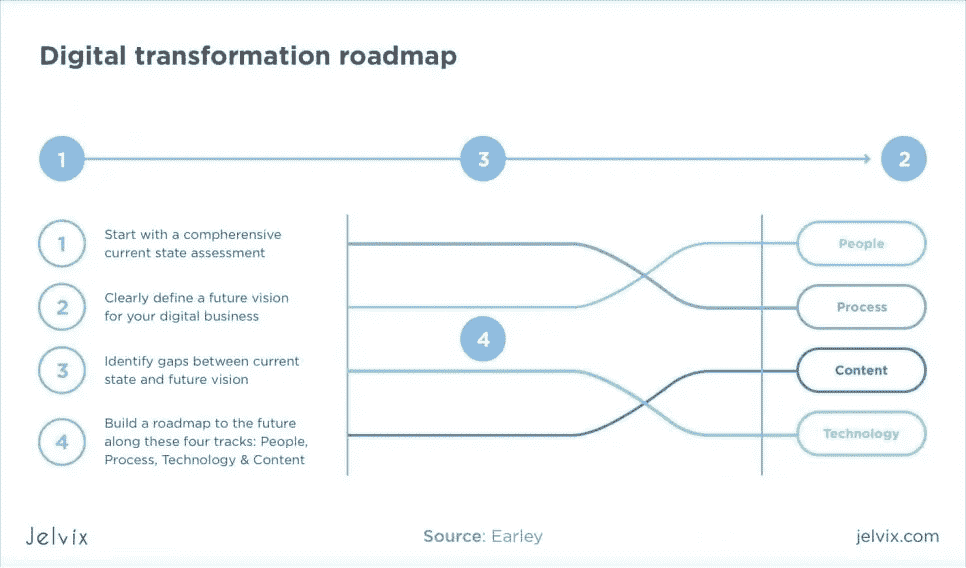

数字化转型基于三个普遍阶段。

## 1.商情分析

当一家公司开始数字化转型之旅时，其团队仍然必须继续日常运营——客户支持、产品交付、订单处理、物流。因此，确保数字化转型不会破坏当前的客户体验至关重要。

**如何准备无缝数字化转型？**

*   **研究问题** —了解数字化转型意味着什么，它需要您的团队提供哪些资源。
*   **定义痛点** —您需要概述您的服务中最需要转型的领域。例如，如果您不断收到关于交付速度的投诉，这就是您应该开始数字化转型规划的地方。可靠的线索通常在进行客户反馈评估和采访团队成员之后出现。
*   **优先考虑现有客户的满意度**。事实上，你的目标是未来的进步，这不应该分散你手头的事情。一个简单的例子:即使你正在重新设计你公司的网站，你也应该继续支持当前的版本，为它提供内容和技术支持。

当您完成这些关键行动后，您就可以开始为企业数字化转型的方法奠定基础，同时仍然确保您的公司运转良好。

## 2.在团队层面准备转型

很多公司在数字化转型道路上的通病就是裁员。企业主决定雇佣几名训练有素的专家，他们致力于建立一个技术驱动的公司，并将他们视为关键的利益相关者。其他团队成员不清楚发生了什么。

**如何向您的团队介绍数字化转型？**

*   用统计数据来支持你的主张。在你开始说服别人某个特定的策略之前，你需要确保你的方向是正确的。一个很好的起点是探索市场趋势、竞争对手统计数据、寻找参考资料——与你设想的公司类似的经历过这一过程的公司，并收集你的数据。
*   鼓励同事分享他们的经验。团队成员可以添加他们对棘手问题的独特观点，这些问题您可能不会立即考虑。
*   为每个团队成员分配数字化转型中的角色。一个人将负责提供客户数据，其他人将控制物流，而另一个人将通过转换跟踪财务状况的变化。

为了在整个转换过程中跟踪您的团队的意见，确保与整个团队进行定期会议，而不仅仅是有经验的“被选择的人”当然，让每个人都了解情况需要时间，但这是一项值得的长期投资。

## 3.是时候拿出系统了

一旦您确定了转型领域并向您的团队介绍了计划，就该开始规划切实的变革了。您需要为完整的转型设计一个大系统，同时为特定的棘手问题设计更小的子系统。

**如何规范改造？**

*   定义你的目标。它们应该是技术性的——你想开发和实施哪种在线工具(网站、移动应用程序、聊天机器人)——和财务性的——你期望多少回报以及转型能帮助完成多少交易。
*   **讨论度量标准。**我们建议使用看板管理器进行任务跟踪——您可以定义每周想要完成的工作量，并检查团队是否满足这些要求。有了谷歌分析，你可以检查转换和财务增长，这将直接与你的转型活动。
*   **保持参考收藏。**你需要分析成功竞争对手的策略，并采纳他们的想法。

# 数字化转型战略驱动因素

接近数字化转型可能会势不可挡。然而，一旦你将这个过程分解成四个驱动支柱，事情就会变得简单。

数字数据:收集有关市场和客户的信息可以评估风险并做出明智的决策。

**自动化**:将人工智能实施到业务运营中是必要的措施。通过这种方式，你可以将你的团队重定向到重要的任务上，而算法则处理平凡的工作。

**连接设备**:使用物联网和联合网络同步供应链，连接团队成员，并提供实时报告。

**新客户访问**:客户获得公司流程的透明视图，并直接与团队或智能聊天机器人交流。

团队不必只选择一个方面。尽管如此，最好还是一步一步来，逐步关注转型。你可以向各个方向发展，但重要的是要确定在某个特定时刻你的优先事项。

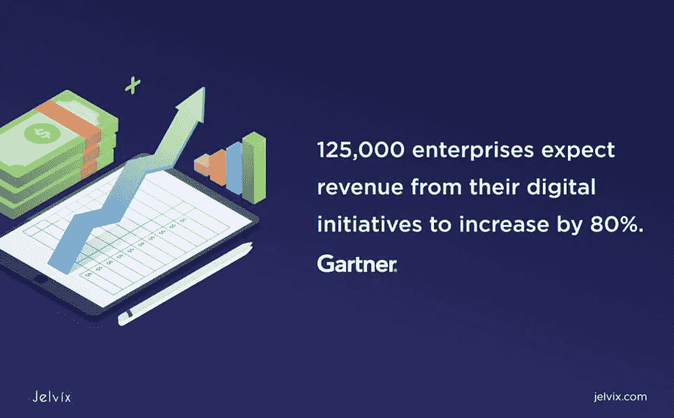

# 2021 年的数字化转型趋势

数字化转型建立在两个发展载体的成功结合之上:业务和技术。你需要确保你公司的组织流程不会阻碍技术变革的进程。

**商业数字化趋势**

*   CEO 领路:数字化转型应该始终自上而下进行。首席执行官应该对公司的发展有清晰的愿景，并且知道如何与团队分享这些目标。
*   数字化教育和日常过程中的软件实现。你需要将技术整合到沟通、任务管理和客户支持中；
*   [GDPR](https://jelvix.com/blog/how-to-comply-with-gdpr)——合规。在想出技术方法之前，确保熟悉隐私条例；
*   可扩展性。所有的数字实践都应该有增长潜力。考虑改变时，总是问自己——下一步是什么？

商业趋势应该在你开始投资技术进步之前就开始实施。然而，这并不意味着你不应该使用专业的帮助。在这里，您可以求助于经验丰富的 IT 顾问。

**技术数字化趋势**

数字化转型战略并不是从实施 buzz 技术开始的——这可能已经是最后阶段之一了。相反，公司专注于做出不那么重要的小改变。

减少技术债务意味着修复错误，去除多余的代码，使其可读。在开始新的东西之前，确保基础是牢固的。在开始构建新功能之前，投资于性能测试和重构。

*   向云迁移—数字化转型与大量数据息息相关。将所有这些存储在硬盘上既昂贵又不可靠。在转向创新之前，你需要转向云计算；
*   设置分析——为了让您的任何转换指标发挥作用，您需要确保您建立了 KPI 并创建了数据通道来检查您的进度。

在企业中，实施创新的责任应该在团队领导和数字化专家之间分配。让每个人都参与到这个过程中来，可以加速创新，降低最终成本。

# 数字化转型框架与数字化转型平台

很明显，成功的数字化转型不仅依赖于软件解决方案，还依赖于对流程的理论理解。一个不能替代另一个——你需要有一个框架和一个平台。

**数字化转型框架基于四个关键因素:**

*   流程转型——审查业务活动并使其适应数字化解决方案；
*   交易自动化——订单处理和付款完成应外包给自动化软件，而不是手动处理；
*   数字化应用——在某个时候，公司必须转向设备互联网络，发展其外部(公司到客户)和内部(内部管理)智能网络；
*   决策数字化-在您自动化了最原始的操作之后，是时候通过使用基于数据科学的见解和预测性人工智能来增强决策能力了。

你可以把这个框架作为一步一步的指南。不要急于实施所有四个方面，而是选择先完成较低的步骤。

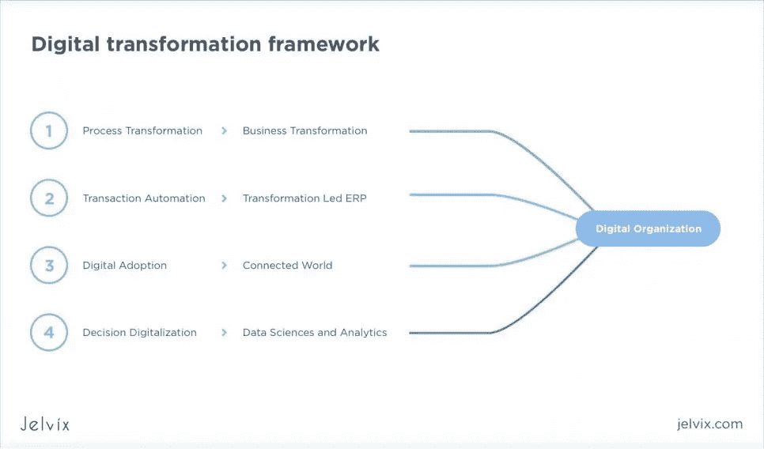

**数字化转型平台的架构**

数字化转型框架的每个阶段都对应于指导组织度过激烈变革时期的解决方案。

*   决策数字化分析——使用自动化大数据平台；
*   通过自动化系统进行流程改造— [CRM 平台](https://jelvix.com/blog/how-to-use-crm-effectively-5-things-you-need-to-know-about-crm)、任务管理工具、ERP 软件；
*   物联网推动[数字应用](https://blog.userlane.com/what-is-digital-adoption-definition)——你可以将智能手机、电脑、平板电脑和其他设备连接到一个网络；
*   基于人工智能的交易自动化系统——虚拟经理负责提供顺畅的订单管理并最终完成交易。

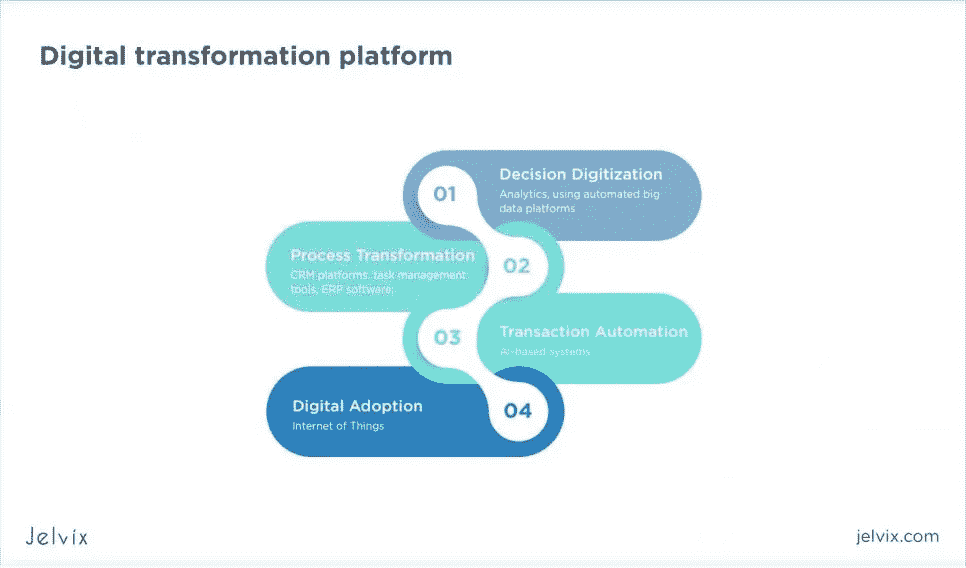

# 首席数字官是数字化转型之旅的领导者

首席数字官负责领导数字化转型。一些组织倾向于雇用新成员来履行数字化转型经理的职责，而其他组织则在内部填补该职位。可以选择最适合自己的策略。

**CDO 是:**的人

*   与首席执行官、部门领导和财务人员合作，制定公司战略；
*   确保客户利益是数字战略的核心，创建客户地图并详细描述客户的观点；
*   决定哪些技术项目应该继续或放弃，提供预算见解，并建立扩展计划；
*   分析趋势，衡量业务前景，与客户和合作伙伴保持联系，并重新审视现有战略；
*   承担风险— [Russen Reynolds Associates 调查首席执行官](https://www.russellreynolds.com/insights/thought-leadership/survey-of-corporate-governance-practices)显示，与其他类型的高管相比，CDO 更有可能具有破坏性和决心。

最重要的是，CDO 是一个拥有丰富 IT 数字化转型经验的人。这个人对公司未来 5 年或 10 年的发展有很强的洞察力，并且知道现在该采取什么措施来达到那个目标。一个好的 CDO 由强大的分析技能、软件开发专业知识和高水平的沟通能力来定义。

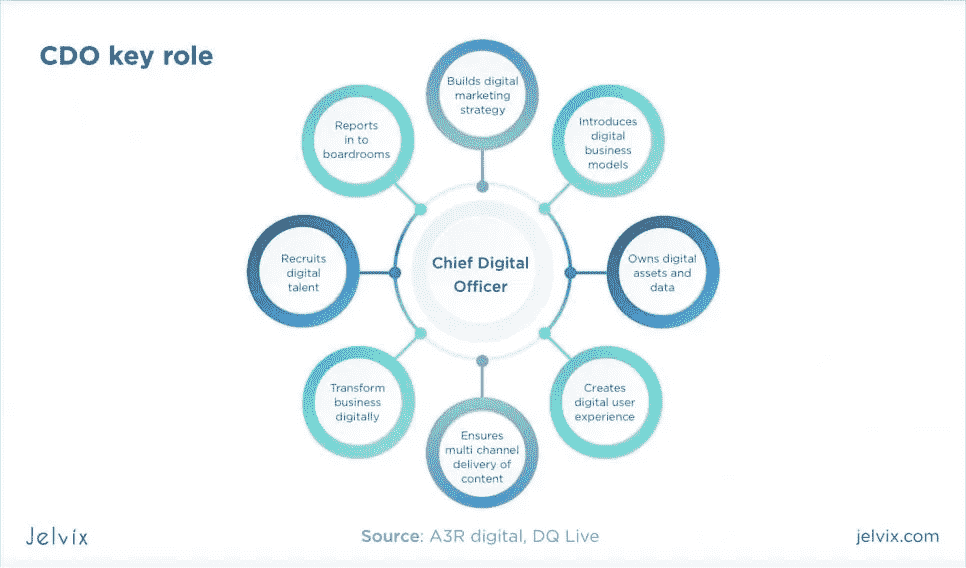

# 为什么数字化转型是必要的

也许你已经明白了——通过执行数字化转型，团队投资于公司的未来。然而，还有另一个更深层的视角。不仅仅是市场和竞争对手在增长，观众也在增长。新一代产品在市场上处于领先地位。千禧一代仍然领先，但也有新的参与者——z 世代。

# Y 世代和 Z 世代对公司有什么期望？

这一代人伴随着科技成长。这是他们思考、选择和购买的方式。如果一个公司不在网上开展业务，它就不能成为市场的领导者。新一代的期望和要求并不容易满足——这是一个有意识的一代，他们分析品牌的价值，希望在他们做的和购买的一切中有一个更大的目标，同时仍然努力追求便利。

*   新的客户体验——你必须提供新的机会，哇哦效应是 Z 世代真正的选择因素；
*   快公司是最好的——Z 世代快，它用自己的标准评判品牌；
*   Z 世代正在进入市场——他们不仅是客户，也是你的同事和竞争对手。了解 Z 世代的价值观将更容易雇佣有能力的团队成员，并预测竞争对手的动向。

有一件事是企业主不可避免要接受的——代沟在商业和生活的其他方面一样真实。很自然，Z 世代将会与科技相处得更好——他们的大脑天生会进行数字化思考。然而，这并不意味着你应该放弃——而是开始提前思考，做两倍的工作来适应这充满活力的一代的需求。

# 什么可以数字化改造？

数字化转型过程在许多层面上响应了新兴市场、客户和竞争对手的需求。商业的任何方面都可以数字化——而且有负担得起的方法。

## 一、客户体验

表面的业务转型是一个很好的起点。终端客户可以直接看到它们，并且可以快速实施。此外，处理这件事有多种方式，你可以选择最适合你的公司和战略的方式。

*1。全渠道通信*

现代消费者从多种数字资源中获取信息。十年前，在单一平台上与用户交流就足够了，例如网站。下一步是多渠道沟通——业务可以在移动设备和网络应用程序上进行——但每个渠道都是独立运作的。跨频道体验将这些不同的媒体结合在一起——你可以在任何频道上继续你离开的地方。

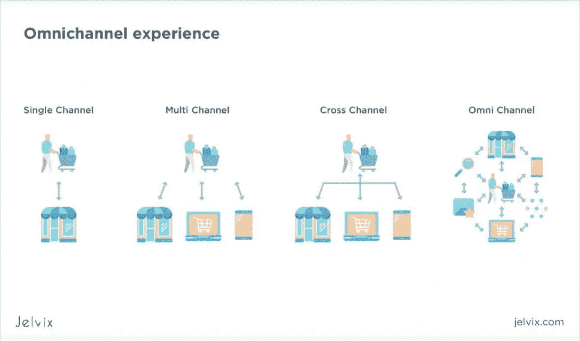

全渠道沟通使用完全不同的方法。该网站整合了社交媒体、电子邮件和搜索引擎。所有展示公司的媒体都应该有一个统一的策略。

*2。自助服务和物联网*

网上零售和线下商店正迅速转向越来越多的自助服务。探索创新的第一步是亚马逊的结账应用程序和 T2 的智能杂货店购物。很明显，这种趋势很受市场欢迎，并将很快被大大小小的公司广泛接受。

物联网是智能购物体验的巨大推动力。该技术将智能设备集成到一个网络中，将客户直接连接到商店的数据库，在他们的智能手机上清晰地显示产品。他们可以浏览目录，阅读和留下评论，购买，并获得后续。

**物联网自助服务如何在零售业实现？**

*   连接到公司计算机设备的自助式触摸屏——触摸屏将数据发送到公司的 CRM，实现自动报告生成；
*   互联应用和二维码——通过扫描二维码，访问者可以连接到企业的数字平台和特别优惠；
*   移动推送通知——很快，顾客只要进入商店，就可能自动收到推送通知。

到目前为止，物联网自助服务的实施依赖于 web 平台或触摸屏等久经考验的数字方法，但该领域的可能性是无限的。

*3。更好的客户细分*

当一家公司渴望提供广泛的数字功能选择时，市场认知度的重要性会成倍增加。你需要知道用户如何从一个特定的功能中受益，以及如何以个人方式传达你的优势。

这就是客户细分的切入点。任务是将目标受众分成更小、更易管理的群体。通过指定你的目标群体，你可以更准确地突出他们的需求，并为[营销活动](https://serp.co/university)选择特定的沟通方式。

细分是通过几种主要方法的组合来完成的:

*   **聚类** —基于数学算法分析的科学分割。根据客户之间的最小差异，您将目标受众划分为小群体——这些特征是原型的核心。
*   **复杂细分** —复杂的逻辑让你可以准备不同的用户场景，并与成千上万的变量一起工作——细分软件会根据用户对特定群体的亲和力自动对用户进行分类；
*   **行为细分**:公司分析客户的购买模式——品牌选择方面(首选产品或公司的关键特征)、寻求利益(什么优势最重要)、使用习惯(产品或服务如何使用)、购买偏好(例如，在线或线下购物)；
*   **生命周期细分**使用客户的年龄作为定义性的细分因素——公司看到了客户人口统计特征的精确统计数据；
*   **社会人口统计细分**与生命周期略有相似，只是它针对更广泛的特征；
*   **地理区域划分** —观众根据他们的位置进行划分；
*   **客户需求** —该系统使用基于需求的方法，如 Pareto 或 ABC，对客户的优先事项和需求进行分类；
*   **RFM** —这种细分使用客户忠诚度作为定义因素。顾客分为三类——最近(最近一次购买完成的时间)、频率(一个人购买的频率)、金钱(顾客应该有足够的资源来购买)。
*   **基于偏好的定制—** 系统分析客户的目标和优先事项，并创建复杂的个人资料。

使用这些系统中的任何一个都足以让您更深入地了解客户的特征、优先事项和可能性。有了这些数据，你可以创建个性化的、有针对性的广告，使聊天机器人人性化，并改善沟通。

*4。营销实验(MNG:变革管理)*

一旦你对你的目标受众细分有了一个精确的概念，你就可以开始实施解决方案了。然而，你不能期望升级的第一个版本是最好的。在大多数情况下，你需要尝试几个选项来找到一个最佳组合。

这是通过营销实验完成的，通过检查转化率来测试客户对创新的反应。

*举例:你想在你的网站上实现一个改变，有两个可能的修改。确定哪一个效果最好的最好方法是向 50%的用户展示选项 A，向另一半用户展示选项 B。例如，通过 Google Analytics 来衡量 KPI，你会得到一个关于哪个选项效果最好的切实想法。*

成功的数字公司实施基于实验的管理策略。每当设计一个新功能时，团队都会进行一系列测试，以获得切实的客户反馈。这种方法有一个既定的名字:MNG——基于变革的管理。

**MNG 基于 6 个关键阶段**

1.  识别—找到解决方案的第一步是在分析客户数据后识别问题。
2.  准备——这是构思和计划的阶段；挑战被分解成可管理的小块，每个小块都被单独解决，然后再组合成更大的画面。
3.  设计——团队对解决方案有了清晰的愿景后，就到了实施的时候了；这也是技术团队介入的地方。
4.  执行——这个阶段不应该和设计混淆，因为你不应该只有一个现成的特性，而是一个已经准备好投放市场的功能或界面。
5.  可持续性——维护是一项长期投资，因此尽早评估其成本和风险以及设计执行策略非常重要。
6.  监控——市场不断波动，您的客户需求也在快速变化。随时准备更新解决方案—通过分析营销 KPI 和直接的客户反馈，您可以获得更清晰的想法。

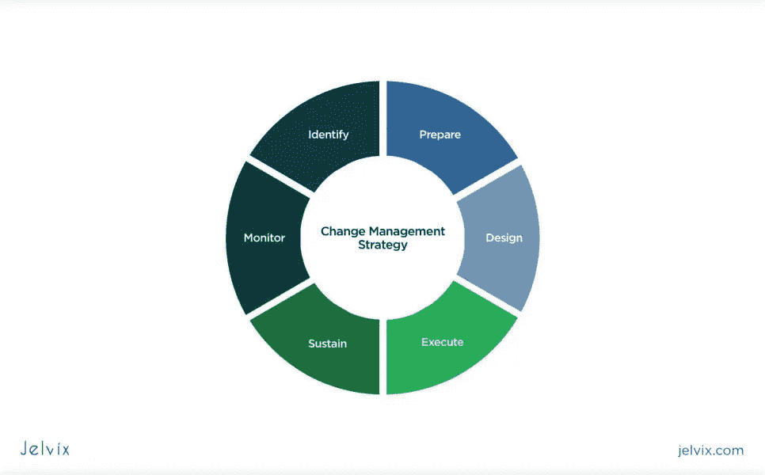

持续整合战略是构建可持续数字化战略的关键。请记住，你不是在寻找一个快速解决方案，而是一个长期的改善。这意味着规划应该是所有创新的核心。

*5。聊天机器人(NLP 聊天机器人，漏斗聊天机器人)*

[聊天机器人](https://jelvix.com/blog/how-to-build-a-chatbot)是未来咨询和客户互动的手段。尽管如此，还是有必要总结一下为什么这项技术在现代技术市场上变得如此突出——让我们看看它能带来什么好处。

*   快速反应:聊天机器人的使用减少了响应等待时间，缩短了完成交易所需的时间；
*   服务质量标准化:聊天机器人不会出现人为错误——它们不会很匆忙，也不会过得很糟糕。当有人参与咨询时，这些事情会破坏交易。
*   雇佣员工的投资更少——聊天机器人减少了工作量，使人类的“支持”几乎过时；
*   大众服务——一个强大的聊天机器人可以同时与世界各地的多个客户合作；
*   令人惊叹的效果——到目前为止，客户对聊天机器人没有太多期望，使用个性化的助理充分说明了公司的专业性；
*   新服务——聊天机器人不一定只是你的服务功能的附加组件。事实上，它们可能是整个商业模式的核心。

聊天机器人的这种多功能性是通过对不同的操作应用几种架构来实现的。让我们来看看两种最常见的聊天机器人类型——漏斗和 NLP。

**漏斗聊天机器人**

这些聊天机器人使用基于销售渠道的明确定义的对话模式——聊天机器人使用捷径，以尽可能最快的方式将客户引向积极的结果。

**优点**

*   易于构建——漏斗聊天机器人使用简单的对话地图，包含问题和答案；
*   Messenger 集成——这种聊天机器人可以很容易地连接到 Facebook Messenger、Viber、WhatsApp、Telegram 等。；
*   支付处理——你可以使用自定义模块将聊天机器人连接到银行的 APIs
*   详细分析——漏斗聊天机器人服务为其用户提供 PDF 报告；
*   成本相对较低；
*   这个聊天机器人是技术支持的最佳解决方案——只需准备最常见问题的答案。

漏斗聊天机器人是对话营销的起点。它们很便宜，实现起来很快，并且可以完美地完成简单的任务。

**自然语言处理聊天机器人(NLP)**

NLP 聊天机器人提供更精确的定制，更依赖于准备好的模板。这种助手倾向于聪明的即兴创作——客户可以提出一个意想不到的问题或一句开场白，聊天机器人将从单个单词中猜出意思。

**优势**

*   适应性——NLP 聊天机器人适用于所有类型的对话，没有严格定义的限制；
*   个性化报价——聊天机器人可以根据特定的客户查询提供定制的折扣或摘要；
*   类似人类的交流——NLP 聊天机器人不会用同样的答案吓跑用户，完全与问题本身无关；
*   WOW-effect——聊天机器人的自然交流在大多数网站和应用程序上仍然相当受欢迎，所以你有机会将创新带入市场；
*   长期投资——由于 NLP 非常依赖人工智能和数据科学，它将与这些创新携手前进是很自然的。

**两者之间如何选择？**

漏斗聊天机器人实现起来更简单、更快，但它们的对话能力有限。用户迟早会发现自己陷入了无创意的答案中——这肯定不会激发忠诚度。这是走向对话式营销的良好开端，但不是最佳的长期解决方案。

自然语言处理聊天机器人更加通用——它们依赖于实时短语分析，可以当场提出新的答案选项。他们提供个性化和定制的支持和优惠，使您的营销活动更加高效。然而，这些聊天机器人的设计和定制成本更高，对于简单的目的(如技术支持)来说，这可能是一项过度投资。

*6。自动通道*

数字化转型的基础是找到吸引和留住客户的新方法。如果你有一个自动漏斗——潜在的潜在客户转化为公司客户的必经之路，这个过程会变得简单得多。

销售漏斗有三个关键阶段:

1.  意识。从一个没有听说过你的公司的客户那里，潜在客户必须认识你的品牌名称。
2.  考虑。当客户评估购买时，您的公司将被列入潜在选项列表。这就是购买选择的理性成分的来源——客户有意识地比较所有品牌的优势，并挑选符合最迫切需求的品牌。
3.  转换。销售线索转化为客户的最后阶段。第一步是做决定——在这里，一个人联系你或留下订单。最后一个阶段是交易完成，直到付款完成。

对于每个阶段，公司都应该采用适当的沟通渠道。理想情况下，客户应该通过不同的方式与您联系。

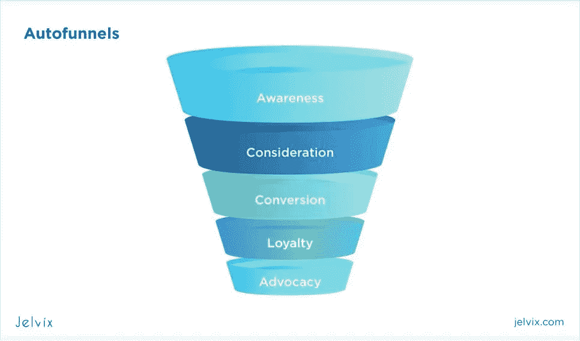

最常见的联系方式包括以下几种:

*   认知阶段的定向广告。脸书、谷歌、Youtube 的广告让潜在客户熟悉你的品牌，并对你的品牌产生特定的联想。这种第一印象的好坏，决定了接下来沟通方式的成功与否。
*   长时间接触。当一个人看到你的品牌被提及后，你的下一个任务是通过确保一个潜在客户访问你的网站、社交媒体页面等来延长互动。请确保在您的所有沟通中包含行动号召。
*   后续。鼓励你的客户注册一份时事通讯或者订阅社交媒体。确保所有这些信息都在你的网站上公开。
*   个性化联系。在这里，社交媒体页面和博客开始发挥作用。确保你选择了一种可信赖的交流方式——如果有任何问题，客户应该随时联系你。
*   开始对话。此时，线索应该在网站上留下问题，通过社交媒体联系你，或者在你的博客页面上写评论。在这一点上，你的目标是迅速回应和谈论客户的关切。
*   完成交易。在这里，你提出一个明确的商业提议。它可以是个性化的——通过电子邮件(通常在 B2B 中)发送的信息，或者自动生成打折的报价——适用于在线 B2C 存储。

我们鼓励您为不同的受众群体开发不同的自动化渠道，并使用聊天机器人或 CRM 等自动化解决方案来跟踪跟进和个人交流。

7 .*。人工智能质量保证*

我们已经讨论了为每一个计划的创新实施基于测试的策略的重要性。最棒的是，你不必手动运行这些检查。人工智能质量保证，通过一系列自动化测试，帮助你外包枯燥和重复的工作，让你负责设计策略和概述结果。

**自动化测试的好处**

*   应用程序的自动化结构——人工智能检查编写的代码，并将其整合到一个单一的架构中；
*   问题识别——自动化测试寻找技术问题，并在交互文件中报告它们；
*   关键用户路径——人工智能确定哪些功能部分对终端用户和进一步的应用维护最重要；
*   基于数据的自动化测试——AI 使用所有的信息为测试实现设计脚本。

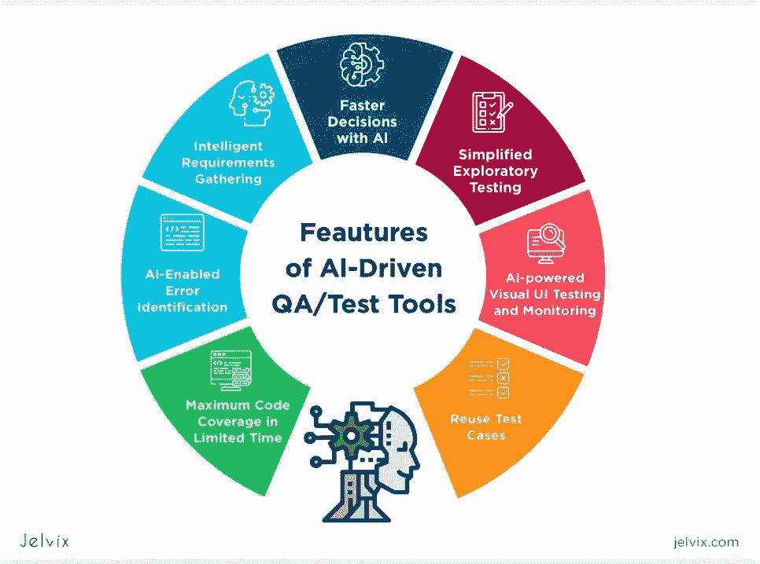

团队质量检查也可以采用类似的方法。

1.  AI 记录并分析从员工屏幕上记录的视频和音频数据，并确定客户支持的质量。
2.  人工智能创建了一个统一的数据库，管理人员可以随时查阅质量报告。
3.  AI 定义可能的问题，并检查所有接收到的关于这些“痛点”的数据

自动化质量保证为管理人员提供了切实的数据，使规划和投资更加透明。

*8。个性化:CRM、脚本、弹性价格*

为了跟踪多种沟通方式和受众群体，您需要在专用的文件管理器中存储和管理这些数据。最简单的解决方案是使用一个[客户关系管理软件](https://jelvix.com/blog/crm-application-functionality)。

**CRM 的可能性**

*   为所有客户联系人和潜在客户创建一个交互式数据库——这是一个您可以监控所有联系人和个人信息的地方；
*   提供个性化的优惠 CRM 可以根据客户活动和个人信息(生日、假期等)来分配折扣。；
*   个性化跟进 CRM 自动生成跟进信函，并按照规定的时间表发送；
*   衡量转化——你可以将 CRM 整合到你的分析中，看看哪些交流互动导致了购买；
*   记录和预测销售— CRM 跟踪成功的交易和收集的利润，为您提供定期报告和基于数据的预测。

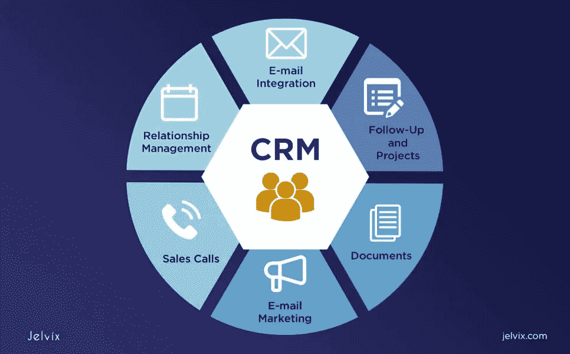

**最佳客户关系管理系统** : [Zoho](https://www.zoho.com/) ， [Salesforce](https://www.salesforce.com/) ， [Insightly](https://www.insightly.com/) ， [Pipedrive](https://www.pipedrive.com/) ， [Freshsales](https://www.freshworks.com/freshsales-crm/) 。

大多数 CRM 还支持额外的插件，这意味着您可以在开发的第一阶段根据您的业务行业调整内置功能。您可以下载适用于金融保健、零售、农业、技术和其他行业的加载项。

# 二。人事部门

转变您与客户的互动是向前迈出的一大步，但这不是数字化转型的唯一坚实基础。下一步是转变团队动力和管理方法。

*1。新数字企业文化*

新的数字化战略应该以全新的工作效率观为动力。你需要将技术引入到你的内部运作中，以你分配任务、衡量生产力、沟通和交换信息的方式。

**建立一个结果驱动的团队**

为了提高效率，你必须从基本的朝九晚五心态重新调整，把重点放在结果本身上。任务控制应该集中在质量评估和对花费的资源数量的测量上。

**敏捷管理方法论**——敏捷、SCRUM、精益生产、精益创业——基于持续的工作评估和优先级重估。工作日从定期的全体会议开始，团队成员在会上报告他们的进展并概述当天的任务。

*2。新的项目管理方法*

工作的效率由结果决定——每个员工都知道工作如何有助于转化、内部运作和客户满意度。通过将客户关系管理添加到组合中，您可以直接检查员工的行为对新销售额的贡献。

**敏捷软件**

*   任务跟踪: [Bitrix 24](https://www.bitrix24.com/) ，[特雷罗](https://trello.com/en)，[吉拉](https://www.atlassian.com/software/jira)；
*   时间追踪器— [轮毂斯塔夫](https://hubstaff.com/)、[吉拉](https://www.atlassian.com/software/jira)、[托格尔](https://toggl.com/)、 [TMetric](https://tmetric.com/) 。

这个软件为你提供量化的数据，显示你的员工工作了多少，他们取得了什么样的成就。

# 新的数字商业模式

从长远来看，如果你想创造一项新的服务或创办一家公司，从一开始就考虑实施基于数字的商业模式会更便宜。基于技术的产品吸引新的客户和投资者，你可以省去以后实施创新的麻烦。

技术改变了我们对业务和客户利益的思考方式。现在，您的客户寻求不同的优势，他们希望看到获得这些优势的新方式。

## 共享经济

基本的想法是，你不需要拥有一个产品来为客户服务。优步和 Lyft 的例子——运输公司不拥有任何汽车——为所有企业主树立了榜样。

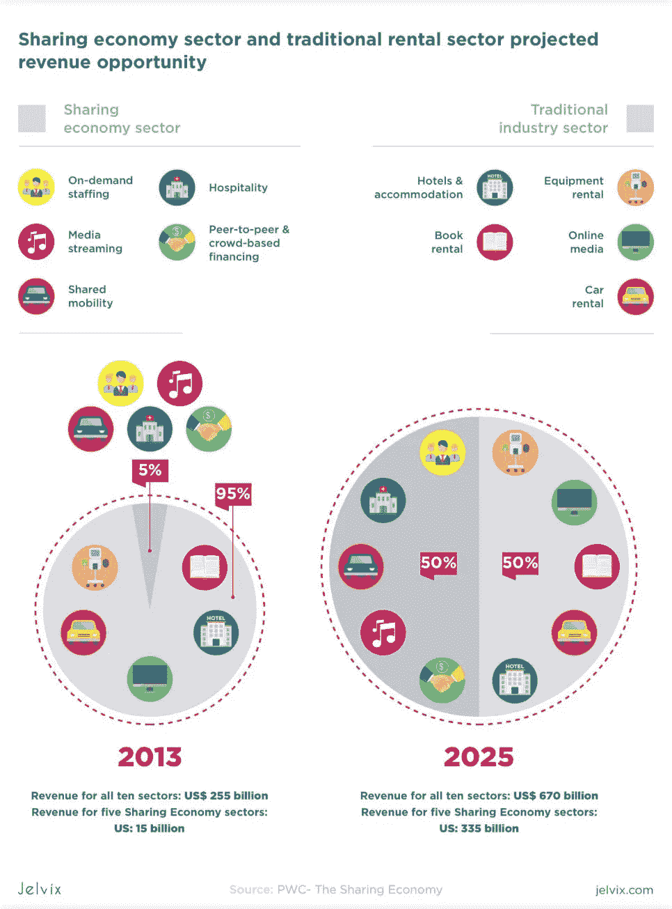

**成功共享模型的例子**

*   [BookMooch](http://bookmooch.com/) —一家允许人们租借图书的初创公司；
*   [Olio](https://olioex.com/) 和[food sharing](https://en.wikipedia.org/wiki/Foodsharing.de)——鼓励分享剩余食物用于营养、动物饲料和堆肥的公司；
*   [Kiva](https://www.kiva.org/) —向发展中国家的人们提供贷款，也是一种慈善方式；
*   [Fon](https://fon.com/) 是一家鼓励开放 WiFi 网络的创业公司，奖励用户无限接入全球数百万个网络；
*   [blabla car](https://www.blablacar.com/)——加入拼车，节省交通费用，优化用车费用。

共享经济几乎可以成功应用于任何领域，尤其是零售、住宿、送货和网络媒体。

## 外包，按使用付费，SaaS

你可以实现一种新的提供服务并获得报酬的方式。数字化转型催生了三种主要的服务分发方式。

*   外包—公司可以使用远程服务，而不是雇佣远程团队来进行软件开发、客户支持、测试和设计。你可以选择两个极端——外包耗时的工作，或者成为这类服务的提供商。
*   按使用付费——该服务为用户提供免费浏览功能，客户可以探索产品的演示版本。然而，为了实际使用产品或服务，用户必须为单次购买付费。
*   订阅即服务—您可以按月或按周向用户收费，而不是向每个客户收取一笔费用。SaaS 的例子有 Adobe 的 creative cloud、网飞、Audible、Youtube Premium 和其他基于订阅的服务。

这些商业模式都有一个快速发展的市场，但是如果你想在竞争中胜出，你需要快速行动。这些商业模式已经在市场上存在了 10 多年，你必须应对已经形成的竞争。

# 数字化转型创新

商业模式可以基于特定的现代技术，将其作为吸引客户和投资的竞争优势。我们已经看到基于人工智能的金融创业公司、区块链平台和物联网智能穿戴的崛起，这些公司在开始开发时就有明确的创新想法。

## 1.区块链

教科书对技术的定义是，它是一个分散的数字账本，用于多设备交易。每个参与者都在自己的服务器上创建自己的数据库，信息不会保存在单一的第三方存储中。

**区块链成功应用于多个行业**

*   金融科技:在进行免佣金的国际转账、制造加密硬币、存储金融记录等方面，区块链有大量尚未开发的潜力。；
*   教育:索尼全球教育最近推出了一个区块链平台，用于学校和大学的验证程序；
*   房地产——区块链租赁市场，每个对象都有经过验证的数据，不会受到黑客攻击；
*   医疗保健:该行业比任何其他行业都更依赖于安全的数据存储和交换——区块链可以支持统一的医疗数据库，并允许不同医院的医生安全地交换记录，病人将能够随时访问他们的个人资料。

[区块链](https://jelvix.com/blog/blockchain-transforms-industries)提供了一种更安全的数据交换方法，因为黑客没有一个潜在的脆弱点作为目标——要破坏网络，他们需要访问大多数联网设备。

## 2.嗡嗡声

预计到 2025 年，无人机市场[将达到 636 亿美元](https://www.prnewswire.com/news-releases/global-drone-service-market-report-2019-market-is-expected-to-grow-from-usd-4-4-billion-in-2018-to-usd-63-6-billion-by-2025--at-a-cagr-of-55-9-300839192.html)，多个行业将采用这些创新。下面我们就来看看投资无人机市场，哪些领域最能受益。

*   农业——无人机可以轻而易举地飞过数百公顷的区域，形成该区域的精确图像。通过智能软件，drowns 可以自动将这些图像发送到公司的存储中。
*   保险——无人机提供了一种可靠的方式来评估发生的损害，并向利益相关者提供事件的详细更新；
*   构造和架构——同时管理和跟踪它们的多个对象。此外，投资者和客户可以随时了解他们的建设进度。
*   物流——无人机通过及时交付库存和提供最后一英里的交付来应对仓库管理的挑战。

无人机的应用不仅限于这些载体——它们可以成功适用于任何类型的行业，在这些行业中，监控是优先事项。

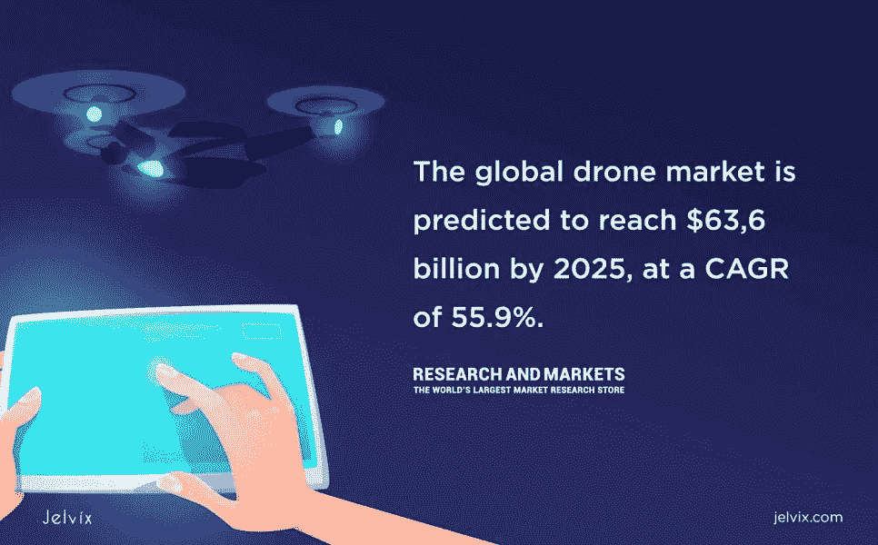

## 3.语音助手

Siri 和 Alexa 已经展示了智能语音助手如何提供接收信息和订购产品和服务的新体验。让我们来看看你如何将现有的语音助手整合到你的商业模式中。

*   旅游和[旅游](https://jelvix.com/blog/digital-transformation-tourism) : [预订服务 Expedia](https://skift.com/2016/11/30/expedia-debuts-amazon-alexa-voice-search-for-flight-status-and-car-rentals/) ，发布了 Alexa 扩展，为用户提供酒店预订更新、航班数据、租赁服务；
*   [电子商务](https://jelvix.com/blog/ecommerce-software-development-for-the-customer-base-management-automation)——公司可以为 Alexa 开发他们的客户服务插件——这些插件通常能够检查订单状态，联系网站用户，提供退货数据，等等；
*   酒店:一项全新的服务[“Alexa for Hospitality”](https://www.amazon.com/alexahospitality)允许客人管理他们的预订信息、结账时间、请求额外服务，并与工作人员联系。

这些只是语音助手如何拉近您与客户的距离、将您的业务融入客户日常生活的基本示例。在现实中，Alexa 和 Siri 的应用并不局限于这些行业——你可以很容易地找到一个针对你所在行业的预制解决方案，或者创建一个定制的扩展。

## 4.物联网

智能连接设备允许企业将不同的设备连接到同一应用程序或网页。您可以直接在设备之间发送请求，而不必执行手动操作。这种无缝集成允许将物理事物连接到设备，也可以创建智能衣服、化妆品、鞋子等。

这里列出了已经被物联网大规模破坏的行业。

*   交通——智能汽车可以相互通信，防止事故并发送有关道路安全的请求；
*   制造——物联网单元可以附着在制造的物品上，以跟踪其位置、发展阶段和物流；
*   农业——智能设备可以检测空气、土壤和水，控制水泵，监控员工效率；所有拣货技术也可以连接；
*   医疗保健——可以将 MRI 机、心脏监护仪和呼吸机连接到在线数据库，并无缝更新患者的状态。

物联网可用于增强任何在线解决方案，并将其连接到物理离线设备。这使得在任何行业中的应用可能性几乎是无限的。

## 5.3D 打印

据[福布斯](https://www.forbes.com/sites/tjmccue/2019/03/27/wohlers-report-2019-forecasts-35-6-billion-in-3d-printing-industry-growth-by-2024/#6adb913c7d8a)预测，到 2024 年，3D 打印市场的收入将达到 350 亿美元以上，年均增长时间超过 25%。这是未来的制造方式，也难怪各行各业的公司决定跳上船来。

*   教育——教师可以为学生提供适用于物理、工程、生物、化学和其他科学领域的逼真 3D 模型；
*   医疗保健——已经有公司在探索[打印出真实器官](https://www.techrepublic.com/article/3d-printer-turns-out-organs-that-act-like-the-real-thing/)的可能性，为医生和他们的病人带来教育和示范效益；
*   军事——3D 打印模型允许军队成功地在原型车辆、建筑物和物体中进行训练，它还具有突破性的防御应用，可用于保护平民；
*   时尚——也许不久我们就会在大众市场上看到印花服装；这是一种节约成本的生产方式，可以最大限度地减少人力资源支出。

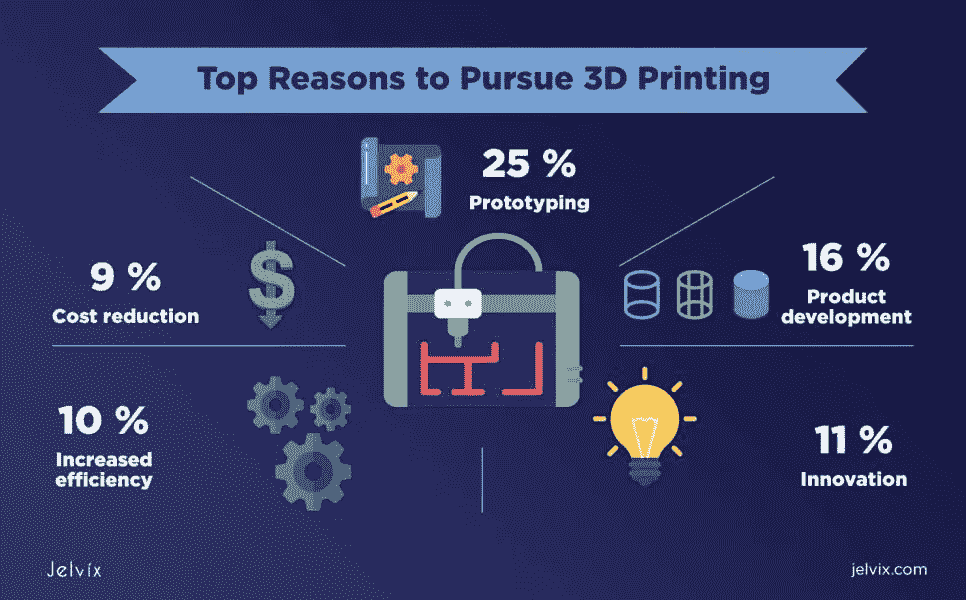

3D 打印可以应用于任何地方——从突破性创新到日常需求。最棒的是，它的潜力仍未被开发，这意味着你可以成为所在市场的领先创新者。

## 6.增强现实/虚拟现实

增强和虚拟现实已经达到了顶峰——这不是什么意义深远的创新；事实上，它已经在娱乐和制造业中被广泛探索。然而，这并不是说市场不能使用更多的创新——仍然有许多未开发的领域。为了理解创新的可能应用，让我们来看看在关键行业中应用的现有概念。

*   汽车:宝马和捷豹路虎使用虚拟现实来测试他们新车型的视觉设计，并执行基本的功能测试；
*   医疗保健:尽管医学界正在就 [AR 和](https://jelvix.com/blog/vr-vs-ar-vs-mr)VR 对人类大脑的好处进行辩论，但一些医院已经在痛苦的患者康复期间实施 VR 来缓解疼痛；
*   零售:易贝最近推出了虚拟现实百货商店，顾客可以在那里试穿衣服，测试我们的商品。不仅仅是时尚在改头换面。去年，易贝与澳大利亚零售商 Myer 合作推出了“世界上第一家虚拟现实百货商店”。这是购物的未来吗？
*   旅游:游客可以在买票前尝试度假目的地、住宿和景点。

虚拟现实允许最终用户在做出最终决定之前试用服务或产品。除此之外，它还可以作为一项服务用于娱乐或教育目的。

## 7.技术的生态系统方法

为了建立一个长期的数字业务，公司需要超越一个产品，而是考虑长期的实施。我们以 [Slack](https://api.slack.com/) 为例。

该应用于 2013 年推出，但该团队并没有停止成为当年增长最快的工具。相反，他们推出了一个完整的平台，开发者和项目经理可以在这个平台上创建和管理产品。他们分析了他们的目标受众，并在看到他们的大多数用户都在 IT 部门工作后，创建了一个专用平台来满足这些需求。

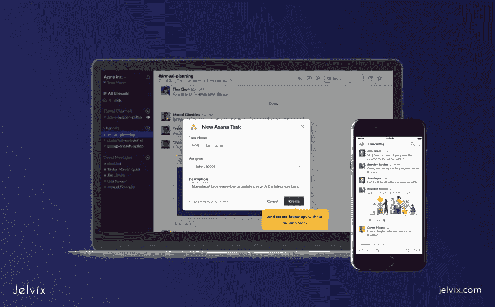

为了创造长期的解决方案，企业主应该考虑**以下几个方面**:

*   集成附加组件和插件——您需要让用户能够根据自己的需求调整功能；
*   创建跨平台解决方案—您希望能够将您的工具连接到其他服务；
*   创造额外的工具——你可以自己制作扩展，作为主产品的附加产品出售。

## 8.狭窄的利基市场

创建一个一劳永逸的解决方案已经不是一个有效的方法了。在未来，随着广泛的个性化趋势，看起来事情不会有太大的变化。如果有的话，利基市场将变得更加狭窄，公司需要比以往任何时候都更精确地定义他们的目标细分市场。

你可以通过**完成以下步骤**来确定你的定位

*   概述您的细分市场——设计您可以向每个细分市场提供什么样的独立产品和专业服务；
*   想出一套个性化的福利；
*   确保最终设计反映了你的目标受众的差异；
*   将您的支持团队分成更小的子单元，这些子单元将处理特定领域的特定请求。

不要试图同时创造多个利基产品，而是一个接一个地选择和实施狭窄的解决方案。

# 数据分析

数据分析使公司能够防止错误并避免财务损失。这是你计划和策略的核心。

**数据分析的主要功能**

*   数据基础—信息被实施到技术解决方案中，并积极用于内部运营—物流、仓库管理、营销等。；
*   报告——数据驱动的见解被汇编成报告，用于交流和制定战略；
*   绩效管理——公司收集关于团队效率的数据，并将初始 KPI 与交付的结果进行比较；
*   预测—分析识别有问题的错误；
*   规定性的——在检测到潜在问题后，系统会提出基于数据的解决方案；通常，这种系统还包括 ML 算法，该算法提供了对所收集信息的智能洞察。

## 会计和财务管理系统

自动化会计和财务管理工具为企业提供了预算、收入、支出和利润的及时更新。该软件的核心功能依赖于预算执行、报告、货币客户档案和税务文件。

这是任何规模公司必须做的投资。当收入流的数量随着常规投资而增长时，您需要跟踪所有已实现解决方案的可持续性。此外，您需要看到转换的货币结果。

## 系统:企业资源规划、文件流程、数字

ERP 是一个集中的平台，集成了所有主要的公司运营，从人力资源到物流或采购。它结合了 CRM、财务管理器和分析工具的功能。这是一个一体化平台，您可以在其中访问多个内置工具。然而，使用 EPR 的缺点是这种系统太复杂——员工需要时间来适应广泛的功能——并且昂贵。

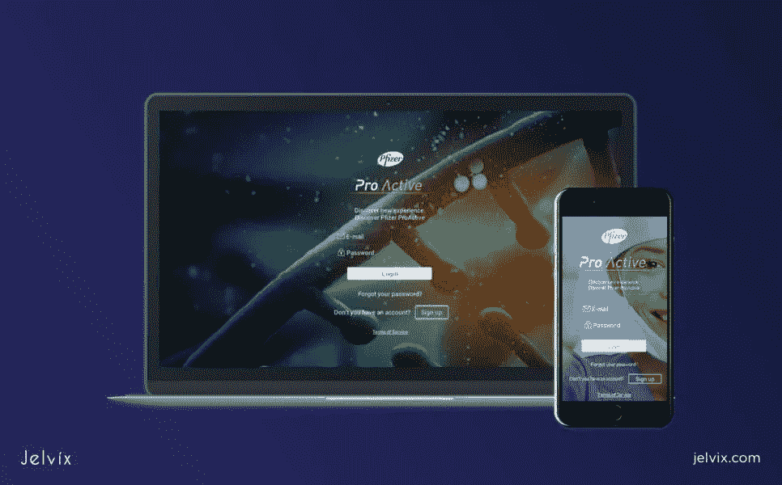

对于文档管理，最好使用专用软件——它将提供更丰富的定制选项，并且比复杂的解决方案成本更低。文档管理的主要方法是文档流，这是一个自动化文档创建、编辑、管理和存储的数字活动系统。

## 提取转换负载

该软件不能替代统一数据管理框架——请记住，数字化转型既依赖于框架，也依赖于技术实现。对于成功的创新，你两者都需要。

最常见的数据管理框架被称为精确转换加载或 ETL。该框架分三个阶段工作。

1.  提取—从数据库中提取数据。从不同的渠道收集，准备加工。
2.  转换—处理提取的数据；通常，这意味着文件大小或格式的改变。这一步使数据与其他数据库或算法兼容。
3.  加载-将提取和转换的数据加载到最终数据库中。

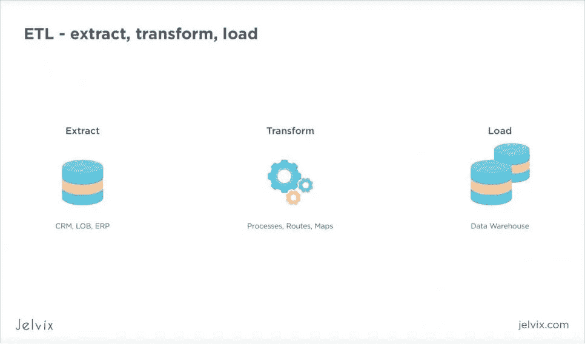

**使用 ETL 的理由**

*   该系统允许从不同类型的数据库中读取数据，并同时传输数千个对象；
*   您可以连接各种库及其元数据存储；
*   维护要便宜得多，因为你总是可以根据操作自由地将数据从一个存储器发送到另一个存储器。
*   ETL 最适合复杂的数据操作——如果您有多个数据集，您需要将它们放在一个分母上——ETL 非常适合这种目的。

## 商业智能和描述性分析

描述性分析致力于为单个数字提供具有多个上下文的详细报告。例如，如果您想要生成一份销售报告，描述性分析软件不仅会计算该部分，还会分析与上个月、上个季度和上一年相关的这些数字。您还将看到为了达到这样的结果花费了多少时间和金钱。

你可以使用现成的解决方案，如 [Sisence](https://www.sisense.com/) 或 [Alteryx](https://www.alteryx.com/) ，或者构建一个定制的描述性 API。事实上，第二种选择通常效果更好，尽管它更贵。从长远来看，您希望拥有一个与您的业务规格相符的量身定制的分析软件。分析是一个非常特殊的领域，方法和算法因公司而异，不同领域之间的差异甚至更大。

## 人工智能用于分析

人工智能和机器学习算法非常适合个性化分析。如果企业主和经理不确定公司的发展方向，他们可以依靠这些聪明的见解，或者使用这些见解来定义下一步行动。我们来看一些商业智能中 AI 应用的例子。

*   HubSpot 使用人工智能进行内容管理，以确定潜在客户的兴趣，并根据他们博客的分析定义潜在的有趣话题；
*   Pinterest 将机器学习应用于他们的内容交付、广告设置、垃圾邮件审核和内容分析；
*   TrademarkVision 使用人工智能分析来获得对与注册商标相似的徽标的见解。

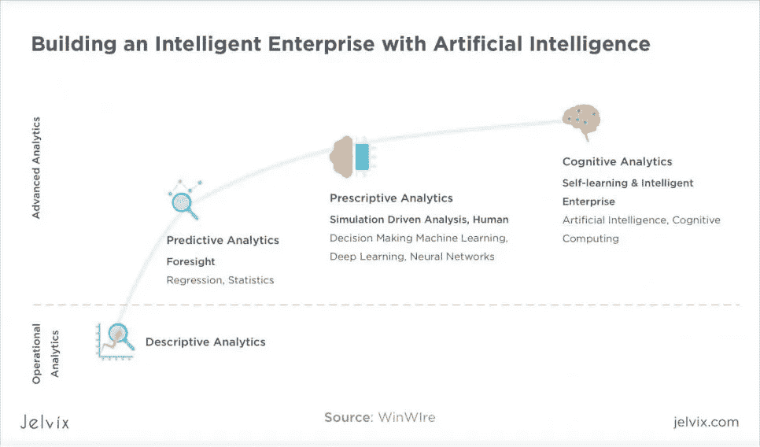

**如何使用人工智能进行分析？**

*   AI 行为分析——人工智能可以跟踪用户在网站上的行为，并提供见解；
*   绩效管理——人工智能在决定团队成员的生产力方面做得很好；它还可以提供关于提高员工绩效的个性化建议；
*   推荐系统——业务经理不可能在公司管理的所有领域都是专家；你不可能在同样高的层次上了解软件开发、物流、制造细节、广告零售细节。AI 可以缩短这种差距，并为企业主提供关于他们“薄弱”点的建议。

然而，值得考虑的是，即使基于人工智能的分析是公正的，实施它们的人也可能不是。因此，你需要意识到你自己的决定，并确保它们不与基于数据的见解相矛盾。在依靠技术和追求自己的主动性之间找到一条细微的界限需要时间和训练——尽管现代系统确实使计划变得容易得多。

# 结论

数字化转型是一个基于不断构思和测试的持续旅程。一个公司实施一项创新后就不能停下来。事实上，新技术项目应该一直在进行中。否则，该业务很难取得长期效果。

在你把创新带给客户之前，你需要在你的团队和组织中实施变革。从将创新工具引入你的时间和项目经理开始。员工应该知道公司的长期目标是什么，以及他们的目标和资源如何发挥作用。

从创新与客户互动的方式开始—实施 CRM、大数据分析和聊天机器人。你可以开发一个完全基于创新方法的新产品。

公司可以通过多种途径实现数字化转型。决定战略起点的最好方法是分析你的市场和客户。寻求紧急问题的解决方案，并利用技术优化您的工作流程，这应该是您的首要任务。Jelvix 是一家数字化转型公司，帮助您了解数字化转型计划中固有的复杂性。

*最初发表于*[*【https://jelvix.com】*](https://jelvix.com/blog/how-start-digital-transformation-of-business)*。*