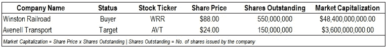
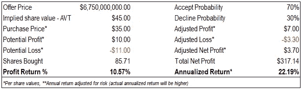
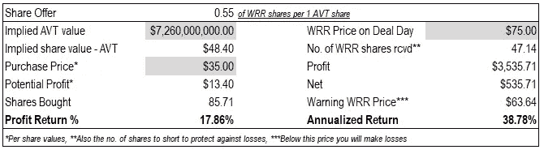
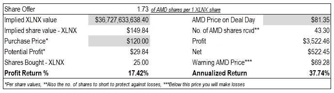
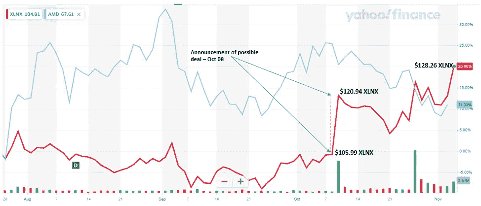

# 合并套利入门

> 原文：<https://medium.datadriveninvestor.com/a-primer-on-merger-arbitrage-28106ef2a584?source=collection_archive---------3----------------------->

## 了解如何通过简单的策略将你的投资组合回报率提高 10%以上

## 什么是合并套利

与私有公司不同，上市公司在各自国家的金融市场上市，而且通常在不止一个交易所上市。组织通常使用公司上市的方式来筹集更多的资金，以扩大和发展业务或确保其保持运转。让公司上市的其他好处包括，能够将股价作为公司业绩的晴雨表，以及开辟更多获得贷款的渠道(也就是更多资本)。

然而，公司上市也使其暴露于金融市场及其监管机构的变幻莫测之中，因为管理层将无法单独采取行动，而且公司将必须遵守金融监管机构制定的各种政策。此外，最重要的是，这也为公司被收购(即被另一家公司收购)打开了方便之门。如果管理层和董事会由创始人或在公司投入大量时间的人组成，这通常会令人心痛。

瞄准、收购或合并另一家公司的理由有很多。在一个非常基本的层面上，它可以分为 1)战略买家 2)金融买家 3)袭击者/积极分子。

通常，这种公司行为(见下文)通常是在金融新闻中宣布。正常情况下，目标公司的股价上涨(或下跌)至设定的要约价格(通常是公告的一部分)。因此，合并套利就是快速购买目标公司的股票，并在价格上涨时卖出。在我们进入细节之前，让我们先回顾一下要点。

## 基本术语

让我们先来看看在这篇文章中我会用到的基本术语

*   **套利**——零风险或几乎最小风险赚取或产生利润的能力。
*   **买方/收购方**——向另一家公司发出收购要约的公司
*   **目标** —买方采购投标的目标组织
*   **合并——两家公司合并成一家公司的情况。**
*   **收购** —企业(公司)收购另一家公司的过程。购买可以通过现金、股票或资产结算
*   **友好/敌意收购** —目标公司不想被买方公司收购的情况属于敌意收购。一场友谊赛
*   **要约收购**——买方直接向目标公司的股东而不是董事会管理层发出要约，以增加其股份的情况。自我要约收购是一家公司向自己的股东发出的回购股票的要约
*   **现金收购—** 购买者向目标公司支付现金的收购或合并
*   **股票报价—** 与现金报价相同，只是向目标公司提供一定比例的买方股票作为交换
*   **做空—** 做空一只股票，或者更简单地说，押注这只股票的价格会下跌

## 从哪里开始—流程概述

**新闻来源&公告**

假设我们是个人投资者，不像金融界的大男孩和女孩(读机构投资者),我们没有 24×7 跟踪市场的奢侈，那么首先要做的就是关注和了解最新的金融新闻。

因此，如果一个人有一个只允许在美国投资的经纪账户，那么寻找有关在纽约证券交易所或纳斯达克上市的公司的新闻会更有意义，因为只有在这些交易中，我们才能寻找套利机会并采取行动。如上所述，人们可以查看各种新闻来源。我经常去的有 [WSJ](https://www.wsj.com) 、[雅虎财经](https://ca.finance.yahoo.com/)、 [MSN 财经](https://www.msn.com/en-ca/money)、[汤姆森 One](https://www.refinitiv.com/en/products/thomson-one-wealth-solutions) 。其他来源包括 [CB Insights](https://www.cbinsights.com/) 和 [Factset](https://www.factset.com/) 。

**验证和分析**

一旦新闻被确定，下一步将是与其他新闻来源和网站核实新闻。我上面提到的新闻来源是非常值得信赖的网站，它们的报道可能非常准确。

核实后，我们将对目标公司的股票进行快速分析，并计算我们通过套利机会获得的潜在回报。为了进行分析，请留意新闻公告中的交易条款。

在这个阶段，我们将决定出售股票的价格。

**购买&出售股份**

分析后，谨慎购买有问题的公司/目标的股票。建议至少投资 1000 美元，或至少投资 500 美元。较低的金额会吃掉你的利润，因为佣金和税收，从而减少你的净收入。

**重复！**

当一个人获得套利经验时，他/她可以设计个人技术来进行分析或策略来利用套利机会。

现在让我们看两个简单的合并套利例子。出于本文的目的，让我们看一个派系所有现金和所有股票交易，然后是一个活生生的案例。

## 例 1:全现金交易

**新闻&分析**

假设有两家虚构的公司，温斯顿铁路公司和阿文内尔运输公司，它们的股票代码分别是 WRR 和 AVT。假设 Avenell Transport 的股票在第 0 天(D+0)上午 8:30 的交易价格为 24 美元。上午 9 点 45 分，新闻传来，WRR 希望以 67.5 亿美元的全现金交易收购 AVT。让我们也假设你碰巧有一种直觉，认为这笔交易有 70%的可能性被接受，30%的可能性被拒绝。

这意味着 WRR 对 AVT 股票的估价是每股 45 美元，而目前的价格是每股 24 美元。声明一发布，股价就可能开始向 45 美元靠拢。因此，我们打算以尽可能低的成本在 AVT 持有一个头寸。然而，在我们下订单之前，我们会对我们的潜在回报进行快速分析，以计算我们的潜在利润。

这里，我们假设我们以 35 美元的价格购买了 AVT 的股票，因为在我们的分析中损失了时间(你可以通过在这里下载电子表格，或者更好——创建你自己的表格来节省时间)。此外，我们通过将概率乘以潜在的上涨和下跌(下跌=购买价格-初始股价)来调整我们的净利润，假设您在大约 6 个月后平仓，并在交易中投资 3，000 美元，则我们的利润为 318 美元，年回报率为 22.2%。请随意摆弄我表中的值，以便更好地理解计算。需要您输入的单元格以灰色突出显示。

## 示例 2:股票报价

为了这个交易的目的，再次考虑 WRR 和 AVT。除了在这种情况下，WRR 向 AVT 提供 0.55 股 AVT 股票(也就是说，每持有一股 AVT 股票，你将获得 0.55 股 WRR 股票)。假设在公告日，WRRs 的价格是 88 美元，这意味着 WRR 对 AVT 的估价是 48.40 美元(0.55 x 88 美元)。这里的关键是，这笔交易取决于 WRR 股票的价格，而股票价格在每个交易日都会波动。

假设你以 35 美元购买 AVT 股票，而 WRR 股票在交易日的价格低于公告日的价格(75 美元对 88 美元)，你将获得 535.71 美元的净利润。警告 WRR 价格将表明在 WRR 股票的哪个价格你将亏损。为了克服/对冲这种风险，可以做空 47.14 股 WRR 股票，并在最后一天(如果不是更早的话)进行交易和平仓。这项交易的年回报率为 39%。

**注意——对于两个 tx，我假设佣金为 0 美元。您可以在电子表格中为自己的计算进行更改**

## 真实世界的例子

据《T2》彭博 10 月 8 日(T3)上午 7 点报道，AMD 正在谈判以 350 亿美元的全股票交易收购 Xilinx。因此，AMD 将为每股 Xilinx 股票提供 1.72 股自己的股票，这意味着 XLNX 的每股股票估值为 149.84 美元。如果一个人迅速行动，以 120 美元的价格投资 3000 美元到 XLNX 股票，他可以在这笔交易中获得 38%的年化利润(0 佣金成本)。

从 10 月 8 日 AMD 和 Xilinx 之间潜在交易的报告日期开始，跟踪两家公司的图表也很有趣。可以看到，XLNX 股票在一天之内跃升至 120.94 美元

由于这是一个股票报价，只要 AMD 的价格徘徊在 80 美元左右，可以肯定 XLNX 的股价可能会达到 140 美元左右。运行数字(见上图或电子表格)将允许计算潜在的未来回报，如果一个人投资的机会。即使在今天，如果我们以 129 美元的价格购买 XLNX，而 AMD 的价格徘徊在 79 美元，那么 7%的回报率是可以获得的。你可以在这里阅读更多关于这笔交易的[。](https://fortune.com/2020/10/27/amd-acquire-xilinx-35-billion-deal/)

## 总结想法

我希望每个人都注意到这样一个事实，即从事此类交易存在各种风险，作为个人，你可能会与拥有数千美元终端和新闻来源的机构投资者竞争。

话虽如此，这无疑是一个值得关注的有趣话题，尤其是因为沃伦巴菲特(Warren Buffet)等著名投资者也通过套利策略提高了他们的投资组合回报。配合[正确的投资组合分配](https://sanketkarve.net/building-an-optimized-portfolio-using-python/)，这可能是你的制胜策略。

最后，我希望这本关于合并套利的简单入门书已经让你对这种做法有了初步的了解，并且我希望这已经激起了你进一步探索这种做法的兴趣。

*原载于 2020 年 11 月 5 日*[*【https://sanketkarve.net】*](https://sanketkarve.net/a-primer-on-merger-arbitrage/)*。*