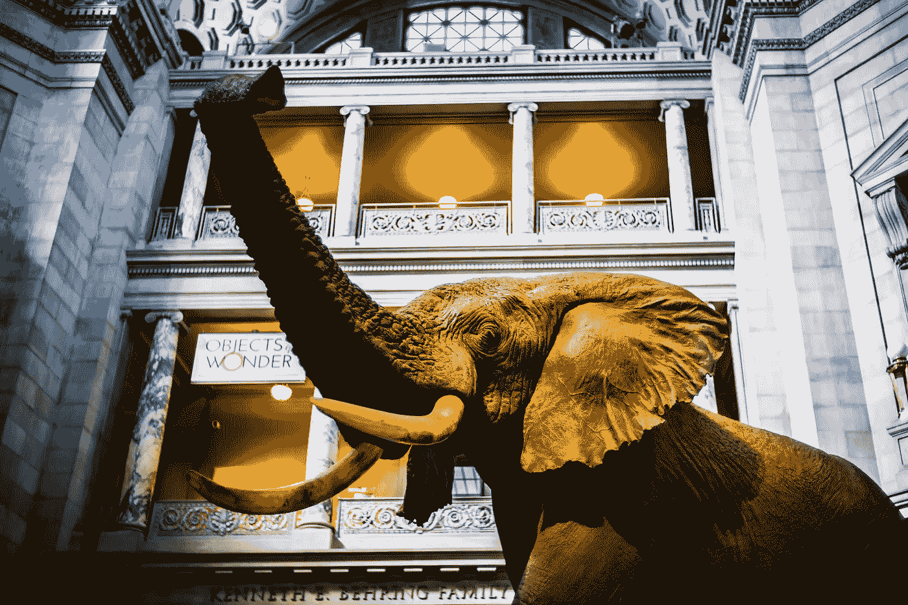

# 如果你是一个企业家，这是一个永远不会失败的完成大项目的程序

> 原文：<https://medium.datadriveninvestor.com/a-procedure-that-never-fails-to-accomplish-big-projects-if-youre-an-entrepreneur-30519762cd82?source=collection_archive---------26----------------------->

## 一个简单易行的吃掉一头大象的过程

Photo by [David Watkis](https://unsplash.com/@david_watkis?utm_source=unsplash&utm_medium=referral&utm_content=creditCopyText) on [Unsplash](https://unsplash.com/s/photos/elephant?utm_source=unsplash&utm_medium=referral&utm_content=creditCopyText)

# 尺寸很重要。

这是你(和我)深藏在脑中的一句话。我不知道为什么…

大事对你来说似乎深不可测。

> 无论怎么看，大象就是大象。

不要感到内疚。我们都这么想。

要点是这样的:为了实现人生的圆满，让你的存在有意义，你需要完成“大”的事情。你感到自豪的项目。尤其是如果你是一个企业家。

# 你是做什么的？你如何处理这种情况？

我想知道为什么我(和你一样)会有这种感觉，并寻找解决这个问题的方法。

在我的旅途中，我发现了一些东西。在谈论小事时，我没有那种感觉。

> 不管我有多少件小事，我都能处理好。

这让我不得不打破常规。如果我必须把一个项目分成一百万个小块，我会去做。

但这也有点让人不知所措。

想想“打破流程”会让你直接取消项目所花费的时间。

# 我走了另一条路

我决定把这个项目分成几个大的阶段。

那就简单多了。

> 所有的项目都可以分成几个阶段。

我们的大脑很清楚也很容易想到，“我必须这样做，过一会儿，我必须那样做……”。

这对我思考可交付成果也有很大帮助。每个阶段后我想要(或需要)拥有的东西。

例如，如果你想建造一座大楼，你首先得找一个地方建造它。

> 使用 coherence，你会发现任何项目的所有主要阶段。

作为人类，我们擅长想象一个连续的过程来创造东西。

不细说了。画大线。

这些阶段将有一个执行顺序。

只关注第一个，忘记其他的。在这一点上，它们根本不重要。

 [## 取代你的风投？企业家的 5 条原则|数据驱动的投资者

### 在 Tau Ventures，我们建议所有企业家将融资过程中的勤奋过程视为双向的…

www.datadriveninvestor.com](https://www.datadriveninvestor.com/2020/11/29/replacing-your-vc-5-principles-for-entrepreneurs/) 

# 管理第一阶段

现在你算是解脱了。

你的大项目要小得多。你向前迈进了一步。

开始觉得可以控制了。你感觉更舒服了。

> 专注于第一阶段。

是不是太大了？如果是这样，再重复一遍这个过程。

迭代永远是生活中的关键！

现在，你有一个你可以控制的舞台。不是压倒性的。让我们再次前进。

# 创建任务

开始思考完成第一阶段需要完成的所有任务。

忘记它们应该被完成的顺序、持续时间和时间。把它们都写下来。

让你的大脑空着。感受那种神奇的自由感。

现在，你着火了！

**你想要更多！**

**你看到解决你的大象的办法了！**

你开始看到隧道的尽头了！

同样，这些任务将有一个顺序，一个执行它们的序列。

请订购它们。

# 专注于你的第一项任务

现在，再一次，忘记所有的任务。如果你创造了 200 个，扔掉 199 个你会感觉好很多！

看第一个任务。

你估计完成它需要多长时间？

> 我总是使用一个规则。我不想要持续超过 2-3 小时的任务。

为什么会这样呢？

因为今天要连续 6-7 个小时专注于一件事情并不容易。

你会受到干扰:邮件、电话、休闲裤、WhatsApp 信息，你会失去我们的注意力，你会感到疲倦…

你得保护好自己的时间，但如今消失 7 个小时可不容易，不是吗？

除非你是天才或隐士，否则这就是你生活的环境。让我们接受它。

# 分解你的第一个任务

2-3 个小时还是很长的时间。让我们变得更简单！

将你的第一个任务分解成更小的任务。

如果你能把它分成“小小的”待办事项，那就太好了。

再次，按顺序排列那些待办事项。

# 专注于你的第一件事

现在你只是把注意力集中在你的大象的小拇指指甲上。

你一点也不关心他的头，他的躯干，他的身体…

你只是在看这个小小的信息。

**你怎么能不干呢？**

你当然会。也许你的待办事项很小，你甚至可以多做两三件。

关键是每天都做，至少做一件你要做的事情。我来告诉你为什么。

# 外卖食品

有了这个系统，你将一举两得。

## 动机

为什么我建议你每天至少做一件你该做的事？

因为这是你成为赢家的方式。

> 当你开始日复一日地享受胜利时，胜利的洪流会毫不犹豫地驱使你走向成功。

每一次胜利都将为开始做“下一件事”注入新的能量。

你会觉得自己是一个胜利者，觉得自己在进步，离目标越来越近。

你将无法停止这个循环。你会一直做，做，做。

行动是你在生活中取得成就的方式。至少，这是我知道的唯一方法。

## 拖延

这个系统也很完美的避免了拖延。

你会把你的项目分解成如此小的部分，以至于你不可能说:“我做不到”。

即使是世界上最懒的人也会说:“伙计，我必须这么做”。

**你不会有任何借口，因为它们不存在。**

避免拖延也是事情前进的方式。

一大步还是一小步都没关系，因为人生的每一步都很重要。

你越来越接近你的目标，这才是最重要的，也是激励你的。

## 访问专家视图— [订阅 DDI 英特尔](https://datadriveninvestor.com/ddi-intel)