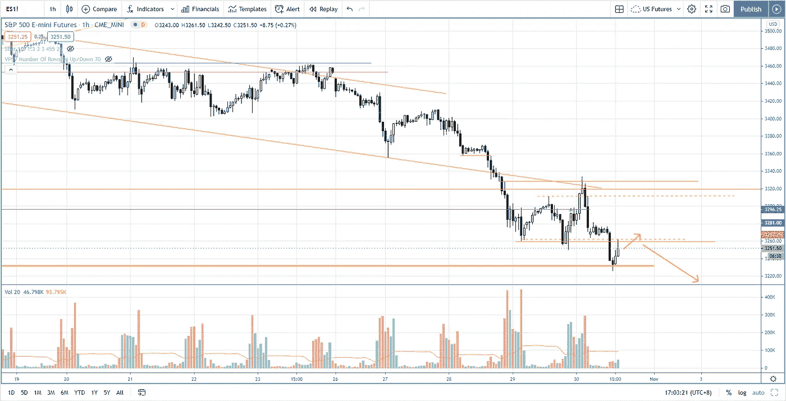

# 教科书中的盈利回调交易策略——标准普尔 500 日内交易

> 原文：<https://medium.datadriveninvestor.com/a-profitable-pullback-trading-strategy-as-per-the-textbook-s-p-500-day-trading-b777e002c0d8?source=collection_archive---------18----------------------->

一个假的突破就像教科书一样搭建了交易回调的舞台。在交易回顾部分找到这个**有利可图而** **简单的回调交易策略**。

观看视频，了解 2020 年 10 月 30 日交易时段标准普尔 500 指数期货的**每日市场分析。在这段视频中，你将看到上一个交易日的市场回顾，以及三分钟时间内的交易回顾(包括进场、出场和背后的理由)，内容是如何从阻力区的拒绝中获利。展望未来，我将涵盖偏见，要注意的关键水平，我稍后的交易计划。**

## 时间戳

*   [1:30](https://www.youtube.com/watch?v=rsUC0a1y4Ok&t=90s) 市场回顾
*   [3:50](https://www.youtube.com/watch?v=rsUC0a1y4Ok&t=230s) 行业回顾
*   [5:20](https://www.youtube.com/watch?v=rsUC0a1y4Ok&t=320s) 假故障
*   [6:55](https://www.youtube.com/watch?v=rsUC0a1y4Ok&t=415s) 交易回调
*   [8:15](https://www.youtube.com/watch?v=rsUC0a1y4Ok&t=495s) 威科夫法律努力与退出交易的结果
*   9:50[威科夫堆积结构](https://www.youtube.com/watch?v=rsUC0a1y4Ok&t=590s)
*   [10:40](https://www.youtube.com/watch?v=rsUC0a1y4Ok&t=640s) 当前股市展望

如果你还没有看我的[每日市场分析视频](https://www.youtube.com/watch?v=F_9jU-QvxXk)，为了更好地了解市场回顾和交易回顾。

**偏向** —中性(日内交易)；看涨(长期)

**关键点位** —阻力:3300–3320，3260；支持:3200–3230

**潜在设置** —在关键级别寻找潜在反转。

# 资源

**每周市场展望&最佳交易建议**直达您的收件箱:[https://www.tradeprecise.com/](https://www.tradeprecise.com/)

**专业免费**制图平台:创建账户→[www.TradingView.com](https://bit.ly/2U2Femd)

**非美国居民？** ( **、新加波**、澳洲、纽西兰、欧洲等……):[点击此处，存款 2000 新币](https://ji.hn/sgtiger)即可获得**免费股票(价值 100++ &美元)老虎经纪公司的欢迎礼物**

美国居民？[点击此处，当您存入 1500 美元](https://ji.hn/ustradeup)时，就有机会在 TradeUP 上获得一份**免费的 AMZN 股票(价值 3000++美元** ) & **欢迎礼物**

**无限制访问媒体文章** —加入以下:[https://priceactiontrading.medium.com/membership](https://priceactiontrading.medium.com/membership)

# 进一步阅读

 [## DDOG、MDB、净价行为分析——大规模行动即将到来？[内部关键级别]

### 了解为什么会有潜在的大规模迁移，以及 DDOG、MDB 和 NET 的关键扩展级别。

medium.com](https://medium.com/datadriveninvestor/ddog-mdb-net-price-action-analysis-massive-move-coming-key-levels-inside-b229d18e65ec)  [## 市场修正，泡沫还是崩盘？标准普尔 500 价格行为分析

### 标准普尔 500 期货(es)昨日因供应激增下跌 2.5%，跌破上行通道。这是正常的…

medium.com](https://medium.com/datadriveninvestor/market-correction-bubble-or-crash-s-p-500-price-action-analysis-6f26e6698dbc)  [## 苹果(AAPL)收益前创历史新高——买还是卖？

### 苹果打破了杯子和把手的模式，在昨天 Q1 财报发布前跃升至历史新高。什么是…

medium.com](https://medium.com/datadriveninvestor/apple-aapl-at-record-highs-ahead-of-earnings-buy-or-sell-726c7989daeb) 

Photo by Author — Ming Jong Tey

Photo by Author — Ming Jong Tey

披露:如果您点击本文中的链接进行购买或开立账户，并将所需金额存入推荐的经纪人账户，我们将免费为您赚取佣金。

免责声明:本演示中的信息仅用于教育目的，不应作为投资建议。