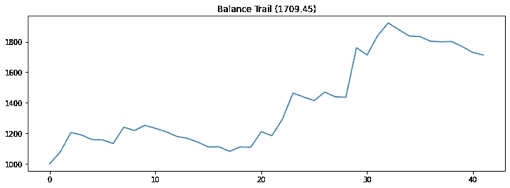
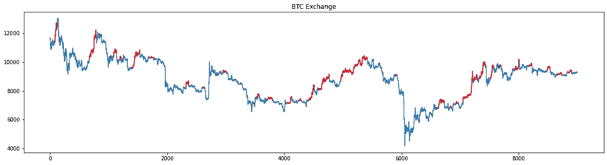
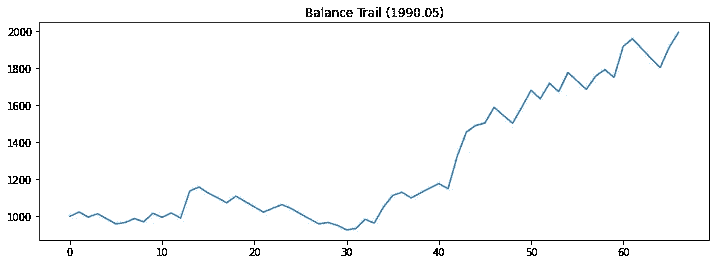
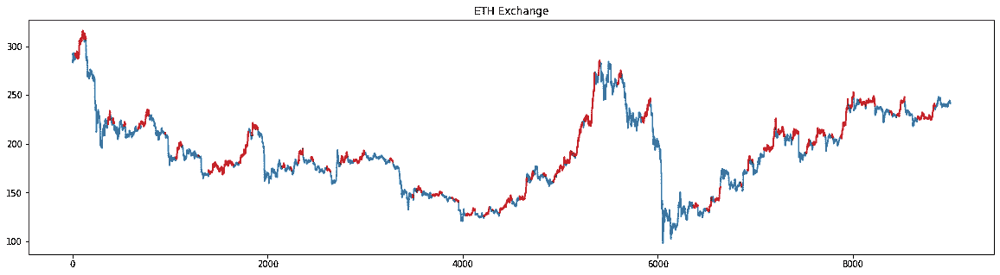
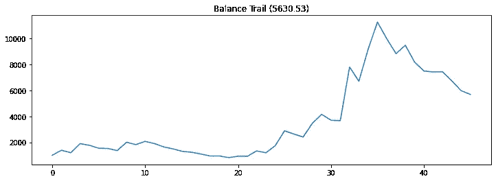
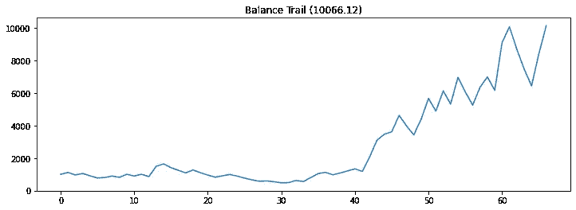
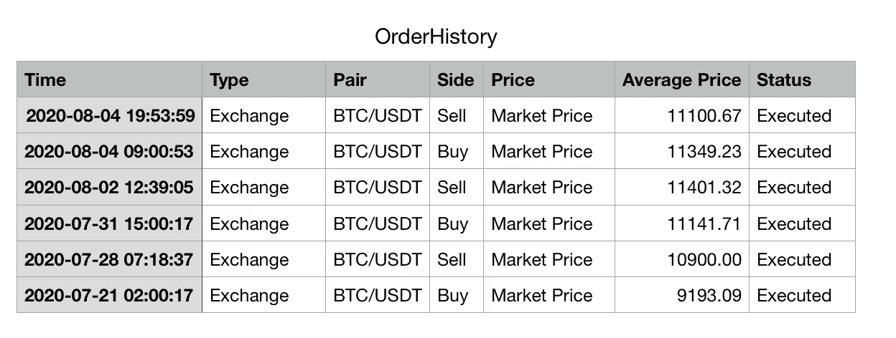

# 一种有利可图的加密货币交易策略

> 原文：<https://medium.datadriveninvestor.com/a-profitable-trading-strategy-of-crypto-currency-a9a31bdef196?source=collection_archive---------2----------------------->

## 交易策略对 BTC 和瑞士联邦理工学院有效

我已经在加密货币上交易了几年，看了很多交易视频，试图学习各种交易模式。但老实说，这些对我都不起作用。

# 我交易失败的原因

毫无疑问，我不是一个专业交易者，也没有强大的商业背景。我发现有很多原因让我很难做出理想的交易，

*   首先，我相信，我们必须承认，对大多数人来说，我们不是专业人士，我们的大部分时间不能花在屏幕前，观察市场的每一个动作，因此我们要么过早进入交易，要么过晚进入交易。
*   其次，即使给自己制定了严格的纪律，我们做的交易也可能是非常主观的，毕竟，你如何看待市场和趋势完全取决于你自己。很多在线视频会告诉你，如果 A、B、C 发生，我们做多，而其他情况下，我们做短，然而，在真实的市场中，事情从来不会这样发展。只要你交易几次，到时候你就会发现有多暧昧。
*   第三，人类的耐心是有限的，偶尔也会有冲动。如果你为自己设定的规则连续 5 次失败，你还有信心坚持下去吗？另一方面，如果你在市场上看到一个很好的机会，但与你的原则相矛盾，你会一直忽略它吗？

# 什么是糟糕的交易策略？

在透露我的交易策略之前，我想分享一下什么是糟糕的策略，这将帮助你更好地理解什么是有效的策略以及如何使用它。

*   首先，**不考虑交易费用和其他与交易相关的费用。**毕竟，我假设我们都在一些平台上交易，一个平台对每笔交易收费。如果是这样的话，不考虑这些费用的策略可能是欺骗性的和无效的。我研究过在每笔交易中获得很低边际利润的策略，一旦交易费开始上涨，它就会下跌，给我带来负利润。
*   其次，**过度适应市场**。你可以推导出一个计划在一个特定的时间段内完美的工作，而在另一个时间段内失败。一个好的策略或算法应该能够在更长的不同时间跨度上工作，并且能够随着时间的推移而进化。
*   第三，**未考虑最大损失**。如果一个策略在最糟糕的时候让你的账户余额降到了 0，你就不要指望你能回到账户余额为 0 的市场。没有一个策略在市场的每种情况下都有效，但是一个好的策略应该能够在它没有真正发挥作用的时候控制你的损失。

# 有效的策略

就我个人而言，当我根据 Youtube 的教训进行交易时，我做得不是很好(不是因为那些视频传播了一些错误的知识，而是因为有太多事情对我来说是不可控的)，但我不得不从不同的角度思考这个问题。

我的主要工作与数据密切相关，在过去的两年里，我基于历史数据推导了许多不同的算法，不幸的是，它们中的大多数都因我上面介绍的问题而失败，但这里有一个经受住了所有考验。

## BTC 交易所

该算法适用于 BTC、瑞士联邦理工学院、BTC 大学和瑞士联邦理工学院。

*   ***测试期****:2019 年 7 月 8 日至 2020 年 7 月 12 日*
*   **:0.2%(这是火币上的手续费率)**
*   ****订单类型*** *: Long(我们这里只考虑 Long 位置)**
*   ****开始余额*** *: 1000 USDT**

*在 BTC 交易所的表现:*

***平衡轨迹***

**

***连续最大亏损** : -0.1366
**交易笔数** : 42*

*在过去的一年时间里，我们只做了长线，总共做了 42 笔交易(有些交易可以上个月)，连续最大亏损是 13.66%，这意味着算法永远不会把你的账户吹到 0 余额，即使在最糟糕的时候。最后，我们的余额从 1000 USDT 交易到 1709.45 USDT。*

*那么这个算法是不是只在这么长的时间内有效，而在更短的时间内可能表现很差呢？让我们对该周期进行采样，并检查其性能:*

*从抽样中可以看出，它的性能大多远高于初始余额 1000。*

***交易日志**:*

*这里我分享部分交易日志。你可以看到，对于每一笔交易，我都考虑了交易费用。*

***进入和关闭:***

**

*用红色标记的线段表示算法提供的进入和关闭信号。*

## *以太网交换机*

*如果你曾经在 ETH 和 BTC 都交易过，你会知道大多数时候，ETH 的反应比 BTC 激烈得多，这可能会带来更高的利润，但也会带来更高的损失。我们来看看在 ETH 上的表现(算法和上面有点不一样)。*

*   ****测试周期****:2019 年 7 月 8 日至 2020 年 7 月 12 日**
*   ****交易手续费率*** *: 0.2%(这是火币上的手续费率)**
*   ****订单类型*** *: Long(我们这里只考虑多头位置)**
*   ****开始平衡*** *: 1000 USDT**

*在 ETH 交易所的表现:*

***平衡轨迹***

**

***连续最大损失** : -0.2002
**交易笔数** : 67*

*在过去的一年时间里，我们总共做了 67 笔多头交易(有些交易可能是上个月)，连续亏损的最大值是 20%。最后，我们的交易余额从 1000 USDT 变成了 1990.05 USDT。因此，我们确实看到了 ETH 更高的最大损失，但也看到了更高的回报。*

***不同时期的样本**:*

*从示例中，您可以看到它的表现基本上足够好。*

***进入并关闭:***

**

*用红色标记的线段表示算法提供的进入和关闭信号。*

*从 ETH 交易所和 BTC 交易所，我们看到更大的利润伴随着更大的风险。那么，如果加上利润，会带来更高的利润吗？*

# *BTC 保证金*

*   ****测试周期****:2019 年 7 月 8 日至 2020 年 7 月 12 日**
*   ****交易手续费率*** *: 0.2%(这是火币上的手续费率)**
*   ****贷款利率*** *: 0.0980%(每日)**
*   ****边距*** *: 5x**
*   ****订单类型*** *:多头(我们这里只考虑多头仓位)**
*   ****开始平衡*** *: 1000 USDT**

*BTC 利润率的表现:*

***平衡轨迹***

**

***连续最大亏损** : -0.6051
**交易笔数** : 46*

*在过去的一年里共进行了 46 次交易。显然，保证金交易可能会带来更高的风险，最大连续亏损高达 60.51%，但另一方面，它也带来了更高的利润，期末余额飙升至 5630.53 USDT。*

*让我们对该周期进行采样，并检查其性能:*

***交易日志**:*

*这里我分享部分交易日志。你可以看到，对于每笔交易，我都考虑了交易费和贷款费。*

## *ETH 边距*

*让我们用 5 倍杠杆把它应用在 ETH 上。*

*   ****测试周期****:2019 年 7 月 8 日至 2020 年 7 月 12 日**
*   ****交易手续费率*** *: 0.2%(这是火币上的手续费率)**
*   ****贷款费率*** *: 0.0980%(每日)**
*   ****边距*** *: 5x**
*   ****订单类型*** *:龙(我们这里只考虑龙的位置)**
*   ****开始平衡*** *: 1000 USDT**

*BTC 利润率的表现:*

***平衡轨迹***

**

***连续最大亏损** : -0.7121
**交易笔数** : 67*

*这次我们的余额差不多是 10 倍！在高盈利的同时，我们承受的最大亏损也上升到 71.21%。*

*让我们对该周期进行采样，并检查其性能:*

***交易日志**:*

*你可以看到，对于每笔交易，我都考虑了交易费和贷款费。*

# *行动交易*

*再好听的话，一个策略都是需要在真实市场中测试的，以下是我在交易所市场测试的交易(详细金额不透露)。*

**

*在 2020 年 7 月底，BTC 和瑞士联邦理工学院出现了看涨趋势，该算法确实捕捉到了这一趋势，同时控制了损失。*

*最后，欢迎在 [Github](https://github.com/MJeremy2017) 上关注我或者通过[电子邮件](http://zhangyue9306@gmail.com)联系我讨论交易。*