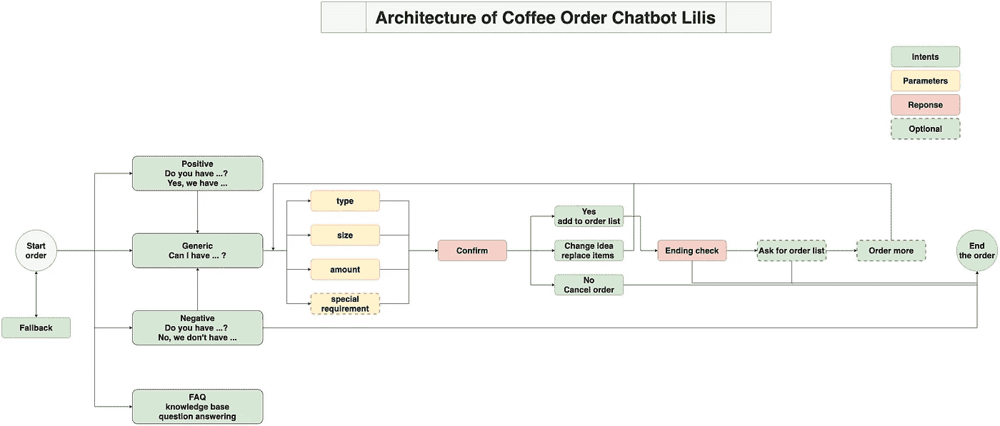
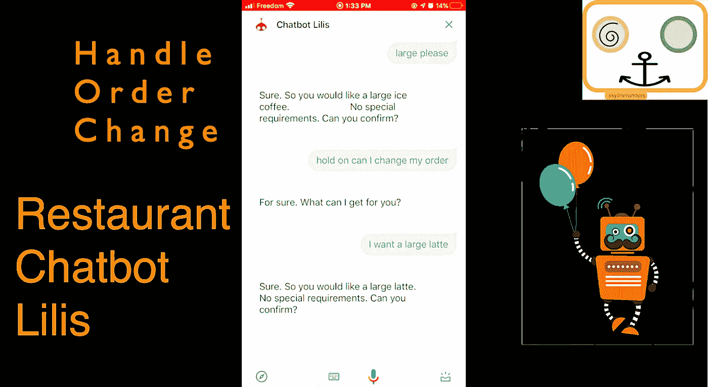

# 在咖啡店工作的聊天机器人女服务员 Lilis 的快速演示

> 原文：<https://medium.datadriveninvestor.com/a-quick-demo-of-chatbot-waitress-lilis-who-works-at-a-coffee-shop-5b220a7c5981?source=collection_archive---------10----------------------->

## 最小可行产品的特征是什么

# 一个最低生存能力的聊天机器人服务员有什么特征？

*   问候顾客
*   客户意图检测
*   与客户确认订单
*   所需信息的槽填充
*   食品可用性检查
*   处理订单变更
*   提供购物车详情
*   期末支票
*   完成订单

# 聊天机器人的架构是什么？

## 要了解更多关于构建和部署聊天机器人的信息，请关注我们的 LinkedIn。

**访问专家视图—** [**订阅 DDI 英特尔**](https://datadriveninvestor.com/ddi-intel)