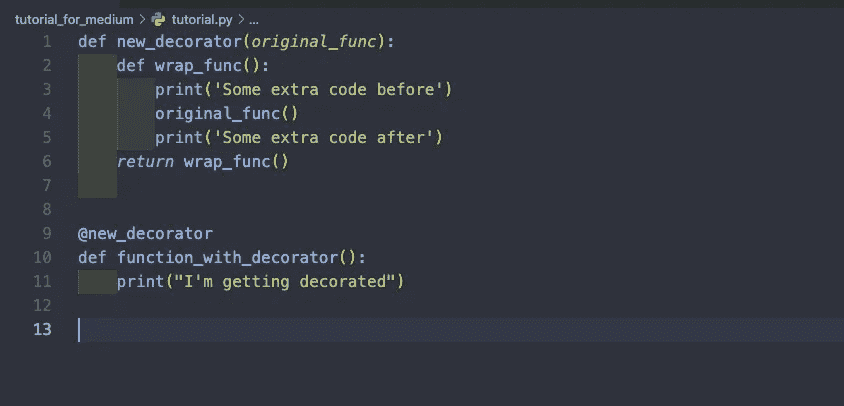
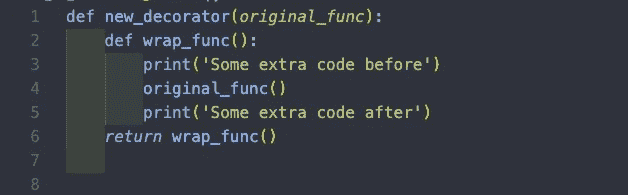
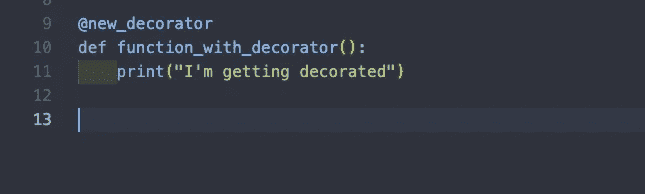

# Python 装饰者快速指南

> 原文：<https://medium.datadriveninvestor.com/a-quick-guide-to-python-decorators-ae257e2103d0?source=collection_archive---------29----------------------->

**简介**

如果你是 Python 的新手，你可能在`@im_a_decorator` 之前遇到过类似的东西，后面跟着一个函数。这就是 Python 和其他语言所说的装饰器，这是 Python 在不覆盖原始函数的情况下向函数添加额外功能的方式。在这个快速教程中，我将给出一个例子，说明如何以及何时可以使用 decorators。

**例子:**

好的，假设我们想创建一个函数，它有打印一个简单语句的功能，但是有时候我们想打印一个前后都有语句的语句。当然，我们可以只创建一个单独的函数，并用围绕它的其他 print 语句重写第一个 print 语句，但是在实际的代码库中，该函数可能比只打印一个语句具有更多的功能。所以为了干燥起见(不要重复自己)，我们将改为使用装饰器。

**创建包装函数**

为了使用装饰器，我们显然需要首先创建它。所以你需要做的是创建一个函数，它接受一个函数(你想要修饰的函数)作为参数。该函数将返回一个包装函数，然后您可以使用该包装函数在将被修饰的函数之前和之后放置代码。

**使用装饰器**

要使用装饰器，你所要做的就是在你的装饰器函数上使用@关键字，然后是你想要装饰的函数，就像这样…

这样做之后，结果将是该函数返回的内容，或者在本例中是打印的内容，加上装饰器的代码。像这样…

**结论**

这就是如何用 Python 创建一个简单的装饰器！每当你发现你需要给一个函数增加额外的功能而不是重新定义函数时，试着用装饰器来代替。希望这有所帮助！

**来源:**

 [## Python 训练营:学习 Python 编程和代码培训

### 这是 Udemy 上最全面、最直接的 Python 编程语言课程！你是否…

www.udemy.com](https://www.udemy.com/course/complete-python-bootcamp/)  [## 使用 Python |数据驱动投资者的名称匹配技术

### 我们确实面临很多情况，我们必须匹配一个有很多变体的单词。这可能是因为错别字…

www.datadriveninvestor.com](https://www.datadriveninvestor.com/2020/12/07/name-matching-techniques-with-python/) 

**访问专家视图—** [**订阅 DDI 英特尔**](https://datadriveninvestor.com/ddi-intel)