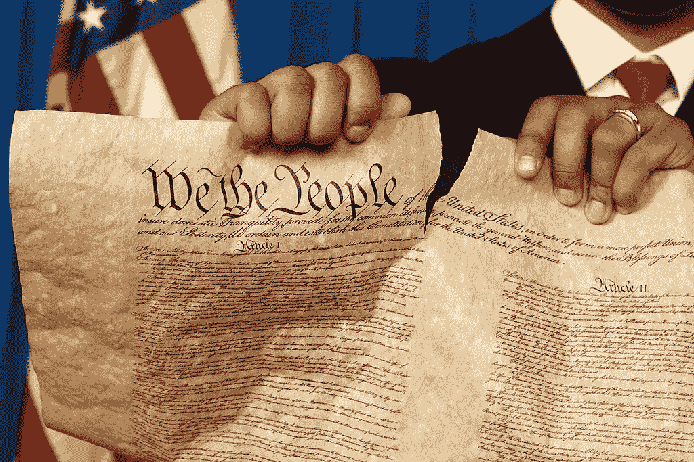

# 为什么金融业永远不会改变的快速指南

> 原文：<https://medium.datadriveninvestor.com/a-quick-guide-to-why-congress-stopped-caring-about-the-little-guy-149f8700ec48?source=collection_archive---------10----------------------->

## 这都是关于责任的

**(Photo via Getty Images)**

整个 [GameStop 的崩溃](https://www.disunitedstate.com/articles/how-the-sec-is-going-to-use-gamestop-to-screw-retail-investors)似乎让每个人都在问同样的问题。美国怎么可能允许如此明显错误的事情发生？

当这么多人在挣扎，而国会完全不愿意伸出援手的时候，一些人找到了一种方法，从几十年来夺走美国一切的同一群人那里要回一分钱，那就是银行家。

然后，就在整个世界为他们欢呼的时候，金融业公然非法地试图关闭整件事，而政治家们基本上保持沉默。从党的领导人那里，什么都没有。与此同时，总统通过他的秘书传话，说他[在关注](https://www.dailymail.co.uk/news/article-9202945/Joe-Biden-Janet-Yellen-stay-silent-GameStop-crisis-roiling-Wall-Street.html)。

整件事完全是对整个国家的嘲弄，政客们似乎对此漠不关心。事实上，他们似乎更关心弹劾前总统，而不是处理国家目前面临的数百万个问题中的任何一个。

他们的冷漠和美国人的震惊背后的原因很简单，责任。或者说，他们缺乏对美国人民的责任感，金融业缺乏对任何人的责任感。

# 有责任

人们对本周发生的事件感到震惊，与其说是因为券商的行为，不如说是因为他们知道对此无能为力。具体来说，他们感到震惊的是，这个国家的政治阶层没有让金融业对他们的行为负责。

美国有着深厚的问责文化，在过去，政客们至少会假装让人们负责，即使他们知道最终不会有任何结果。

事实上，这个国家如此繁荣的原因之一是因为每个人都对某个人负责。个人对老板负责，公司对法律负责。这给人们灌输了一种信任感，无论发生什么，总会有人有权解决问题。

然而，政客和金融行业制造的问题几乎从未得到解决，因为这两个群体无法对自己的行为负责。

# 政治家

理论上，政治家对他们的选民负责。实际上，他们没有。

实际上，政客们知道两件事是真的。首先，大多数人不选举个人进入国会，他们只是选择代表他们政党的人。第二，只要党喜欢他们，他们就不会被初选。

因此，一旦他们赢得席位，他们唯一的工作就是忠于党，并希望他们的选民下次不要全部倒戈。

只要这种情况发生，他们几乎可以保证在他们想要的时间内获得席位，数字也支持这一点。平均而言，在 1990 年至 2018 年期间，87.3%的现任参议员和 93.5%的现任众议员赢得了连任。

因此，既然他们知道无论如何人民都会选他们，他们的责任就从他们的选民转移到他们的政党。真正决定他们是否继续掌权的是政党。在初选中，该党可以决定撤回支持，让另一名候选人与他们竞争。

然而，让派对开心很简单，拿钱进来就行了。有钱能使鬼推磨。它确保了该党在选举中的竞争力，从而为其提供了一种权力，使人们愿意首先给它钱。没钱没权。没有权力，没有钱。

然而，众所周知，这个世界上没有什么是免费的，尤其是政治献金。因此，政党以及他们的政客必须对他们的捐助者负责，这些捐助者在很多情况下来自金融行业。

# 金融

如果你想赌成功，金融业是这个世界上最有把握的事情。它控制着世界的货币，严重影响着它的经济，并且买下了整个美国的政治体系。毫无疑问，它也不对任何人负责。

从技术上讲，金融公司必须遵守法律。然而，如果存在一种制度，在这种制度下，制定法律的人必须让你——他们最大的捐助者——高兴，以便继续掌权，那么法律基本上说的就是你希望它说的。

因此，作为他们“做生意的成本”的一部分，金融公司向两党大量捐款，反过来，这些党派竭尽全力让他们的钱物有所值。从[放松管制](https://www.cepr.net/documents/publications/dereg-timeline-2009-07.pdf)，到[不起诉](https://knowledge.wharton.upenn.edu/article/why-wrongdoing-executives-are-rarely-prosecuted/)金融犯罪，到当他们的赌博[没有回报](https://www.investopedia.com/terms/p/privatizing-profits-and-socializing-losses.asp)时买单，金融公司比[查理 M 的走狗](https://www.youtube.com/watch?v=3-d5yU-aQ34)更紧地控制着这个国家。

情况并非总是如此，但是，多年来，美国文化对金融公司的看法已经发生了变化。

# 文化

金融业不用为他们的行为负责，因为人们已经不再期望他们这样做。2008 年金融危机的后果，没有人入狱的事实，政府将国债增加一倍为银行家的错误买单的事实，加上整个“太大而不能倒”的语言，让美国的每个人都清楚地知道，这个特定的行业将得到它想要的一切，而不管后果如何。

2010 年多德-弗兰克法案被吹捧为大萧条以来最全面的银行监管法案，但几乎没有改变这种情绪。事实上，这被视为仅仅是装点门面，让它看起来像是在做什么。

2018 年，国会豁免了数十家美国银行，这一观点很快得到了验证。在那一点上，很明显，政府甚至缺乏监管该行业的表面能力。

这一点上，两党共同努力控制银行的想法听起来就像邀请大脚怪喝茶一样有可能。

更重要的是，金融公司知道这一点，这就是为什么他们可以肆无忌惮地做一些他们可以逃避的事情。政治家们也知道这一点，这就是为什么他们在很大程度上停止了对该行业哪怕是表面上的谴责。

然而，这种行为最终会产生后果。

# 结局如何？

随着人们不再对金融行业或其政客的责任抱有任何期望，他们将继续被忽视。相反，这些政党将有勇气继续推动可允许行为的极限。

整件事的结局是快乐还是悲伤，这是一个视角问题。但是最终会发生的是，无论是在 5 个月还是 50 年后，某些事情会引发公众的强烈反对。可能是像智利发生的小事情，也可能是像另一场大萧条那样的大事件。

无论如何，要想对当前的体系做出任何改变，首先必须改变目前对政客或银行家的问责没有任何要求的文化。

这可能会非常混乱，谁知道我们最终会得到什么，但好消息(如果你是一个乐观主义者)是，这个国家的政治和金融业的方向是完全不可持续的，肯定会在我们的有生之年发生变化。

‍

*最初发表于*[T5【https://www.disunitedstate.com】](https://www.disunitedstate.com/articles/a-quick-guide-to-why-congress-stopped-caring-about-the-little-guy)*。*