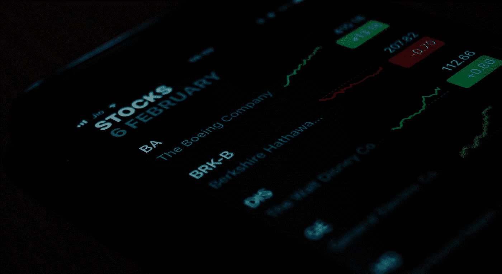

# 我的 5 种安全产品组合的快速概述

> 原文：<https://medium.datadriveninvestor.com/a-quick-overview-of-my-5-security-portfolio-58cb86bda89e?source=collection_archive---------12----------------------->

## 了解我目前持有的股份

Photo by [Ishant Mishra](https://unsplash.com/@ishant_mishra54?utm_source=medium&utm_medium=referral) on [Unsplash](https://unsplash.com?utm_source=medium&utm_medium=referral)

写关于投资的文章是一回事，做投资人是另一回事。是的，我投资股票市场，并将继续每月至少投资 1000 美元。我相信透明度是生活中的一个重要方面，所以我想与你分享我的 5 种证券投资组合，以及我为什么持有每种证券。

事不宜迟，我目前的投资组合包含以下 5 种证券:

1.先锋标准普尔 500 增长指数基金 ETF ( [VOOG](https://finance.yahoo.com/quote/VOOG?p=VOOG&.tsrc=fin-srch)

2.先锋信息技术指数基金 ETF ( [VGT](https://finance.yahoo.com/quote/VGT?p=VGT&.tsrc=fin-srch)

3.微软( [MSFT](https://finance.yahoo.com/quote/MSFT?p=MSFT&.tsrc=fin-srch) )

4.苹果( [AAPL](https://finance.yahoo.com/quote/AAPL?p=AAPL&.tsrc=fin-srch) )

5.特斯拉( [TSLA](https://finance.yahoo.com/quote/TSLA?p=TSLA&.tsrc=fin-srch) )

*注:我不是理财顾问。我不知道你的财务状况。我分享这些信息只是为了教育目的。*

**1。先锋 S &普 500 成长指数基金 ETF(**[**VOOG**](https://finance.yahoo.com/quote/VOOG?p=VOOG&.tsrc=fin-srch)**)**

我原本在 [VOO](https://finance.yahoo.com/quote/VOO?p=VOO&.tsrc=fin-srch) ，但是我决定把我的股份转移到 VOOG。这是为什么呢？我希望我的投资组合关注全面增长。VOOG 对增长型公司的权重较高，如苹果、微软、亚马逊、脸书和 Alphabet。VOOG 如何确定哪些公司是增长型的？3 个增长因素是销售增长、收益变化与价格的比率和价格动力。到目前为止，我投资 VOOG 的总回报率约为 8.5%。VOOG 的费用率为 0.10%，这意味着我在它身上投入的每 1000 美元，我只需要花 1 美元。

**2。先锋信息技术指数基金 ETF(**[**VGT**](https://finance.yahoo.com/quote/VGT?p=VGT&.tsrc=fin-srch)**)**

VGT 是我最喜欢的技术 ETF。它让我有机会接触世界上最强的科技公司，如苹果、微软、英伟达和 Visa。到目前为止，我在 VGT 投资的总回报率约为 14.5%。VGT 的费用率也是 0.10%，这意味着我每投资 1000 美元，只需花费 1 美元。

**3。微软(******)****

**微软是技术领域的领导者之一。该公司在持续击败收益、显著增长其企业云计算业务以及增长其办公产品订阅服务方面表现出色。由于许多大型企业如果停止使用 Windows 和 Office 产品，将不得不经历高昂的转换成本，微软有着最强的经济护城河之一。微软的实力也体现在它是沃格和 VGT 的三大股东之一。到目前为止，我投资微软的总回报率约为 27%。**

****4。苹果(**[**)AAPL**](https://finance.yahoo.com/quote/AAPL?p=AAPL&.tsrc=fin-srch)**)****

**苹果也是科技领域的领导者之一。该公司在持续击败收益方面表现出色，扩大了 MacBook、iPad、Apple Watch、AirPods 和 Apple TV 等辅助产品，并通过 Apple Music 和 Apple TV 扩大了订阅服务。苹果拥有全球最强大的品牌之一，这一点从其忠实的粉丝群中可以看出，这使得 iPhone 成为世界上最畅销的手机之一。由于产品之间连接和共享的简单性，苹果围绕其产品创建了一个生态系统，这是一个消费者很难摆脱的生态系统。到目前为止，我投资苹果的总回报率约为 40%。**

****5。特斯拉(******)******

****特斯拉是一家正在进入全盛时期的公司。这家电动汽车和清洁能源公司是电动汽车行业、电池存储和太阳能行业的领导者。该公司首次连续 4 个季度超过收益，展示了其电池技术的非凡进步，并继续提供创新，迫使更多老牌汽车制造商将重点转移到电动汽车上，从而证明了反对者的错误。在过去几年里，特斯拉已经成为一个家喻户晓的名字，随着该公司继续降低其车辆、电池和太阳能产品的成本，现在已经为指数级增长做好了准备。到目前为止，我投资特斯拉的总回报率约为 11%。****

****如你所见，我没有持有那么多证券，也不需要持有。我没有必要持有比现在更多的东西。由于我的投资组合关注范围狭窄，它为我的长期财务成功奠定了基础。当确定你的投资组合的最佳分配时，通过确立你的关注点、目标和投资组合风险&优化来确定你的[投资策略](https://medium.com/swlh/3-simple-steps-to-create-your-investment-strategy-74bba1ca445d)。****

****[查看屯积信保持联系](https://tunji.substack.com/)。****