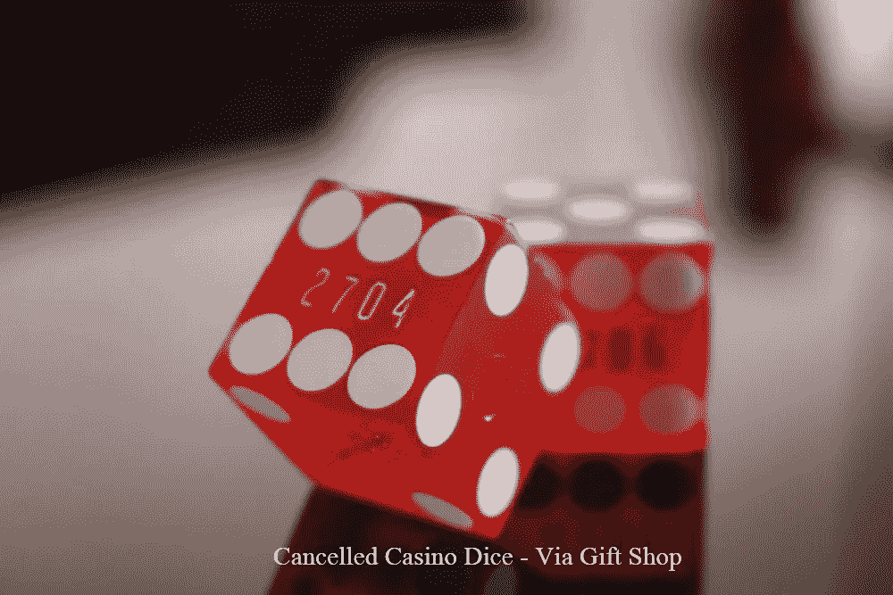
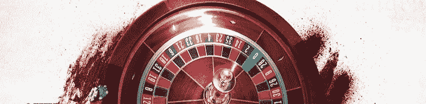
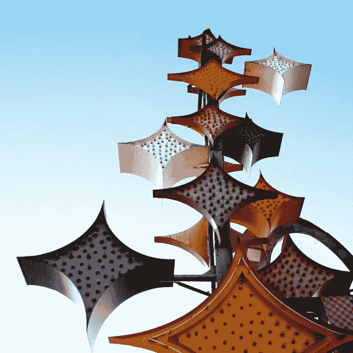

# 博彩业的战斗口号

> 原文：<https://medium.datadriveninvestor.com/a-rallying-cry-for-the-gaming-industry-80c72075eff0?source=collection_archive---------6----------------------->

"尽管社交距离越来越远，游戏仍然是社交的."

无论是谁发明了这句格言，*“清洁仅次于虔诚”，*他肯定不会涉足现代赌场，那里是细菌的滋生地。然而，这些成人娱乐的大型综合体正准备发出史诗般的战斗口号，以帮助我们应对这个瘫痪的疫情。如果你认为冠状病毒的威胁很可怕，让我们回到疫情之前的赌场生活，比较一下两者的区别。想象一下，用汗手里的一副纸牌玩 21 点。溢出的啤酒瓶粘在有粘性的杯架上，上面有模糊的指纹。一个烟灰缸-满是口红印记的烟头弥漫在桌子上，而一个经销商打了个喷嚏到他的腋下。听起来熟悉吗？这是一张二十一点的桌子。把这个场景乘以五十遍，那还只是坑。

当我开始进入游戏行业时，我经常生病。我每天挣 20 美元的小费，买不起赛百味，它就在赌场迷失角落的电动扑克机的尽头。我在员工餐厅吃日常菜单，有时包括肝和洋葱。这个“非法闯入的房子”炫耀着低矮的天花板，这放大了香烟的烟雾。很明显，他们的赌场筹码已经很多年没有清洗过了，也没有订购新筹码的计划。普通感冒很常见。我会在休息的第一分钟冲到洗手间去清理我的流鼻涕。突然，我注意到玩家们没有洗手，冲回我负责的那张骰子桌。后来，我会和他们打赌，他们会用那双没有洗过的手，拿着又旧又脏的薯片，一直浸泡在细菌中。

> “我认为我们在这次疫情中记住了我们的老年人，这很好，但他们一直都在我们的赌场里。”

慢慢地，我的免疫系统开始适应，我生病的频率降低了。触摸皱巴巴的钞票和脏兮兮的筹码不再困扰我，我还在提醒玩家上厕所时洗手的经销商身上找到了幽默。赌场并不适合所有人，我尝试了多次才明白到底发生了什么。在这个痛苦的开始之后——感觉就像没有红色袋子的生物危害训练——你看到了它的本来面目。这是娱乐的最后手段，在这里你可以放松一下，手里拿着一杯冷饮，如果你赌博的话，你不用付钱。

Image by Pries Designs

冠状病毒具有潜在的致命性，我不否认这一点。我当然也不会说我的赌场同行可以免受全球疫情的影响。截至昨天，内华达州州长史蒂夫·西索拉克下令关闭所有赌场。这是我们努力减少新冠肺炎病毒传播的下一个合乎逻辑的步骤。如果博彩业有任何战斗口号的话，那也要等到关闭之后，截止到现在已经 30 天了。然而，赌场不仅仅是《步强规则:所有投资者都应该知道的 35 条赌博规则 》的作者帕特·霍兰德所说的“赌博、陷阱、停滞和百分比”赌场建得像小城市是有原因的。我们提供社区。一些人，如老年人，依赖它进行社交活动。我认为我们在这次疫情中记住了我们的老年人，这很好，但他们一直都在我们的赌场里。考虑到这种情况，我们可能都需要坐下来和坐在我们旁边的人一起笑，做一会儿人类，问问这一切是为了什么。

> “在 2008 年金融危机期间，拉斯维加斯受到了全国最严重的打击，我们不希望这种情况重演。”

自助餐、餐馆和桌上游戏都关门了。大多数主要运动项目都被取消了。接下来是什么，[环法自行车赛](https://link.medium.com/XS6GfP48V4)？有些人把赌场人群称为问题赌徒，但他们错得不能再错了。当我们重新开业时——我们会让它成为一个“盛大的重新开业！”—过来坐在退休人员 R 的旁边，他喜欢 5 美元的牌九。记在 B 的账上— —一个富有的离了婚的人，有一大笔钱。打赌不要通过线与 S —，谁最近收到了优步的一个不是他的过错的车祸的解决方案。尽管社交距离遥远，游戏仍然是社交的。

 [## 跑步摆脱疯狂:锻炼如何提高你的生产力|数据驱动的投资者

### 没有比锻炼更好的方式来开始一天的工作了。我试着一周至少做四天，在…

www.datadriveninvestor.com](https://www.datadriveninvestor.com/2018/10/23/running-to-get-rid-of-the-crazy-how-working-out-increases-your-productivity/) 

赌场和许多其他企业主一样，行使了裁员的权利。然而，一些公司正在努力做正确的事情。我很感激我工作的公司给员工提供了比其他公司更多的救济。不幸的是，并不是每家公司都有相同的前景，许多员工被解雇了。2008 年在我们所有人的脑海里。那个似乎很遥远的噩梦，又变成了现实。在 2008 年的金融危机中，拉斯维加斯遭受了全国最严重的打击，我们不希望危机重演。

The old Stardust sign via [The Neon Museum](https://medium.com/u/ebdee6d9dea9?source=post_page-----80c72075eff0--------------------------------)

亲爱的博彩业，我并不提倡我们鲁莽行事。我们必须小心，非常小心。我们必须创造性地从这次关闭中重新崛起，并确保我们行业的可持续性。现实是人们正在死去，病毒正在传播，我们都只想呆在家里。然而，赌场同胞们，重新开放我们的赌场可能是我们最美好的时光。如果说有哪个行业在不知不觉中通过全球疫情为业务做准备，那就是博彩业。所以保持安全，小心谨慎——如果你愿意可以戴上面具——让我们继续旋转轮盘，掷骰子，翻转 21 点纸牌。

只要大门重新打开，他们就会来。