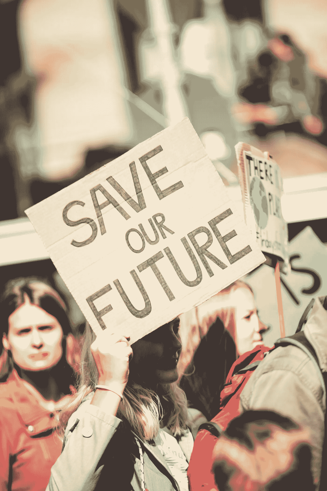

# 关于超级星期二的思考

> 原文：<https://medium.datadriveninvestor.com/a-reflection-on-super-tuesday-d6ddaeae7992?source=collection_archive---------22----------------------->

Photo by [Markus Spiske](https://unsplash.com/@markusspiske?utm_source=unsplash&utm_medium=referral&utm_content=creditCopyText) on [Unsplash](https://unsplash.com/s/photos/politics?utm_source=unsplash&utm_medium=referral&utm_content=creditCopyText)

超级星期二的民主党初选释放了大量的情绪，不管你认为哪个候选人是你的冠军。乔·拜登在许多人意料之外的帮助下重新成为民主党的领跑者，这让许多人感到意外。此外，尽管他赢得的大部分州以及所有南方的州永远不会出现在 2020 年 11 月 3 日的蓝色专栏中，但这不是问题所在。

最让我吃惊的是，在没有证据表明他们对自己的所作所为进行过深刻思考的情况下，当权派控制辩论、笼络选民并把他们推向某个特定方向是多么容易。我可以想象中间派民主党人聚集在舞台上几个温和候选人之一的周围，因为我看到了辩论通过的内容，但不是乔·拜登。

为什么？拜登有 50 年的悠久历史可以借鉴，我花了时间来重新熟悉其中的许多内容。我不认为他能打败唐纳德·特朗普。我不认为他是一个我信任、相信和可以依赖的人，来激励我们面对问题，做出我们必须做出的改变，以迎接未来的挑战。而我认为，如果他当选，他会成为某种绷带，来止血我们在白宫现任主人的领导下遭受的数千例伤口的出血。我不认为他是现任总统的政策和行为所鼓励、推动和释放的专制法西斯主义蔓延的长期解毒剂。

 [## 保护主义、政治和经济动荡|数据驱动的投资者

### 美国股市昨日出现 400 多点的大幅反转，为未来的事情发出了警告信号。市场…

www.datadriveninvestor.com](https://www.datadriveninvestor.com/2018/06/28/protectionism-politics-economic-turmoil/) 

我想起了我在 2018 年年中读到的一篇文章，作者是我不熟悉的人。作者 Umair Haque 写了美国发生的事情和英国关于英国退出欧盟的斗争之间的相似之处，断言美国人(和英国人)是这个星球上最愚蠢的人。我顿时毛骨悚然，心想这个人一定是疯了，但我还是继续读下去。从那时起，我决定后退一步，更密切地关注。我扩大了我的阅读清单，加入了一些我们在主流出版物上看不到的资料和观点，我开始理解他的观点。

在很大程度上，我们美国人已经变得以自我为中心，专注于我们自己的欲望和欲望，而对我们周围更广阔的世界漠不关心。我们放弃了我们更高层次的思维过程，转而使用任何电子资源来提升我们对现实的有限和先入为主的看法。我们观看和聆听我们最喜爱的思想塑造者，然后去反刍和拥护这些会说话的头脑告诉我们要说和要相信的东西。我们都知道他们是谁。我不必一一列举。

乔·拜登(Joe Biden)作为当权派钦点的冠军在 11 月面对唐纳德·特朗普(Donald Trump)时突然东山再起，这证明了一小撮有权有势的人利用和利用恐惧说服我们支持他们的选择是多么容易。此时此刻，拜登似乎可能会获胜，因为许多民主党选民显然已经确信只有他才能击败特朗普，因为毕竟桑德斯是社会主义者！尽管大多数美国人不知道什么是社会主义者，也肯定不是民主社会主义者，但他们被这个词蒙蔽了双眼，所有的思考和理性思考都在那一刻停止了。

当美国人，尤其是那些 45 岁以上的人看到社会主义这个词时，他们会立即联想到他们仍然记得的冷战、苏联及其对数百万人的极权控制。我们在成长过程中被灌输了社会主义的邪恶，它被定义为任何与我们所谓的“共产主义”相似的东西。我们用恐惧来让人们守规矩，并惩罚那些提问并想探究其实际含义的人。

因此，现在我们看到这种行为的微妙回归，将社会主义一词与桑德斯联系起来，并用它来提醒我们应该害怕。现实是，当权派确实感到害怕，因为桑德斯倡导的变革威胁到现状以及两党人士享有的特权和权力。桑德斯必须被阻止，我们已经目睹了那些控制者如何利用他们的地位、影响力和权力来引导、操纵和控制结果。

民主党建制派将强烈否认有任何有组织的阻止桑德斯的企图，这是对所有支持他的人的智慧的又一次侮辱。

四十多年前，一个决定使得民主党放弃了传统的穷人和劳动人民的基础，转而去讨好美国公司。放弃这个基地为唐纳德·特朗普在 2016 年赢得当选总统所需的选举人票的机会打开了大门。

在我成年后的生活中，我观察到民主党机构一再在选举时出现，要求像我这样的进步人士、非洲裔美国人、拉丁裔美国人和其他人的支持，但选举一结束，我就发现这些人无视并忘记了我们所有人，因为他们兴高采烈地与他们的公司支持者上床。曾经有一段时间，这些呼吁包括穷人和工人阶级的美国人，但在 20 世纪 80 年代初后停止了。

我预测 2020 年将是美国政治的分水岭。让我们假设拜登是民主党提名人。我们大多数人都会把感情放在一边，尽最大努力看到特朗普被击败，被免职。我们这样做是出于对国家的热爱，是为了保护我们的民主和制度免受进一步的攻击。如果我们能让足够多的人投票，拜登可能会赢。他能做的最好的事情是让伊丽莎白·沃伦这样的人做他的竞选伙伴，并在政纲中采纳伯尼·桑德斯的大部分计划，但我怀疑他会考虑这样做。

由于几个因素，更有可能的结果是特朗普获胜。他可能会赢得普选的绝对多数，但即使这样也是有疑问的。拜登是否能产生足够的能量和热情来激励大量从不投票的人投票，还有待观察，即使考虑到我们现在所知道的关于特朗普的一切(谎言、腐败、无能等)。).选举非常接近。拜登赢得普选，但选举团是另一回事。几个关键州的严重不公正选区划分、选民压制和公然欺诈让特朗普获得了微弱的选举人团多数。

我们知道选举人永远不会履行我们的创始人希望特朗普当选的职能。有抗议，媒体上有很多叫喊和尖叫，但随后是默许和屈服于受污染的结果。拜登稍后将在他的让步和公开言论中带头确保和平与安宁。大多数人会跟随他的领导。

2021 年 1 月 20 日，特朗普不失时机地告诉和展示他的意图。随着顺从的国会的胜利，一场全面的攻击将会对我们所知的这个国家的剩余部分发起。欢迎来到新美国！