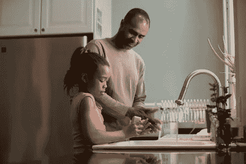

# 对生命中什么是重要的思考

> 原文：<https://medium.datadriveninvestor.com/a-reflection-on-whats-important-in-life-36ac535ebed5?source=collection_archive---------8----------------------->

## 主要的事情是主要的事情

Photo by CDC on Unsplash

在新冠肺炎时代，我们中的一些人可能已经对死亡变得有点麻木了。每天都有数千人死亡，美国已经超过 40 万人死亡，我们被告知，在疫情被控制之前，我们可能会超过 50 万到 60 万人死亡。我们很多人都失去了亲人，至少知道有人被绑架了。尽管如此，对个人死亡的担忧总是存在的。它像电脑上的后台程序一样运行，但出于继续运行的需要，它不可能是存在的中心。更直接的危险让我思考什么是重要的，什么是最重要的。

昨天早上，在我去上班的路上，我在早上 5:30 左右在一家 7-11 便利店停下来吃早餐，因为我把车停在了面对商店的最右边的停车位(只有四个)。我看见两个男人从左侧向商店走来。我没有看到他们下车，其他三个空间都是空的，但走进商店的人流量并不少见。这个地区有无家可归的人，他们经常去那里。

这两个人让我印象深刻的是，他们都穿着相似的夹克，头上戴着兜帽。我住在佛罗里达，一月的清晨。天气不冷，大约 60 度，即使你不像我一样来自明尼苏达州，想要一件夹克。兜帽似乎没有必要。这两个人都很苗条，不像喜剧演员克里斯·洛克开玩笑说的那样“像毒品一样”瘦，但是很瘦。他们每个人都在 5 英尺 6 英寸到 5 英尺 8 英寸之间。我下车时，他们走进了商店；我没见过他们的脸。

当我走向入口时，我可以透过玻璃窗看到店内，看到其中一名男子绕过柜台走向收银台。我现在可以看到他的脸。他是一个 20 到 30 岁之间留着小胡子的浅色皮肤的西班牙男性。那个人双手朝下面对着收银员，左手拿着一把枪。我不知道第二个人在哪里。如果我没有注意的话，我可能会陷入致命的境地。关于我该做什么，我脑子里充满了一百种想法？

一生看电视和电影的经历表明，有一些英雄的事情要做。我没有在心里怀疑我能制服这两个人中的任何一个(假设我没有先中枪)。我几乎比他们都高一英尺，而且可能比他们都强壮。当然，在我看来，我仍然可以扣篮和赢得比赛，但有两个，我不知道其中一个在哪里。柜台后面的那个不能很快联系到，成功的几率看起来也不大。

虽然我可以透过玻璃清楚地看到一个人，但他没有注意到我。我小心翼翼地回到车里，倒车，给自己留出空间转向最近的停车场出口。我看见第三个人步行向商店走来。我不能确定他是和前两个在一起，还是仅仅因为时机不好。我应该大声喊他不要进去吗？如果他和他们在一起，惊动他可能会危及我。我什么也没说，从 7-11 便利店出来，路过商店的左侧。

商店旁边是一辆浅色的 SUV。驾驶座的门开着，但里面没有人。我猜这是他们逃跑用的车。我告诉自己看车牌，但不知何故只看了前三个数字，没有看到品牌或型号。我把车开进街对面的星巴克，然后拨了 911。

我有商店的确切地址，我认为这很好。我在离开商店时注意到了这一点。911 接线员说一个电话也是从商店里面打进来的，所以劫匪肯定已经离开了。离我看到持枪男子还不到一分钟，所以他们一定是在我开车离开后就离开了。我见了两个警官并填写了一份报告，然后被要求返回商店去见负责此案的侦探。

我一整天都在想我本可以/本应该做得不同的事情。我本可以停下来拍下车和车牌。我几乎不会自拍，操作手机摄像头可能要花 15-20 秒；这足以让我中枪。我应该能更好地辨认出那辆车，并得到整个牌照。如果车在跑，我可能会开着他们的车走了，让他们束手无策？我后来认为这是一个坏主意，可能会导致人质事件或枪战。我对自己做出的选择很满意；没人中枪。我确定 7-11 已经为损失投保了；他们通常只有少量的现金。我应该为了 50 美元冒生命危险吗？

我根本没想到的是唐纳德·特朗普或他即将到来的参议院审判。我没有想到特德·克鲁兹和米奇·麦康奈尔。这并不是说它不重要，但是系统性的种族主义和经济差距并不在我的清单之首。

我最关心的是回到我爱的女人，我的孩子和孙子身边。我想的是主要的事情，而不是那些经常让我全神贯注或分心的事情。我有机会分清轻重缓急，记住什么是最重要的。我仍然会花时间尝试做出改变，解决其他问题。但不能在最重要的事情之前。

那天下午我回到 7-11 便利店去加油。我问大家都还好吗？那天早上值班的收银员患有阿斯伯格综合症，喝了几杯红牛能量饮料。显然，一名男子用枪指着他的头，索要钱财。收银员心跳加速，被运送到医院，后来才出院。窃贼显然在那天早上抢劫了 11 个加油站，警方有完整的描述和完整的车牌号码。他们还没有被逮捕，但这可能是一个时间问题。据我所知，在过去的几个月里，同一家 7-11 至少被抢劫过一次。我想我将来也会有更好的早餐选择。大家注意安全！