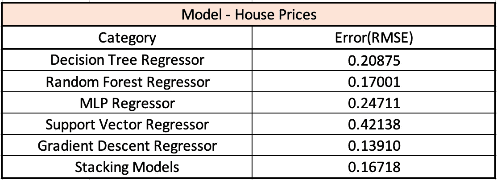

# Python 中的回归问题——房价:高级回归技术

> 原文：<https://medium.datadriveninvestor.com/a-regression-problem-with-python-house-prices-advanced-regression-techniques-98616d31f0ab?source=collection_archive---------0----------------------->

## 用 Scikit-Learn 理解 Python 中的回归方法


House Prices

这是我之前做的关于 Python 中高级回归技术的 Kaggle 竞赛。

## [房价:高级回归技术](https://www.kaggle.com/c/house-prices-advanced-regression-techniques)

我们可以请购房者描述他们梦想中的房子，他们可能不会从地下室天花板的高度或靠近东西向铁路开始。但是这个游乐场竞赛的数据集证明，影响价格谈判的远不止卧室的数量或白色尖桩栅栏。这个比赛的目的是预测每栋房子的最终价格。

# 数据描述

有 79 个解释变量描述了爱荷华州埃姆斯住宅的各个方面，这场比赛挑战我们预测每栋房子的最终价格。下面是数据文件的简要描述。

*   *——你试图预测的目标变量。*
*   *地址(包括邻居和公用设施)*
*   *销售情况(包括销售和建造年份)*
*   *房屋状况(包括房间类型、地下室尺寸、屋顶、供暖系统、空调、电气系统、地板尺寸、壁炉、车库尺寸、游泳池等)。)*

# ***数据预处理***

***数据预处理**是数据挖掘过程中的一个重要步骤，数据被转换或编码，使其达到机器可以轻松解析的状态。*

*[](https://www.datadriveninvestor.com/2019/02/07/8-skills-you-need-to-become-a-data-scientist/) [## 成为数据科学家所需的 8 项技能|数据驱动型投资者

### 数字吓不倒你？没有什么比一张漂亮的 excel 表更令人满意的了？你会说几种语言…

www.datadriveninvestor.com](https://www.datadriveninvestor.com/2019/02/07/8-skills-you-need-to-become-a-data-scientist/) 

首先，我们应该决定哪些训练和测试数据应该丢弃，并考虑训练和测试数据中缺失值的百分比大于 0.7。

```
train_missing = train_data.isna().sum() / train_data.shape[0]
train_missing[train_missing > **0.7**]Alley          0.937671
PoolQC         0.995205
Fence          0.807534
MiscFeature    0.963014test_missing = test_data.isna().sum() / test_data.shape[0]
test_missing[test_missing > **0.7**]Alley          0.926662
PoolQC         0.997944
Fence          0.801234
MiscFeature    0.965045
```

然后，我们丢弃训练和测试数据，缺失值的百分比大于 0.7。

```
train_data.drop(train_missing[train_missing > 0.7].index, axis = 1, inplace = True)
test_data.drop(test_missing[test_missing > 0.7].index, axis = 1, inplace = True)
```

其次，对训练数据集中缺失值的百分比小于 0.7 的数据进行处理。

```
train_data['LotFrontage'].interpolate(axis=0, inplace=True)
train_data[['MasVnrType']].fillna('None', inplace=True)
train_data.dropna(subset=['GarageType', 'GarageYrBlt', 'GarageFinish', 'GarageQual', 'GarageCond'], inplace=True)
train_data.dropna(subset=['BsmtQual', 'BsmtCond', 'BsmtFinType1'], inplace=True)
train_data.dropna(subset=['MasVnrType', 'MasVnrArea'], inplace=True)
train_data.drop('FireplaceQu', axis=1, inplace=True)
train_data['BsmtExposure'].fillna('No', inplace=True)
train_data['BsmtFinType2'].fillna('Unf', inplace=True)
train_data['Electrical'].fillna('SBrkr', inplace=True)
```

此外，我们还管理测试数据集中的缺失值。

```
test_data.fillna(method='ffill', inplace=True)
test_data.fillna(method='bfill', inplace=True)
```

下一步，我们应该处理分类变量的问题。对于分类变量，一个热编码是一个过程，通过该过程分类变量被转换成可以提供给 ML 算法以在预测中做得更好的形式。

```
# Copy Train data excluding target
trainData_Copy = train_data.drop(['SalePrice', 'Id'], axis=1).copy()
testData_Copy = test_data.drop('Id', axis=1).copy()# Combine Train and test for **One Hot Encoding**
combined_Data = pd.concat([trainData_Copy,testData_Copy], keys = [0,1])# Do One Hot Encoding for categorical features
combined_Data = pd.get_dummies(combined_Data)# Separate Train data and test data
X_train = combined_Data.xs(0)
X_test = combined_Data.xs(1)
y_train = train_data["SalePrice"]
``` 

# *模型*

*不同模型的详细描述已经在[上显示了 Python 的分类问题——home site 报价转换](https://towardsdatascience.com/a-classification-problem-with-python-homesite-quote-conversion-15174bca09b8)。根据预测值的对数和观察到的销售价格的对数之间的[均方根误差(RMSE)](https://en.wikipedia.org/wiki/Root-mean-square_deviation) 对模型进行评估。(取日志意味着预测贵房子和便宜房子的误差会同等影响结果。)*

*这里我解释一下我之前创建的模型。*

## *决策树回归器*

*决策树是一种决策支持工具，它使用树状图形或决策模型及其可能的结果，包括偶然事件结果、资源成本和效用。*

```
*from sklearn.tree import DecisionTreeRegressorclf = DecisionTreeRegressor()
clf.fit(X_train, y_train)
clf_predict = clf.predict(X_test)*
```

*决策树回归器的误差(RMSE):0.20875*

## *随机森林回归量*

*随机森林是一种集成学习方法，它在数据子集上拟合多个决策树，并对结果进行平均。*

```
*from sklearn.ensemble import RandomForestRegressorrfc = RandomForestRegressor()
rfc.fit(X_train, y_train)
rfc_predict = rfc.predict(X_test)*
```

*随机森林回归量的误差(RMSE ): 0.17001*

## *MLP 回归器(神经网络)*

*神经网络是一种机器学习算法，涉及拟合许多用于表示与突触激活功能相连的神经元的隐藏层。这些基本上使用一个非常简化的大脑模型来建模和预测数据。*

```
*from sklearn.neural_network import MLPRegressormlp = MLPRegressor()
mlp.fit(X_train, y_train)
mlp_predict = mlp.predict(X_test)*
```

*MLP 回归量的误差(RMSE):0.42138*

## *支持向量回归机*

*支持向量机可以用作回归方法，保持表征算法的所有主要特征(最大间隔)。*

```
*from sklearn.svm import SVRsvr = SVR()
svr.fit(X_train, y_train)
svr_predict = svr.predict(X_test)*
```

*支持向量回归机的误差(RMSE):0.24711*

## *梯度推进回归器*

*梯度推进是一组机器学习算法，将许多弱学习模型结合在一起，创建一个强预测模型。*

```
*from sklearn.ensemble import GradientBoostingRegressorsearch_random = {'n_estimators': range(1000, 5000, 100), 'learning_rate':[0.01, 0.1, 0.05]}
abc = GradientBoostingRegressor()
abc.fit(X_train, y_train)
abc_predict = abc.predict(X_test)*
```

*梯度推进回归器的误差(RMSE):0.13910*

## *堆叠模型*

*模型堆叠是一种有效的集成学习技术，其中通过使用各种机器学习算法生成的预测被用作第二层学习算法中的输入。该第二层算法被训练成最佳地组合模型预测以形成一组新的预测。在堆叠模型中，该数据点靠近神经网络和支持向量回归的位置。但是，堆叠模型的整体预测准确性更好。因此，我们使用决策树、随机森林和神经网络的堆叠模型来进行预测。*

```
*models = [MLPRegressor(**grid_parm_mlp), RandomForestRegressor(**grid_parm_rfc), DecisionTreeRegressor(**grid_parm)]

S_Train, S_Test = stacking(models, X_train, y_train, X_test, regression=True, verbose=2)model = RandomForestRegressor()  
model = model.fit(S_Train, y_train)
model_pred = model.predict(S_Test)*
```

*叠加模型误差(RMSE):0.16718*

# *比较和结论*

*基于我创建的模型，首先我们需要找出哪个算法得到最低的 RMSE。因此，我们可以认识到梯度推进回归得到最低的误差(RMSE)。此外，梯度推进模型因其在分类复杂数据集方面的有效性而变得越来越受欢迎，最近已被用于赢得许多 Kaggle 数据科学竞赛。然后，对于堆叠模型，它也获得了比其他模型更低的误差(RMSE ),因为它最佳地组合了模型预测以形成一组新的预测，并且堆叠模型的整体预测准确性更好。*

**

*Comparison*

*总之，我们使用 Scikit-Learn 的不同高级回归技术(决策树、随机森林、支持向量机、神经网络和梯度推进)来预测最终销售价格，并专注于预测准确性。目的是学习一个可以最小化均方根误差(RMSE)的模型，比较不同的算法，并选择性能最佳的算法。*

*创建这篇文章的源代码可以在[这里](https://github.com/shirley0823/Machine-Learning-with-Python/blob/master/House_Prices_Advanced_Regression_Techniques.ipynb)找到。*

# *关于我*

*非常感谢您阅读我的文章！大家好，我是雪莉，目前在亚利桑那州立大学攻读商业分析硕士学位。如果您有任何问题，请随时联系我！*

```
*Email me at ***kchen122@asu.edu***and feel free to connect me on [**LinkedIn**](https://www.linkedin.com/in/kuanyinchen-shirley/)!*
```