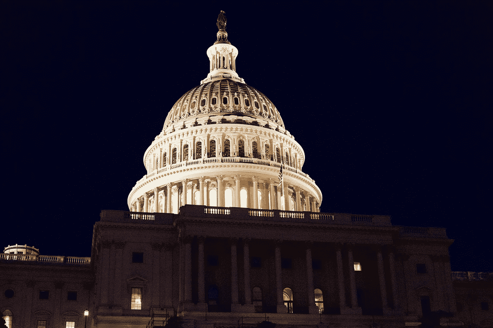

# “一个共和国，如果你能保持它的话”

> 原文：<https://medium.datadriveninvestor.com/a-republic-if-you-can-keep-it-6d32208c2ab3?source=collection_archive---------16----------------------->

Photo by [Darren Halstead](https://unsplash.com/@darren1303?utm_source=unsplash&utm_medium=referral&utm_content=creditCopyText) on [Unsplash](https://unsplash.com/s/photos/government?utm_source=unsplash&utm_medium=referral&utm_content=creditCopyText)

美国滑向深渊

制宪会议后，当有人问我们创造了一个共和国还是一个王国时，“如果你能保持它，那就是一个共和国”这句话被归功于本杰明·富兰克林。它提到了一个问题，建立了一个共和国，接下来会发生什么？一个民主政体需要广泛的接受，对其健康的承诺，以及坚持其原则和价值观的意愿。当情况不再如此时，我们将见证会发生什么。

2020 年 11 月 3 日是 2000 年以来的第三次总统选举，选举团成为决定结果的核心问题。我指的是 2000 年、2016 年和 2020 年的选举。虽然民主党候选人获得了最多的选票，但选举团宣布共和党候选人获胜。乔·拜登以超过 700 万张普选票和 306 张选举人票赢得了 2020 年的选举。除了唐纳德·特朗普(Donald Trump)之外，这一结果本不应该是一个问题，特朗普得到了他的忠诚爪牙的支持，试图通过一切可以想象的方式窃取选举。这种成为神帝的企图是一场政变，在众目睽睽之下，有许多同谋行为者。

我记得 1951 年初秋，我第一次遇到“多数”这个词。我刚刚在印第安纳州沃巴什的东沃德学校上一年级，在操场上上每周一次的体育课。东沃德已经 80 多岁了，却没有健身房。我们所拥有的只是一个砾石覆盖的操场，它环绕着学校，甚至覆盖了篮球场。你试过在沙砾上打篮球吗？这是一所古老的学校，位于印第安纳州一个不起眼的小镇的贫困社区。

作为那天课程的一部分，我们的巡回体育老师，史密斯先生，让我们在两个可供选择的活动中做出选择。我们通过做两条线把一边或另一边连接起来。在表达了我们的偏好后，史密斯先生宣布我们的课堂活动是由我们大多数人的选择决定的。他解释说，发现大多数人想要的是在一个民主国家如何决策，以及美国是一个民主国家。“我们相信多数决定原则，”他强调说。

这是我的第一堂公民课，我坚信我那时学到的关于我们如何管理自己的知识。我仍然这样认为，但我不再那么乐观了。在 2000 年、2016 年和 2020 年的竞选活动之后，不需要太多的智慧就可以看出我们美国人在选举(如果这个词是正确的)代表我们的人方面存在问题。除非得到解决，否则这些问题注定会增长并摧毁我们民主共和国的残余。企业媒体不断搅拌，无休止地重复，反刍事实，伪事实，谎言，以填补 24/7 新闻周期加剧了这个问题。当他们开始通过猜测谁将在 2016 年竞选来推动他们持续的政治竞选周期时，2012 年的选举结果仍在计算中。坦白地说，我们大多数人只是在努力生存。我们希望我们的政府能够运转，我们的民选代表能够解决我们选举他们来解决的问题。坦率地说，大多数人在那一刻根本不关心谁会在下一轮竞选中胜出。我们关心今天。没完没了的胡言乱语不断由那些为企业媒体底线服务的负责人提供，而不是我们，美国人民，只会加剧这些问题的解决方案。

这也是事实，除非令人信服的威胁，我们的厄运阻碍我们的方式，没有任何重大的成就。因此，本着这一精神，我提出一些想法和建议。也许他们会引发思考和评论，并鼓励讨论我们的选举程序，我觉得早就应该这样做了。

首先，我们的政府官员、媒体和教育工作者需要停止对我们的历史和政治进程，特别是总统选举撒谎或歪曲事实。例如:首先，我们没有全国选举日，我们有 50 个州和哥伦比亚特区的选举在同一天举行。事情并不总是这样。19 世纪早期，总统选举全年在不同的州举行。其次，全国普选总统是一个毫无意义的骗局。作为奴隶时代的遗迹，选举团旨在通过控制和阻挠民意来安抚蓄奴州。它允许少数人控制政府的杠杆。第三，媒体和政府官员向我们提供有关选举问题的专业信息，让我们了解他们所谈论的政府职能，这种期望是否过高？第四，为什么我们，公众，从来没有意识到由于这样或那样的原因，数以百万计的选票没有被计算在内？2012 年，据报道，约有 550 万张选票因错误而永远无法统计。这是因为它们是缺席的或者是被系统地取消资格的临时选票。因为人们认为计算它们对选举结果没有影响，所以它们被丢弃了。

2020 年，拜登获得了 81，283，098 张选票，赢得了 51.3%的选票。特朗普获得了 74，222，957 张选票或 46.8%的选票。我们有史以来最高的投票率。共有 159，633，396 张选票，代表了 66.7%的投票资格人口。这是自 1900 年以来最高的投票率，当时有 73.7%的人投票，但 1900 年只有男性投票。尽管共和党人在红州试图限制少数族裔选民的投票率，但这一较大的数字部分是由于提前投票，特别是通过邮件投票或由于疫情的缺席

相比之下，2016 年，在大约 2.425 亿有资格的公民中，约有 1.38 亿公民投票，这是这个星球上任何民主国家中公民参与水平最低的国家之一。为什么？这一低数字源于选民的冷漠，选民登记程序，包括选民照片身份证，这阻碍了登记，特别是在老年人、穷人和少数民族中。我们是唯一一个选举日是工作日而不是国定假日或周末的民主国家。选举日在一年中的 11 月举行，这个时候天气往往是投票率的决定性因素。各州开放投票的时间各不相同，像印第安纳这样的地方，投票时间实际上阻碍了工薪阶层的投票。我们的两个主要政党都倾向于为同样的中产阶级和中上层阶级服务。没有人对社会经济阶梯中较低的 80%说话。没有一个政党倾听或关心穷人。最后，最高法院在 2000 年布什诉戈尔案的判决中没有给这一程序增加任何东西，反而拿走了很多东西。实际上，最高法院选择了自己的院长。这树立了一个不好的先例，即法院以非常党派化的方式直接干预选举进程，发布的裁决充其量是混乱和矛盾的。然后，为了嘲弄和把民主变成荒谬，最高法院在公民联合会诉联邦选举委员会一案中，扩大了法人的概念，使其比实际活着的人拥有更多的权利。你越有钱，你就越公民，反之亦然。

一位选举团的捍卫者最近引用诗人罗伯特·弗罗斯特的话开始为这个机构辩护。弗罗斯特写道，“在你知道为什么要建篱笆之前，不要拆掉它。”好建议。因此，我们应该透过选举团通常的理由和借口看得更深，看看其背后有什么。我们都被灌输了我们的创始人想要保护我们免受多数人暴政的思想。少数人的权利必须得到保护。这听起来很好，但我们从未研究过我们的创始人实际上指的是什么样的多数暴政？我们从未探究过他们到底在保护谁的少数民族权利？哦，有人声称有大国控制小国的危险。人口最多的州将会支配和歧视其余的州。这就是我们被告知的美国参议院和选举人团成立的原因。更深入地看，我们知道这一切都是为了掩盖他们的真实意图。

这份文件的作者代表了受启蒙运动影响的 18 世纪晚期思想的一个很好的例子。开国元勋们担心的多数人的暴政是这个国家的大多数公民希望在政府中有更多的民主和更多的发言权。新的精英阶层害怕人民，就像精英阶层总是做的那样，将他们视为暴徒。穷人和大众就是今天精英们居高临下地称之为“你们这些小人物”的东西。他们害怕我们所有公民的参与。这威胁到他们的特权，他们竭尽全力限制穷人的投票权或发言权。

当我们学习政府和宪法时，强调的是保护少数人的权利。他们必须受到保护，免受多数人的暴政。换句话说，他们真正的意思是精英需要保护，免受大众的伤害。他们希望插入条款以确保他们在新政府中的地位、权力和特权。他们非常成功。我们带着他们的遗产生活在所有的不平等中。

我成长在冷战最激烈的时期。我们被美国民主的优点淹没了。我们每天早上站在国旗前背诵效忠我们的公民上帝的誓言。我们不断地被灌输共产主义的邪恶。我们被告知这是多么的残酷，但却拒绝尝试去发现原因和理解它是什么。

在那段时间里，我们的政府在世界各地以及在国内宣传民主的理念。我们从未意识到，当我们向他人推广民主时，我们否认并尽一切可能阻止自己实践民主。如果一个国家真的建立了一个民主政府，它最好不要与美国的目标和利益相冲突。有一长串国家可以证明会发生什么。这份名单很长，包括 1953 年的伊朗、1954 年的危地马拉、1963 年的洪都拉斯、2009 年的智利、1973 年的阿根廷、1964 年的巴西、1967 年的希腊以及许多其他地方的肮脏战争。

当我们试图推销我们的民主理想时，我们得到的是茫然的目光和压抑的笑声，这有什么奇怪的吗？如果我们不亲自实践，谁会相信我们销售的任何东西？

唐纳德·特朗普(Donald Trump)和共和党的相当一部分人试图颠覆和推翻合法当选的政府。他使用了过多的不正当和违反宪法的手段，最终导致了对国会的暴力攻击。他们只是揭示了他们到底是谁，以及他们对我们国家和社会的愿景是什么。毕竟，国会主要是由富人或即将成为富人的人组成的。他们没有兴趣为送他们去那里的人服务。他们只想到保护自己和促进他们的个人议程，这在推翻 2020 年选举的最后努力中显而易见。此外，在这场对美国民主的前所未有的攻击中，你有没有听到过富人和企业精英反对或谴责特朗普的言论？

我们躲过了一场由一个狡猾无知的人发动的未遂政变。我们很幸运，特朗普没有获得更多支持。我们的问题暴露了。我们有选择和机会做出改变，解决需要解决的问题，以防止重蹈覆辙。特朗普第二次被弹劾是事实。为了我们的未来，对他的审判必须导致定罪。

如果我们不惩罚企图政变推翻民选政府的人。如果我们不惩罚那些支持我们的人。如果我们不能从内战后的失败中吸取教训，进行系统的变革来惩罚和逃避责任者，我们就没有未来。请放心，下一个有抱负的独裁者将会更加聪明和老练。他/她将利用这个系统来摧毁剩下的东西，把我们推入一个专制的或者很可能是极权的黑色深渊。