# 快速 RCNN 综述

> 原文：<https://medium.datadriveninvestor.com/a-review-on-faster-rcnn-72d31f50cc52?source=collection_archive---------1----------------------->

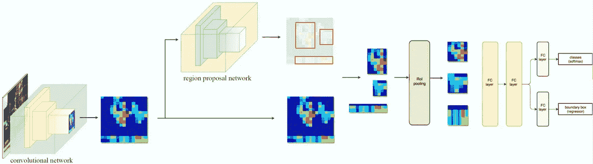

在这篇文章中，我们将回顾由任、何、Ross Girshick 和撰写的 [**更快 RCNN 论文**](https://arxiv.org/pdf/1506.01497.pdf) 。在阅读这篇文章之前，我建议大家如果感兴趣的话，先看一下 [**快速 RCNN 回顾**](https://medium.com/datadriveninvestor/review-on-fast-rcnn-202c9eadd23b) 。这有助于更好地理解这些概念。与其他基于区域的网络相比，更快的 RCNN 使用相同的网络进行区域提议和对象检测。我们将文章分成 5 个部分

**1。区域提案网络**

**2。培训**

**3。实验和观察**

**4。检测结果**

# **1。地区提案网**

在快速 RNN 中，选择性搜索和检测网络是分离。但是脱钩不是一个好主意。比如说，如果选择性搜索有假阴性，这个错误将直接影响检测网络。最好将它们耦合在一起，使它们相互关联。

在解释区域建议网络之前，最好知道，为什么我们需要它，以及在 RCNN 中使用选择性搜索的缺点是什么。

替换选择性搜索的一些条件:

*   应产生少于 2000 个区域提案
*   与选择性搜索一样快或更好
*   与选择性搜索一样准确或更好
*   应该能够提出不同的长宽比和规模的投资回报率。

 [## 人工智能和监督资本主义|数据驱动的投资者

### 大科技，总是现在:人工智能推动的大科技，已经使购物，搜索，在你的…

www.datadriveninvestor.com](https://www.datadriveninvestor.com/2020/03/04/on-artificial-intelligence-and-surveillance-capitalism/) 

我们将讨论一些尝试解决这个问题的方法:

## **方法 1:快速 RCNN +图像金字塔+特征地图上的滑动窗口**

在这种方法中，我们可以使用图像金字塔，并在不同的比例下进行 ROI 项目来描绘地图。现在我们可以在特征图上使用滑动窗口技术。在每个滑动窗口位置，我们可以进行 ROI 合并，从而进行分类和回归。

缺点:这种方法会降低网络速度

## **方法 2:快速 RCNN +特征金字塔**

我们可以使用特征金字塔从特征地图中提取感兴趣区域，也就是说，我们将使用不同形状的盒子来提取感兴趣区域。例如，我们将使用正方形、高长方形和宽长方形盒子。我们将使用大约 9 种这样的盒子。

但是，即使这种方法也将创建总共 40x60x9=14400 个 bboxes 和一个 40x60 的特征映射。所以这也会降低网络速度

## 方法 3:快速 RCNN + bbox 回归器(RPN)

这种方法是区域提议网络的核心思想。现在我们将了解 RPN 是如何工作的？

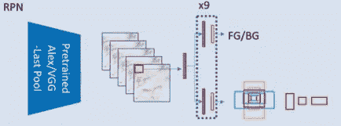

区域提议网络(RPN)将图像(任何大小)作为输入，并输出一组矩形对象提议，每个提议都有一个客观分数。RPN 有一个回归变量(相对回归)和一个分类器。分类器将预测 ROI 的概率输出为前景或背景。回归器将预测(dx，dy，dh，dw ),我们将它添加到 ROI 中，以匹配真实的 bbox 尺寸。

1.  图像经过卷积层并提取特征。

2.然后对特征图上的每个位置使用滑动窗口。

3.对于每个位置，我们使用 9 个锚盒来生成区域提议，我们使用 3 个不同比例(128，256，512)和 3 个纵横比(1:1，1:2，2:1)的 3 个锚盒。因此总共有 9 个锚箱。因此，每个位置生成 9 个区域提案。

4.分类层为 *k* 盒子输出 *2k* 分数是否那里是物体。

5.回归层输出*k*盒子的坐标(盒子中心坐标，宽度和高度)4k 。

6.一张尺寸为*W*×H 的特征图，总共有 *WHk* 个锚点。

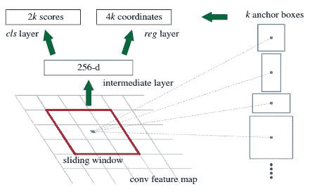

对于训练 rpn，我们给每个锚点分配一个二元类标签(是 FG 还是 BG)。我们给两种主播贴上了正面标签:

*   具有最高交集(IoU)的锚与地面实况框重叠

运筹学

*   与地面实况框的 IOU 重叠高于 0.7 的锚。

注意，单个地面实况框可以将阳性标签分配给多个锚。通常第二个条件足以确定阳性样本；但是我们仍然采用第一个条件，因为在一些罕见的情况下，第二个条件可能找不到正样本。

*   如果非正锚的 IoU 比率对于所有地面实况框都低于 0.3，则我们将负标签分配给非正锚

基于这些目标，我们最小化以下损失函数:

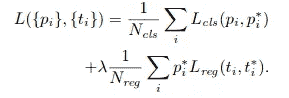

p_i 是锚 I 成为物体的预测概率。

p _ I∫I 是基础事实标签，如果锚是正的，则为 1，如果锚是负的，则为 0。

t1 是表示预测边界框的 4 个参数化坐标的向量，

t _ I∫是与正锚相关联的地面实况框。

第一项是 2 类(前景或背景)的分类损失。第二项是仅当存在对象(即 p_i* =1)时边界框的回归损失。

这两项由 N_cls 和 N_reg 归一化，并由平衡参数λ加权。在我们当前的实现中(如在发布的代码中)，cls 项由小批量大小(即 N_cls= 256)归一化，reg 项由锚位置的数量(即 N _ reg \u 2400)归一化

由于区域可以彼此高度重叠，所以使用非最大抑制(NMS)来将提议的数量从大约 6000 减少到 N (N=300)

现在，相应的位置和边界框将传递到检测网络，用于检测对象类别并返回该对象的边界框。

# 2.培训——4 步培训

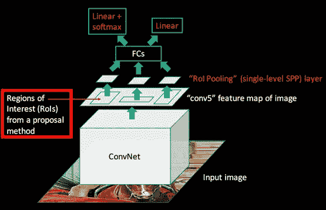

由于卷积层是共享的，因此训练过程非常不同:

**1。用图像网络预训练模型初始化 RPN 网络。现在训练(微调)RPN 网络。**

**2。用 imagenet 预训练模型初始化一个独立的检测网络。现在，使用步骤 1 RPN 生成的建议，通过快速 R-CNN 训练(微调)单独的检测网络。此时，两个网络不共享卷积层。**

**3。我们使用检测器网络来初始化 RPN 训练。在这一步中，我们修复了共享的卷积层，只对 RPN 特有的层进行了微调。我们不微调共享卷积层。**

**4。最后，保持共享卷积层固定不变，我们用步骤 3 中的新 ROI 建议微调快速 R-CNN 的独特层。这里我们也不微调共享卷积层。**

# 3.实验和观察

## 3.1 RPN 消融实验

为了调查 RPN 网络的性能，他们进行了几次烧蚀研究。首先，我们展示了 RPN 和快速 R-CNN 检测网络之间共享卷积层的效果。为此，我们在 4 步训练流程的第二步后停下来。

使用单独的网络将结果略微缩小到 **58.7%的 mAP。**这是因为在第三步中，当检测器调节特征用于微调 RPN 时，方案质量得到提高。但是在共享 conv 图层的情况下，**得到了**59.9%的贴图**。**优于现有技术的 SS 和 EB。

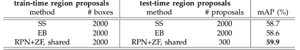

## 损失函数中的 3.2 λ

当 VGG16 主干的 **λ = 10** 时，我们得到了最佳结果。

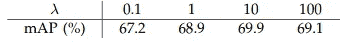

## 3.3 比例和比率

在 3 个比例和 3 个比率的情况下，**获得 69.9%的 mAP** ，仅比 3 个比例和 1 个比率有很小的改进。但是仍然使用 3 个标度和 3 个比率。

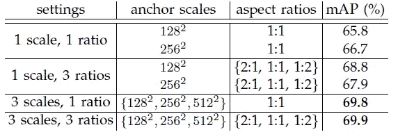

## 3.4 召回至借据的分析

他们还用基础事实框计算了不同 IoU 比率下的提案召回率。他们的结果如下图所示:

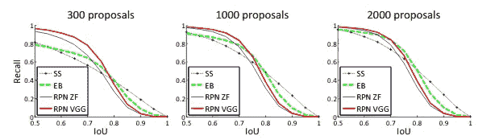

这些图表明，当建议的数量从 2000 下降到 300 时，RPN 方法表现良好。这解释了为什么 RPN 在使用少至 300 个建议时具有良好的最终检测图。

# **4。检测结果**

## 4.1 帕斯卡 VOC 2007

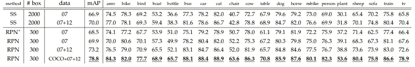

上表显示了使用快速 R-CNN 检测器和 VGG-16 的 PASCAL VOC 2007 测试集的结果。对于 RPN，快速 R-CNN 的列车时间建议是 2000。RPN 表示非共享功能版本。

## 4.2 帕斯卡 VOC 2010

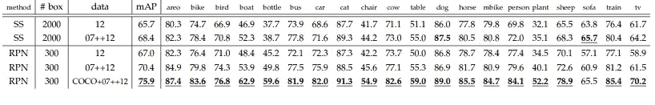

上表显示了使用快速 R-CNN 检测器和 VGG-16 的 PASCAL VOC 2007 测试集的结果。对于 RPN，快速 R-CNN 的列车时间建议是 2000。

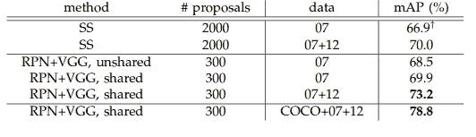

利用使用 COCO、VOC 2007 (train+val)和 VOC 2012 (train+val)数据集的训练数据，获得了 **78.8%的 mAP** 。

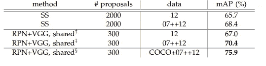

通过使用 COCO、VOC 2007 (train+val+test)和 VOC 2012 (train+val)数据集的训练数据，获得了 **75.9%的 mAP** 。

## 4.3 检测时间

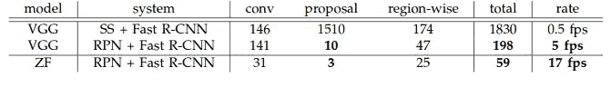

用 SS 做 RPN，用 VGGNet 做检测网络:0.5 fps / 1830ms
用 VGGNet 做 RPN，检测网络: **5fps / 198ms**
用 ZFNet 做 RPN，检测网络:17fps / 59ms
，比 SS 快很多。

## 4.4 文中提到的一些检测实例

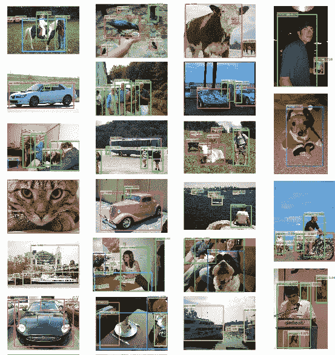

注意:我没有提到论文中提到的所有实验。我只提到了重要的几个。如果你想了解更多，你可以随时查阅论文。

# 参考

*   [https://arxiv.org/pdf/1506.01497.pdf](https://arxiv.org/pdf/1506.01497.pdf)
*   [https://www.youtube.com/watch?v=5sYK0z-lqU&list = pl 1 gqavho 4 f _ jlxookw7 cs 5 ky _ j 1t 17s&index = 85](https://www.youtube.com/watch?v=5sYK0z--lqU&list=PL1GQaVhO4f_jLxOokW7CS5kY_J1t1T17S&index=85)