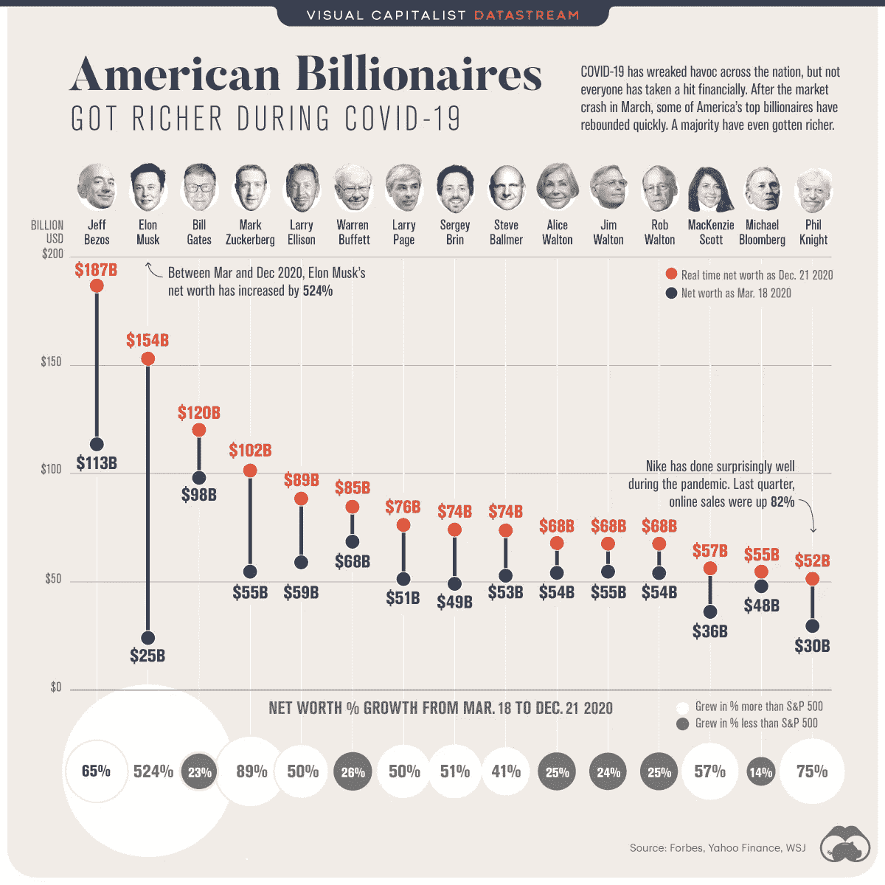

# 我们如何看待价值的一场革命

> 原文：<https://medium.datadriveninvestor.com/a-revolution-in-how-we-perceive-value-fb40e0425555?source=collection_archive---------14----------------------->

## GameStop 的迅速崛起(并且不合逻辑)仅仅是个开始

source: [https://www.visualcapitalist.com/the-rich-got-richer-during-covid-19-heres-how-american-billionaires-performed/](https://www.visualcapitalist.com/the-rich-got-richer-during-covid-19-heres-how-american-billionaires-performed/)

现状受到了攻击。它的力量总是更多的是幻觉而不是事实，而且它的外表正变得越来越透明。这在很大程度上是正确的，但具体从我们如何确定价值的角度来看也是如此。

2020 年，石油期货交易的美元价值为负值。2021 年，GameStop 的股价在两周内上涨了 2000%(20 倍)，GameStop 是一家基于零售的视频游戏商店，甚至在疫情之前就已经陷入困境。

古老的真理是，价值是被支配的。新的范式是它是主观的。我们决定。

在过去的十年里，我进入这一领域的主要窗口是通过 2 美元钞票和比特币，我认为这是这一趋势的先驱。我总是着迷于 2 美元钞票的主观价值。它的价值，像所有政府资助的钱一样，实际上是由我们决定的。总的来说，我们接受政府印在纸上的任何价值——除了 2 美元钞票。一些人会保存它们，认为它们比面值更值钱，另一些人会避开它们，质疑它们的合法性。很久以前，我就爱上了 2 美元钞票，因为我对它的价值的主观性非常着迷。这是外墙上的一个裂缝。

厄瓜多尔 2 美元钞票的奇特案例

下一次破解是在我了解比特币之后。人们会说:“你认为它值多少，它就值多少。”他们的本意是嘲笑比特币，但实际上他们发现了比无视他们不理解的东西更深刻的东西。一切都只值我们集体决定的价值。新的东西更明显，因为我们没有任何先入为主的观念，但所有我们毫无疑问接受的东西都是如此。

【[理解比特币的钥匙](https://medium.com/the-capital/the-key-to-understanding-bitcoin-88deda02c848)

我们毫无疑问地接受的这些东西通常遵循一些逻辑和理由——股票价格随着公司的预期收入而波动，或者政府发行的货币提供了一种方便的交易媒介——但它们的大部分价值与其说来自共识，不如说来自口述。政府为它们印刷的纸片的价值盖章，金融精英设定趋势，并对我们感知的股票或房地产等事物的价值产生深远影响。

然而，这些墙正在被打破。几十年来，精英阶层可以接触到金融工具，比如裸卖空或期权，而普通人基本上看不到这些工具。这种受限的访问总是被设计好的。金融精英在决定价值方面发挥了过大的作用(总是为了富人越来越富的自身利益)，这是大多数人毫无疑问接受的。技术进步和基于应用程序的交易工具等东西当然在公平竞争中发挥了作用，但我认为这种趋势是心理和智力上的。挑选对冲基金通过做空赚取巨额利润的垂死股票，然后将其推高至任何人都认为合理的价格之上，这是扭转局面的集体努力。随着价格上涨，卖空者不得不回购股票，这产生了一种级联效应，并导致财富从传统金融精英手中罕见地转移出去。这不仅仅是工具变得更加普及，而是对价值和我们自己在这一决定中的角色的集体重新想象。

像 GamesStop 或 AMC 这样的股票肯定会在某个时候回到地球，但不会在表面的裂缝变得越来越大之前。一个新世界即将到来，我们可以选择它。