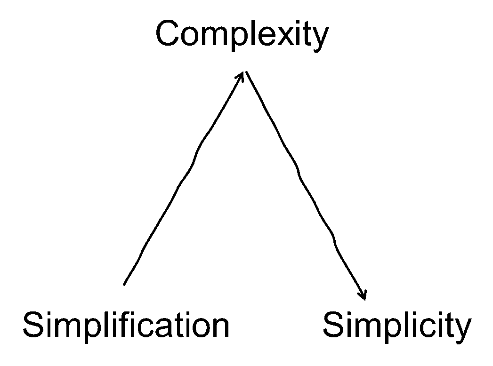
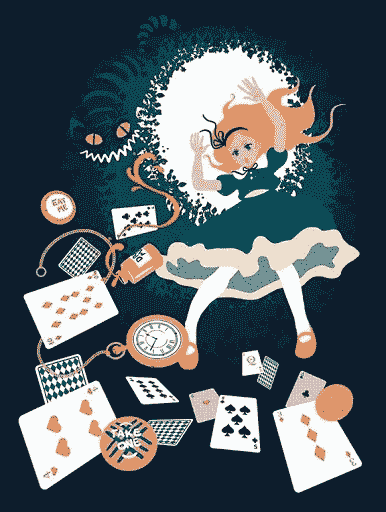

# 简单性路线图

> 原文：<https://medium.datadriveninvestor.com/a-roadmap-to-simplicity-6f53d22a1d65?source=collection_archive---------8----------------------->

我过去经常出差，在哥本哈根机场看到这样一个标志:“问题可能很复杂，但解决方案不会。”我认为这是明智的。它用一个小句子来说明什么是简单。这与我的经历产生了共鸣。对我来说，美丽的设计、迷人的艺术或鼓舞人心的文学作品总是以简洁为共同点。一种我的大脑乐于接触的复杂性。简单似乎有能力超越时间和地点。简单有一种自然的吸引力，就像行星引力一样。

不久前，我决定看看，是否有可能展现简单？不是工具，也不是制造工具的技能，而是心态。看看我是否能做一个模型，这个模型能够描述当复杂性被压缩成简单性时的过程。

 [## 数据驱动始于数据素养|数据驱动的投资者

### 光是听到“数据”这个词就令人生畏。老实说，只有 21%的全球员工对自己的工作充满信心

www.datadriveninvestor.com](https://www.datadriveninvestor.com/2020/03/22/data-driven-starts-with-data-literacy/) 

下面是我在研究了哲学、文学、建筑、艺术和现代认知心理学之后的简短总结。它是一种地图；你跟着它去理解你在通往简单的旅途中最有可能遇到的障碍。一路平安。

它由三个阶段组成:1)你从一个(过度)简化开始，2)然后你的探索导致新的信息被解释，建立复杂性，3)最后你开始看到模式出现，你走向简单。

根据希腊哲学家苏格拉底的说法，智慧始于知道你不知道的事情。然而，根据我的经验，当我们处理一个新的领域时，我们经常开始假设，我们知道很多但没有意识到，我们的理解是一种简化——它是先入为主的和未经证实的。我们过于自信，高估了自己的能力水平。我们在一个地方，我们对我们所面临的事情有一个过于简单的描述。它看起来像现实，但并不完全公正，因为我们依赖于假设，而不是事实。

这本身不是问题，只要我们注意不要在过度自信和缺乏能力水平的完美风暴中试图做出重要的人生选择。度过这个阶段的最好方法是问很多问题，避免下结论。认为我们可以在这个水平上对任何事情做出结论，就像试图提供一个自制的馅饼，而不是先去便利店，购买原料，回家，按照正确的比例混合，然后烘烤。

当我们不断提问时，我们的探索就开始了，我们开始发现新的见解。我们开始学习。这也意味着我们开始意识到，我们最初的理解是建立在未经证实的假设之上的。我们开始看到复杂性，这向我们表明，我们最初的理解被简化了。我们现在就像《爱丽丝梦游仙境》中那样“下兔子洞”。左右我们面对的东西，我们不理解，因为我们进入了一个新的世界。由于我们对一切都不熟悉，我们会感到困惑、失去信心和沮丧。这就是诱惑人放弃的地方。

然而，为了学习，我们必须通过这个阶段。省略细节不会降低复杂性。当我们在数据中找到一个模式，并确保有足够的数据来创建模式时，复杂性就会降低。再说一次，坚持到底，就是不断提问，保持好奇和探索。

做到了，就能达到“简单”。在这里，我们可以让一个复杂的主题对新手来说变得简单。爱因斯坦说过“如果你不能向一个六岁的孩子解释清楚，那你自己也不明白”。当我们可以向一个 6 岁的孩子解释任何话题的时候，我们已经到了“简单”的阶段。我经常体验到，简单和简化是混淆的。简化和简单之间的基本区别在于，简单包含并压缩了给定主题的复杂性；简化不会。简约是令人敬畏的建筑、永恒的艺术和获得诺贝尔奖的文学的发源地；简化不是。尽管经历了几个世纪的审查和质疑，简约仍然是有意义的；简化不会。

所以，如果你一直想追求简单，这是我的建议。

每当你想掌握或创造简单，记住我们通过一个旅程达到它，我们应该小心不要低估它。这是一个既令人沮丧又令人疲惫的旅程。但是，如果我们不花时间和资源，我们很可能以简化而不是简单而告终。他们可能看起来很像，但他们远非完全相同。

*原载于 2020 年 5 月 28 日 https://www.datadriveninvestor.com***。**